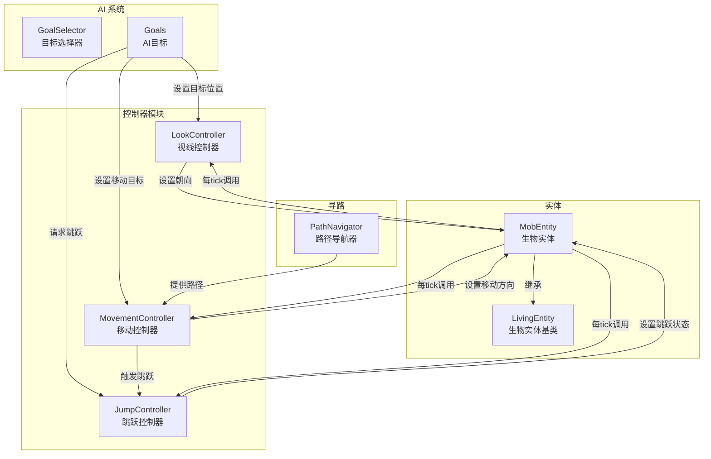
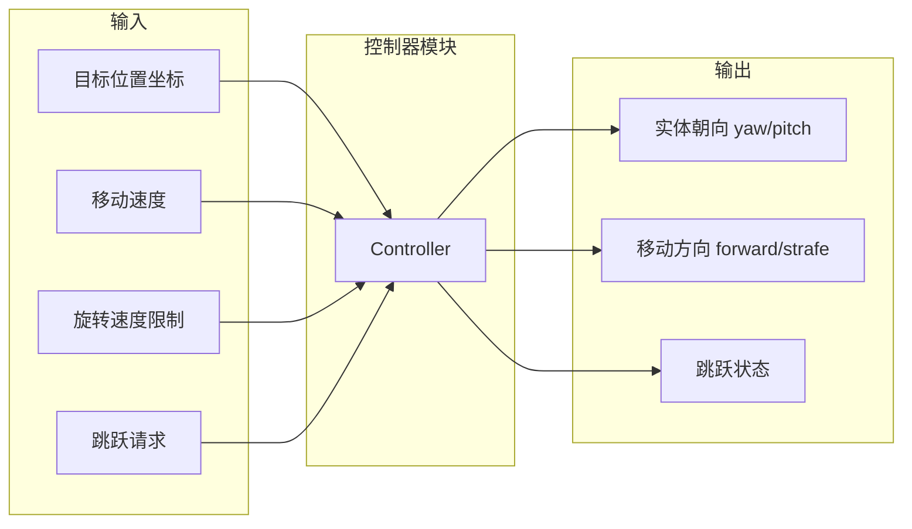
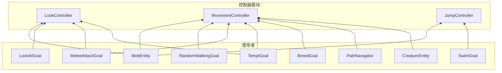

# AI 控制器模块 (Controller)

本模块实现了 Minecraft 生物 AI 的底层控制器系统，负责管理实体的视线、移动和跳跃行为。

## 目录结构

```
controller/
├── LookController.hpp      # 视线控制器头文件
├── LookController.cpp      # 视线控制器实现
├── MovementController.hpp  # 移动控制器头文件
├── MovementController.cpp  # 移动控制器实现
├── JumpController.hpp      # 跳跃控制器头文件
├── JumpController.cpp      # 跳跃控制器实现
└── README.md               # 本文档
```

## 文件详解

### LookController（视线控制器）

**文件**: `LookController.hpp` / `LookController.cpp`

**职责**: 控制实体的头部旋转，使其平滑地看向指定位置。

**核心功能**:
- 设置目标看向位置（世界坐标）
- 计算目标偏航角（yaw）和俯仰角（pitch）
- 限制旋转速度，实现平滑转头效果
- 每tick更新实体朝向

**关键方法**:

| 方法 | 说明 |
|------|------|
| `setLookPosition(x, y, z)` | 设置看向目标位置 |
| `setLookPosition(x, y, z, deltaYaw, deltaPitch)` | 设置看向位置并指定旋转速度 |
| `tick()` | 每tick更新，执行实际旋转 |
| `isLooking()` | 是否正在看向某处 |
| `getTargetYaw()` | 计算目标偏航角 |
| `getTargetPitch()` | 计算目标俯仰角 |

**旋转计算公式**:
```cpp
// 偏航角（yaw）: atan2(dz, dx) * RAD_TO_DEG - 90
// 俯仰角（pitch）: -atan2(dy, horizontalDist) * RAD_TO_DEG
```

---

### MovementController（移动控制器）

**文件**: `MovementController.hpp` / `MovementController.cpp`

**职责**: 控制实体的移动行为，包括移动到目标位置和横向移动。

**核心功能**:
- 设置移动目标位置和速度
- 自动计算朝向并旋转实体
- 检测并处理跳跃（目标位置较高时）
- 支持横向移动（strafe）模式

**动作状态枚举**:

| 状态 | 说明 |
|------|------|
| `Wait` | 等待状态，不移动 |
| `MoveTo` | 移动到目标位置 |
| `Strafe` | 横向移动模式 |
| `Jumping` | 跳跃中 |

**关键方法**:

| 方法 | 说明 |
|------|------|
| `setMoveTo(x, y, z, speed)` | 设置移动目标位置和速度 |
| `strafe(forward, strafe)` | 设置横向移动 |
| `tick()` | 每tick更新，执行实际移动 |
| `isUpdating()` | 是否正在移动（MoveTo状态） |

**移动逻辑**:
1. 计算当前位置到目标的水平距离
2. 如果距离小于阈值（0.5格），停止移动
3. 否则计算目标偏航角并限制旋转速度
4. 根据速度属性设置移动方向
5. 检测是否需要跳跃（目标高度 > stepHeight 且距离近）

---

### JumpController（跳跃控制器）

**文件**: `JumpController.hpp` / `JumpController.cpp`

**职责**: 管理实体的跳跃状态，作为简单的跳跃命令缓冲。

**核心功能**:
- 接收跳跃请求
- 在下一tick将跳跃状态应用到实体
- 自动重置跳跃状态

**关键方法**:

| 方法 | 说明 |
|------|------|
| `setJumping()` | 请求跳跃 |
| `tick()` | 每tick应用跳跃状态到实体 |
| `isJumping()` | 是否有待处理的跳跃请求 |

**工作流程**:
```
AI Goal → setJumping() → m_isJumping = true
                ↓
           tick() → m_mob->setJumping(true)
                ↓
           m_isJumping = false（自动重置）
```

---

## 模块整体架构



---

## 模块职责

### 整体职责

控制器模块是 AI 系统的**执行层**，负责：

1. **抽象化底层操作**: 将复杂的旋转计算、移动逻辑封装为简单接口
2. **平滑过渡**: 实现平滑的转头和移动效果，避免瞬移
3. **状态管理**: 管理移动和跳跃的状态转换
4. **解耦 AI 与物理**: AI Goal 只需设置目标，控制器负责具体执行

### 输入和输出



**输入**:
- 目标位置（世界坐标）
- 移动速度倍率
- 旋转速度限制（偏航角/俯仰角）
- 跳跃请求信号

**输出**:
- 实体朝向（yaw/pitch）
- 移动方向（forward/strafe）
- 跳跃状态标志

---

## 依赖项

### 内部依赖

```
controller/
├── 依赖 mob/MobEntity.hpp       # 实体访问和操作
├── 依赖 living/LivingEntity.hpp # 属性访问（移动速度等）
├── 依赖 attribute/Attributes.hpp # 属性系统
└── 依赖 util/math/MathUtils.hpp  # 数学工具（角度限制等）
```

### 被依赖



---

## 使用方法

### 基本使用

控制器由 `MobEntity` 自动创建和管理，AI Goal 通过 `MobEntity` 访问：

```cpp
// 在 MobEntity 构造函数中创建
MobEntity::MobEntity(LegacyEntityType type, EntityId id)
    : LivingEntity(type, id)
    , m_lookController(std::make_unique<LookController>(this))
    , m_moveController(std::make_unique<MovementController>(this))
    , m_jumpController(std::make_unique<JumpController>(this))
{
}

// 在 tick() 中更新
void MobEntity::tick() {
    LivingEntity::tick();
    // ...
    if (m_lookController) m_lookController->tick();
    if (m_moveController) m_moveController->tick();
    if (m_jumpController) m_jumpController->tick();
}
```

### 在 AI Goal 中使用

```cpp
// 看向目标实体
void LookAtGoal::tick() {
    if (m_mob && m_lookTarget) {
        // 使用便捷方法
        m_mob->lookAt(*m_lookTarget);
        
        // 或直接访问控制器
        auto* lookCtrl = m_mob->lookController();
        if (lookCtrl) {
            lookCtrl->setLookPosition(
                m_lookTarget->x(),
                m_lookTarget->y() + m_lookTarget->eyeHeight(),
                m_lookTarget->z(),
                10.0f,  // deltaYaw
                10.0f   // deltaPitch
            );
        }
    }
}

// 移动到目标位置
void RandomWalkingGoal::startExecuting() {
    if (m_creature) {
        m_creature->tryMoveTo(m_targetX, m_targetY, m_targetZ, m_speed);
    }
}

// 触发跳跃
void SwimGoal::tick() {
    if (m_mob && m_mob->isInWater()) {
        auto* jumpCtrl = m_mob->jumpController();
        if (jumpCtrl) {
            jumpCtrl->setJumping();
        }
    }
}
```

### 控制器协同工作

```cpp
// MovementController 自动触发 JumpController
void MovementController::tick() {
    // ...
    // 检查是否需要跳跃（目标位置比当前位置高，且水平距离较近）
    if (m_action == MoveAction::MoveTo && dy > m_mob->stepHeight() && distSq < 1.0) {
        if (auto* jumpCtrl = m_mob->jumpController()) {
            jumpCtrl->setJumping();
        }
        m_action = MoveAction::Jumping;
    }
}
```

---

## 容易踩的坑

### 1. 控制器更新顺序

**问题**: 控制器的 `tick()` 调用顺序影响行为。

**正确顺序**:
```cpp
void MobEntity::tick() {
    LivingEntity::tick();
    // 1. 先更新 AI Goal（设置目标）
    m_goalSelector.tick();
    m_targetSelector.tick();
    // 2. 再更新控制器（执行目标）
    m_lookController->tick();
    m_moveController->tick();
    m_jumpController->tick();
    // 3. 最后执行物理移动
    aiStep();
}
```

### 2. 跳跃状态重置

**问题**: `JumpController::tick()` 会自动重置跳跃状态。

**注意**: 每次跳跃请求只在一帧内有效，AI Goal 需要在跳跃完成前持续请求：

```cpp
// 错误：只请求一次
void SwimGoal::startExecuting() {
    m_mob->jumpController()->setJumping();
}

// 正确：持续请求直到跳出水面
void SwimGoal::tick() {
    if (m_mob->isInWater()) {
        m_mob->jumpController()->setJumping();
    }
}
```

### 3. 旋转速度限制

**问题**: 过大的旋转速度会导致实体瞬移视角。

**建议值**:
- 默认转头速度：`10.0f`（度/tick）
- 快速转头：`30.0f`（度/tick）
- 缓慢转头：`5.0f`（度/tick）

### 4. 移动控制器状态

**问题**: `MoveAction::Jumping` 状态需要正确转换回 `MoveTo`。

**当前实现**:
```cpp
// 检查跳跃状态
if (m_action == MoveAction::Jumping && m_mob->onGround()) {
    m_action = MoveAction::MoveTo;  // 着陆后继续移动
}
```

### 5. 空指针检查

**问题**: 控制器可能为 `nullptr`（如果实体未正确初始化）。

**建议**: 始终检查控制器指针：
```cpp
if (auto* ctrl = m_mob->lookController()) {
    ctrl->setLookPosition(x, y, z);
}
```

---

## 测试覆盖

### 当前状态

**测试文件**: 暂无专用测试文件

### 建议的测试用例

#### LookController 测试

| 测试用例 | 说明 |
|----------|------|
| `testSetLookPosition` | 设置看向位置，验证目标坐标存储 |
| `testGetTargetYaw` | 验证偏航角计算正确性 |
| `testGetTargetPitch` | 验证俯仰角计算正确性 |
| `testClampedRotate` | 验证旋转速度限制 |
| `testTickUpdatesRotation` | 验证tick正确更新实体朝向 |

#### MovementController 测试

| 测试用例 | 说明 |
|----------|------|
| `testSetMoveTo` | 设置移动目标，验证状态转换 |
| `testStrafe` | 验证横向移动模式 |
| `testArrival` | 验证到达目标后停止移动 |
| `testJumpTrigger` | 验证高目标位置触发跳跃 |
| `testRotationTowardTarget` | 验证移动时朝向目标旋转 |

#### JumpController 测试

| 测试用例 | 说明 |
|----------|------|
| `testSetJumping` | 验证跳跃请求设置 |
| `testTickAppliesJump` | 验证tick应用跳跃状态 |
| `testAutoReset` | 验证跳跃状态自动重置 |

#### 集成测试

| 测试用例 | 说明 |
|----------|------|
| `testLookAtGoalIntegration` | 验证LookAtGoal正确使用LookController |
| `testRandomWalkingIntegration` | 验证RandomWalkingGoal正确使用MovementController |
| `testMeleeAttackIntegration` | 验证MeleeAttackGoal同时使用多个控制器 |

---

## 设计参考

本模块参考了 Minecraft Java Edition 1.16.5 的控制器系统：

- `net.minecraft.entity.ai.controller.LookController`
- `net.minecraft.entity.ai.controller.MovementController`
- `net.minecraft.entity.ai.controller.JumpController`

主要差异：
1. 使用现代 C++17 语法和智能指针
2. 命名空间组织：`mc::entity::ai::controller`
3. 简化了部分状态管理逻辑

---

## 更新历史

| 日期 | 变更 |
|------|------|
| 2024-XX-XX | 初始实现三个控制器 |
| 2026-03-26 | 创建 README.md 文档 |
