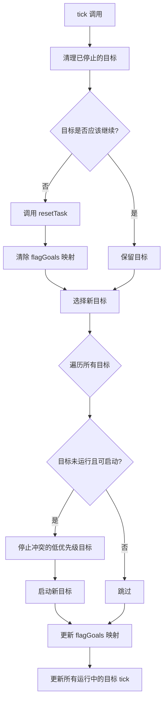
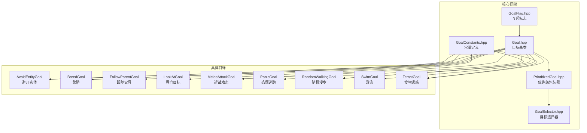
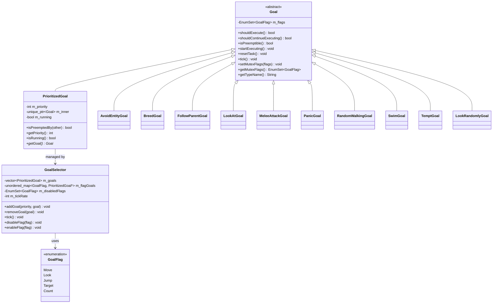
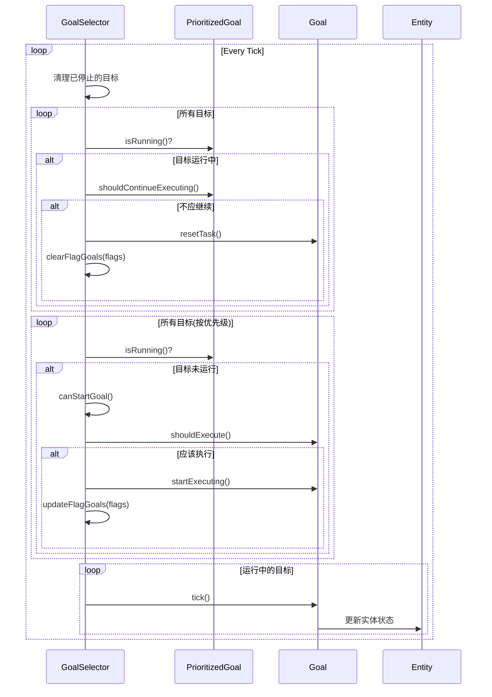

# AI 目标系统 (Goal System)

## 目录结构

```
goal/
├── Goal.hpp                  # AI目标基类
├── GoalConstants.hpp         # 目标系统常量定义
├── GoalFlag.hpp              # 互斥标志枚举
├── GoalSelector.hpp          # 目标选择器
├── PrioritizedGoal.hpp       # 带优先级的目标包装器
└── goals/                    # 具体目标实现
    ├── AvoidEntityGoal.hpp/cpp   # 避开实体目标
    ├── BreedGoal.hpp/cpp         # 繁殖目标
    ├── FollowParentGoal.hpp/cpp  # 跟随父母目标
    ├── LookAtGoal.hpp/cpp        # 看向目标/随机看向
    ├── MeleeAttackGoal.hpp/cpp   # 近战攻击目标
    ├── PanicGoal.hpp/cpp         # 恐慌逃跑目标
    ├── RandomWalkingGoal.hpp/cpp # 随机漫步目标
    ├── SwimGoal.hpp/cpp          # 游泳目标
    └── TemptGoal.hpp/cpp         # 食物诱惑目标
```

## 整体职责

AI 目标系统负责管理实体的智能行为决策。每个 AI 行为（如游泳、漫步、攻击、繁殖等）都被封装为一个独立的 Goal 对象，通过 GoalSelector 根据优先级和互斥标志协调多个目标的执行。

### 核心设计理念

1. **模块化**: 每个 AI 行为是独立的目标类，易于扩展和维护
2. **优先级系统**: 数值越小优先级越高，高优先级目标可以抢占低优先级目标
3. **互斥机制**: 通过 GoalFlag 标志防止冲突行为同时执行
4. **生命周期管理**: 统一的执行流程 (`shouldExecute` → `startExecuting` → `tick` → `resetTask`)

---

## 文件详细介绍

### 核心框架文件

#### Goal.hpp - AI目标基类

**职责**: 定义所有 AI 目标的抽象基类，声明生命周期的核心接口。

**主要方法**:
| 方法 | 说明 |
|------|------|
| `shouldExecute()` | 检查当前条件是否满足执行此目标（纯虚函数） |
| `shouldContinueExecuting()` | 检查是否应该继续执行，默认调用 `shouldExecute()` |
| `isPreemptible()` | 是否可被抢占，默认返回 `true` |
| `startExecuting()` | 目标开始时调用，用于初始化状态 |
| `resetTask()` | 目标被中断时调用，用于清理状态 |
| `tick()` | 每游戏刻调用，更新正在执行的目标 |
| `getMutexFlags()` | 获取互斥标志集合 |

**关键成员**:
- `m_flags`: 互斥标志集合，用于控制目标间的互斥关系

```cpp
// 示例：自定义目标
class MyGoal : public Goal {
public:
    bool shouldExecute() override {
        return m_entity->isHungry();
    }

    void startExecuting() override {
        m_entity->startEating();
    }

    void tick() override {
        m_entity->continueEating();
    }
};
```

---

#### GoalFlag.hpp - 互斥标志枚举

**职责**: 定义目标互斥标志，用于控制哪些目标不能同时运行。

**标志类型**:
| 标志 | 说明 | 典型使用场景 |
|------|------|--------------|
| `Move` | 移动控制 | 漫步、跟随、逃跑、攻击 |
| `Look` | 视线控制 | 看向玩家、看向攻击目标 |
| `Jump` | 跳跃控制 | 游泳、自动跳跃 |
| `Target` | 目标选择 | 攻击目标选择、仇恨系统 |

**互斥原理**: 如果两个目标共享相同的标志，则它们不能同时运行。例如，`RandomWalkingGoal` 和 `MeleeAttackGoal` 都使用 `Move` 标志，因此当实体攻击时不会同时漫步。

```cpp
// 示例：设置互斥标志
setMutexFlags(EnumSet<GoalFlag>{GoalFlag::Move, GoalFlag::Look});
```

---

#### GoalConstants.hpp - 目标系统常量

**职责**: 定义目标系统使用的常量，避免魔法数字。

**常量分类**:

| 类别 | 常量 | 值 | 说明 |
|------|------|-----|------|
| 距离 | `DEFAULT_FOLLOW_DISTANCE` | 10.0f | 默认跟随距离 |
| 距离 | `BREED_DISTANCE` | 3.0f | 繁殖所需距离 |
| 距离 | `TEMPT_RANGE` | 10.0f | 诱惑检测范围 |
| 距离 | `AVOID_DETECTION_RANGE` | 16.0f | 避开检测距离 |
| 距离 | `MELEE_ATTACK_REACH` | 2.0f | 近战攻击范围 |
| 时间 | `MELEE_ATTACK_COOLDOWN` | 20 tick | 攻击冷却 (1秒) |
| 时间 | `PATH_RECALCULATE_INTERVAL` | 5 tick | 路径重算间隔 |
| 时间 | `MAX_WALK_TIME` | 600 tick | 最大漫步时间 (30秒) |
| 概率 | `DEFAULT_LOOK_CHANCE` | 0.02f | 默认看向概率 (2%) |
| 速度 | `AVOID_NEAR_SPEED` | 1.5 | 近距离逃跑速度 |

---

#### GoalSelector.hpp - 目标选择器

**职责**: 管理实体的所有 AI 目标，负责选择和执行当前应该运行的目标。

**核心流程**:



**主要方法**:
| 方法 | 说明 |
|------|------|
| `addGoal(priority, goal)` | 添加目标，数值越小优先级越高 |
| `removeGoal(goal)` | 移除指定目标 |
| `removeAllGoals()` | 移除所有目标 |
| `tick()` | 每刻更新，选择和执行目标 |
| `disableFlag(flag)` | 禁用指定标志的目标 |
| `enableFlag(flag)` | 启用指定标志的目标 |
| `forEachRunningGoal(func)` | 遍历所有运行中的目标 |

**关键成员**:
- `m_goals`: 所有目标的列表（按添加顺序）
- `m_flagGoals`: 标志到正在运行的目标的映射
- `m_disabledFlags`: 被禁用的标志集合

---

#### PrioritizedGoal.hpp - 带优先级的目标包装器

**职责**: 包装 Goal 对象并添加优先级信息，实现优先级比较和抢占逻辑。

**主要方法**:
| 方法 | 说明 |
|------|------|
| `getPriority()` | 获取优先级（数值越小优先级越高） |
| `isRunning()` | 是否正在运行 |
| `isPreemptedBy(other)` | 是否可以被另一个目标抢占 |
| `getGoal()` | 获取内部目标指针 |

**抢占规则**:
```cpp
bool isPreemptedBy(const PrioritizedGoal& other) const {
    return isPreemptible() && other.m_priority < m_priority;
}
```
只有当目标可抢占且另一个目标优先级更高时，才会被抢占。

---

### 具体目标实现

#### AvoidEntityGoal - 避开实体目标

**职责**: 使生物避开特定类型的实体（如村民躲避僵尸）。

**执行条件**: 检测到威胁实体在避开距离内

**行为**:
1. 寻找最近的威胁实体
2. 计算逃跑方向（远离威胁）
3. 根据距离调整速度（近距离跑更快）

**互斥标志**: `Move`

**关键参数**:
- `m_avoidDistance`: 避开检测距离
- `m_farSpeed`: 远距离逃跑速度
- `m_nearSpeed`: 近距离逃跑速度

---

#### BreedGoal - 繁殖目标

**职责**: 使两只动物靠近并繁殖。

**执行条件**: 动物处于爱心状态（被喂食后）

**行为**:
1. 寻找附近同类型且同样处于爱心状态的配偶
2. 移动向配偶
3. 距离足够近时生成幼体

**互斥标志**: `Move`, `Look`

**关键参数**:
- `m_speed`: 移动速度
- `SPAWN_BABY_DELAY`: 繁殖延迟 (60 tick)

---

#### FollowParentGoal - 跟随父母目标

**职责**: 幼体动物跟随成年动物。

**执行条件**: 实体是幼体且有附近的成年同类

**行为**:
1. 搜索附近的成年动物
2. 保持跟随但维持最小距离
3. 定期更新路径

**互斥标志**: `Move`

**关键参数**:
- `FOLLOW_PARENT_MIN_DISTANCE`: 最小跟随距离 (3.0f)
- `FOLLOW_PARENT_MAX_DISTANCE`: 最大跟随距离 (10.0f)

---

#### LookAtGoal - 看向目标

**职责**: 使生物看向附近的实体。

**执行条件**: 以一定概率触发

**行为**:
1. 寻找附近的实体
2. 使用 LookController 看向目标
3. 持续一定时间

**互斥标志**: `Look`

**关键参数**:
- `m_maxDistance`: 最大观看距离
- `m_chance`: 执行概率

**派生类**: `LookRandomlyGoal` - 随机看向某个方向

---

#### MeleeAttackGoal - 近战攻击目标

**职责**: 使生物攻击目标实体。

**执行条件**: 有攻击目标且目标存活

**行为**:
1. 追踪攻击目标
2. 定期更新路径
3. 攻击冷却结束后攻击
4. 应用伤害和击退

**互斥标志**: `Move`, `Look`

**关键参数**:
- `m_speed`: 追踪速度
- `m_useLongMemory`: 是否使用长期记忆（目标丢失后继续追踪）
- `ATTACK_COOLDOWN_TICKS`: 攻击冷却 (20 tick)

---

#### PanicGoal - 恐慌逃跑目标

**职责**: 当实体受到攻击或着火时，随机逃跑。

**执行条件**: 实体受到攻击或着火

**行为**:
1. 如果着火，尝试寻找水源
2. 否则随机选择逃跑方向
3. 持续逃跑直到安全

**互斥标志**: `Move`

**关键参数**:
- `m_speed`: 逃跑速度
- `PANIC_ESCAPE_MIN_DISTANCE`: 最小逃跑距离 (5.0f)
- `PANIC_ESCAPE_MAX_DISTANCE`: 最大逃跑距离 (10.0f)

---

#### RandomWalkingGoal - 随机漫步目标

**职责**: 使生物随机选择一个方向并移动。

**执行条件**: 概率触发，且实体空闲

**行为**:
1. 检查概率和空闲时间
2. 选择随机目标位置
3. 移动到目标位置
4. 超时后停止

**互斥标志**: `Move`

**关键参数**:
- `m_speed`: 移动速度
- `m_executionChance`: 执行概率倒数
- `MAX_WALK_TIME`: 最大漫步时间 (600 tick)

---

#### SwimGoal - 游泳目标

**职责**: 当实体在水中或岩浆中时，尝试向上游动。

**执行条件**: 实体在水中或岩浆中

**行为**:
1. 检测是否在液体中
2. 随机触发跳跃以游泳

**互斥标志**: `Jump`

**特点**: 非常简单的目标，只控制跳跃行为。

---

#### TemptGoal - 食物诱惑目标

**职责**: 当玩家手持特定物品时，动物会被诱惑跟随玩家。

**执行条件**: 附近有玩家手持诱惑物品

**行为**:
1. 检测玩家手持物品
2. 跟随玩家移动
3. 保持适当距离
4. 可选：被玩家移动吓跑

**互斥标志**: `Move`, `Look`

**关键参数**:
- `m_speed`: 跟随速度
- `m_scaredByMovement`: 是否被玩家移动吓跑
- `TEMPT_COOLDOWN`: 诱惑冷却 (100 tick)

---

## 文件关系图



---

## 输入和输出

### 输入

| 输入来源 | 说明 |
|----------|------|
| 实体状态 | 实体的位置、生命值、状态效果等 |
| 世界环境 | 周围实体、方块、光照等 |
| 玩家交互 | 玩家手持物品、攻击等 |
| 控制器 | MoveController、LookController、JumpController |

### 输出

| 输出类型 | 说明 |
|----------|------|
| 移动指令 | 通过 `tryMoveTo()` 设置移动目标 |
| 视线控制 | 通过 `lookAt()` 设置看向目标 |
| 跳跃指令 | 通过 `JumpController` 触发跳跃 |
| 状态变更 | 繁殖、攻击伤害等 |

---

## 依赖项

### 外部依赖

```cpp
// 实体系统
#include "common/entity/core/MobEntity.hpp"
#include "common/entity/core/CreatureEntity.hpp"
#include "common/entity/core/LivingEntity.hpp"
#include "common/entity/entities/passive/basic/AnimalEntity.hpp"

// 控制器
#include "common/entity/ai/controller/LookController.hpp"
#include "common/entity/ai/controller/MovementController.hpp"
#include "common/entity/ai/controller/JumpController.hpp"
#include "common/entity/ai/pathfinding/PathNavigator.hpp"

// 工具
#include "common/util/math/random/Random.hpp"
#include "common/core/EnumSet.hpp"
```

### 被依赖

```cpp
// 动物实体
#include "common/entity/entities/passive/basic/PigEntity.hpp"
#include "common/entity/entities/passive/basic/CowEntity.hpp"
// ...其他动物

// 敌对生物
#include "common/entity/entities/monster/undead/ZombieEntity.hpp"
#include "common/entity/entities/monster/undead/SkeletonEntity.hpp"
// ...其他生物
```

---

## 使用方法

### 1. 创建自定义目标

```cpp
class MyCustomGoal : public mc::entity::ai::Goal {
public:
    MyCustomGoal(MobEntity* mob, f64 speed)
        : m_mob(mob)
        , m_speed(speed)
    {
        // 设置互斥标志
        setMutexFlags(EnumSet<GoalFlag>{GoalFlag::Move});
    }

    bool shouldExecute() override {
        if (!m_mob) return false;
        // 检查执行条件
        return m_mob->isHungry();
    }

    bool shouldContinueExecuting() override {
        // 检查是否继续
        return m_mob->isHungry() && m_targetFood != nullptr;
    }

    void startExecuting() override {
        // 初始化状态
        m_targetFood = findFood();
    }

    void resetTask() override {
        // 清理状态
        m_targetFood = nullptr;
        m_mob->clearNavigation();
    }

    void tick() override {
        // 每刻更新
        if (m_targetFood) {
            m_mob->tryMoveTo(
                m_targetFood->x(),
                m_targetFood->y(),
                m_targetFood->z(),
                m_speed
            );
        }
    }

    String getTypeName() const override {
        return "MyCustomGoal";
    }

private:
    MobEntity* m_mob;
    f64 m_speed;
    Entity* m_targetFood = nullptr;
};
```

### 2. 为实体添加目标

```cpp
void PigEntity::registerGoals() {
    // 优先级 0: 最高（游泳）
    m_goalSelector.addGoal(0, std::make_unique<SwimGoal>(this));

    // 优先级 1: 恐慌逃跑
    m_goalSelector.addGoal(1, std::make_unique<PanicGoal>(this, 1.5));

    // 优先级 2: 繁殖
    m_goalSelector.addGoal(2, std::make_unique<BreedGoal>(this, 1.0));

    // 优先级 3: 食物诱惑
    m_goalSelector.addGoal(3, std::make_unique<TemptGoal>(
        this, 1.2, isFoodItem, false));

    // 优先级 4: 跟随父母
    m_goalSelector.addGoal(4, std::make_unique<FollowParentGoal>(this, 1.0));

    // 优先级 5: 随机漫步
    m_goalSelector.addGoal(5, std::make_unique<RandomWalkingGoal>(this, 1.0));

    // 优先级 6: 看向玩家
    m_goalSelector.addGoal(6, std::make_unique<LookAtGoal>(this, 8.0f));
}
```

### 3. 在游戏循环中更新

```cpp
void MobEntity::tick() {
    // 更新 AI 目标
    m_goalSelector.tick();

    // 更新控制器
    if (m_moveController) m_moveController->tick();
    if (m_lookController) m_lookController->tick();
    if (m_jumpController) m_jumpController->tick();
}
```

---

## 容易踩的坑

### 1. 优先级数值混淆

**问题**: 以为数值越大优先级越高。

**正确**: 数值越小优先级越高。

```cpp
// 正确：高优先级用小数值
m_goalSelector.addGoal(0, swimGoal);      // 最高优先级
m_goalSelector.addGoal(10, wanderGoal);   // 低优先级
```

### 2. 忘记设置互斥标志

**问题**: 两个目标同时修改实体状态导致冲突。

**解决**: 始终设置正确的互斥标志。

```cpp
// 错误：没有设置互斥标志
class MyGoal : public Goal {
    MyGoal() { }  // 可能与其他移动目标冲突
};

// 正确：设置互斥标志
class MyGoal : public Goal {
    MyGoal() {
        setMutexFlags(EnumSet<GoalFlag>{GoalFlag::Move});
    }
};
```

### 3. `shouldContinueExecuting` 默认行为

**问题**: 依赖默认实现 `return shouldExecute()`，导致目标过早结束。

**解决**: 根据需要重写 `shouldContinueExecuting()`。

```cpp
// 可能有问题
bool shouldExecute() override {
    return m_target != nullptr;  // 检查目标存在
}
// 默认 shouldContinueExecuting() 也检查目标存在
// 但可能检查时机不对

// 更好的实现
bool shouldContinueExecuting() override {
    return m_target != nullptr &&
           m_target->isAlive() &&
           m_attackCooldown > 0;  // 额外条件
}
```

### 4. 空指针检查缺失

**问题**: 实体指针在目标执行期间可能失效。

**解决**: 在每个方法开始检查空指针。

```cpp
void tick() override {
    if (!m_mob) return;  // 防御性检查
    if (!m_target || !m_target->isAlive()) return;

    // 正常逻辑...
}
```

### 5. 目标状态未清理

**问题**: `resetTask()` 未清理所有状态。

**解决**: 确保 `resetTask()` 清理所有临时状态。

```cpp
void resetTask() override {
    m_target = nullptr;
    m_timer = 0;
    m_pathRecalculateCounter = 0;
    if (m_mob) {
        m_mob->clearNavigation();  // 清理导航
    }
}
```

### 6. 距离比较使用 sqrt

**问题**: 频繁调用 `sqrt()` 影响性能。

**解决**: 使用距离平方比较。

```cpp
// 低效
f32 distance = std::sqrt(dx * dx + dy * dy + dz * dz);
if (distance < maxDistance) { }

// 高效
f32 distSq = dx * dx + dy * dy + dz * dz;
if (distSq < maxDistance * maxDistance) { }

// 或使用预定义的平方常量
if (distSq < MAX_DISTANCE_SQ) { }
```

### 7. 目标间竞争条件

**问题**: 多个相同优先级的目标可能竞争执行。

**解决**: 使用不同的优先级或互斥标志。

---

## 涉及的测试用例

### GoalTests.cpp (437 行)

| 测试名称 | 说明 |
|----------|------|
| `EnumSetTest.DefaultConstruction` | EnumSet 默认构造 |
| `EnumSetTest.InitializerListConstruction` | 初始化列表构造 |
| `EnumSetTest.SetAndReset` | 设置和重置标志 |
| `EnumSetTest.Operators` | 并集、交集、差集操作 |
| `EnumSetTest.Intersects` | 交集检查 |
| `EnumSetTest.ForEach` | 遍历操作 |
| `GoalTest.DefaultFlags` | Goal 默认标志为空 |
| `GoalTest.SetMutexFlags` | 设置互斥标志 |
| `GoalTest.ConstructWithFlags` | 构造时设置标志 |
| `GoalTest.DefaultPreemptible` | 默认可抢占 |
| `PrioritizedGoalTest.Priority` | 优先级获取 |
| `PrioritizedGoalTest.Preemption` | 抢占规则测试 |
| `PrioritizedGoalTest.NonPreemptible` | 不可抢占测试 |
| `PrioritizedGoalTest.RunningState` | 运行状态管理 |
| `PrioritizedGoalTest.DelegatesToInner` | 委托到内部目标 |
| `GoalSelectorTest.AddAndRemoveGoal` | 添加和移除目标 |
| `GoalSelectorTest.PriorityOrdering` | 优先级排序 |
| `GoalSelectorTest.MutexFlags` | 互斥标志测试 |
| `GoalSelectorTest.DisableFlags` | 禁用标志测试 |
| `GoalSelectorTest.TickRunningGoals` | tick 更新运行目标 |
| `GoalSelectorTest.StopWhenShouldNotContinue` | 停止条件测试 |
| `GoalSelectorTest.RemoveAllGoals` | 移除所有目标 |
| `GoalSelectorTest.ForEachRunningGoal` | 遍历运行目标 |
| `GoalFlagTest.AllFlags` | 所有标志测试 |

### RandomWalkingGoalTest.cpp (389 行)

| 测试名称 | 说明 |
|----------|------|
| `RandomWalkingGoalTest.ShouldExecuteReturnsFalseWhenNullCreature` | 空实体检查 |
| `RandomWalkingGoalTest.ShouldExecuteReturnsTrueWhenConditionsMet` | 条件满足时执行 |
| `RandomWalkingGoalTest.ShouldExecuteReturnsFalseWhenIdleTimeTooHigh` | 空闲时间检查 |
| `RandomWalkingGoalTest.ShouldContinueExecutingReturnsFalseWhenNullCreature` | 空实体继续检查 |
| `RandomWalkingGoalTest.ShouldContinueExecutingReturnsTrueWhenActive` | 活动状态继续 |
| `RandomWalkingGoalTest.StartExecutingSetsTargetPosition` | 启动时设置目标位置 |
| `RandomWalkingGoalTest.ResetTaskClearsNavigation` | 重置清理导航 |
| `RandomWalkingGoalTest.TickDecrementsTimeoutCounter` | tick 递减超时计数 |
| `RandomWalkingGoalTest.MakeUpdateForcesNextExecution` | 强制下次执行 |
| `RandomWalkingGoalTest.SetExecutionChance` | 设置执行概率 |
| `CreatureEntityMoveTest.*` | CreatureEntity 移动测试 |
| `MovementControllerTest.*` | MovementController 测试 |
| `RandomWalkingGoalIntegrationTest.*` | 集成测试 |

---

## 类图



---

## 执行流程时序图



---

## 参考资料

- Minecraft Java 1.16.5 `net.minecraft.entity.ai.goal` 包
- 本项目 CLAUDE.md 文档
