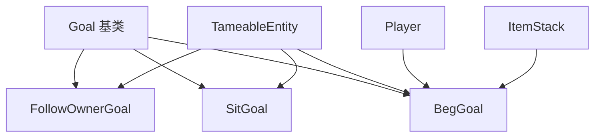

# 交互类 AI 目标 (Interact Goals)

包含与实体交互相关的 AI 目标。

## 文件列表

| 文件 | 说明 |
|------|------|
| TameableGoals.hpp/cpp | 可驯服动物相关目标（FollowOwnerGoal, SitGoal, BegGoal） |
| LandOnOwnersShoulderGoal.hpp/cpp | 肩膀乘坐目标（鹦鹉落到主人肩膀） |

## 整体职责

提供可驯服动物（狼、猫、鹦鹉等）特有的 AI 行为目标。

---

## FollowOwnerGoal - 跟随主人目标

**职责**: 使驯服动物跟随主人。

**执行条件**: 驯服 + 未坐下 + 有主人 + 距离够远

**行为**:
1. 跟随主人移动
2. 定期重新计算路径
3. 距离过远时传送到主人身边

**互斥标志**: `Move`

**关键参数**:
- `m_speed`: 跟随速度
- `m_minDistance`: 最小跟随距离 (默认 3.0f)
- `m_maxDistance`: 最大跟随距离 (默认 10.0f)
- `m_teleportDistance`: 传送距离 (默认 32.0f)

**参考**: MC 1.16.5 `net.minecraft.entity.ai.goal.FollowOwnerGoal`

---

## SitGoal - 坐下目标

**职责**: 使驯服动物保持坐下状态。坐下时不会移动或跟随主人。

**执行条件**: 驯服 + 坐下状态

**行为**:
1. 清除导航
2. 保持原地不动

**互斥标志**: `Target`

**参考**: MC 1.16.5 `net.minecraft.entity.ai.goal.SitGoal`

---

## BegGoal - 乞求目标

**职责**: 当玩家手持食物或驯服物品时，动物会看向玩家并乞求。主要用于狼（狗）的行为。

**执行条件**: 附近有玩家手持驯服物品（仅已驯服动物）或繁殖物品（所有动物）

**行为**:
1. 检测玩家手持物品
2. 看向玩家
3. 播放乞求动画（头部摆动）

**互斥标志**: `Look`

**关键参数**:
- `m_maxDistance`: 最大乞求距离 (默认 8.0f)
- `m_targetPlayer`: 当前乞求目标

### 驯服物品检查逻辑

**MC 1.16.5 规则** (`BegGoal.hasTemptationItemInHand`):

```cpp
bool isPlayerHoldingFood(const Player* player) const {
    for (Hand hand : {MainHand, OffHand}) {
        ItemStack stack = player->getHeldItem(hand);
        if (stack.isEmpty()) continue;
        
        // 已驯服的动物：对驯服物品乞求
        // 狼：骨头；猫：生鱼；鹦鹉：种子
        if (m_entity->isTamed() && m_entity->isTameItem(stack)) {
            return true;
        }
        
        // 所有动物：对繁殖物品乞求
        // 狼：肉类；猫：生鱼；鹦鹉：无
        if (m_entity->isBreedingItem(stack)) {
            return true;
        }
    }
    return false;
}
```

### 使用示例

```cpp
void WolfEntity::registerGoals() {
    // 优先级 9: 乞求目标
    m_goalSelector.addGoal(9, std::make_unique<BegGoal>(this, 8.0f));
}
```

### 与 TemptGoal 的区别

| 特性 | BegGoal | TemptGoal |
|------|---------|-----------|
| 行为 | 只看向玩家，不移动 | 跟随玩家移动 |
| 适用动物 | 狼 | 牛、猪、羊等 |
| 互斥标志 | `Look` | `Move`, `Look` |
| 驯服物品支持 | 已驯服动物对驯服物品乞求 | 不检查驯服状态 |

**参考**: MC 1.16.5 `net.minecraft.entity.ai.goal.BegGoal`

---

## 依赖关系



---

## 使用指南

### 为可驯服动物注册目标

```cpp
void MyTameableEntity::registerGoals() {
    // 调用父类方法
    TameableEntity::registerGoals();
    
    // 优先级 1: 坐下目标
    m_goalSelector.addGoal(1, std::make_unique<SitGoal>(this));
    
    // 优先级 3: 跟随主人
    m_goalSelector.addGoal(3, std::make_unique<FollowOwnerGoal>(
        this, 1.0,    // 速度
        3.0f,         // 最小距离
        10.0f,        // 最大距离
        32.0f         // 传送距离
    ));
    
    // 优先级 9: 乞求目标
    m_goalSelector.addGoal(9, std::make_unique<BegGoal>(this, 8.0f));
}
```

### 实现 isTameItem 方法

在子类中重写 `isTameItem` 方法：

```cpp
// WolfEntity.hpp
[[nodiscard]] bool isTameItem(const ItemStack& itemStack) const override;

// WolfEntity.cpp
bool WolfEntity::isTameItem(const ItemStack& itemStack) const {
    const Item* item = itemStack.getItem();
    if (item == nullptr) return false;
    return item == Items::BONE;  // 狼用骨头驯服
}
```

---

## 测试用例

参见 `tests/entity/BegGoalTest.cpp`：
- 驯服物品测试
- 繁殖物品测试
- 已驯服/未驯服状态测试
- 多态调用测试

---

## LandOnOwnersShoulderGoal - 落到主人肩膀目标

**职责**: 使可驯服的肩膀乘坐实体（如鹦鹉）飞到主人的肩膀上。

**MC 1.16.5 参考**: `net.minecraft.entity.ai.goal.LandOnOwnersShoulderGoal`

### 执行条件

`shouldExecute()` 返回 true 当：
1. 实体已驯服 (`isTamed()`)
2. 实体未坐下 (`!isSitting()`)
3. 主人存在且是有效玩家
4. 主人不在旁观者模式
5. 主人不在飞行（创造模式飞行）
6. 主人不在水中
7. 肩膀乘坐冷却已过（> 100 ticks）

### 核心行为

#### `tick()` 逻辑

每帧检查：
1. 计算与主人的距离
2. 如果实体碰撞箱与主人碰撞箱相交：
   - 调用 `mountShoulder()` 坐到主人肩膀
   - 设置 `m_isSittingOnShoulder = true`

#### `isPreemptible()`

- 返回 `false` 如果已经坐在肩膀上（不可被打断）
- 返回 `true` 否则（可以被其他目标打断）

### 关键参数

| 参数 | 类型 | 说明 |
|------|------|------|
| `m_entity` | `ShoulderRidingEntity*` | 肩膀乘坐实体 |
| `m_owner` | `Player*` | 主人引用 |
| `m_isSittingOnShoulder` | `bool` | 是否已坐在肩膀上 |

### 互斥标志

无（不占用任何互斥标志）

### 使用示例

```cpp
void ParrotEntity::registerGoals() {
    ShoulderRidingEntity::registerGoals();
    
    // 优先级 3: 落到主人肩膀
    m_goalSelector.addGoal(3, std::make_unique<LandOnOwnersShoulderGoal>(this));
}
```

### ShoulderRidingEntity 接口

肩膀乘坐实体需要实现以下方法：

| 方法 | 说明 |
|------|------|
| `canSitOnShoulder()` | 检查是否可以坐到肩膀上 |
| `isOnShoulder()` | 检查是否正在肩膀上 |
| `mountShoulder()` | 开始坐到肩膀上 |
| `shoulderRidingCooldown()` | 获取冷却时间（默认 100 ticks） |

### 依赖关系

```
LandOnOwnersShoulderGoal
    ├── ShoulderRidingEntity    # 肩膀乘坐实体
    │   └── TameableEntity      # 可驯服实体
    │       └── MobEntity       # 生物实体
    └── Player                  # 玩家
```

### 与其他目标的配合

鹦鹉 AI 目标优先级（MC 1.16.5）：

| 优先级 | 目标 | 说明 |
|--------|------|------|
| 0 | SwimGoal | 游泳 |
| 0 | PanicGoal | 恐慌逃跑 |
| 1 | LookAtGoal | 看向玩家 |
| 2 | SitGoal | 坐下 |
| 2 | FollowOwnerGoal | 跟随主人 |
| 2 | WaterAvoidingRandomFlyingGoal | 随机飞行 |
| 3 | LandOnOwnersShoulderGoal | 落到肩膀 |
| 3 | FollowMobGoal | 跟随其他生物 |

### 测试用例

参见 `tests/entity/ParrotGoalsTest.cpp`：
- LandOnOwnersShoulderGoal 构造测试
- shouldExecute 条件测试
- isPreemptible 状态测试
- tick 行为测试
