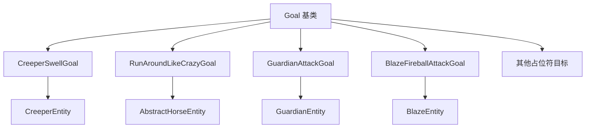

# 特殊 AI 目标 (Special Goals)

## 目录结构

```
special/
├── SpecialGoals.hpp       # 特殊目标头文件
├── SpecialGoals.cpp       # 特殊目标实现
├── GuardianAttackGoal.hpp # 守卫者攻击目标头文件
├── GuardianAttackGoal.cpp # 守卫者攻击目标实现
├── BlazeFireballAttackGoal.hpp # 烈焰人火球攻击目标头文件
├── BlazeFireballAttackGoal.cpp # 烈焰人火球攻击目标实现
└── README.md              # 本文档
```

## 整体职责

本目录包含特定实体专用的 AI 目标，这些目标不适用于通用场景，而是为特定实体类型定制的行为。

## 文件详细介绍

### BlazeFireballAttackGoal - 烈焰人火球攻击目标

**职责**: 控制烈焰人使用小火球攻击目标。

**MC 1.16.5 参考**: `net.minecraft.entity.monster.BlazeEntity.FireballAttackGoal`

**攻击阶段**:
1. **充能阶段**: 60 ticks (3秒)，烈焰人进入燃烧状态
2. **火球阶段**: 连发最多 3 个小火球，每个间隔 6 ticks (0.3秒)
3. **冷却阶段**: 100 ticks (5秒)

**执行条件**:
- 有攻击目标
- 目标存活
- 目标在追踪范围内

**特点**:
- 使用加速度驱动的小火球（SmallFireballEntity）
- 散布计算：`spread = sqrt(sqrt(distSq)) * 0.5`
- 近战范围（< 2 格）使用物理攻击
- 视线检测控制追踪行为

**互斥标志**: `Move`, `Look`

**使用示例**:
```cpp
void BlazeEntity::registerGoals() {
    // 优先级 4: 火球攻击
    m_goalSelector.addGoal(4, std::make_unique<BlazeFireballAttackGoal>(this));
}
```

**常量**:
| 常量 | 值 | 说明 |
|------|-----|------|
| CHARGE_TIME | 60 | 充能时间 (ticks) |
| FIREBALL_INTERVAL | 6 | 火球间隔 (ticks) |
| COOLDOWN_TIME | 100 | 冷却时间 (ticks) |
| MAX_FIREBALLS | 3 | 最大连发火球数 |
| MELEE_RANGE_SQ | 4.0 | 近战范围平方 (2格) |

---

### CreeperSwellGoal - 苦力怕膨胀目标

**职责**: 控制苦力怕在玩家靠近时膨胀并最终爆炸的行为。

**MC 1.16.5 参考**: `net.minecraft.entity.ai.goal.CreeperSwellGoal`

**执行条件**:
- 苦力怕已经有膨胀状态 (`getCreeperState() > 0`)，或
- 攻击目标在 9 格距离内 (3x3 范围)

**tick 行为**:
- 如果攻击目标为空：取消膨胀 (`setCreeperState(-1)`)
- 如果攻击目标距离 > 49 格 (7x7 范围)：取消膨胀
- 如果无法看到攻击目标：取消膨胀
- 否则：设置膨胀状态为 1

**互斥标志**: `Move`

**使用示例**:
```cpp
void CreeperEntity::registerGoals() {
    // 优先级 2: 膨胀爆炸
    m_goalSelector.addGoal(2, std::make_unique<CreeperSwellGoal>(this));
}
```

---

### RunAroundLikeCrazyGoal - 疯狂奔跑目标

**职责**: 控制未驯服的马在被骑乘时四处乱跑，增加驯服难度。

**MC 1.16.5 参考**: `net.minecraft.entity.ai.goal.RunAroundLikeCrazyGoal`

**执行条件**:
- 马未被驯服
- 马正在被骑乘

**tick 行为**:
- 马 AI 随机移动（模拟疯狂奔跑）
- 每 tick 有 1/50 概率执行驯服检查
- 如果驯服成功：
  - 调用 `setTamedBy(player)` 设置主人
  - 发送 `EntityStatus::TamingSucceeded`（爱心粒子）
- 如果驯服失败：
  - 增加 `temper` 进度（+5）
  - 调用 `removePassengers()` 甩下玩家
  - 调用 `makeMad()` 触发扬蹄动画和愤怒音效
  - 发送 `EntityStatus::TamingFailed`（烟雾粒子）

**驯服机制**:
```cpp
// MC 1.16.5 驯服概率计算
i32 temper = horse.getTemper();     // 当前进度
i32 maxTemper = horse.getMaxTemper(); // 最大进度（马默认100）

if (maxTemper > 0 && random.nextInt(maxTemper) < temper) {
    // 驯服成功
    horse.setTamedBy(player);
} else {
    // 增加进度
    horse.increaseTemper(5);
}
```

**互斥标志**: `Move`

**使用示例**:
```cpp
void AbstractHorseEntity::registerGoals() {
    // 优先级 1: 疯狂奔跑（未驯服时）
    m_goalSelector.addGoal(1, std::make_unique<RunAroundLikeCrazyGoal>(this, 1.2));
}
```

**常量**:
| 常量 | 值 | 说明 |
|------|-----|------|
| TEMPER_INCREASE | 5 | 每次驯服失败增加的进度 |
| TAMING_CHECK_CHANCE | 1/50 | 每 tick 驯服检查概率 |

**依赖关系**:
- 需要实体实现 `AbstractHorseEntity` 接口
- 需要 `setTamedBy(Player*)` 方法
- 需要 `makeMad()` 方法（扬蹄 + 愤怒音效）
- 需要 `removePassengers()` 方法

---

### EndermanTeleportGoal - 末影人传送目标

**职责**: 控制末影人在受到攻击或看向玩家时传送。

**MC 1.16.5 参考**: `net.minecraft.entity.ai.goal.EndermanTeleportGoal`

**状态**: 占位符，待实现

---

### LlamaFollowCaravanGoal - 羊驼跟随商队目标

**职责**: 控制羊驼跟随领头的羊驼形成商队。

**MC 1.16.5 参考**: `net.minecraft.entity.ai.goal.LlamaFollowCaravanGoal`

**状态**: 占位符，待实现

---

### DolphinJumpGoal - 海豚跳跃目标

**职责**: 控制海豚跳出水面跳跃。

**MC 1.16.5 参考**: `net.minecraft.entity.ai.goal.DolphinJumpGoal`

**状态**: 占位符，待实现

---

### GuardianAttackGoal - 守卫者攻击目标

**职责**: 控制守卫者使用激光攻击目标。

**MC 1.16.5 参考**: `net.minecraft.entity.monster.GuardianEntity.AttackGoal`

**攻击阶段**:
1. **准备阶段**: tickCounter 从 -10 计数到 0
2. **充能动画**: tickCounter 从 0 计数到 80，在 tickCounter == 0 时发送 EntityStatus::GuardianAttack (21) 触发客户端音效
3. **发射阶段**: tickCounter >= 80 时造成伤害

**执行条件**:
- 有攻击目标
- 目标存活
- 目标在视线范围内

**攻击机制**:
- 魔法伤害 (4.0) + 物理伤害 (基于 ATTACK_DAMAGE 属性)
- 远古守卫者额外 +2.0 伤害
- 困难模式额外 +2.0 伤害 (TODO)
- 使用 `broadcastEntityStatus()` 发送状态21触发客户端攻击音效

**目标选择**:
- 玩家或鱿鱼
- 距离 > 3 格（距离平方 > 9.0）
- 非创造模式/观察者模式的玩家

**常量**:
| 常量 | 值 | 说明 |
|------|-----|------|
| ATTACK_DURATION | 80 | 攻击周期 (ticks) |
| ATTACK_RANGE | 15.0 | 攻击范围 |
| LASER_DAMAGE | 4.0 | 激光基础伤害 |
| ELDER_BONUS_DAMAGE | 2.0 | 远古守卫者额外伤害 |

**互斥标志**: `Move`, `Look`

**使用示例**:
```cpp
void GuardianEntity::registerGoals() {
    // 优先级 4: 激光攻击
    m_goalSelector.addGoal(4, std::make_unique<GuardianAttackGoal>(this));
}
```

---

## 依赖关系



---

## 使用方法

### 1. 在实体中注册特殊目标

```cpp
void MyEntity::registerGoals() {
    // 调用父类方法
    ParentEntity::registerGoals();

    // 注册特殊目标
    m_goalSelector.addGoal(2, std::make_unique<CreeperSwellGoal>(this));
}
```

### 2. 实现新的特殊目标

```cpp
class MySpecialGoal : public Goal {
public:
    explicit MySpecialGoal(MyEntity* entity)
        : Goal(EnumSet<GoalFlag>{GoalFlag::Move})
        , m_entity(entity)
    {
        MC_ASSERT(entity != nullptr);
    }

    bool shouldExecute() override {
        if (!m_entity) return false;
        // 检查执行条件
        return m_entity->someCondition();
    }

    void startExecuting() override {
        // 初始化状态
    }

    void tick() override {
        // 更新逻辑
    }

    void resetTask() override {
        // 清理状态
    }

private:
    MyEntity* m_entity;
};
```

---

## 容易踩的坑

### 1. 忘记设置互斥标志

**问题**: 特殊目标与其他目标冲突。

**解决**: 始终设置正确的互斥标志。

```cpp
// 正确：设置互斥标志
CreeperSwellGoal::CreeperSwellGoal(CreeperEntity* creeper)
    : Goal(EnumSet<GoalFlag>{GoalFlag::Move})
    , m_creeper(creeper)
{
}
```

### 2. 空指针检查缺失

**问题**: 实体指针在目标执行期间可能失效。

**解决**: 在每个方法开始检查空指针。

```cpp
void CreeperSwellGoal::tick() {
    if (!m_creeper) return;
    if (!m_attackTarget || !m_attackTarget->isAlive()) {
        m_creeper->setCreeperState(-1);
        return;
    }
    // 正常逻辑...
}
```

### 3. 距离比较使用 sqrt

**问题**: 频繁调用 `sqrt()` 影响性能。

**解决**: 使用距离平方比较。

```cpp
// 低效
f32 distance = std::sqrt(dx * dx + dy * dy + dz * dz);
if (distance < 7.0f) { }

// 高效
f32 distSq = dx * dx + dy * dy + dz * dz;
if (distSq < 49.0f) { }  // 7 * 7 = 49
```

---

## 涉及的测试用例

| 测试名称 | 说明 |
|----------|------|
| GoalTest.* | Goal 基础测试 |
| GoalSelectorTest.* | 目标选择器测试 |
| PrioritizedGoalTest.* | 优先级目标测试 |
| CreeperSwellGoalBasicTest.* | 苦力怕膨胀目标常量测试 |
| BlazeFireballAttackGoalBasicTest.* | 烈焰人火球攻击目标常量测试 |

---

## 参考资料

- Minecraft Java 1.16.5 `net.minecraft.entity.ai.goal.CreeperSwellGoal`
- Minecraft Java 1.16.5 `net.minecraft.entity.ai.goal.RunAroundLikeCrazyGoal`
- Minecraft Java 1.16.5 `net.minecraft.entity.monster.GuardianEntity.GuardianAttackGoal`
- Minecraft Java 1.16.5 `net.minecraft.entity.monster.BlazeEntity.FireballAttackGoal`
- 本项目 CLAUDE.md 文档
