# 特殊 AI 目标 (Special Goals)

## 目录结构

```
special/
├── SpecialGoals.hpp       # 特殊目标头文件
├── SpecialGoals.cpp       # 特殊目标实现
├── GuardianAttackGoal.hpp # 守卫者攻击目标头文件
├── GuardianAttackGoal.cpp # 守卫者攻击目标实现
├── BlazeFireballAttackGoal.hpp # 烈焰人火球攻击目标头文件
├── BlazeFireballAttackGoal.cpp # 烈焰人火球攻击目标实现
├── MoveToLavaGoal.hpp     # 炽足兽寻找熔岩目标头文件
├── MoveToLavaGoal.cpp     # 炽足兽寻找熔岩目标实现
├── SquidGoals.hpp         # 鱿鱼目标头文件
├── SquidGoals.cpp         # 鱿鱼目标实现
├── BatGoals.hpp           # 蝙蝠目标头文件
├── BatGoals.cpp           # 蝙蝠目标实现
├── DolphinGoals.hpp       # 海豚目标头文件
├── DolphinGoals.cpp       # 海豚目标实现
├── PhantomGoals.hpp       # 幻翼目标头文件
├── PhantomGoals.cpp       # 幻翼目标实现
├── SlimeGoals.hpp         # 史莱姆目标头文件
├── SlimeGoals.cpp         # 史莱姆目标实现
├── IronGolemGoals.hpp     # 铁傀儡目标头文件
├── IronGolemGoals.cpp     # 铁傀儡目标实现
├── EvokerGoals.hpp        # 唤魔者目标头文件
├── EvokerGoals.cpp        # 唤魔者目标实现
├── VexGoals.hpp           # 恼鬼目标头文件
├── VexGoals.cpp           # 恼鬼目标实现
├── BeeGoals.hpp           # 蜜蜂目标头文件
├── BeeGoals.cpp           # 蜜蜂目标实现
└── README.md              # 本文档
```

## 整体职责

本目录包含特定实体专用的 AI 目标，这些目标不适用于通用场景，而是为特定实体类型定制的行为。

## 文件详细介绍

### BlazeFireballAttackGoal - 烈焰人火球攻击目标

**职责**: 控制烈焰人使用小火球攻击目标。

**MC 1.16.5 参考**: `net.minecraft.entity.monster.BlazeEntity.FireballAttackGoal`

**攻击阶段**:
1. **充能阶段**: 60 ticks (3秒)，烈焰人进入燃烧状态
2. **火球阶段**: 连发最多 3 个小火球，每个间隔 6 ticks (0.3秒)
3. **冷却阶段**: 100 ticks (5秒)

**执行条件**:
- 有攻击目标
- 目标存活
- 目标在追踪范围内

**特点**:
- 使用加速度驱动的小火球（SmallFireballEntity）
- 散布计算：`spread = sqrt(sqrt(distSq)) * 0.5`
- 近战范围（< 2 格）使用物理攻击
- 视线检测控制追踪行为

**互斥标志**: `Move`, `Look`

**使用示例**:
```cpp
void BlazeEntity::registerGoals() {
    // 优先级 4: 火球攻击
    m_goalSelector.addGoal(4, std::make_unique<BlazeFireballAttackGoal>(this));
}
```

**常量**:
| 常量 | 值 | 说明 |
|------|-----|------|
| CHARGE_TIME | 60 | 充能时间 (ticks) |
| FIREBALL_INTERVAL | 6 | 火球间隔 (ticks) |
| COOLDOWN_TIME | 100 | 冷却时间 (ticks) |
| MAX_FIREBALLS | 3 | 最大连发火球数 |
| MELEE_RANGE_SQ | 4.0 | 近战范围平方 (2格) |

---

### CreeperSwellGoal - 苦力怕膨胀目标

**职责**: 控制苦力怕在玩家靠近时膨胀并最终爆炸的行为。

**MC 1.16.5 参考**: `net.minecraft.entity.ai.goal.CreeperSwellGoal`

**执行条件**:
- 苦力怕已经有膨胀状态 (`getCreeperState() > 0`)，或
- 攻击目标在 9 格距离内 (3x3 范围)

**tick 行为**:
- 如果攻击目标为空：取消膨胀 (`setCreeperState(-1)`)
- 如果攻击目标距离 > 49 格 (7x7 范围)：取消膨胀
- 如果无法看到攻击目标：取消膨胀
- 否则：设置膨胀状态为 1

**互斥标志**: `Move`

**使用示例**:
```cpp
void CreeperEntity::registerGoals() {
    // 优先级 2: 膨胀爆炸
    m_goalSelector.addGoal(2, std::make_unique<CreeperSwellGoal>(this));
}
```

---

### RunAroundLikeCrazyGoal - 疯狂奔跑目标

**职责**: 控制未驯服的马在被骑乘时四处乱跑，增加驯服难度。

**MC 1.16.5 参考**: `net.minecraft.entity.ai.goal.RunAroundLikeCrazyGoal`

**执行条件**:
- 马未被驯服
- 马正在被骑乘

**tick 行为**:
- 马 AI 随机移动（模拟疯狂奔跑）
- 每 tick 有 1/50 概率执行驯服检查
- 如果驯服成功：
  - 调用 `setTamedBy(player)` 设置主人
  - 发送 `EntityStatus::TamingSucceeded`（爱心粒子）
- 如果驯服失败：
  - 增加 `temper` 进度（+5）
  - 调用 `removePassengers()` 甩下玩家
  - 调用 `makeMad()` 触发扬蹄动画和愤怒音效
  - 发送 `EntityStatus::TamingFailed`（烟雾粒子）

**驯服机制**:
```cpp
// MC 1.16.5 驯服概率计算
i32 temper = horse.getTemper();     // 当前进度
i32 maxTemper = horse.getMaxTemper(); // 最大进度（马默认100）

if (maxTemper > 0 && random.nextInt(maxTemper) < temper) {
    // 驯服成功
    horse.setTamedBy(player);
} else {
    // 增加进度
    horse.increaseTemper(5);
}
```

**互斥标志**: `Move`

**使用示例**:
```cpp
void AbstractHorseEntity::registerGoals() {
    // 优先级 1: 疯狂奔跑（未驯服时）
    m_goalSelector.addGoal(1, std::make_unique<RunAroundLikeCrazyGoal>(this, 1.2));
}
```

**常量**:
| 常量 | 值 | 说明 |
|------|-----|------|
| TEMPER_INCREASE | 5 | 每次驯服失败增加的进度 |
| TAMING_CHECK_CHANCE | 1/50 | 每 tick 驯服检查概率 |

**依赖关系**:
- 需要实体实现 `AbstractHorseEntity` 接口
- 需要 `setTamedBy(Player*)` 方法
- 需要 `makeMad()` 方法（扬蹄 + 愤怒音效）
- 需要 `removePassengers()` 方法

---

### EndermanStareGoal - 末影人注视目标

**职责**: 当玩家正在注视末影人时，末影人停止移动并注视玩家。

**MC 1.16.5 参考**: `net.minecraft.entity.monster.EndermanEntity.StareGoal`

**执行条件**:
- 末影人有攻击目标
- 攻击目标是玩家
- 攻击目标在 16 格距离内（距离平方 < 256）
- 玩家正在注视末影人（通过 `shouldAttackPlayer()` 检测）

**行为**:
- `shouldExecute()`: 检查是否有玩家正在注视末影人
- `startExecuting()`: 清除导航路径，停止移动
- `tick()`: 持续注视玩家的眼睛位置
- `resetTask()`: 清除目标玩家引用

**常量**:
| 常量 | 值 | 说明 |
|------|-----|------|
| STARE_RANGE_SQ | 256.0 | 注视范围平方（16²） |

**互斥标志**: `Look`, `Move`

**使用示例**:
```cpp
void EndermanEntity::registerGoals() {
    // 优先级 1: 注视玩家目标
    m_goalSelector.addGoal(1, std::make_unique<EndermanStareGoal>(this));
}
```

---

### EndermanFindPlayerGoal - 末影人查找玩家目标

**职责**: 查找正在注视末影人的玩家并激怒末影人。

**MC 1.16.5 参考**: `net.minecraft.entity.monster.EndermanEntity.FindPlayerGoal`

**执行条件**:
- 末影人有世界实例
- 10 格范围内存在正在注视末影人的玩家
- 玩家不是创造模式或观察者模式

**行为**:
- `shouldExecute()`: 搜索 10 格内正在注视末影人的玩家
- `startExecuting()`: 设置激怒计时器（5 ticks）和愤怒状态
- `shouldContinueExecuting()`: 持续注视玩家直到条件不满足
- `tick()`: 
  - 激怒计时器倒计时
  - 计时器归零后设置攻击目标
  - 近距离（< 4 格）时瞬移躲避
  - 远距离（> 16 格）时瞬移接近
- `resetTask()`: 清除目标玩家引用

**激怒机制**:
1. 玩家注视末影人 5 ticks 后末影人被激怒
2. 被激怒后设置 `screaming` 状态
3. 设置攻击目标并触发攻击行为

**瞬移逻辑**:
| 条件 | 行为 |
|------|------|
| 距离 < 4 格 | 瞬移躲避 |
| 距离 > 16 格 | 瞬移接近目标 |
| 瞬移冷却 | 30 ticks |

**常量**:
| 常量 | 值 | 说明 |
|------|-----|------|
| AGGRO_DURATION | 5 | 激怒持续时间 (ticks) |
| TARGET_DISTANCE | 10 | 目标搜索距离 (格) |
| TELEPORT_NEAR_DISTANCE_SQ | 16.0 | 近距离瞬移阈值 (4²) |
| TELEPORT_FAR_DISTANCE_SQ | 256.0 | 远距离瞬移阈值 (16²) |
| TELEPORT_COOLDOWN_TICKS | 30 | 瞬移冷却 (ticks) |

**互斥标志**: `Target`（继承自 TargetGoal）

**使用示例**:
```cpp
void EndermanEntity::registerGoals() {
    // 优先级 1: 查找注视玩家目标选择器
    m_targetSelector.addGoal(1, std::make_unique<EndermanFindPlayerGoal>(this));
}
```

**依赖关系**:
- 需要 `EndermanEntity` 提供 `shouldAttackPlayer()` 方法
- 需要 `Player` 提供 `isLookingAt()` 和 `isWearingPumpkin()` 方法
- 需要 `EndermanEntity` 提供 `teleport()` 和 `teleportToTarget()` 方法

---

### EndermanTeleportGoal - 末影人传送目标

**职责**: 控制末影人在受到攻击或看向玩家时传送。

**MC 1.16.5 参考**: `net.minecraft.entity.ai.goal.EndermanTeleportGoal`

**状态**: 占位符，待实现

---

### LlamaFollowCaravanGoal - 羊驼跟随商队目标

**职责**: 控制羊驼跟随领头的羊驼形成商队。

**MC 1.16.5 参考**: `net.minecraft.entity.ai.goal.LlamaFollowCaravanGoal`

**执行条件**:
- 羊驼未在商队中 (`!isInCaravan()`)
- 附近有可加入的商队（已加入商队但无尾部的羊驼）
- 距离 > 2 格（最小加入距离）
- 商队长度未超过最大值（8 只）

**行为流程**:
1. `shouldExecute()`: 搜索 9 格内可加入的商队尾部羊驼
2. `startExecuting()`: 初始化速度修正系数
3. `tick()`: 移动到头领羊驼，保持 2 格间距
4. `resetTask()`: 离开商队

**商队跟随逻辑**:
```cpp
// tick() 核心逻辑
f64 dx = head->x() - llama->x();
f64 dy = head->y() - llama->y();
f64 dz = head->z() - llama->z();
// 归一化并缩放
f64 length = std::sqrt(dx * dx + dy * dy + dz * dz);
f64 scale = std::max(dist - 2.0, 0.0);  // 保持 2 格间距
// 导航到目标位置
navigator->moveTo(targetX, targetY, targetZ, speedModifier);
```

**距离检测**:
- 距离 > 26 格时加速（速度修正系数 × 1.2，最大 3.0）
- 距离过远且速度已达上限时放弃跟随

**互斥标志**: `Move`

**使用示例**:
```cpp
void LlamaEntity::registerGoals() {
    // 优先级 2: 商队跟随
    m_goalSelector.addGoal(2, std::make_unique<LlamaFollowCaravanGoal>(this, 2.1f));
}
```

**常量**:
| 常量 | 值 | 说明 |
|------|-----|------|
| SEARCH_RADIUS | 9.0 | 搜索商队半径 (格) |
| SEARCH_HEIGHT | 4.0 | 搜索商队高度 (格) |
| MIN_JOIN_DISTANCE_SQ | 4.0 | 最小加入距离平方 (2²) |
| MAX_FOLLOW_DISTANCE_SQ | 676.0 | 最大跟随距离平方 (26²) |
| CARAVAN_FOLLOW_DISTANCE | 2.0 | 跟随间距 (格) |
| MAX_CARAVAN_LENGTH | 8 | 商队最大长度 |

**依赖关系**:
- 需要 LlamaEntity 提供 `isInCaravan()`, `hasCaravanTail()`, `getCaravanHead()`, `joinCaravan()`, `leaveCaravan()`, `navigator()` 方法
- 需要 PathNavigator 提供 `moveTo()` 方法

---

### LlamaDefendTargetGoal - 羊驼防御目标

**职责**: 羊驼攻击附近的未驯服的狼。

**MC 1.16.5 参考**: `net.minecraft.entity.passive.horse.LlamaEntity.DefendTargetGoal`

**执行条件**:
- 羊驼有世界实例
- 搜索范围内存在未驯服的狼

**搜索范围**:
- 基础范围 = 跟随范围属性 (默认 40 格)
- 实际范围 = 基础范围 × 0.25 = 10 格（MC 1.16.5）

**行为流程**:
1. `shouldExecute()`: 搜索范围内最近的未驯服狼
2. `startExecuting()`: 设置攻击目标
3. `resetTask()`: 清除攻击目标引用

**狼检测条件**:
- 实体类型为 `LegacyEntityType::Wolf`
- 狼存活 (`isAlive()`)
- 狼未被驯服 (`!isTamed()`)

**互斥标志**: `Target`

**使用示例**:
```cpp
void LlamaEntity::registerGoals() {
    // Target 优先级 2: 防御目标 - 攻击未驯服的狼
    m_targetSelector.addGoal(2, std::make_unique<LlamaDefendTargetGoal>(this));
}
```

**常量**:
| 常量 | 值 | 说明 |
|------|-----|------|
| TARGET_RANGE | 16.0 | 基础检测范围 (格) |
| TARGET_RANGE_MODIFIER | 0.25 | 范围修正系数（实际范围 = 16 × 0.25 = 4 格）|

**依赖关系**:
- 需要 LlamaEntity 提供 `world()`, `boundingBox()`, `distanceSqTo()`, `setAttackTarget()` 方法
- 需要 WolfEntity 提供 `isTamed()` 方法
- 需要 IWorld 提供 `getEntitiesInAABB()` 方法
- 需要 `Attributes::FOLLOW_RANGE` 属性

---

### DolphinJumpGoal - 海豚跳跃目标

**职责**: 控制海豚跳出水面跳跃。

**MC 1.16.5 参考**: `net.minecraft.entity.ai.goal.DolphinJumpGoal`

**执行条件**:
- 随机概率触发 (1/chance)
- 检查前方跳跃路径上有足够的水
- 检查水面上方有足够的空气空间

**行为**:
- `shouldExecute()`: 随机概率检查 + 跳跃路径验证
- `startExecuting()`: 根据朝向设置跳跃速度（水平 0.6, 垂直 0.7）
- `tick()`: 在空中时调整俯仰角
- `resetTask()`: 重置俯仰角为 0

**跳跃距离检查** (`JUMP_DISTANCES = {0, 1, 4, 5, 6, 7}`):
- 检查每个距离位置是否有水
- 检查每个距离位置上方是否有空气

**互斥标志**: `Jump`, `Move`

**常量**:
| 常量 | 值 | 说明 |
|------|-----|------|
| JUMP_DISTANCES | {0, 1, 4, 5, 6, 7} | 跳跃距离检查点 |
| HORIZONTAL_SPEED | 0.6f | 水平跳跃速度 |
| VERTICAL_SPEED | 0.7f | 垂直跳跃速度 |

**使用示例**:
```cpp
void DolphinEntity::registerGoals() {
    // 优先级 5: 跳跃
    m_goalSelector.addGoal(5, std::make_unique<DolphinJumpGoal>(this, 10));
}
```

---

### SwimToTreasureGoal - 海豚游向宝藏目标

**职责**: 当海豚被喂食鱼后，引导玩家到附近的宝藏结构。

**MC 1.16.5 参考**: `net.minecraft.entity.passive.DolphinEntity.SwimToTreasureGoal`

**执行条件**:
- 海豚已经得到了鱼 (`hasGotFish = true`)
- 空气值 >= 100

**行为**:
- `startExecuting()`: 寻找附近的沉船或海底废墟结构
- `tick()`: 向宝藏位置游泳，如果接近目标则重新规划路径
- `resetTask()`: 到达宝藏后清除鱼的标记

**常量**:
| 常量 | 值 | 说明 |
|------|-----|------|
| MIN_AIR | 100 | 最小空气值要求 |
| ARRIVE_DISTANCE | 4.0f | 到达距离 |
| CLOSE_TO_TARGET_DISTANCE | 12.0f | 接近目标距离 |

**互斥标志**: `Move`, `Look`

**使用示例**:
```cpp
void DolphinEntity::registerGoals() {
    // 优先级 1: 游向宝藏
    m_goalSelector.addGoal(1, std::make_unique<SwimToTreasureGoal>(this));
}
```

---

### SwimWithPlayerGoal - 海豚与玩家同游目标

**职责**: 当玩家在水中游泳时，海豚会跟随玩家并给予"海豚的恩惠"效果。

**MC 1.16.5 参考**: `net.minecraft.entity.passive.DolphinEntity.SwimWithPlayerGoal`

**执行条件**:
- 附近有正在游泳的玩家
- 海豚的攻击目标不是该玩家

**行为**:
- `startExecuting()`: 给玩家添加海豚的恩惠效果
- `tick()`: 跟随玩家，持续添加效果
- `resetTask()`: 清除目标玩家

**效果**:
- 给予玩家 `DolphinsGrace` 效果 (游泳加速)
- 效果持续时间: 100 ticks (5秒)
- 效果刷新间隔: 每 6 ticks

**常量**:
| 常量 | 值 | 说明 |
|------|-----|------|
| SEARCH_RADIUS | 10.0f | 搜索玩家半径 |
| CLOSE_DISTANCE_SQ | 6.25f | 接近距离平方 (2.5²) |
| MAX_DISTANCE_SQ | 256.0f | 最大距离平方 (16²) |
| EFFECT_DURATION | 100 | 效果持续时间 (ticks) |
| EFFECT_INTERVAL | 6 | 效果刷新间隔 (ticks) |

**互斥标志**: `Move`, `Look`

**使用示例**:
```cpp
void DolphinEntity::registerGoals() {
    // 优先级 2: 与玩家同游
    m_goalSelector.addGoal(2, std::make_unique<SwimWithPlayerGoal>(this, 4.0));
}
```

---

### PlayWithItemsGoal - 海豚玩物品目标

**职责**: 海豚会拾取水中的物品并扔出来玩。

**MC 1.16.5 参考**: `net.minecraft.entity.passive.DolphinEntity.PlayWithItemsGoal`

**执行条件**:
- 冷却时间已过
- 附近有可拾取的物品实体（在水中）
- 或海豚正在手中持有物品

**行为**:
- `startExecuting()`: 向物品移动
- `tick()`: 拾取物品或扔出物品
- `resetTask()`: 扔出手中物品

**物品选择条件**:
- 物品必须在水中
- 物品可以被拾取

**常量**:
| 常量 | 值 | 说明 |
|------|-----|------|
| SEARCH_RADIUS | 8.0f | 搜索物品半径 |
| THROW_VELOCITY | 0.3f | 扔出速度 |
| PICKUP_DELAY | 40 | 扔出物品的拾取延迟 (ticks) |
| MIN_COOLDOWN | 100 | 最小冷却时间 (ticks) |

**互斥标志**: `Move`, `Look`

**使用示例**:
```cpp
void DolphinEntity::registerGoals() {
    // 优先级 8: 玩物品
    m_goalSelector.addGoal(8, std::make_unique<PlayWithItemsGoal>(this));
}
```

---

### GuardianAttackGoal - 守卫者攻击目标

**职责**: 控制守卫者使用激光攻击目标。

**MC 1.16.5 参考**: `net.minecraft.entity.monster.GuardianEntity.AttackGoal`

**攻击阶段**:
1. **准备阶段**: tickCounter 从 -10 计数到 0
2. **充能动画**: tickCounter 从 0 计数到 80，在 tickCounter == 0 时发送 EntityStatus::GuardianAttack (21) 触发客户端音效
3. **发射阶段**: tickCounter >= 80 时造成伤害

**执行条件**:
- 有攻击目标
- 目标存活
- 目标在视线范围内

**攻击机制**:
- 魔法伤害 (4.0) + 物理伤害 (基于 ATTACK_DAMAGE 属性)
- 远古守卫者额外 +2.0 伤害
- 困难模式额外 +2.0 伤害 (TODO)
- 使用 `broadcastEntityStatus()` 发送状态21触发客户端攻击音效

**目标选择**:
- 玩家或鱿鱼
- 距离 > 3 格（距离平方 > 9.0）
- 非创造模式/观察者模式的玩家

**常量**:
| 常量 | 值 | 说明 |
|------|-----|------|
| ATTACK_DURATION | 80 | 攻击周期 (ticks) |
| ATTACK_RANGE | 15.0 | 攻击范围 |
| LASER_DAMAGE | 4.0 | 激光基础伤害 |
| ELDER_BONUS_DAMAGE | 2.0 | 远古守卫者额外伤害 |

**互斥标志**: `Move`, `Look`

**使用示例**:
```cpp
void GuardianEntity::registerGoals() {
    // 优先级 4: 激光攻击
    m_goalSelector.addGoal(4, std::make_unique<GuardianAttackGoal>(this));
}
```

---

### PuffGoal - 河豚膨胀目标

**职责**: 控制河豚在检测到敌对生物或玩家靠近时触发膨胀行为。

**MC 1.16.5 参考**: `net.minecraft.entity.passive.fish.PufferfishEntity.PuffGoal`

**执行条件**:
- 河豚存活
- 检测到碰撞箱向外扩展 2 格范围内的威胁实体

**威胁判定 (isEnemy)**:
- **玩家**: 非旁观者模式且非创造模式视为威胁
- **其他生物**: 非水生生物视为威胁（通过 LegacyEntityType 检查）
  - 水生生物（不是威胁）: Cod, Salmon, Pufferfish, TropicalFish, Squid, Dolphin, Turtle
  - 其他所有生物都是威胁

**行为流程**:
1. `shouldExecute()`: 检测范围内是否有威胁实体
2. `shouldContinueExecuting()`: 持续检测（与 shouldExecute 相同逻辑）
3. `startExecuting()`: 调用 `startPuffTimer()` 启动膨胀计时器
4. `resetTask()`: 调用 `resetPuffTimer()` 重置计时器

**PufferfishEntity.tick() 状态转换**:
```
Deflated → SemiPuffed: puffTimer == 1
SemiPuffed → FullyPuffed: puffTimer > 40

FullyPuffed → SemiPuffed: deflateTimer > 60
SemiPuffed → Deflated: deflateTimer > 100
```

**攻击机制 (attackNearbyEnemies)**:
- 膨胀状态时检测碰撞箱扩展 0.3 格范围内的敌人
- 伤害 = 1 + puffState (1-3)
- 中毒持续时间 = 60 * puffState ticks (60/120/180)
- 播放刺击音效 (ENTITY_PUFFER_FISH_STING)

**互斥标志**: 无（不与其他目标互斥）

**使用示例**:
```cpp
void PufferfishEntity::registerGoals() {
    AbstractFishEntity::registerGoals();
    // 优先级 1: 膨胀目标
    m_goalSelector.addGoal(1, std::make_unique<PuffGoal>(this));
}
```

**常量**:
| 常量 | 值 | 说明 |
|------|-----|------|
| DETECTION_RANGE | 2.0f | 检测范围（碰撞箱向外扩展） |
| PUFF_SEMI_THRESHOLD | 40 | 膨胀到半膨胀的阈值 (ticks) |
| DEFLATE_FULL_TO_SEMI | 60 | 完全膨胀到半膨胀的延迟 |
| DEFLATE_SEMI_TO_DEFLATE | 100 | 半膨胀到未膨胀的延迟 |

**碰撞箱尺寸**:
| 状态 | 缩放因子 | 碰撞箱尺寸 |
|------|----------|-----------|
| Deflated | 0.5 | 0.35 x 0.35 |
| SemiPuffed | 0.7 | 0.49 x 0.49 |
| FullyPuffed | 1.0 | 0.7 x 0.7 |

---

### SquidMoveRandomGoal - 鱿鱼随机游泳目标

**职责**: 控制鱿鱼在水中进行随机游泳移动。

**MC 1.16.5 参考**: `net.minecraft.entity.passive.SquidEntity.MoveRandomGoal`

**执行条件**:
- `shouldExecute()` 始终返回 true（鱿鱼随时可以游泳）

**tick 行为**:
1. 如果空闲时间 > 100 tick：停止移动（设置移动向量为零）
2. 否则以 1/50 概率，或不在水中，或没有移动向量时，生成新的随机移动向量：
   - 角度：随机 [0, 2π)
   - X = cos(角度) × 0.2
   - Y = -0.1 + random × 0.2 (范围 [-0.1, 0.1])
   - Z = sin(角度) × 0.2

**互斥标志**: 无（不与其他目标互斥）

**使用示例**:
```cpp
void SquidEntity::registerGoals() {
    // 优先级 0: 随机游泳（最高优先级）
    m_goalSelector.addGoal(0, std::make_unique<SquidMoveRandomGoal>(this));
}
```

**常量**:
| 常量 | 值 | 说明 |
|------|-----|------|
| IDLE_THRESHOLD | 100 | 空闲 tick 阈值 |
| RANDOM_CHANCE | 50 | 1/50 概率触发新方向 |
| HORIZONTAL_SPEED | 0.2f | 水平移动向量大小 |
| VERTICAL_MIN | -0.1f | 垂直移动向量最小值 |
| VERTICAL_RANGE | 0.2f | 垂直移动向量范围 |

**依赖**:
- 需要 SquidEntity 提供 `idleTime()`, `isInWater()`, `hasMovementVector()`, `setMovementVector()` 方法

---

### SquidFleeGoal - 鱿鱼逃跑目标

**职责**: 控制鱿鱼在受到攻击时向相反方向逃跑。

**MC 1.16.5 参考**: `net.minecraft.entity.passive.SquidEntity.FleeGoal`

**执行条件**:
- 鱿鱼必须在水中 (`isInWater()`)
- 必须有复仇目标 (`getLastHurtBy() != nullptr`)
- 复仇目标距离必须 < 10 格 (距离平方 < 100)

**tick 行为**:
1. 计算远离敌人的方向向量
2. 根据距离调整逃跑速度：
   - 基础速度 = 3.0
   - 距离 > 5 格时：速度 = 3.0 - (距离 - 5) / 5
3. 如果目标是空气，移除 Y 分量避免跳出水面
4. 设置移动向量（除以 20 转换为每 tick 速度）
5. 每 10 tick 的第 5 tick 产生气泡粒子

**互斥标志**: 无（不与其他目标互斥）

**使用示例**:
```cpp
void SquidEntity::registerGoals() {
    // 优先级 1: 逃跑目标（受攻击时逃跑）
    m_goalSelector.addGoal(1, std::make_unique<SquidFleeGoal>(this));
}
```

**常量**:
| 常量 | 值 | 说明 |
|------|-----|------|
| FLEE_DISTANCE_SQ | 100.0 | 触发逃跑的距离平方阈值 (10²) |
| BASE_FLEE_SPEED | 3.0f | 基础逃跑速度 |
| DISTANCE_THRESHOLD | 5.0 | 速度衰减开始距离 |
| SPEED_SCALE | 20.0f | 速度缩放因子 |
| BUBBLE_INTERVAL | 10 | 气泡粒子产生间隔 |
| BUBBLE_OFFSET | 5 | 气泡粒子产生偏移 |

**依赖**:
- 需要 SquidEntity 提供 `isInWater()`, `getLastHurtBy()`, `distanceSqTo()`, `x()`, `y()`, `z()`, `setMovementVector()` 方法

---

### BatRandomFlyGoal - 蝙蝠随机飞行目标

**职责**: 控制蝙蝠在空中进行随机飞行移动。

**MC 1.16.5 参考**: `net.minecraft.entity.passive.BatEntity` 第142-159行

**执行条件**:
- `shouldExecute()`: 蝙蝠不在休息状态时返回 true
- `shouldContinueExecuting()`: 蝙蝠不在休息状态时继续

**tick 行为**:
1. 检查是否需要选择新目标点：
   - 无目标时选择新目标
   - 目标不可用（非空气或Y<1）时选择新目标
   - 1/30 概率随机更换目标
   - 到达目标点（距离<2）时选择新目标
2. 选择随机目标点：
   - X: 当前位置 ±7 格
   - Y: 当前位置 -2 到 +4 格
   - Z: 当前位置 ±7 格
3. 平滑转向朝目标点飞行：
   - 计算方向向量 (signum * 0.5)
   - Y轴调整更强 (0.7 而非 0.5)
   - 速度调整因子 0.1
   - 更新偏航角

**互斥标志**: `Move`

**使用示例**:
```cpp
void BatEntity::registerGoals() {
    // 优先级 0: 随机飞行目标
    m_goalSelector.addGoal(0, std::make_unique<BatRandomFlyGoal>(this));
}
```

**常量**:
| 常量 | 值 | 说明 |
|------|-----|------|
| TARGET_RANGE_XZ | 7 | X/Z方向目标范围 |
| TARGET_RANGE_Y_MIN | -2 | Y方向目标范围下限 |
| TARGET_RANGE_Y_MAX | 4 | Y方向目标范围上限 |
| TARGET_REACH_DISTANCE | 2.0f | 到达目标的距离阈值 |
| DIRECTION_FACTOR | 0.5 | 水平方向因子 |
| VERTICAL_FACTOR | 0.7 | 垂直方向因子（更强） |
| VELOCITY_ADJUST | 0.1 | 速度调整因子 |
| TARGET_CHANGE_CHANCE | 30 | 1/30 概率更换目标 |
| MAX_TARGET_ATTEMPTS | 20 | 目标搜索最大尝试次数 |

**依赖**:
- 需要 BatEntity 提供 `isResting()`, `position()`, `velocity()`, `setVelocity()`, `yaw()`, `setRotation()`, `world()`, `getRandom()` 方法
- 需要 IWorld 提供 `getBlockState()` 方法
- 需要 BlockState 提供 `getBlock().isAir()` 方法

---

### BatRestGoal - 蝙蝠挂墙休息目标

**职责**: 控制蝙蝠在白天挂墙休息的行为。

**MC 1.16.5 参考**: `net.minecraft.entity.passive.BatEntity` 第125-163行

**执行条件**:
- `shouldExecute()`:
  - 白天时间 (dayTime < 12000)
  - 1/100 概率
  - 上方有固体方块可以倒挂
  - 蝙蝠当前不在休息状态
- `shouldContinueExecuting()`:
  - 仍在休息状态
  - 未被唤醒

**唤醒条件**:
- 夜间 (dayTime >= 12000)
- 玩家靠近（4格内）- TODO: 需要 world()->getClosestPlayer() 实现
- 失去支撑（上方不再是固体方块）

**startExecuting 行为**:
1. 设置休息状态为 true
2. 设置飞行状态为 false
3. 清除速度
4. 对齐位置到方块下方
5. 初始化转头计时器

**tick 行为**:
1. 1/200 概率随机选择新的转头角度
2. 平滑转向目标角度
3. 保持静止（速度清零）

**互斥标志**: `Move`, `Look`

**使用示例**:
```cpp
void BatEntity::registerGoals() {
    // 优先级 1: 挂墙休息目标
    m_goalSelector.addGoal(1, std::make_unique<BatRestGoal>(this));
}
```

**常量**:
| 常量 | 值 | 说明 |
|------|-----|------|
| REST_CHANCE | 100 | 1/100 概率尝试休息 |
| TURN_CHANCE | 200 | 1/200 概率随机转头 |
| DAY_TIME_THRESHOLD | 12000 | 白天时间阈值 |
| PLAYER_WAKE_DISTANCE | 4.0f | 玩家唤醒距离（TODO） |

**依赖**:
- 需要 BatEntity 提供 `isResting()`, `setResting()`, `setFlying()`, `position()`, `yaw()`, `pitch()`, `setRotation()`, `setVelocity()`, `height()`, `world()`, `getRandom()` 方法
- 需要 IWorld 提供 `getBlockState()`, `dayTime()` 方法
- 需要 BlockState 提供 `getBlock().isSolid()` 方法

---

### PhantomAttackPlayerTargetGoal - 幻翼攻击玩家目标选择器

**职责**: 为幻翼寻找并锁定攻击目标（玩家）。

**MC 1.16.5 参考**: `net.minecraft.entity.monster.PhantomEntity.AttackPlayerGoal`

**执行条件**:
- 幻翼存活
- 搜索延迟已过
- 64 格范围内存在可攻击的玩家

**行为**:
- `shouldExecute()`: 搜索范围内最近的可攻击玩家
- `shouldContinueExecuting()`: 确认攻击目标仍然有效
- `resetTask()`: 清除攻击目标

**目标选择条件**:
- 玩家存活
- 非旁观者模式
- 非创造模式
- 距离 ≤ 64 格
- 距离 > 20 格（不会太近）

**常量**:
| 常量 | 值 | 说明 |
|------|-----|------|
| SEARCH_RANGE | 64.0 | 搜索玩家范围 |
| 初始搜索延迟 | 20 ticks | 首次搜索延迟 |
| 成功后延迟 | 60 ticks | 找到目标后的搜索间隔 |

**互斥标志**: 无（目标选择器不设置互斥标志）

**使用示例**:
```cpp
void PhantomEntity::registerGoals() {
    // 优先级 1: 目标选择器
    m_targetSelector.addGoal(1, std::make_unique<PhantomAttackPlayerTargetGoal>(this));
}
```

---

### PhantomOrbitPointGoal - 幻翼环绕飞行目标

**职责**: 控制幻翼在目标上方环绕飞行。

**MC 1.16.5 参考**: `net.minecraft.entity.monster.PhantomEntity.OrbitPointGoal`

**执行条件**:
- 幻翼没有攻击目标，或
- 幻翼处于环绕阶段（CIRCLE）

**行为**:
- `startExecuting()`: 初始化环绕半径、高度偏移、方向
- `tick()`: 更新环绕角度，计算目标位置，移动幻翼

**环绕参数**:
- 环绕半径: 5.0 + random(10.0) = [5, 15)
- 高度偏移: -4.0 + random(9.0) = [-4, 5)
- 环绕方向: 1.0 或 -1.0（随机）

**tick 逻辑**:
1. 更新环绕角度: `angle += 0.05 * direction`
2. 计算环绕偏移:
   - X = radius * cos(angle)
   - Z = radius * sin(angle)
   - Y = heightOffset
3. 设置目标位置: 目标位置 + 环绕偏移
4. 移动幻翼向目标位置

**互斥标志**: `Move`

**使用示例**:
```cpp
void PhantomEntity::registerGoals() {
    // 优先级 3: 环绕飞行
    m_goalSelector.addGoal(3, std::make_unique<PhantomOrbitPointGoal>(this));
}
```

---

### PhantomPickAttackGoal - 幻翼攻击阶段选择目标

**职责**: 在环绕（CIRCLE）和俯冲（SWOOP）阶段之间切换。

**MC 1.16.5 参考**: `net.minecraft.entity.monster.PhantomEntity.PickAttackGoal`

**执行条件**:
- 有攻击目标
- 攻击目标存活
- 攻击延迟已过

**行为**:
- `startExecuting()`: 设置为环绕阶段，更新环绕位置
- `tick()`: 管理攻击阶段切换
- `resetTask()`: 更新环绕位置

**阶段切换逻辑**:
1. 环绕阶段：等待合适时机
2. 当接近目标且满足条件时，切换到俯冲阶段
3. 俯冲完成后，切换回环绕阶段

**常量**:
| 常量 | 值 | 说明 |
|------|-----|------|
| 攻击延迟 | 可变 | 切换攻击阶段的延迟 |

**互斥标志**: 无

**使用示例**:
```cpp
void PhantomEntity::registerGoals() {
    // 优先级 1: 攻击阶段选择
    m_goalSelector.addGoal(1, std::make_unique<PhantomPickAttackGoal>(this));
}
```

---

### PhantomSweepAttackGoal - 幻翼俯冲攻击目标

**职责**: 执行俯冲攻击，对目标造成伤害。

**MC 1.16.5 参考**: `net.minecraft.entity.monster.PhantomEntity.SweepAttackGoal`

**执行条件**:
- 有攻击目标
- 幻翼处于俯冲阶段（SWOOP）

**继续执行条件**:
- 攻击目标存活
- 附近没有猫（猫会驱赶幻翼）

**行为**:
- `tick()`: 向目标俯冲，检测碰撞造成伤害
- `resetTask()`: 切换回环绕阶段

**俯冲机制**:
- 直接向目标飞行
- 撞击目标造成攻击伤害
- 碰撞后切换回环绕阶段

**猫检测**:
- 每 20 tick 检测一次
- 附近有猫时停止攻击并逃离

**互斥标志**: `Move`

**使用示例**:
```cpp
void PhantomEntity::registerGoals() {
    // 优先级 2: 俯冲攻击
    m_goalSelector.addGoal(2, std::make_unique<PhantomSweepAttackGoal>(this));
}
```

---

### ShowVillagerFlowerGoal - 铁傀儡给村民展示花朵目标

**职责**: 铁傀儡在白天随机向村民展示罂粟花。

**MC 1.16.5 参考**: `net.minecraft.entity.passive.IronGolemEntity.ShowVillagerFlowerGoal`

**执行条件**:
- 白天时间 (isDaytime)
- 1/8000 概率触发
- 6 格范围内有村民

**行为**:
- `shouldExecute()`: 检查白天、概率和附近村民
- `startExecuting()`: 设置持花状态，看向时间 400 ticks
- `tick()`: 看向村民
- `resetTask()`: 清除持花状态

**常量**:
| 常量 | 值 | 说明 |
|------|-----|------|
| SEARCH_RANGE | 6.0f | 搜索村民范围 |
| SEARCH_HEIGHT | 2.0f | 搜索村民高度 |
| LOOK_DURATION | 400 | 看向持续时间 (ticks = 20秒) |
| CHANCE | 8000 | 执行概率倒数 (1/8000) |

**互斥标志**: `Move`, `Look`

**使用示例**:
```cpp
void IronGolemEntity::registerGoals() {
    // 优先级 5: 给村民展示罂粟花
    m_goalSelector.addGoal(5, std::make_unique<ShowVillagerFlowerGoal>(this));
}
```

**依赖**:
- 需要 IronGolemEntity 提供 `setHoldingRose()`, `world()`, `position()`, `boundingBox()`, `lookController()` 方法
- 需要 VillagerEntity 存在
- 需要 EntityUtils::findClosestEntity() 函数

---

---

### MoveToBlockGoal - 移动到方块目标基类

**职责**: 抽象基类，提供在范围内搜索特定方块并导航移动的功能。子类只需实现 `shouldMoveTo()` 方法来定义目标方块条件。

**MC 1.16.5 参考**: `net.minecraft.entity.ai.goal.MoveToBlockGoal`

**执行条件**:
- 延迟计时器已过（200-400 tick 随机延迟）
- 搜索范围内找到目标方块

**搜索算法**:
- **螺旋搜索**: 从实体位置开始，逐层向外扩展搜索
- **Y轴交替搜索**: 按 0, 1, -1, 2, -2... 顺序搜索，优先搜索当前位置
- **家范围检查**: 如果有家限制，只搜索家范围内的方块

**核心方法**:
| 方法 | 说明 |
|------|------|
| `shouldExecute()` | 检查延迟，搜索目标方块 |
| `shouldContinueExecuting()` | 检查超时和目标有效性 |
| `startExecuting()` | 初始化导航，设置随机停留时间 |
| `tick()` | 更新导航，检测是否到达目标 |
| `shouldMoveTo(world, pos)` | 纯虚函数，子类实现目标方块检测 |
| `getTargetPosition()` | 获取目标位置（默认方块上方） |
| `searchForDestination()` | 螺旋搜索算法 |

**关键参数**:
| 参数 | 类型 | 说明 |
|------|------|------|
| `m_searchLength` | i32 | 水平搜索半径 |
| `m_verticalSearchRange` | i32 | 垂直搜索范围 |
| `m_movementSpeed` | f64 | 移动速度倍率 |
| `m_runDelay` | i32 | 执行延迟 (tick) |
| `m_timeoutCounter` | i32 | 超时计数器 |
| `m_maxStayTicks` | i32 | 最大停留时间 |
| `m_destinationBlock` | BlockPos | 目标方块位置 |

**超时机制**:
- `startExecuting()` 时设置随机最大停留时间（1200-2400 tick）
- 未到达目标时 `timeoutCounter` 递增
- 到达目标后 `timeoutCounter` 递减
- 当 `timeoutCounter < -maxStayTicks` 或 `timeoutCounter > 1200` 时停止

**互斥标志**: `Move`, `Jump`

**使用示例**:
```cpp
// 子类实现
class MoveToLavaGoal : public MoveToBlockGoal {
protected:
    bool shouldMoveTo(IWorld* world, const BlockPos& pos) override {
        // 检查是否是熔岩
        const FluidState* fluid = world->getFluidState(pos);
        return fluid && fluid->getFluid().isIn(FluidTags::LAVA());
    }
};
```

---

### MoveToLavaGoal - 炽足兽寻找熔岩目标

**职责**: 炽足兽（Strider）离开熔岩后自动寻找并移动到附近的熔岩。

**MC 1.16.5 参考**: `net.minecraft.entity.passive.StriderEntity.MoveToLavaGoal`

**执行条件**:
- 炽足兽当前不在熔岩中（`!isInLava()`）
- 搜索范围内找到有效的熔岩方块

**目标方块检测** (`shouldMoveTo`):
1. 检查位置是否在世界边界内
2. 检查目标方块是否是熔岩（使用 `FluidTags::LAVA`）
3. 检查上方方块是否可以通过（空气或非固体方块）

**与父类的区别**:
| 方法 | MoveToBlockGoal | MoveToLavaGoal |
|------|-----------------|----------------|
| `getTargetPosition()` | 返回 `pos.up()` | 返回 `pos`（直接返回熔岩位置） |
| `shouldMove()` | 每 40 tick 检查一次 | 每 20 tick 检查一次 |
| `shouldExecute()` | 只搜索目标 | 额外检查 `!isInLava()` |
| `shouldContinueExecuting()` | 检查超时和目标有效性 | 额外检查 `!isInLava()` |

**构造参数**:
| 参数 | 值 | 说明 |
|------|-----|------|
| `searchLength` | 8 | 水平搜索半径（MC 1.16.5） |
| `verticalSearchRange` | 2 | 垂直搜索范围（MC 1.16.5） |
| `speed` | 1.5 | 移动速度倍率（StriderEntity 使用） |

**互斥标志**: `Move`, `Jump`

**使用示例**:
```cpp
void StriderEntity::registerGoals() {
    // 优先级 4: 寻找熔岩目标
    m_goalSelector.addGoal(4, std::make_unique<MoveToLavaGoal>(this, 1.5));
}
```

**常量**:
| 常量 | 值 | 说明 |
|------|-----|------|
| SEARCH_LENGTH | 8 | 水平搜索半径 |
| VERTICAL_SEARCH_RANGE | 2 | 垂直搜索范围 |
| MOVE_INTERVAL | 20 | 重新导航间隔 (ticks) |
| RUN_DELAY_MIN | 200 | 最小执行延迟 (ticks) |
| RUN_DELAY_RANGE | 200 | 执行延迟范围 (ticks) |

**依赖关系**:
- 需要 CreatureEntity 提供 `world()`, `tryMoveTo()`, `getRandom()` 方法
- 需要 MobEntity 提供 `isWithinHomeDistanceFromPosition()` 方法
- 需要 IWorld 提供 `getFluidState()`, `getBlockState()`, `isWithinWorldBounds()` 方法
- 需要 FluidTags::LAVA() 标签系统

---

## BeeGoals - 蜜蜂专用目标

包含蜜蜂的授粉、返回蜂巢、攻击和漫步行为。

### BeePassiveGoal - 蜜蜂被动目标基类

**职责**: 当蜜蜂处于愤怒状态时，打断所有被动行为。

**MC 1.16.5 参考**: `net.minecraft.entity.passive.BeeEntity.PassiveGoal`

**执行条件**:
- `shouldExecute()`: 蜜蜂不愤怒时调用 `canBeeStart()`
- `shouldContinueExecuting()`: 蜜蜂不愤怒时调用 `canBeeContinue()`

**设计模式**: 模板方法模式，子类只需实现 `canBeeStart()` 和 `canBeeContinue()`。

**使用示例**:
```cpp
class MyBeeGoal : public BeePassiveGoal {
protected:
    bool canBeeStart() override { /* 检查条件 */ }
    bool canBeeContinue() override { /* 检查条件 */ }
};
```

---

### BeeStingGoal - 蜜蜂蛰刺攻击目标

**职责**: 控制蜜蜂对目标进行蛰刺攻击，攻击后蜜蜂会死亡。

**MC 1.16.5 参考**: `net.minecraft.entity.passive.BeeEntity.StingGoal`

**执行条件**:
- 蜜蜂愤怒 (`isAngry()`)
- 蜜蜂未蛰刺过 (`!hasStung()`)

**行为**:
- 继承自 `MeleeAttackGoal`
- 攻击成功后设置 `hasStung = true`
- 蛰刺后蜜蜂开始死亡倒计时

**互斥标志**: `Move`, `Look` (继承自 MeleeAttackGoal)

**使用示例**:
```cpp
void BeeEntity::registerGoals() {
    // 优先级 0: 蛰刺攻击（最高优先级）
    m_goalSelector.addGoal(0, std::make_unique<BeeStingGoal>(this));
}
```

---

### BeeEnterHiveGoal - 蜜蜂进入蜂巢目标

**职责**: 当蜜蜂满足进入蜂巢条件时，导航到蜂巢并进入。

**MC 1.16.5 参考**: `net.minecraft.entity.passive.BeeEntity.EnterBeehiveGoal`

**执行条件** (`canBeeStart`):
- 蜜蜂有蜂巢位置 (`hasHive()`)
- 蜂巢距离 <= 2 格
- 满足以下任一条件：
  - 离巢后无花粉超过 2400 ticks (2分钟)
  - 下雨 (`isRaining()`)
  - 夜晚 (`!isDaytime()`)
  - 携带花粉 (`hasNectar()`)
- 蜂巢有空间

**优先级**: 1

**使用示例**:
```cpp
void BeeEntity::registerGoals() {
    // 优先级 1: 进入蜂巢
    m_goalSelector.addGoal(1, std::make_unique<BeeEnterHiveGoal>(this));
}
```

**常量**:
| 常量 | 值 | 说明 |
|------|-----|------|
| HIVE_ENTER_RANGE | 2 | 进入蜂巢的距离阈值 |
| TICKS_WITHOUT_NECTAR_THRESHOLD | 2400 | 无花粉超时阈值 (2分钟) |

---

### BeePollinateGoal - 蜜蜂授粉目标

**职责**: 控制蜜蜂飞向花朵并采集花粉。

**MC 1.16.5 参考**: `net.minecraft.entity.passive.BeeEntity.PollinateGoal`

**执行条件** (`canBeeStart`):
- 蜜蜂未携带花粉
- 没有返回蜂巢
- 附近有花朵（5格范围内）
- 未下雨

**行为流程**:
1. `startExecuting()`: 搜索花朵，设置授粉状态
2. `tick()`: 在花朵周围飞行，增加授粉进度
3. 授粉进度达到 400 ticks 后获得花粉
4. `resetTask()`: 清除授粉状态

**互斥标志**: `Move`

**常量**:
| 常量 | 值 | 说明 |
|------|-----|------|
| FLOWER_SEARCH_RANGE | 5.0f | 花朵搜索范围 |
| POLLINATION_DURATION | 400 | 授粉所需时间 (ticks, 20秒) |
| MAX_POLLINATION_TIME | 600 | 最大授粉时间 (ticks, 30秒) |

**使用示例**:
```cpp
void BeeEntity::registerGoals() {
    // 优先级 4: 授粉
    m_goalSelector.addGoal(4, std::make_unique<BeePollinateGoal>(this));
}
```

---

### BeeUpdateHiveGoal - 蜜蜂更新蜂巢位置目标

**职责**: 当蜜蜂没有蜂巢时，搜索附近可用的蜂巢。

**MC 1.16.5 参考**: `net.minecraft.entity.passive.BeeEntity.UpdateBeehiveGoal`

**执行条件** (`canBeeStart`):
- 蜜蜂没有蜂巢位置

**行为**:
- 搜索附近 20 格内的蜂巢
- 选择最近的可用蜂巢

**优先级**: 5

**使用示例**:
```cpp
void BeeEntity::registerGoals() {
    // 优先级 5: 更新蜂巢位置
    m_goalSelector.addGoal(5, std::make_unique<BeeUpdateHiveGoal>(this));
}
```

---

### BeeFindHiveGoal - 蜜蜂寻找蜂巢目标

**职责**: 当蜜蜂需要返回蜂巢时，导航到蜂巢位置。

**MC 1.16.5 参考**: `net.minecraft.entity.passive.BeeEntity.FindBeehiveGoal`

**执行条件** (`canBeeStart`):
- 蜜蜂有蜂巢位置
- 满足返回条件（无花粉超时/下雨/夜晚）

**行为**:
- 导航到蜂巢位置
- 到达后在蜂巢附近等待

**互斥标志**: `Move`

**优先级**: 5

**常量**:
| 常量 | 值 | 说明 |
|------|-----|------|
| MAX_NAVIGATION_TIME | 600 | 最大导航时间 (ticks) |
| STUCK_THRESHOLD | 60 | 路径卡住阈值 |

**使用示例**:
```cpp
void BeeEntity::registerGoals() {
    // 优先级 5: 寻找蜂巢
    m_goalSelector.addGoal(5, std::make_unique<BeeFindHiveGoal>(this));
}
```

---

### BeeFindFlowerGoal - 蜜蜂寻找花朵目标

**职责**: 当蜜蜂长时间没有花粉时，飞向记忆中的花朵位置。

**MC 1.16.5 参考**: `net.minecraft.entity.passive.BeeEntity.FindFlowerGoal`

**执行条件** (`canBeeStart`):
- 蜜蜂有花朵位置 (`hasFlower()`)
- 离巢后无花粉超过 2400 ticks (2分钟)

**行为**:
- 导航到花朵位置
- 到达后清除花朵位置

**互斥标志**: `Move`

**优先级**: 6

**常量**:
| 常量 | 值 | 说明 |
|------|-----|------|
| MAX_NAVIGATION_TIME | 600 | 最大导航时间 (ticks) |
| TICKS_WITHOUT_NECTAR_THRESHOLD | 2400 | 无花粉阈值 (2分钟) |

**使用示例**:
```cpp
void BeeEntity::registerGoals() {
    // 优先级 6: 寻找花朵
    m_goalSelector.addGoal(6, std::make_unique<BeeFindFlowerGoal>(this));
}
```

---

### BeeFindPollinationTargetGoal - 蜜蜂寻找授粉目标

**职责**: 当蜜蜂有花粉时，飞过农作物并促进其生长。

**MC 1.16.5 参考**: `net.minecraft.entity.passive.BeeEntity.FindPollinationTargetGoal`

**执行条件** (`canBeeStart`):
- 蜜蜂携带花粉 (`hasNectar()`)
- 授粉作物数 < 10

**行为**:
- 在飞行路径上检测农作物
- 对 `BEE_GROWABLES` 标签的方块促生长
- 每次授粉最多促进 10 个作物

**互斥标志**: 无

**优先级**: 7

**常量**:
| 常量 | 值 | 说明 |
|------|-----|------|
| MAX_CROPS_GROWN | 10 | 每次授粉最多促进的作物数 |

**使用示例**:
```cpp
void BeeEntity::registerGoals() {
    // 优先级 7: 寻找授粉目标
    m_goalSelector.addGoal(7, std::make_unique<BeeFindPollinationTargetGoal>(this));
}
```

---

### BeeWanderGoal - 蜜蜂随机飞行目标

**职责**: 当没有其他任务时，蜜蜂会随机飞行。如果离蜂巢太远，会飞回蜂巢方向。

**MC 1.16.5 参考**: `net.minecraft.entity.passive.BeeEntity.WanderGoal`

**执行条件**:
- 蜜蜂不愤怒
- 1/10 概率触发

**行为**:
- 离蜂巢 > 22 格：向蜂巢方向飞行
- 否则：随机选择飞行方向
- 飞行范围：水平 ±8 格，垂直 ±7 格

**互斥标志**: `Move`

**优先级**: 8

**常量**:
| 常量 | 值 | 说明 |
|------|-----|------|
| WANDER_RANGE | 8.0f | 漫游范围 |
| WANDER_HEIGHT | 7.0f | 漫游高度范围 |
| HIVE_RETURN_DISTANCE | 22.0f | 触发返回蜂巢的距离 |
| WANDER_CHANCE | 10 | 漫游概率倒数 |

**使用示例**:
```cpp
void BeeEntity::registerGoals() {
    // 优先级 8: 随机飞行
    m_goalSelector.addGoal(8, std::make_unique<BeeWanderGoal>(this));
}
```

---

### BeeAngerGoal - 蜜蜂愤怒目标

**职责**: 当蜜蜂被攻击时，记住攻击者并召唤附近的其他蜜蜂一起攻击。

**MC 1.16.5 参考**: `net.minecraft.entity.passive.BeeEntity.AngerGoal`

**执行条件**:
- 蜜蜂受到伤害
- 攻击者存活

**行为**:
- 继承自 `HurtByTargetGoal`
- 设置愤怒目标
- 召唤附近其他蜜蜂

**优先级**: 1 (Target Selector)

**使用示例**:
```cpp
void BeeEntity::registerGoals() {
    // 优先级 1: 愤怒目标
    m_targetSelector.addGoal(1, std::make_unique<BeeAngerGoal>(this));
}
```

---

### BeeAttackPlayerGoal - 蜜蜂攻击玩家目标

**职责**: 当蜜蜂愤怒时，攻击附近的玩家。

**MC 1.16.5 参考**: `net.minecraft.entity.passive.BeeEntity.AttackPlayerGoal`

**执行条件**:
- 蜜蜂愤怒 (`isAngry()`)
- 蜜蜂未蛰刺过 (`!hasStung()`)
- 10 格范围内有玩家

**行为**:
- 搜索范围内的玩家
- 设置攻击目标
- 配合 `BeeStingGoal` 执行攻击

**优先级**: 2 (Target Selector)

**常量**:
| 常量 | 值 | 说明 |
|------|-----|------|
| TARGET_RANGE | 10.0f | 目标搜索范围 |

**使用示例**:
```cpp
void BeeEntity::registerGoals() {
    // 优先级 2: 攻击玩家目标
    m_targetSelector.addGoal(2, std::make_unique<BeeAttackPlayerGoal>(this, 2));
}
```

---

### BeeResetAngerGoal - 蜜蜂重置愤怒目标

**职责**: 当愤怒时间结束后，重置愤怒状态。

**MC 1.16.5 参考**: `net.minecraft.entity.ai.goal.ResetAngerGoal`

**执行条件**:
- 愤怒时间已结束 (`!isAngry()`)

**行为**:
- 清除攻击目标
- 重置愤怒时间

**优先级**: 3 (Target Selector)

**使用示例**:
```cpp
void BeeEntity::registerGoals() {
    // 优先级 3: 重置愤怒
    m_targetSelector.addGoal(3, std::make_unique<BeeResetAngerGoal>(this));
}
```

---

## 依赖关系

```mermaid
graph TD
    A[Goal 基类] --> B[CreeperSwellGoal]
    A --> C[RunAroundLikeCrazyGoal]
    A --> D[GuardianAttackGoal]
    A --> E[BlazeFireballAttackGoal]
    A --> F[PuffGoal]
    A --> G[SquidMoveRandomGoal]
    A --> H[SquidFleeGoal]
    A --> I[DolphinJumpGoal]
    A --> J[SwimToTreasureGoal]
    A --> K[SwimWithPlayerGoal]
    A --> L[PlayWithItemsGoal]
    A --> M[BatRandomFlyGoal]
    A --> N[BatRestGoal]
    A --> O[PhantomAttackPlayerTargetGoal]
    A --> P[PhantomOrbitPointGoal]
    A --> Q[PhantomPickAttackGoal]
    A --> R[PhantomSweepAttackGoal]
    A --> S[MoveToBlockGoal]
    A --> BP[BeePassiveGoal]
    S --> T[MoveToLavaGoal]

    B --> U[CreeperEntity]
    C --> V[AbstractHorseEntity]
    D --> W[GuardianEntity]
    E --> X[BlazeEntity]
    F --> Y[PufferfishEntity]
    G --> Z[SquidEntity]
    H --> Z
    I --> AA[DolphinEntity]
    J --> AA
    K --> AA
    L --> AA
    M --> AB[BatEntity]
    N --> AB
    O --> AC[PhantomEntity]
    P --> AC
    Q --> AC
    R --> AC
    T --> AD[StriderEntity]

    BP --> BE[BeeEnterHiveGoal]
    BP --> BF[BeePollinateGoal]
    BP --> BG[BeeUpdateHiveGoal]
    BP --> BH[BeeFindHiveGoal]
    BP --> BI[BeeFindFlowerGoal]
    BP --> BJ[BeeFindPollinationTargetGoal]

    A --> BK[BeeWanderGoal]
    A --> BL[BeeResetAngerGoal]

    MeleeAttackGoal --> BM[BeeStingGoal]
    HurtByTargetGoal --> BN[BeeAngerGoal]
    TargetGoal --> BO[BeeAttackPlayerGoal]

    BE --> Bee[BeeEntity]
    BF --> Bee
    BG --> Bee
    BH --> Bee
    BI --> Bee
    BJ --> Bee
    BK --> Bee
    BL --> Bee
    BM --> Bee
    BN --> Bee
    BO --> Bee
```



---

## 使用方法

### 1. 在实体中注册特殊目标

```cpp
void MyEntity::registerGoals() {
    // 调用父类方法
    ParentEntity::registerGoals();

    // 注册特殊目标
    m_goalSelector.addGoal(2, std::make_unique<CreeperSwellGoal>(this));
}
```

### 2. 实现新的特殊目标

```cpp
class MySpecialGoal : public Goal {
public:
    explicit MySpecialGoal(MyEntity* entity)
        : Goal(EnumSet<GoalFlag>{GoalFlag::Move})
        , m_entity(entity)
    {
        MC_ASSERT(entity != nullptr);
    }

    bool shouldExecute() override {
        if (!m_entity) return false;
        // 检查执行条件
        return m_entity->someCondition();
    }

    void startExecuting() override {
        // 初始化状态
    }

    void tick() override {
        // 更新逻辑
    }

    void resetTask() override {
        // 清理状态
    }

private:
    MyEntity* m_entity;
};
```

---

## 容易踩的坑

### 1. 忘记设置互斥标志

**问题**: 特殊目标与其他目标冲突。

**解决**: 始终设置正确的互斥标志。

```cpp
// 正确：设置互斥标志
CreeperSwellGoal::CreeperSwellGoal(CreeperEntity* creeper)
    : Goal(EnumSet<GoalFlag>{GoalFlag::Move})
    , m_creeper(creeper)
{
}
```

### 2. 空指针检查缺失

**问题**: 实体指针在目标执行期间可能失效。

**解决**: 在每个方法开始检查空指针。

```cpp
void CreeperSwellGoal::tick() {
    if (!m_creeper) return;
    if (!m_attackTarget || !m_attackTarget->isAlive()) {
        m_creeper->setCreeperState(-1);
        return;
    }
    // 正常逻辑...
}
```

### 3. 距离比较使用 sqrt

**问题**: 频繁调用 `sqrt()` 影响性能。

**解决**: 使用距离平方比较。

```cpp
// 低效
f32 distance = std::sqrt(dx * dx + dy * dy + dz * dz);
if (distance < 7.0f) { }

// 高效
f32 distSq = dx * dx + dy * dy + dz * dz;
if (distSq < 49.0f) { }  // 7 * 7 = 49
```

---

## EvokerGoals - 唤魔者专用目标

包含唤魔者的尖牙攻击和召唤恼鬼目标。

### EvokerAttackSpellGoal - 尖牙攻击目标

**职责**: 控制唤魔者对目标发动尖牙攻击。

**MC 1.16.5 参考**: `net.minecraft.entity.monster.SpellcastingIllagerEntity.SpellGoal` 子类

**攻击模式**:

| 模式 | 条件 | 尖牙排列 |
|------|------|----------|
| 近距离 | 目标距离 < 3 格 | 双圈（内圈5个，外圈8个） |
| 远距离 | 目标距离 >= 3 格 | 直线16个尖牙 |

**近距攻击参数**:
| 参数 | 值 | 说明 |
|------|-----|------|
| INNER_RADIUS | 1.5f | 内圈半径 |
| INNER_COUNT | 5 | 内圈尖牙数 |
| OUTER_RADIUS | 2.5f | 外圈半径 |
| OUTER_COUNT | 8 | 外圈尖牙数 |

**远距攻击参数**:
| 参数 | 值 | 说明 |
|------|-----|------|
| FANG_COUNT | 16 | 直线尖牙数 |
| FANG_SPACING | 1.25f | 尖牙间距 |

**施法参数**:
| 参数 | 值 | 说明 |
|------|-----|------|
| WARMUP_DELAY | 0 | 尖牙攻击无预热延迟 |
| CASTING_TIME | 40 | 施法时间 (ticks) |
| COOLDOWN | 100 | 冷却时间 (ticks) |

### EvokerSummonSpellGoal - 召唤恼鬼目标

**职责**: 控制唤魔者召唤恼鬼助战。

**MC 1.16.5 参考**: `net.minecraft.entity.monster.EvokerEntity.SummonSpellGoal`

**召唤条件**:
- 周围恼鬼数量 < 8 个
- 施法冷却已过

**召唤参数**:
| 参数 | 值 | 说明 |
|------|-----|------|
| VEX_SUMMON_COUNT | 3 | 每次召唤数量 |
| VEX_SEARCH_RANGE | 16.0f | 搜索恼鬼范围 |
| MAX_VEX_COUNT | 8 | 最大恼鬼数量 |
| MIN_LIFE_TIME | 600 | 最短生命 (ticks, 30秒) |
| MAX_LIFE_TIME | 2400 | 最长生命 (ticks, 120秒) |
| SPAWN_OFFSET_MIN | -2 | 生成位置偏移最小值 |
| SPAWN_OFFSET_MAX | 2 | 生成位置偏移最大值 |
| CASTING_TIME | 100 | 施法时间 (ticks) |
| COOLDOWN | 340 | 冷却时间 (ticks) |

**countNearbyVexes() 实现**:
使用 `IWorld::getEntitiesInAABB()` 统计唤魔者周围 16 格内的恼鬼数量：

```cpp
i32 EvokerSummonSpellGoal::countNearbyVexes() const
{
    if (m_evoker == nullptr || m_evoker->world() == nullptr) {
        return 0;
    }
    IWorld* world = m_evoker->world();
    AxisAlignedBB searchBox = m_evoker->boundingBox().grow(16.0f);
    std::vector<Entity*> entities = world->getEntitiesInAABB(searchBox, m_evoker);
    i32 vexCount = 0;
    for (Entity* entity : entities) {
        if (entity == nullptr || entity->isRemoved()) continue;
        if (entity->legacyType() == LegacyEntityType::Vex) vexCount++;
    }
    return vexCount;
}
```

**互斥标志**: `Move`, `Look`

### EvokerWololoSpellGoal - 唔噜噜法术目标

**职责**: 控制唤魔者将附近的蓝色羊变成红色羊。

**MC 1.16.5 参考**: `net.minecraft.entity.monster.EvokerEntity.WololoSpellGoal`

**执行条件**:
- 没有攻击目标（Wololo 只在空闲时施放）
- 不在施法状态
- 冷却已过
- 16格范围内有蓝色羊

**行为流程**:
1. `shouldExecute()`: 搜索16格内的蓝色羊
2. `startExecuting()`: 设置施法状态，准备时间开始
3. `tick()`: 准备阶段看向目标羊，准备完成后将羊毛变红
4. `resetTask()`: 设置冷却，清除目标

**施法参数**:
| 参数 | 值 | 说明 |
|------|-----|------|
| CAST_WARMUP_TIME | 40 | 准备时间 (ticks, 2秒) |
| CASTING_TIME | 60 | 施法时间 (ticks, 3秒) |
| CASTING_INTERVAL | 140 | 冷却时间 (ticks, 7秒) |
| SEARCH_RANGE | 16.0f | 搜索羊范围 (X/Z方向) |
| SEARCH_HEIGHT | 4.0f | 搜索羊范围 (Y方向) |

**羊毛颜色变化**:
- 目标颜色: DyeColor::Blue (11)
- 结果颜色: DyeColor::Red (14)

**findBlueSheep() 实现**:
```cpp
SheepEntity* EvokerWololoSpellGoal::findBlueSheep() const
{
    if (m_evoker == nullptr || m_evoker->world() == nullptr) {
        return nullptr;
    }
    IWorld* world = m_evoker->world();
    AxisAlignedBB searchBox = m_evoker->boundingBox().expand(16.0f, 4.0f, 16.0f);
    std::vector<Entity*> entities = world->getEntitiesInAABB(searchBox, m_evoker);
    std::vector<SheepEntity*> blueSheep;
    for (Entity* entity : entities) {
        if (entity == nullptr || entity->isRemoved()) continue;
        if (entity->legacyType() == LegacyEntityType::Sheep) {
            SheepEntity* sheep = static_cast<SheepEntity*>(entity);
            if (sheep->getFleeceColor() == DyeColor::Blue) {
                blueSheep.push_back(sheep);
            }
        }
    }
    if (blueSheep.empty()) return nullptr;
    math::Random& rng = world->getRandom();
    return blueSheep[rng.nextInt(static_cast<i32>(blueSheep.size()))];
}
```

**互斥标志**: `Move`, `Look`

**使用示例**:
```cpp
void EvokerEntity::registerGoals() {
    // 优先级 6: 唔噜噜法术（蓝色羊变红）
    m_goalSelector.addGoal(6, std::make_unique<EvokerWololoSpellGoal>(this));
}
```

---

## VexGoals - 恼鬼专用目标

包含恼鬼的冲锋攻击、随机飞行和复制主人目标。

### VexChargeAttackGoal - 冲锋攻击目标

**职责**: 控制恼鬼飞向目标的眼睛位置进行攻击。

**MC 1.16.5 参考**: `net.minecraft.entity.monster.VexEntity.ChargeAttackGoal`

**执行条件**:
- 有攻击目标
- 移动控制器未更新
- 1/7 概率触发
- 距离 > 2 格（距离平方 > 4.0）

**行为流程**:
1. `shouldExecute()`: 检查执行条件
2. `startExecuting()`: 设置充电状态，移向目标眼睛位置
3. `tick()`: 看向目标，检测碰撞造成伤害
4. `resetTask()`: 清除充电状态，重置攻击冷却

**攻击机制**:
- 飞向目标的眼睛位置（y + eyeHeight）
- 碰撞箱相交时造成攻击伤害
- 攻击后停止充电状态

**常量**:
| 常量 | 值 | 说明 |
|------|-----|------|
| MIN_CHARGE_DISTANCE_SQ | 4.0 | 最小冲锋距离平方 (2²) |
| STOP_CHASE_DISTANCE_SQ | 9.0 | 停止追击距离平方 (3²) |
| ATTACK_COOLDOWN_TICKS | 20 | 攻击冷却 (ticks, 1秒) |
| CHARGE_PROBABILITY | 7 | 触发概率倒数 (1/7 ≈ 14%) |

**互斥标志**: `Move`

**使用示例**:
```cpp
void VexEntity::registerGoals() {
    // 优先级 4: 冲锋攻击
    m_goalSelector.addGoal(4, std::make_unique<VexChargeAttackGoal>(this));
}
```

---

### VexMoveRandomGoal - 随机飞行目标

**职责**: 控制恼鬼在绑定点周围随机飞行。

**MC 1.16.5 参考**: `net.minecraft.entity.monster.VexEntity.MoveRandomGoal`

**执行条件**:
- 移动控制器未更新
- 1/7 概率触发

**行为流程**:
1. `shouldExecute()`: 检查移动控制器状态和概率
2. `tick()`: 在绑定点周围随机找空气方块，移动到那里

**漫游参数**:
| 参数 | 值 | 说明 |
|------|-----|------|
| WANDER_RANGE_X | 7 | X轴漫游范围 (±7格) |
| WANDER_RANGE_Y | 5 | Y轴漫游范围 (±5格) |
| WANDER_RANGE_Z | 7 | Z轴漫游范围 (±7格) |
| WANDER_SPEED | 0.25f | 漫游速度 |
| RANDOM_PROBABILITY | 7 | 触发概率倒数 (1/7) |
| MAX_ATTEMPTS | 3 | 最大尝试找空气方块次数 |

**互斥标志**: `Move`

**使用示例**:
```cpp
void VexEntity::registerGoals() {
    // 优先级 8: 随机飞行
    m_goalSelector.addGoal(8, std::make_unique<VexMoveRandomGoal>(this));
}
```

---

### VexCopyOwnerTargetGoal - 复制主人目标

**职责**: 当唤魔者有攻击目标时，恼鬼也攻击同一目标。

**MC 1.16.5 参考**: `net.minecraft.entity.monster.VexEntity.CopyOwnerTargetGoal`

**执行条件**:
- 主人存在（通过 `getOwner()` 获取）
- 主人有攻击目标
- 目标适合攻击（通过 `isSuitableTarget()` 检查）
- 目标在视线内（通过 `canSee()` 检查）

**行为流程**:
1. `shouldExecute()`: 检查主人的攻击目标
2. `startExecuting()`: 设置攻击目标为主人的攻击目标

**注意**: 继承自 `TargetGoal`，构造时 `checkSight = false`，但在 `shouldExecute()` 中手动检查视线。

**互斥标志**: 无（目标选择器不设置互斥标志）

**使用示例**:
```cpp
void VexEntity::registerGoals() {
    // 优先级 2: 复制主人目标
    m_targetSelector.addGoal(2, std::make_unique<VexCopyOwnerTargetGoal>(this));
}
```

---

### GhastRandomFlyGoal - 恶魂随机飞行目标

**职责**: 控制恶魂在下界中随机飞行漫游。

**MC 1.16.5 参考**: `net.minecraft.entity.monster.GhastEntity.RandomFlyGoal`

**执行条件**:
- 移动控制器空闲（没有目标）
- 目标距离太近（< 1 格）
- 目标距离太远（> 60 格）

**行为流程**:
1. `shouldExecute()`: 检查移动控制器状态和目标距离
2. `startExecuting()`: 在当前位置周围选择随机飞行点

**飞行参数**:
| 参数 | 值 | 说明 |
|------|-----|------|
| WANDER_RANGE | 16.0 | 随机漫游范围 (±16格) |
| MIN_DISTANCE_SQ | 1.0 | 最小目标距离平方 |
| MAX_DISTANCE_SQ | 3600.0 | 最大目标距离平方 (60²) |

**互斥标志**: `Move`

**使用示例**:
```cpp
void GhastEntity::registerGoals() {
    // 优先级 5: 随机飞行
    m_goalSelector.addGoal(5, std::make_unique<GhastRandomFlyGoal>(this));
}
```

---

### GhastLookAroundGoal - 恶魂环顾四周目标

**职责**: 控制恶魂的朝向，根据状态调整看向方向。

**MC 1.16.5 参考**: `net.minecraft.entity.monster.GhastEntity.LookAroundGoal`

**执行条件**: 始终执行（`shouldExecute()` 返回 true）

**行为逻辑**:
- **无攻击目标时**: 朝向移动方向（velocity 向量计算 yaw）
- **有攻击目标时**: 朝向攻击目标（64 格范围内）

**互斥标志**: `Look`

**使用示例**:
```cpp
void GhastEntity::registerGoals() {
    // 优先级 7: 环顾四周
    m_goalSelector.addGoal(7, std::make_unique<GhastLookAroundGoal>(this));
}
```

---

### GhastFireballAttackGoal - 恶魂火球攻击目标

**职责**: 控制恶魂向攻击目标发射火球。

**MC 1.16.5 参考**: `net.minecraft.entity.monster.GhastEntity.FireballAttackGoal`

**执行条件**:
- 有攻击目标
- 目标存活

**攻击流程**:
1. **检测阶段**: 检查目标是否在 64 格范围内且视线可见
2. **充能阶段**: 充能 20 ticks，第 10 tick 播放充能音效
3. **发射阶段**: 充能完成后调用 `shootFireball()` 发射火球
4. **冷却阶段**: 攻击冷却 40 ticks

**攻击参数**:
| 参数 | 值 | 说明 |
|------|-----|------|
| ATTACK_RANGE_SQ | 4096.0 | 攻击范围平方 (64²) |
| CHARGE_SOUND_TICK | 10 | 充能音效 tick |
| CHARGE_DURATION | 20 | 充能持续时间 (ticks, 1秒) |
| COOLDOWN_DURATION | 40 | 攻击冷却 (ticks, 2秒) |

**状态管理**:
- 充能 > 10 ticks 时设置 `charging = true`（客户端动画用）
- 攻击冷却期间 `attackTimer < 0`

**互斥标志**: `Look`

**使用示例**:
```cpp
void GhastEntity::registerGoals() {
    // 优先级 7: 火球攻击
    m_goalSelector.addGoal(7, std::make_unique<GhastFireballAttackGoal>(this));
}
```

**火球发射逻辑** (在 GhastEntity::shootFireball() 中实现):
- 计算发射位置：恶魂位置 + lookVector * 4.0
- 计算到目标的方向向量作为加速度
- 创建 FireballEntity 并设置爆炸威力

---

## 涉及的测试用例

| 测试名称 | 说明 |
|----------|------|
| GoalTest.* | Goal 基础测试 |
| GoalSelectorTest.* | 目标选择器测试 |
| PrioritizedGoalTest.* | 优先级目标测试 |
| CreeperSwellGoalBasicTest.* | 苦力怕膨胀目标常量测试 |
| BlazeFireballAttackGoalBasicTest.* | 烈焰人火球攻击目标常量测试 |
| PufferfishEntityTest.* | 河豚实体膨胀状态、计时器、尺寸测试 |
| PuffGoalTest.* | 河豚膨胀目标构造和类型名称测试 |
| SquidGoalsTest.* | 鱿鱼目标测试（移动向量、AI目标执行条件） |
| BatGoalsTest.* | 蝙蝠目标测试（状态切换、飞行目标、休息目标） |
| DolphinGoalsTest.* | 海豚目标测试（跳跃、寻宝、与玩家同游、玩物品） |
| PhantomGoalsTest.* | 幻翼目标测试（攻击阶段切换、环绕飞行、俯冲攻击） |
| SlimeGoalsTest.* | 史莱姆目标测试（漂浮、攻击、随机转向） |
| IronGolemGoalsTest.* | 铁傀儡目标测试（展示花朵、移动追踪、重置愤怒） |
| EvokerGoalsTest.* | 唤魔者目标测试（尖牙攻击、召唤恼鬼、Wololo法术、目标选择器优先级） |
| VexGoalsTest.* | 恼鬼目标测试（冲锋攻击、随机飞行、复制主人目标、移动控制器） |
| MoveToLavaGoalTest.* | 炽足兽寻找熔岩目标测试（类型名称、执行条件、互斥标志、StriderEntity集成） |
| BeeGoalsTest.* | 蜜蜂目标测试（花粉状态、蜂巢位置、愤怒状态、飞行状态） |

---

## 参考资料

- Minecraft Java 1.16.5 `net.minecraft.entity.ai.goal.CreeperSwellGoal`
- Minecraft Java 1.16.5 `net.minecraft.entity.ai.goal.RunAroundLikeCrazyGoal`
- Minecraft Java 1.16.5 `net.minecraft.entity.monster.GuardianEntity.GuardianAttackGoal`
- Minecraft Java 1.16.5 `net.minecraft.entity.monster.BlazeEntity.FireballAttackGoal`
- Minecraft Java 1.16.5 `net.minecraft.entity.passive.BatEntity` (蝙蝠飞行和休息逻辑)
- Minecraft Java 1.16.5 `net.minecraft.entity.passive.DolphinEntity` (海豚跳跃、寻宝、与玩家同游)
- Minecraft Java 1.16.5 `net.minecraft.entity.monster.PhantomEntity` (幻翼环绕、俯冲攻击)
- Minecraft Java 1.16.5 `net.minecraft.entity.passive.IronGolemEntity.ShowVillagerFlowerGoal` (铁傀儡送花)
- Minecraft Java 1.16.5 `net.minecraft.entity.monster.VexEntity` (恼鬼冲锋攻击、随机飞行、复制主人目标)
- Minecraft Java 1.16.5 `net.minecraft.entity.monster.VexEntity.ChargeAttackGoal` (冲锋攻击)
- Minecraft Java 1.16.5 `net.minecraft.entity.monster.VexEntity.MoveRandomGoal` (随机飞行)
- Minecraft Java 1.16.5 `net.minecraft.entity.monster.VexEntity.CopyOwnerTargetGoal` (复制主人目标)
- Minecraft Java 1.16.5 `net.minecraft.entity.monster.VexEntity.MoveHelperController` (飞行移动控制器)
- 本项目 CLAUDE.md 文档
