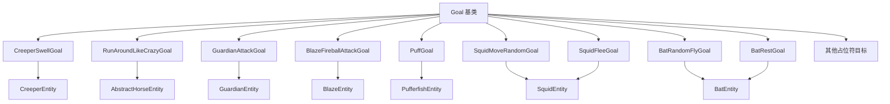

# 特殊 AI 目标 (Special Goals)

## 目录结构

```
special/
├── SpecialGoals.hpp       # 特殊目标头文件
├── SpecialGoals.cpp       # 特殊目标实现
├── GuardianAttackGoal.hpp # 守卫者攻击目标头文件
├── GuardianAttackGoal.cpp # 守卫者攻击目标实现
├── BlazeFireballAttackGoal.hpp # 烈焰人火球攻击目标头文件
├── BlazeFireballAttackGoal.cpp # 烈焰人火球攻击目标实现
├── SquidGoals.hpp         # 鱿鱼目标头文件
├── SquidGoals.cpp         # 鱿鱼目标实现
├── BatGoals.hpp           # 蝙蝠目标头文件
├── BatGoals.cpp           # 蝙蝠目标实现
└── README.md              # 本文档
```

## 整体职责

本目录包含特定实体专用的 AI 目标，这些目标不适用于通用场景，而是为特定实体类型定制的行为。

## 文件详细介绍

### BlazeFireballAttackGoal - 烈焰人火球攻击目标

**职责**: 控制烈焰人使用小火球攻击目标。

**MC 1.16.5 参考**: `net.minecraft.entity.monster.BlazeEntity.FireballAttackGoal`

**攻击阶段**:
1. **充能阶段**: 60 ticks (3秒)，烈焰人进入燃烧状态
2. **火球阶段**: 连发最多 3 个小火球，每个间隔 6 ticks (0.3秒)
3. **冷却阶段**: 100 ticks (5秒)

**执行条件**:
- 有攻击目标
- 目标存活
- 目标在追踪范围内

**特点**:
- 使用加速度驱动的小火球（SmallFireballEntity）
- 散布计算：`spread = sqrt(sqrt(distSq)) * 0.5`
- 近战范围（< 2 格）使用物理攻击
- 视线检测控制追踪行为

**互斥标志**: `Move`, `Look`

**使用示例**:
```cpp
void BlazeEntity::registerGoals() {
    // 优先级 4: 火球攻击
    m_goalSelector.addGoal(4, std::make_unique<BlazeFireballAttackGoal>(this));
}
```

**常量**:
| 常量 | 值 | 说明 |
|------|-----|------|
| CHARGE_TIME | 60 | 充能时间 (ticks) |
| FIREBALL_INTERVAL | 6 | 火球间隔 (ticks) |
| COOLDOWN_TIME | 100 | 冷却时间 (ticks) |
| MAX_FIREBALLS | 3 | 最大连发火球数 |
| MELEE_RANGE_SQ | 4.0 | 近战范围平方 (2格) |

---

### CreeperSwellGoal - 苦力怕膨胀目标

**职责**: 控制苦力怕在玩家靠近时膨胀并最终爆炸的行为。

**MC 1.16.5 参考**: `net.minecraft.entity.ai.goal.CreeperSwellGoal`

**执行条件**:
- 苦力怕已经有膨胀状态 (`getCreeperState() > 0`)，或
- 攻击目标在 9 格距离内 (3x3 范围)

**tick 行为**:
- 如果攻击目标为空：取消膨胀 (`setCreeperState(-1)`)
- 如果攻击目标距离 > 49 格 (7x7 范围)：取消膨胀
- 如果无法看到攻击目标：取消膨胀
- 否则：设置膨胀状态为 1

**互斥标志**: `Move`

**使用示例**:
```cpp
void CreeperEntity::registerGoals() {
    // 优先级 2: 膨胀爆炸
    m_goalSelector.addGoal(2, std::make_unique<CreeperSwellGoal>(this));
}
```

---

### RunAroundLikeCrazyGoal - 疯狂奔跑目标

**职责**: 控制未驯服的马在被骑乘时四处乱跑，增加驯服难度。

**MC 1.16.5 参考**: `net.minecraft.entity.ai.goal.RunAroundLikeCrazyGoal`

**执行条件**:
- 马未被驯服
- 马正在被骑乘

**tick 行为**:
- 马 AI 随机移动（模拟疯狂奔跑）
- 每 tick 有 1/50 概率执行驯服检查
- 如果驯服成功：
  - 调用 `setTamedBy(player)` 设置主人
  - 发送 `EntityStatus::TamingSucceeded`（爱心粒子）
- 如果驯服失败：
  - 增加 `temper` 进度（+5）
  - 调用 `removePassengers()` 甩下玩家
  - 调用 `makeMad()` 触发扬蹄动画和愤怒音效
  - 发送 `EntityStatus::TamingFailed`（烟雾粒子）

**驯服机制**:
```cpp
// MC 1.16.5 驯服概率计算
i32 temper = horse.getTemper();     // 当前进度
i32 maxTemper = horse.getMaxTemper(); // 最大进度（马默认100）

if (maxTemper > 0 && random.nextInt(maxTemper) < temper) {
    // 驯服成功
    horse.setTamedBy(player);
} else {
    // 增加进度
    horse.increaseTemper(5);
}
```

**互斥标志**: `Move`

**使用示例**:
```cpp
void AbstractHorseEntity::registerGoals() {
    // 优先级 1: 疯狂奔跑（未驯服时）
    m_goalSelector.addGoal(1, std::make_unique<RunAroundLikeCrazyGoal>(this, 1.2));
}
```

**常量**:
| 常量 | 值 | 说明 |
|------|-----|------|
| TEMPER_INCREASE | 5 | 每次驯服失败增加的进度 |
| TAMING_CHECK_CHANCE | 1/50 | 每 tick 驯服检查概率 |

**依赖关系**:
- 需要实体实现 `AbstractHorseEntity` 接口
- 需要 `setTamedBy(Player*)` 方法
- 需要 `makeMad()` 方法（扬蹄 + 愤怒音效）
- 需要 `removePassengers()` 方法

---

### EndermanTeleportGoal - 末影人传送目标

**职责**: 控制末影人在受到攻击或看向玩家时传送。

**MC 1.16.5 参考**: `net.minecraft.entity.ai.goal.EndermanTeleportGoal`

**状态**: 占位符，待实现

---

### LlamaFollowCaravanGoal - 羊驼跟随商队目标

**职责**: 控制羊驼跟随领头的羊驼形成商队。

**MC 1.16.5 参考**: `net.minecraft.entity.ai.goal.LlamaFollowCaravanGoal`

**状态**: 占位符，待实现

---

### DolphinJumpGoal - 海豚跳跃目标

**职责**: 控制海豚跳出水面跳跃。

**MC 1.16.5 参考**: `net.minecraft.entity.ai.goal.DolphinJumpGoal`

**状态**: 占位符，待实现

---

### GuardianAttackGoal - 守卫者攻击目标

**职责**: 控制守卫者使用激光攻击目标。

**MC 1.16.5 参考**: `net.minecraft.entity.monster.GuardianEntity.AttackGoal`

**攻击阶段**:
1. **准备阶段**: tickCounter 从 -10 计数到 0
2. **充能动画**: tickCounter 从 0 计数到 80，在 tickCounter == 0 时发送 EntityStatus::GuardianAttack (21) 触发客户端音效
3. **发射阶段**: tickCounter >= 80 时造成伤害

**执行条件**:
- 有攻击目标
- 目标存活
- 目标在视线范围内

**攻击机制**:
- 魔法伤害 (4.0) + 物理伤害 (基于 ATTACK_DAMAGE 属性)
- 远古守卫者额外 +2.0 伤害
- 困难模式额外 +2.0 伤害 (TODO)
- 使用 `broadcastEntityStatus()` 发送状态21触发客户端攻击音效

**目标选择**:
- 玩家或鱿鱼
- 距离 > 3 格（距离平方 > 9.0）
- 非创造模式/观察者模式的玩家

**常量**:
| 常量 | 值 | 说明 |
|------|-----|------|
| ATTACK_DURATION | 80 | 攻击周期 (ticks) |
| ATTACK_RANGE | 15.0 | 攻击范围 |
| LASER_DAMAGE | 4.0 | 激光基础伤害 |
| ELDER_BONUS_DAMAGE | 2.0 | 远古守卫者额外伤害 |

**互斥标志**: `Move`, `Look`

**使用示例**:
```cpp
void GuardianEntity::registerGoals() {
    // 优先级 4: 激光攻击
    m_goalSelector.addGoal(4, std::make_unique<GuardianAttackGoal>(this));
}
```

---

### PuffGoal - 河豚膨胀目标

**职责**: 控制河豚在检测到敌对生物或玩家靠近时触发膨胀行为。

**MC 1.16.5 参考**: `net.minecraft.entity.passive.fish.PufferfishEntity.PuffGoal`

**执行条件**:
- 河豚存活
- 检测到碰撞箱向外扩展 2 格范围内的威胁实体

**威胁判定 (isEnemy)**:
- **玩家**: 非旁观者模式且非创造模式视为威胁
- **其他生物**: 非水生生物视为威胁（通过 LegacyEntityType 检查）
  - 水生生物（不是威胁）: Cod, Salmon, Pufferfish, TropicalFish, Squid, Dolphin, Turtle
  - 其他所有生物都是威胁

**行为流程**:
1. `shouldExecute()`: 检测范围内是否有威胁实体
2. `shouldContinueExecuting()`: 持续检测（与 shouldExecute 相同逻辑）
3. `startExecuting()`: 调用 `startPuffTimer()` 启动膨胀计时器
4. `resetTask()`: 调用 `resetPuffTimer()` 重置计时器

**PufferfishEntity.tick() 状态转换**:
```
Deflated → SemiPuffed: puffTimer == 1
SemiPuffed → FullyPuffed: puffTimer > 40

FullyPuffed → SemiPuffed: deflateTimer > 60
SemiPuffed → Deflated: deflateTimer > 100
```

**攻击机制 (attackNearbyEnemies)**:
- 膨胀状态时检测碰撞箱扩展 0.3 格范围内的敌人
- 伤害 = 1 + puffState (1-3)
- 中毒持续时间 = 60 * puffState ticks (60/120/180)
- 播放刺击音效 (ENTITY_PUFFER_FISH_STING)

**互斥标志**: 无（不与其他目标互斥）

**使用示例**:
```cpp
void PufferfishEntity::registerGoals() {
    AbstractFishEntity::registerGoals();
    // 优先级 1: 膨胀目标
    m_goalSelector.addGoal(1, std::make_unique<PuffGoal>(this));
}
```

**常量**:
| 常量 | 值 | 说明 |
|------|-----|------|
| DETECTION_RANGE | 2.0f | 检测范围（碰撞箱向外扩展） |
| PUFF_SEMI_THRESHOLD | 40 | 膨胀到半膨胀的阈值 (ticks) |
| DEFLATE_FULL_TO_SEMI | 60 | 完全膨胀到半膨胀的延迟 |
| DEFLATE_SEMI_TO_DEFLATE | 100 | 半膨胀到未膨胀的延迟 |

**碰撞箱尺寸**:
| 状态 | 缩放因子 | 碰撞箱尺寸 |
|------|----------|-----------|
| Deflated | 0.5 | 0.35 x 0.35 |
| SemiPuffed | 0.7 | 0.49 x 0.49 |
| FullyPuffed | 1.0 | 0.7 x 0.7 |

---

### SquidMoveRandomGoal - 鱿鱼随机游泳目标

**职责**: 控制鱿鱼在水中进行随机游泳移动。

**MC 1.16.5 参考**: `net.minecraft.entity.passive.SquidEntity.MoveRandomGoal`

**执行条件**:
- `shouldExecute()` 始终返回 true（鱿鱼随时可以游泳）

**tick 行为**:
1. 如果空闲时间 > 100 tick：停止移动（设置移动向量为零）
2. 否则以 1/50 概率，或不在水中，或没有移动向量时，生成新的随机移动向量：
   - 角度：随机 [0, 2π)
   - X = cos(角度) × 0.2
   - Y = -0.1 + random × 0.2 (范围 [-0.1, 0.1])
   - Z = sin(角度) × 0.2

**互斥标志**: 无（不与其他目标互斥）

**使用示例**:
```cpp
void SquidEntity::registerGoals() {
    // 优先级 0: 随机游泳（最高优先级）
    m_goalSelector.addGoal(0, std::make_unique<SquidMoveRandomGoal>(this));
}
```

**常量**:
| 常量 | 值 | 说明 |
|------|-----|------|
| IDLE_THRESHOLD | 100 | 空闲 tick 阈值 |
| RANDOM_CHANCE | 50 | 1/50 概率触发新方向 |
| HORIZONTAL_SPEED | 0.2f | 水平移动向量大小 |
| VERTICAL_MIN | -0.1f | 垂直移动向量最小值 |
| VERTICAL_RANGE | 0.2f | 垂直移动向量范围 |

**依赖**:
- 需要 SquidEntity 提供 `idleTime()`, `isInWater()`, `hasMovementVector()`, `setMovementVector()` 方法

---

### SquidFleeGoal - 鱿鱼逃跑目标

**职责**: 控制鱿鱼在受到攻击时向相反方向逃跑。

**MC 1.16.5 参考**: `net.minecraft.entity.passive.SquidEntity.FleeGoal`

**执行条件**:
- 鱿鱼必须在水中 (`isInWater()`)
- 必须有复仇目标 (`getLastHurtBy() != nullptr`)
- 复仇目标距离必须 < 10 格 (距离平方 < 100)

**tick 行为**:
1. 计算远离敌人的方向向量
2. 根据距离调整逃跑速度：
   - 基础速度 = 3.0
   - 距离 > 5 格时：速度 = 3.0 - (距离 - 5) / 5
3. 如果目标是空气，移除 Y 分量避免跳出水面
4. 设置移动向量（除以 20 转换为每 tick 速度）
5. 每 10 tick 的第 5 tick 产生气泡粒子

**互斥标志**: 无（不与其他目标互斥）

**使用示例**:
```cpp
void SquidEntity::registerGoals() {
    // 优先级 1: 逃跑目标（受攻击时逃跑）
    m_goalSelector.addGoal(1, std::make_unique<SquidFleeGoal>(this));
}
```

**常量**:
| 常量 | 值 | 说明 |
|------|-----|------|
| FLEE_DISTANCE_SQ | 100.0 | 触发逃跑的距离平方阈值 (10²) |
| BASE_FLEE_SPEED | 3.0f | 基础逃跑速度 |
| DISTANCE_THRESHOLD | 5.0 | 速度衰减开始距离 |
| SPEED_SCALE | 20.0f | 速度缩放因子 |
| BUBBLE_INTERVAL | 10 | 气泡粒子产生间隔 |
| BUBBLE_OFFSET | 5 | 气泡粒子产生偏移 |

**依赖**:
- 需要 SquidEntity 提供 `isInWater()`, `getLastHurtBy()`, `distanceSqTo()`, `x()`, `y()`, `z()`, `setMovementVector()` 方法

---

### BatRandomFlyGoal - 蝙蝠随机飞行目标

**职责**: 控制蝙蝠在空中进行随机飞行移动。

**MC 1.16.5 参考**: `net.minecraft.entity.passive.BatEntity` 第142-159行

**执行条件**:
- `shouldExecute()`: 蝙蝠不在休息状态时返回 true
- `shouldContinueExecuting()`: 蝙蝠不在休息状态时继续

**tick 行为**:
1. 检查是否需要选择新目标点：
   - 无目标时选择新目标
   - 目标不可用（非空气或Y<1）时选择新目标
   - 1/30 概率随机更换目标
   - 到达目标点（距离<2）时选择新目标
2. 选择随机目标点：
   - X: 当前位置 ±7 格
   - Y: 当前位置 -2 到 +4 格
   - Z: 当前位置 ±7 格
3. 平滑转向朝目标点飞行：
   - 计算方向向量 (signum * 0.5)
   - Y轴调整更强 (0.7 而非 0.5)
   - 速度调整因子 0.1
   - 更新偏航角

**互斥标志**: `Move`

**使用示例**:
```cpp
void BatEntity::registerGoals() {
    // 优先级 0: 随机飞行目标
    m_goalSelector.addGoal(0, std::make_unique<BatRandomFlyGoal>(this));
}
```

**常量**:
| 常量 | 值 | 说明 |
|------|-----|------|
| TARGET_RANGE_XZ | 7 | X/Z方向目标范围 |
| TARGET_RANGE_Y_MIN | -2 | Y方向目标范围下限 |
| TARGET_RANGE_Y_MAX | 4 | Y方向目标范围上限 |
| TARGET_REACH_DISTANCE | 2.0f | 到达目标的距离阈值 |
| DIRECTION_FACTOR | 0.5 | 水平方向因子 |
| VERTICAL_FACTOR | 0.7 | 垂直方向因子（更强） |
| VELOCITY_ADJUST | 0.1 | 速度调整因子 |
| TARGET_CHANGE_CHANCE | 30 | 1/30 概率更换目标 |
| MAX_TARGET_ATTEMPTS | 20 | 目标搜索最大尝试次数 |

**依赖**:
- 需要 BatEntity 提供 `isResting()`, `position()`, `velocity()`, `setVelocity()`, `yaw()`, `setRotation()`, `world()`, `getRandom()` 方法
- 需要 IWorld 提供 `getBlockState()` 方法
- 需要 BlockState 提供 `getBlock().isAir()` 方法

---

### BatRestGoal - 蝙蝠挂墙休息目标

**职责**: 控制蝙蝠在白天挂墙休息的行为。

**MC 1.16.5 参考**: `net.minecraft.entity.passive.BatEntity` 第125-163行

**执行条件**:
- `shouldExecute()`:
  - 白天时间 (dayTime < 12000)
  - 1/100 概率
  - 上方有固体方块可以倒挂
  - 蝙蝠当前不在休息状态
- `shouldContinueExecuting()`:
  - 仍在休息状态
  - 未被唤醒

**唤醒条件**:
- 夜间 (dayTime >= 12000)
- 玩家靠近（4格内）- TODO: 需要 world()->getClosestPlayer() 实现
- 失去支撑（上方不再是固体方块）

**startExecuting 行为**:
1. 设置休息状态为 true
2. 设置飞行状态为 false
3. 清除速度
4. 对齐位置到方块下方
5. 初始化转头计时器

**tick 行为**:
1. 1/200 概率随机选择新的转头角度
2. 平滑转向目标角度
3. 保持静止（速度清零）

**互斥标志**: `Move`, `Look`

**使用示例**:
```cpp
void BatEntity::registerGoals() {
    // 优先级 1: 挂墙休息目标
    m_goalSelector.addGoal(1, std::make_unique<BatRestGoal>(this));
}
```

**常量**:
| 常量 | 值 | 说明 |
|------|-----|------|
| REST_CHANCE | 100 | 1/100 概率尝试休息 |
| TURN_CHANCE | 200 | 1/200 概率随机转头 |
| DAY_TIME_THRESHOLD | 12000 | 白天时间阈值 |
| PLAYER_WAKE_DISTANCE | 4.0f | 玩家唤醒距离（TODO） |

**依赖**:
- 需要 BatEntity 提供 `isResting()`, `setResting()`, `setFlying()`, `position()`, `yaw()`, `pitch()`, `setRotation()`, `setVelocity()`, `height()`, `world()`, `getRandom()` 方法
- 需要 IWorld 提供 `getBlockState()`, `dayTime()` 方法
- 需要 BlockState 提供 `getBlock().isSolid()` 方法

---

## 依赖关系



---

## 使用方法

### 1. 在实体中注册特殊目标

```cpp
void MyEntity::registerGoals() {
    // 调用父类方法
    ParentEntity::registerGoals();

    // 注册特殊目标
    m_goalSelector.addGoal(2, std::make_unique<CreeperSwellGoal>(this));
}
```

### 2. 实现新的特殊目标

```cpp
class MySpecialGoal : public Goal {
public:
    explicit MySpecialGoal(MyEntity* entity)
        : Goal(EnumSet<GoalFlag>{GoalFlag::Move})
        , m_entity(entity)
    {
        MC_ASSERT(entity != nullptr);
    }

    bool shouldExecute() override {
        if (!m_entity) return false;
        // 检查执行条件
        return m_entity->someCondition();
    }

    void startExecuting() override {
        // 初始化状态
    }

    void tick() override {
        // 更新逻辑
    }

    void resetTask() override {
        // 清理状态
    }

private:
    MyEntity* m_entity;
};
```

---

## 容易踩的坑

### 1. 忘记设置互斥标志

**问题**: 特殊目标与其他目标冲突。

**解决**: 始终设置正确的互斥标志。

```cpp
// 正确：设置互斥标志
CreeperSwellGoal::CreeperSwellGoal(CreeperEntity* creeper)
    : Goal(EnumSet<GoalFlag>{GoalFlag::Move})
    , m_creeper(creeper)
{
}
```

### 2. 空指针检查缺失

**问题**: 实体指针在目标执行期间可能失效。

**解决**: 在每个方法开始检查空指针。

```cpp
void CreeperSwellGoal::tick() {
    if (!m_creeper) return;
    if (!m_attackTarget || !m_attackTarget->isAlive()) {
        m_creeper->setCreeperState(-1);
        return;
    }
    // 正常逻辑...
}
```

### 3. 距离比较使用 sqrt

**问题**: 频繁调用 `sqrt()` 影响性能。

**解决**: 使用距离平方比较。

```cpp
// 低效
f32 distance = std::sqrt(dx * dx + dy * dy + dz * dz);
if (distance < 7.0f) { }

// 高效
f32 distSq = dx * dx + dy * dy + dz * dz;
if (distSq < 49.0f) { }  // 7 * 7 = 49
```

---

## 涉及的测试用例

| 测试名称 | 说明 |
|----------|------|
| GoalTest.* | Goal 基础测试 |
| GoalSelectorTest.* | 目标选择器测试 |
| PrioritizedGoalTest.* | 优先级目标测试 |
| CreeperSwellGoalBasicTest.* | 苦力怕膨胀目标常量测试 |
| BlazeFireballAttackGoalBasicTest.* | 烈焰人火球攻击目标常量测试 |
| PufferfishEntityTest.* | 河豚实体膨胀状态、计时器、尺寸测试 |
| PuffGoalTest.* | 河豚膨胀目标构造和类型名称测试 |
| SquidGoalsTest.* | 鱿鱼目标测试（移动向量、AI目标执行条件） |
| BatGoalsTest.* | 蝙蝠目标测试（状态切换、飞行目标、休息目标） |

---

## 参考资料

- Minecraft Java 1.16.5 `net.minecraft.entity.ai.goal.CreeperSwellGoal`
- Minecraft Java 1.16.5 `net.minecraft.entity.ai.goal.RunAroundLikeCrazyGoal`
- Minecraft Java 1.16.5 `net.minecraft.entity.monster.GuardianEntity.GuardianAttackGoal`
- Minecraft Java 1.16.5 `net.minecraft.entity.monster.BlazeEntity.FireballAttackGoal`
- Minecraft Java 1.16.5 `net.minecraft.entity.passive.BatEntity` (蝙蝠飞行和休息逻辑)
- 本项目 CLAUDE.md 文档
