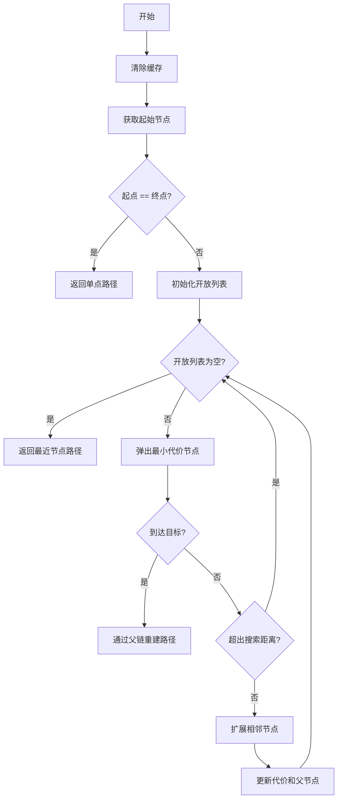
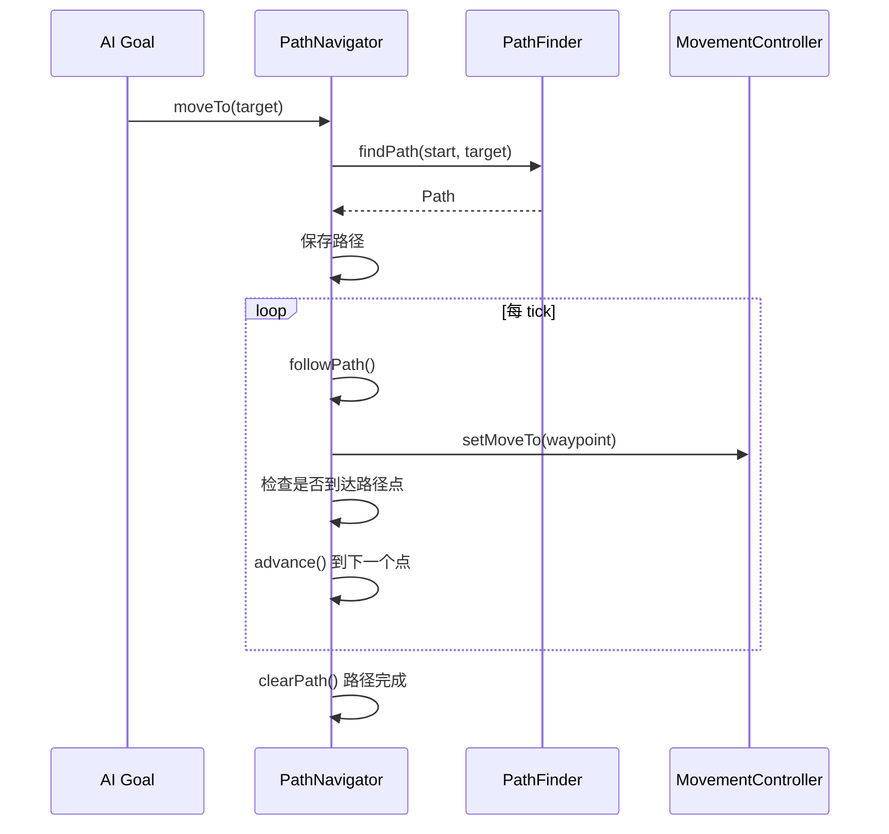
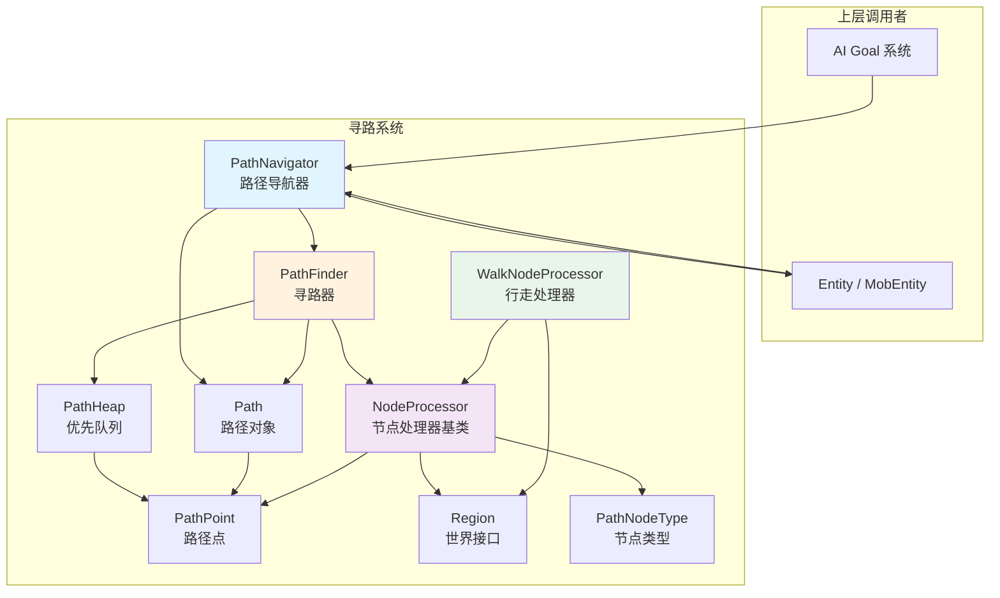

# Pathfinding 寻路系统

寻路系统实现了 A* 算法，为游戏中的实体提供智能路径规划能力。该系统参考 Minecraft 1.16.5 的寻路架构设计。

## 目录结构

```
src/common/entity/ai/pathfinding/
├── NodeProcessor.hpp          # 节点处理器基类
├── Path.hpp                    # 路径对象
├── PathFinder.hpp             # 寻路器（A*算法）
├── PathFinder.cpp             # 寻路器实现
├── PathHeap.hpp               # 路径点最小堆
├── PathNavigator.hpp          # 路径导航器
├── PathNavigator.cpp          # 路径导航器实现
├── PathNodeType.hpp           # 路径节点类型枚举
├── PathPoint.hpp              # 路径点
├── PathPoint.cpp              # 路径点实现
├── Region.hpp                 # 世界区域访问接口
├── WalkNodeProcessor.hpp      # 行走节点处理器
└── WalkNodeProcessor.cpp      # 行走节点处理器实现
```

## 文件详解

### PathNodeType.hpp

定义路径节点类型枚举，描述不同地形的可通行性和危险程度。

```cpp
enum class PathNodeType : u8 {
    Blocked = 0,        // 完全阻塞，无法通行
    Open = 1,           // 空气，可以跌落通过
    Walkable = 2,       // 可行走的地面
    WalkableDoor = 3,   // 可行走的门
    Trapdoor = 4,       // 活板门
    Fence = 5,          // 栅栏
    Lava = 6,           // 岩浆
    Water = 7,          // 水
    DangerFire = 8,     // 火焰危险区域
    DangerCactus = 9,   // 仙人掌危险区域
    DangerBerry = 10,   // 甜浆果丛危险区域
    FenceGate = 11,     // 栅栏门
    Rail = 12,          // 铁轨
    TrapdoorDown = 13,  // 活板门（可下落）
    Climbable = 14,     // 攀爬（梯子、藤蔓等）
    DangerFall = 15,    // 跌落危险
    Other = 255         // 其他
};
```

**辅助函数**：
- `getPathCostPenalty(PathNodeType)` - 获取节点类型的代价惩罚
- `isWalkable(PathNodeType)` - 检查节点是否可通行

### PathPoint.hpp / PathPoint.cpp

表示寻路网格中的单个节点，存储位置信息和 A* 算法所需的状态数据。

**核心属性**：
| 属性 | 类型 | 说明 |
|------|------|------|
| `m_x, m_y, m_z` | `i32` | 方块坐标 |
| `m_costMalus` | `f32` | 代价惩罚（来自节点类型） |
| `m_costFromStart` | `f32` | 从起点的实际代价（g值），MC: totalPathDistance |
| `m_heuristic` | `f32` | 到目标的启发式代价（h值） |
| `m_totalCost` | `f32` | 总代价（f值 = g + h），MC: distanceToTarget |
| `m_distanceToNext` | `f32` | 到下一个路径点的距离，MC: distanceToNext 存储 h*1.5 |
| `m_nodeType` | `PathNodeType` | 节点类型 |
| `m_visited` | `bool` | 是否已访问（在闭合列表中） |
| `m_parent` | `PathPoint*` | 父节点（用于重建路径） |
| `m_heapIndex` | `i32` | 在堆中的索引 |

**关键方法**：
- `distanceTo()` - 曼哈顿距离
- `distanceToSq()` - 直线距离平方
- `distanceToLinear()` - 直线距离
- `clone()` - 克隆节点（不复制寻路状态）
- `cloneMove()` - 创建移动克隆（保留所有寻路状态，MC 1.16.5 cloneMove）
- `hash()` - 生成哈希值用于缓存

### PathHeap.hpp

实现路径点最小堆，用于 A* 算法的开放列表，按总代价排序。

**核心操作**：
| 操作 | 时间复杂度 | 说明 |
|------|------------|------|
| `insert()` | O(log n) | 插入节点 |
| `pop()` | O(log n) | 弹出最小代价节点 |
| `update()` | O(log n) | 更新节点位置 |
| `peek()` | O(1) | 查看堆顶元素 |

**调试方法**：
- `isValidHeap()` - 验证堆属性是否有效

### Path.hpp

表示从起点到终点的完整路径，提供路径导航和操作功能。

**核心功能**：
- **路径导航**：`getCurrentTarget()`, `advance()`, `isFinished()`, `reset()`
- **路径操作**：`addPoint()`, `trimStart()`, `buildFromEnd()`, `setPoint()`
- **状态检查**：`reachesTarget()` - 检查路径是否到达目标位置

**路径修改方法**：
- `setPoint(size_t index, const PathPoint& point)` - 设置指定索引的路径点（MC 1.16.5 setPoint）
- `setPoint(size_t index, PathPoint&& point)` - 设置指定索引的路径点（移动语义）
- `setCurrentPathLength(i32 length)` - 裁剪路径长度

### NodeProcessor.hpp

节点处理器抽象基类，负责生成和缓存路径节点，计算相邻节点。

**核心接口**：
```cpp
class NodeProcessor {
public:
    // 设置世界区域
    void setRegion(const Region* region);

    // 设置实体尺寸
    void setEntitySize(f32 width, f32 height);

    // 获取或创建节点
    PathPoint* getNode(i32 x, i32 y, i32 z);

    // 纯虚方法
    virtual PathNodeType getNodeType(i32 x, i32 y, i32 z) = 0;
    virtual PathNodeType getNodeTypeWithEntity(i32 x, i32 y, i32 z) = 0;
    virtual PathPoint* getStartNode(i32 x, i32 y, i32 z) = 0;
    virtual std::vector<PathPoint*> getNeighbors(PathPoint* current) = 0;
};
```

### WalkNodeProcessor.hpp / WalkNodeProcessor.cpp

地面行走实体的节点处理器实现，支持水平移动、跳跃、跌落、攀爬、游泳。

**可配置能力**：
| 配置项 | 默认值 | 说明 |
|--------|--------|------|
| `m_canSwim` | `false` | 是否可以游泳 |
| `m_canOpenDoors` | `false` | 是否可以开门 |
| `m_canEnterDoors` | `false` | 是否可以通过门 |
| `m_canClimb` | `false` | 是否可以攀爬 |
| `m_maxFallDistance` | `3` | 最大跌落距离 |
| `m_avoidWater` | `false` | 是否避开水 |
| `m_avoidSun` | `false` | 是否避开阳光 |

**邻居节点生成**：
- 8个水平方向（4正向 + 4对角线）
- 跳跃（1格高）
- 跌落（最多 `m_maxFallDistance` 格）
- 攀爬（梯子、藤蔓）
- 水中移动（游泳）

**危险方块检测**：

`WalkNodeProcessor::isDangerous()` 方法检测以下危险方块：

| 方块类型 | 检测方式 | 路径节点类型 |
|----------|----------|--------------|
| 岩浆（流体） | `isLava()` | `Lava` / `DamageFire` |
| 火焰（火、灵魂火） | `BlockTags::FIRE()` | `DamageFire` / `DangerFire` |
| 岩浆块 | `VanillaBlocks::MAGMA` | `DamageFire` / `DangerFire` |
| 点燃的营火 | `CampfireBlock::isLit()` | `DamageFire` / `DangerFire` |
| 仙人掌 | `VanillaBlocks::CACTUS` | `DamageCactus` / `DangerCactus` |
| 甜浆果丛 | `Block::getBlock("minecraft:sweet_berry_bush")` | `DamageOther` / `DangerBerry` |

`getNodeType()` 方法直接站在危险方块上时返回 `Damage*` 类型，代价惩罚为 -1.0（不可通行）或 16.0（极高代价）。

`getNodeTypeWithEntity()` 方法检查相邻位置的危险方块，返回 `Danger*` 类型，代价惩罚为 8.0（高代价但可通行）。

### Region.hpp / Region.cpp

世界区域访问抽象接口，允许寻路算法安全访问世界数据。

```cpp
class Region {
public:
    virtual ~Region() = default;

    // 获取方块状态ID
    virtual u32 getBlockStateId(i32 x, i32 y, i32 z) const = 0;

    // 获取方块状态（默认实现，通过 Block::getBlockState 转换）
    virtual const BlockState* getBlockState(i32 x, i32 y, i32 z) const;

    // 检查区块是否加载
    virtual bool isLoaded(i32 x, i32 z) const = 0;

    // 获取最高方块Y坐标
    virtual i32 getHeight(i32 x, i32 z) const = 0;

    // 检查可通行性
    virtual bool isWalkable(i32 x, i32 y, i32 z) const = 0;

    // 检查流体
    virtual bool isWater(i32 x, i32 y, i32 z) const = 0;
    virtual bool isLava(i32 x, i32 y, i32 z) const = 0;

    // 获取方块顶部高度
    virtual f32 getBlockTopY(i32 x, i32 y, i32 z) const;
};
```

**新增的 `getBlockState()` 方法**：

该方法提供对 `BlockState` 的直接访问，支持更详细的方块类型检查。默认实现通过 `getBlockStateId()` 获取状态ID，然后调用 `Block::getBlockState()` 转换为 `BlockState*`。

### PathFinder.hpp / PathFinder.cpp

寻路器核心，实现 A* 算法寻找从起点到终点的最优路径。

**算法流程**：



**可配置参数**：
| 参数 | 默认值 | 说明 |
|------|--------|------|
| `m_maxSearchDistance` | `100` | 最大搜索距离 |
| `m_maxNodes` | `2000` | 最大搜索节点数 |
| `m_searchRange` | `32` | 搜索范围边界 |

**启发式函数**：使用曼哈顿距离
```cpp
f32 heuristic(i32 x, i32 y, i32 z, i32 targetX, i32 targetY, i32 targetZ) {
    return static_cast<f32>(abs(x - targetX) + abs(y - targetY) + abs(z - targetZ));
}
```

### PathNavigator.hpp / PathNavigator.cpp

路径导航器，管理实体的路径跟随和移动控制。

**核心功能**：
- **路径计算**：`moveTo()`, `moveToRange()` - 计算到目标位置/范围的路径
- **路径跟随**：`tick()` - 每tick更新，沿路径移动实体
- **路径重算**：`recomputePath()` - 目标移动时重新计算路径
- **路径修剪**：`trimPath()` - 处理特殊方块（如炼药锅）的路径调整
- **状态查询**：`hasPath()`, `isDone()`, `isInProgress()`, `isStuck()`

**特殊方块处理**：

`trimPath()` 方法会在路径设置后自动处理特殊方块：

| 方块类型 | 处理方式 | 说明 |
|----------|----------|------|
| 炼药锅 (Cauldron) | 路径点Y坐标+1 | 实体在炼药锅内时需要上移路径点 |
| 下一个路径点Y较低 | 同样上移 | 确保路径平滑过渡 |

参考 MC 1.16.5 `PathNavigator.trimPath()`

**工作流程**：



## 模块架构



## 整体职责

**寻路系统的职责**：
1. **路径计算**：使用 A* 算法计算从起点到终点的最优路径
2. **地形评估**：评估不同地形的可通行性和危险程度
3. **节点生成**：根据实体能力（游泳、攀爬等）生成可行的移动节点
4. **路径跟随**：控制实体沿路径移动，处理路径点切换
5. **动态重算**：目标移动时自动重新计算路径

## 输入和输出

### 输入
| 输入项 | 类型 | 来源 | 说明 |
|--------|------|------|------|
| 起点坐标 | `(i32, i32, i32)` | 实体当前位置 | 寻路起点 |
| 目标坐标 | `(i32, i32, i32)` | AI 系统指定 | 寻路终点 |
| 世界数据 | `Region*` | 服务端世界 | 地形信息 |
| 实体尺寸 | `(f32, f32)` | 实体属性 | 宽度和高度 |
| 能力配置 | `bool` | 实体类型 | 游泳、攀爬等能力 |

### 输出
| 输出项 | 类型 | 说明 |
|--------|------|------|
| 路径对象 | `Path` | 路径点序列，可为空 |
| 移动指令 | `MovementController` | 发送给移动控制器 |
| 状态反馈 | `bool` | 路径计算是否成功 |

## 依赖项

### 内部依赖
```
PathNavigator
    └── PathFinder
        ├── NodeProcessor (抽象)
        │   └── WalkNodeProcessor (实现)
        ├── PathHeap
        ├── Path
        │   └── PathPoint
        │       └── PathNodeType
        └── Region (接口)
```

### 外部依赖
| 依赖项 | 用途 |
|--------|------|
| `Entity` / `LivingEntity` / `MobEntity` | 实体基类，获取位置和属性 |
| `MovementController` | 移动控制器，执行实际移动 |
| `core/Types.hpp` | 基础类型定义 |

## 使用方法

### 基本用法

```cpp
#include "entity/ai/pathfinding/PathNavigator.hpp"
#include "entity/ai/pathfinding/PathFinder.hpp"
#include "entity/ai/pathfinding/WalkNodeProcessor.hpp"

// 1. 创建节点处理器
auto processor = std::make_unique<WalkNodeProcessor>();
processor->setCanSwim(true);
processor->setCanClimb(true);
processor->setEntitySize(0.6f, 1.8f);  // 宽度, 高度

// 2. 创建寻路器
auto finder = std::make_unique<PathFinder>(std::move(processor));
finder->setMaxSearchDistance(100);
finder->setMaxNodes(2000);

// 3. 创建导航器
PathNavigator navigator(std::move(finder));
navigator.setEntity(mobEntity);

// 4. 设置世界区域
navigator.getPathFinder()->setRegion(&worldRegion);

// 5. 计算路径并移动
if (navigator.moveTo(targetX, targetY, targetZ, speed)) {
    // 路径找到
}

// 6. 每tick更新
void tick() {
    navigator.tick();
}
```

### 在 AI Goal 中使用

```cpp
class RandomWalkingGoal : public Goal {
public:
    void startExecuting() override {
        // 随机选择目标位置
        double targetX = mob->x() + random->nextInt(10) - 5;
        double targetZ = mob->z() + random->nextInt(10) - 5;

        // 尝试移动
        mob->tryMoveTo(targetX, targetY, targetZ, speed);
    }

    void tick() override {
        // 导航器自动更新
    }

    bool shouldContinueExecuting() override {
        return mob->getNavigator()->isInProgress();
    }
};
```

### 自定义 Region 实现

```cpp
class ServerRegion : public Region {
public:
    ServerRegion(ServerWorld& world, ChunkCoord x, ChunkCoord z)
        : m_world(world), m_centerX(x), m_centerZ(z) {}

    u32 getBlockStateId(i32 x, i32 y, i32 z) const override {
        return m_world.getBlockStateId(x, y, z);
    }

    bool isLoaded(i32 x, i32 z) const override {
        return m_world.isChunkLoaded(x >> 4, z >> 4);
    }

    // ... 其他方法实现

private:
    ServerWorld& m_world;
    ChunkCoord m_centerX, m_centerZ;
};
```

## 常见陷阱

### 1. 忘记设置 Region

**问题**：寻路前没有设置 `Region`，导致所有节点返回 `Blocked`。

```cpp
// 错误：没有设置 Region
PathFinder finder(std::make_unique<WalkNodeProcessor>());
Path path = finder.findPath(0, 64, 0, 10, 64, 10);  // 返回空路径！

// 正确：设置 Region
auto processor = std::make_unique<WalkNodeProcessor>();
processor->setRegion(&region);
PathFinder finder(std::move(processor));
```

### 2. NodeProcessor 生命周期

**问题**：`PathFinder` 接管 `NodeProcessor` 的所有权，之后不能再访问原始指针。

```cpp
auto processor = std::make_unique<WalkNodeProcessor>();
processor->setCanSwim(true);  // OK

PathFinder finder(std::move(processor));
// processor 现在是 nullptr，不能再使用

// 如需访问，使用 getter
finder.getNodeProcessor()->setCanSwim(false);  // OK
```

### 3. 坐标类型混淆

**问题**：实体位置是 `f64`，而寻路使用 `i32` 块坐标。

```cpp
// 错误：直接使用浮点坐标
navigator.moveTo(entity.x(), entity.y(), entity.z(), speed);

// 正确：转换为块坐标
i32 startX = static_cast<i32>(std::floor(entity.x()));
i32 startY = static_cast<i32>(std::floor(entity.y()));
i32 startZ = static_cast<i32>(std::floor(entity.z()));
```

### 4. Path 对象的生命周期

**问题**：`PathNavigator` 持有 `Path` 的所有权，调用 `clearPath()` 或新的 `moveTo()` 会释放旧路径。

```cpp
const Path* path = navigator.getPath();
// 使用 path ...
navigator.moveTo(newTarget);  // path 现在可能无效！

// 正确：在使用前检查
if (navigator.hasPath()) {
    const Path* path = navigator.getPath();
    // 使用 path
}
```

### 5. 实体尺寸未设置

**问题**：未设置实体尺寸，导致碰撞检测不准确。

```cpp
// 设置正确的实体尺寸
processor->setEntitySize(
    entity->width(),   // 例如：0.6f (玩家)
    entity->height()   // 例如：1.8f (玩家)
);
```

### 6. 搜索距离过大

**问题**：搜索距离设置过大导致性能问题。

```cpp
// 性能友好
finder->setMaxSearchDistance(100);  // 合理
finder->setMaxNodes(2000);          // 限制节点数

// 避免设置过大
finder->setMaxSearchDistance(1000); // 可能很慢！
finder->setMaxNodes(50000);         // 内存爆炸！
```

### 7. 对角线移动被阻挡

**问题**：对角线移动需要两个相邻方向都可通行。

```cpp
// WalkNodeProcessor 会检查对角线移动是否被阻挡
// 如果 A->B 和 A->C 都可通行，但 B 或 C 是障碍，则 A->D (对角) 不可行
```

## 测试用例

### 文件位置
`tests/entity/PathfindingTests.cpp`

### 测试覆盖

| 测试套件 | 测试内容 |
|----------|----------|
| `PathNodeTypeTest` | 代价惩罚计算、可通行性检查 |
| `PathPointTest` | 构造、距离计算、相等性、克隆、代价计算 |
| `PathHeapTest` | 空堆、插入弹出、更新、堆属性验证 |
| `PathTest` | 空路径、添加点、导航、从终点构建、到达检查、裁剪起点 |

### 测试示例

```cpp
// PathPoint 距离计算测试
TEST(PathPointTest, DistanceCalculation) {
    PathPoint p1(0, 0, 0);
    PathPoint p2(3, 4, 0);

    EXPECT_EQ(p1.distanceTo(p2), 7);  // 曼哈顿距离
    EXPECT_FLOAT_EQ(p1.distanceToSq(p2), 25.0f);  // 直线距离平方
    EXPECT_FLOAT_EQ(p1.distanceToLinear(p2), 5.0f);  // 直线距离
}

// PathHeap 堆属性测试
TEST(PathHeapTest, HeapProperty) {
    PathHeap heap;
    std::vector<std::unique_ptr<PathPoint>> points;

    for (int i = 0; i < 20; ++i) {
        points.push_back(std::make_unique<PathPoint>(i, 0, 0));
        points.back()->setHeuristic(static_cast<f32>(i * 10));
        points.back()->updateTotalCost();
        heap.insert(points.back().get());
    }

    EXPECT_TRUE(heap.isValidHeap());

    f32 lastCost = -1.0f;
    while (!heap.empty()) {
        PathPoint* p = heap.pop();
        EXPECT_GE(p->totalCost(), lastCost);
        lastCost = p->totalCost();
    }
}

// Path 导航测试
TEST(PathTest, Navigation) {
    Path path;
    path.addPoint(PathPoint(0, 0, 0));
    path.addPoint(PathPoint(1, 0, 0));
    path.addPoint(PathPoint(2, 0, 0));

    EXPECT_EQ(path.getCurrentIndex(), 0);
    EXPECT_TRUE(path.advance());
    EXPECT_EQ(path.getCurrentIndex(), 1);
    EXPECT_TRUE(path.advance());
    EXPECT_FALSE(path.advance());  // 到达终点
    EXPECT_TRUE(path.isFinished());

    path.reset();
    EXPECT_EQ(path.getCurrentIndex(), 0);
}
```

## 性能优化建议

1. **缓存 Region 数据**：避免每次寻路都重新加载区块
2. **限制搜索范围**：使用 `setMaxSearchDistance()` 和 `setMaxNodes()`
3. **异步寻路**：对于复杂路径，考虑在后台线程计算
4. **路径复用**：如果目标未变化，可以复用已有路径
5. **节点池**：`NodeProcessor` 使用节点缓存，避免频繁内存分配

## 参考

- Minecraft 1.16.5 `net.minecraft.pathfinding` 包
- A* 寻路算法
- 《游戏人工智能编程案例精粹》
