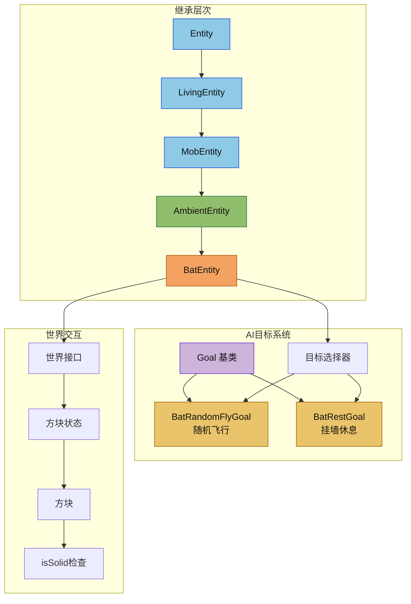

# 环境生物模块

环境生物模块负责蝙蝠这类低频率、低干扰的实体实现。它们通常继承自通用的 `MobEntity`，但会使用独立的声音分类和更低的环境声触发频率。

## 目录结构

```text
src/common/entity/entities/passive/ambient/
├── AmbientEntity.hpp  # 环境生物基类，设置环境音分类
├── AmbientEntity.cpp  # 环境生物通用实现
├── BatEntity.hpp      # 蝙蝠实体声明
├── BatEntity.cpp      # 蝙蝠实体实现（飞行、倒挂休息）
└── README.md          # 本文档
```

## 内部模块关系



## 上下游外部依赖关系

### 本模块依赖

- `entity/core/MobEntity.hpp` - 父类
- `entity/ai/goal/goals/special/BatGoals.hpp` - 蝙蝠AI目标
- `common/sound/SoundCategory.hpp` - 声音分类
- `world/IWorld.hpp` - 世界接口
- `world/block/Block.hpp` / `BlockState.hpp` - 方块检测
- `util/math/random/Random.hpp` - 随机数

### 被依赖

- `entity/EntityTypeRegistry.hpp` - 实体类型注册
- 世界生成器（蝙蝠刷怪）

## 容易踩的坑

### 1. 不要把环境生物当作普通怪物处理声音分类

**问题**: 环境生物的声音应该路由到 `Ambient` 混音通道，而不是 `Neutral` 或 `Hostile`。

**解决**: 确保 `getSoundCategory()` 返回 `SoundCategory::Ambient`。

### 2. 蝙蝠飞行时需要垂直阻尼

**问题**: 蝙蝠飞行时Y轴速度会无限积累。

**解决**: 在 `tick()` 中对Y轴速度应用 0.6 的阻尼：
```cpp
if (m_flying && !m_resting) {
    math::Vector3 vel = velocity();
    setVelocity(vel.x, vel.y * 0.6f, vel.z);
}
```

### 3. 蝙蝠AI目标的互斥标志

**问题**: `BatRandomFlyGoal` 和 `BatRestGoal` 可能同时执行。

**解决**: 设置正确的互斥标志：
- `BatRandomFlyGoal`: `GoalFlag::Move`
- `BatRestGoal`: `GoalFlag::Move | GoalFlag::Look`
