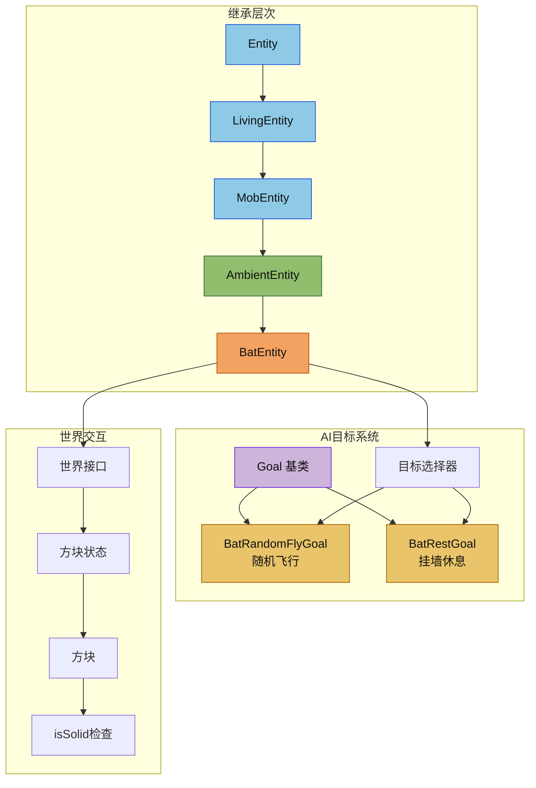

# 环境生物模块

环境生物模块负责蝙蝠这类低频率、低干扰的实体实现。它们通常继承自通用的 `MobEntity`，但会使用独立的声音分类和更低的环境声触发频率。

## 目录结构

```text
src/common/entity/entities/passive/ambient/
├── AmbientEntity.hpp  # 环境生物基类，设置环境音分类
├── AmbientEntity.cpp  # 环境生物通用实现
├── BatEntity.hpp      # 蝙蝠实体声明
├── BatEntity.cpp      # 蝙蝠实体实现
└── README.md          # 本文档
```

## 文件介绍

### AmbientEntity.hpp / AmbientEntity.cpp

- 作为环境生物的公共基类。
- 统一把声音分类设置为 `SoundCategory::Ambient`。
- 给子类提供比普通动物更安静、更稀疏的环境声语义。

### BatEntity.hpp / BatEntity.cpp

蝙蝠的具体实现，包含完整的AI行为系统。

**核心特性**:
- **飞行**: 在空中随机飞行
- **倒挂**: 白天会倒挂在方块下休息
- **昼夜节律**: 白天休息，夜间活动
- **玩家感应**: 玩家靠近时从休息状态唤醒

**AI 目标**:
| 优先级 | 目标类 | 说明 |
|--------|--------|------|
| 0 | BatRandomFlyGoal | 随机飞行目标，选择随机目标点并平滑转向飞行 |
| 1 | BatRestGoal | 挂墙休息目标，白天尝试挂墙休息 |

**状态管理**:
- `m_flying`: 是否正在飞行
- `m_resting`: 是否正在休息（倒挂）

**属性配置**:
| 属性 | 值 | 说明 |
|------|-----|------|
| MAX_HEALTH | 6.0 | 最大生命值（3颗心） |
| MOVEMENT_SPEED | 0.1 | 移动速度 |
| FLYING_SPEED | 0.1 | 飞行速度 |

**关键方法**:
- `isFlying() / setFlying()`: 飞行状态访问器
- `isResting() / setResting()`: 休息状态访问器
- `canRest()`: 检查上方是否有固体方块可以倒挂
- `tick()`: 刻更新，处理飞行时的垂直阻尼
- `registerGoals()`: 注册AI目标
- `registerAttributes()`: 注册属性

## 模块关系



## 整体职责

该模块的职责是提供”环境生物”这一类实体的共同行为：
1. **声音分类**: 统一设置为 `SoundCategory::Ambient`
2. **低干扰**: 不主动与玩家交互
3. **昼夜节律**: 根据时间调整行为（如蝙蝠白天休息）
4. **飞行移动**: 特殊的飞行移动逻辑

## 输入 / 输出

### 输入

- 世界 tick
- 昼夜时间 (dayTime)
- 方块状态检测（上方是否有固体方块）
- 伤害与死亡事件

### 输出

- 环境声事件
- 受伤/死亡声音事件
- 飞行/休息状态切换
- 服务器广播到客户端的音效数据包

## 依赖项

- `entity/core/MobEntity.hpp`
- `entity/ai/goal/goals/special/BatGoals.hpp`
- `common/sound/SoundCategory.hpp`
- `world/IWorld.hpp`
- `world/block/Block.hpp`
- `world/block/BlockState.hpp`
- `util/math/random/Random.hpp`
- `util/math/MathUtils.hpp`

## 使用方法

### 创建蝙蝠实体

```cpp
// 通过工厂方法创建
auto bat = BatEntity::create(world);

// 或直接实例化
BatEntity bat(entityId);
```

### 访问蝙蝠状态

```cpp
// 检查飞行状态
if (bat.isFlying()) {
    // 蝙蝠正在飞行
}

// 检查休息状态
if (bat.isResting()) {
    // 蝙蝠正在挂墙休息
}

// 检查是否可以休息
if (bat.canRest()) {
    // 上方有固体方块可以挂
}
```

## 容易踩的坑

### 1. 不要把环境生物当作普通怪物处理声音分类

**问题**: 环境生物的声音应该路由到 `Ambient` 混音通道，而不是 `Neutral` 或 `Hostile`。

**解决**: 确保 `getSoundCategory()` 返回 `SoundCategory::Ambient`。

### 2. 蝙蝠飞行时需要垂直阻尼

**问题**: 蝙蝠飞行时Y轴速度会无限积累。

**解决**: 在 `tick()` 中对Y轴速度应用 0.6 的阻尼：
```cpp
if (m_flying && !m_resting) {
    math::Vector3 vel = velocity();
    setVelocity(vel.x, vel.y * 0.6f, vel.z);
}
```

### 3. 蝙蝠AI目标的互斥标志

**问题**: `BatRandomFlyGoal` 和 `BatRestGoal` 可能同时执行。

**解决**: 设置正确的互斥标志：
- `BatRandomFlyGoal`: `GoalFlag::Move`
- `BatRestGoal`: `GoalFlag::Move | GoalFlag::Look`

## 涉及的测试用例

| 测试名称 | 说明 |
|----------|------|
| BatEntityTest.* | 蝙蝠实体状态测试（飞行、休息、canRest） |
| BatGoalsTest.* | 蝙蝠AI目标测试（飞行目标、休息目标执行条件） |

## 参考资料

- Minecraft Java 1.16.5 `net.minecraft.entity.passive.BatEntity`
- Minecraft Java 1.16.5 `net.minecraft.entity.passive.BatEntity.MoveHelper`（飞行移动逻辑）
- 本项目 `entity/ai/goal/goals/special/BatGoals.hpp`
- 本项目 CLAUDE.md 文档
