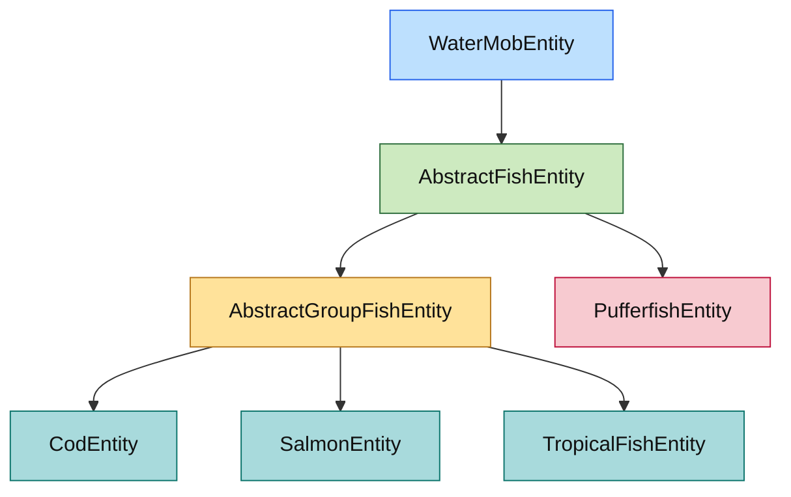

# 鱼类实体模块

## 目录结构

```text
fish/
├── AbstractFishEntity.hpp/cpp         # 所有鱼共享的基础游泳/离水语义
├── AbstractGroupFishEntity.hpp/cpp    # 1.16.5 群游鱼中间层（含招募和导航方法）
├── CodEntity.hpp/cpp                  # 鳕鱼
├── SalmonEntity.hpp/cpp               # 鲑鱼
├── PufferfishEntity.hpp/cpp           # 河豚
├── TropicalFishEntity.hpp/cpp         # 热带鱼
└── README.md                          # 模块说明
```

## 文件介绍

- `AbstractFishEntity`
  - 对齐 1.16.5 `AbstractFishEntity` 的基础层。
  - 负责空气供应、游泳状态、离水扑腾状态。
  - **FromBucket 标签**：支持从桶放出的鱼不会消失的功能。
  - 不再承载群游字段。
- `AbstractGroupFishEntity`
  - 对齐 1.16.5 `AbstractGroupFishEntity`。
  - 负责群首引用、群体大小、跟随距离和 leader 失效后的状态清理。
  - **已实现方法**:
    - `recruitFollowers()` - 招募无首领鱼加入群体
    - `moveToGroupLeader()` - 导航到群首位置
  - **已接入 `FollowSchoolLeaderGoal`** - 完整的群游跟随 AI。
- `CodEntity`
  - 继承 `AbstractGroupFishEntity`。
  - 沿用 vanilla 默认最大群体大小 8。
- `SalmonEntity`
  - 继承 `AbstractGroupFishEntity`。
  - 对齐 vanilla，最大群体大小固定为 5。
- `PufferfishEntity`
  - 继续继承 `AbstractFishEntity`。
  - 不进入群游层，保留河豚自己的膨胀/中毒语义。
- `TropicalFishEntity`
  - 继承 `AbstractGroupFishEntity`。
  - 当前保留基础变种编码，桶数据和预定义花纹仍待补全。

## 模块关系

- `AbstractFishEntity` 继承自 `passive/water/WaterMobEntity`。
- `AbstractGroupFishEntity` 继承自 `AbstractFishEntity`，只给会群游的鱼使用。
- `CodEntity`、`SalmonEntity`、`TropicalFishEntity` 通过 `AbstractGroupFishEntity` 共享群游语义。
- `PufferfishEntity` 直接停留在 `AbstractFishEntity`，避免把非群游鱼误塞进群游层。

## 整体职责

- 提供 1.16.5 鱼类实体的基础层次。
- 统一鱼类共享的空气、游泳、离水扑腾行为。
- 为后续鱼类 AI、生成分组、桶捕捉和同步逻辑提供正确继承结构。

## 输入 / 输出

### 输入

- `Entity` / `WaterMobEntity` 提供的位置、存活状态和环境状态。
- tick 驱动的生命周期更新。
- 未来会接入的群游 AI 目标和生成分组逻辑。

### 输出

- 游泳状态与离水扑腾状态更新。
- 群首引用、群体大小和跟随距离判定。
- 供鱼类 AI 和生成系统消费的基础群游状态。

## 依赖项

### 内部依赖

- `src/common/entity/core/Entity.hpp`
- `src/common/entity/entities/passive/water/WaterMobEntity.hpp`
- `src/common/entity/attribute/Attributes.hpp`

### 外部依赖

- 仅标准库

## 使用方法

```cpp
mc::CodEntity leader(mc::LegacyEntityType::Cod, 1);
mc::SalmonEntity follower(mc::LegacyEntityType::Salmon, 2);

follower.joinGroup(leader);

if (follower.hasGroupLeader() && follower.inRangeOfGroupLeader()) {
    // 后续可在 Goal/Brain 中接入真正的群游跟随逻辑
}
```

## 容易踩的坑

- 不要再把群游字段塞回 `AbstractFishEntity`。
  - 这会再次让 `PufferfishEntity` 落到错误层次。
- 不要把 `SalmonEntity` 的最大群体大小写成默认值 8。
  - vanilla 1.16.5 鲑鱼固定为 5。
- 群游 AI 已完整实现。
  - `FollowSchoolLeaderGoal` 已接入，使用 `EntityUtils::findEntities<AbstractGroupFishEntity>()` 搜索附近鱼群。
  - 初始生成分组逻辑和桶/NBT 同步仍未实现。

## FromBucket 机制（MC 1.16.5）

从桶放出的鱼永远不会消失，这是通过 `FromBucket` 标签实现的：

### 核心逻辑

```cpp
// AbstractFishEntity 中的消失检查
[[nodiscard]] bool preventDespawn() const override {
    return WaterMobEntity::preventDespawn() || m_fromBucket;
}

[[nodiscard]] bool canDespawn(double distanceToClosestPlayer) const override {
    return !m_fromBucket && !hasCustomName();
}
```

### 设置时机

`FishBucketItem.spawnFish()` 在生成鱼实体后调用 `setFromBucket(true)`：

```cpp
auto* abstractFish = dynamic_cast<AbstractFishEntity*>(fish.get());
if (abstractFish != nullptr) {
    abstractFish->setFromBucket(true);
}
```

### 与命名牌的关系

- 有自定义名称的鱼也不会消失（`canDespawn` 检查 `hasCustomName()`）
- `preventDespawn()` 在消失检查中首先被调用，如果返回 `true` 则跳过整个消失逻辑

## 测试用例

- `tests/entity/FishSupportTypesTest.cpp`
  - 覆盖群游层继承关系。
  - 覆盖 follower 加入/离开 leader。
  - 覆盖 leader 移除后的引用清理。
  - 覆盖 vanilla 风格的 11 格跟随距离语义。
  - **覆盖 `FollowSchoolLeaderGoal` 完整测试**:
    - `ShouldNotExecuteWhenIsGroupLeader` - 首领不执行跟随
    - `ShouldExecuteWhenHasGroupLeader` - 有首领时执行
    - `ShouldContinueExecutingWhenInRange` - 范围内继续跟随
    - `ShouldNotContinueExecutingWhenOutOfRange` - 超出范围停止
    - `ShouldLeaveGroupOnReset` - 重置时离开群体
    - `ShouldFindGroupToJoin` - 搜索并加入群体
    - `ShouldRespectMaxGroupSize` - 遵守最大群体限制
    - `RecruitFollowersWorks` - 招募功能正常
    - `MoveToGroupLeaderWorks` - 导航功能正常
  - **覆盖 `AbstractFishEntity FromBucket` 测试**:
    - `DefaultFromBucketIsFalse` - 默认不是从桶放出
    - `SetFromBucketToTrue` - 设置 FromBucket 标签
    - `FromBucketFishPreventsDespawn` - 从桶放出的鱼不会消失
    - `FromBucketFishCannotDespawn` - canDespawn 返回 false
    - `AllFishTypesSupportFromBucket` - 所有鱼类都支持 FromBucket

- `tests/common/item/special/FishBucketItemTest.cpp`
  - 覆盖鱼桶物品注册。
  - 覆盖各类鱼桶的类型名称。
  - 覆盖 FromBucket 标签与消失机制的关联。
  - 覆盖 ItemDropHelper 在实体位置生成物品。

## Mermaid 图表


