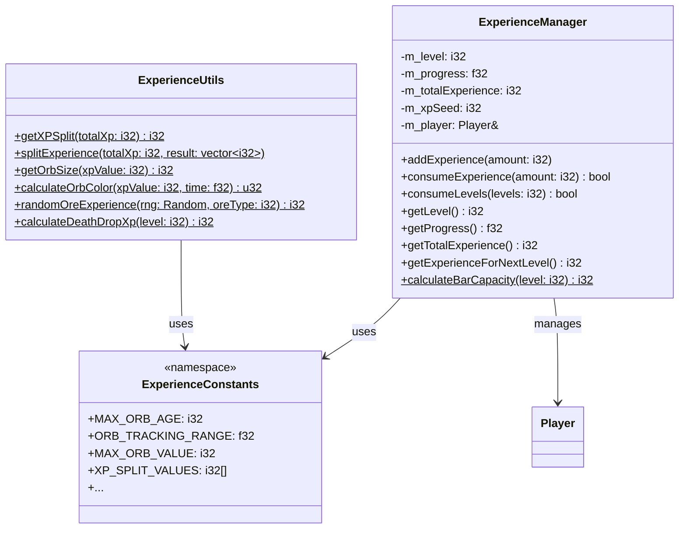

# 经验系统模块 (Experience System)

本目录包含 Minecraft 经验系统的核心实现。

## 目录结构

```
experience/
├── ExperienceConstants.hpp    # 经验常量定义
├── ExperienceManager.hpp/cpp  # 经验管理器
├── ExperienceUtils.hpp        # 经验工具函数
└── README.md                  # 本文档
```

## 核心组件

### ExperienceConstants.hpp

定义经验系统的所有常量：

| 常量类型 | 内容 |
|---------|------|
| 经验球常量 | 最大存活时间、追踪范围、拾取延迟等 |
| 经验值分割 | 11档分割值表 (2477, 1237, 617, ...) |
| 玩家经验 | 拾取冷却、死亡掉落上限等 |
| 矿石经验 | 各矿石的经验掉落范围 |
| 生物经验 | 各生物的经验掉落值 |

### ExperienceManager

管理玩家的经验值和等级。

```cpp
// 创建经验管理器
ExperienceManager xpManager(player);

// 添加经验
xpManager.addExperience(100);

// 消耗等级（附魔用）
xpManager.consumeLevels(30);

// 查询
i32 level = xpManager.getLevel();
f32 progress = xpManager.getProgress();
i32 total = xpManager.getTotalExperience();

// 附魔处理
xpManager.onEnchant(levels, random);
```

### ExperienceUtils

提供经验系统的工具函数：

```cpp
// 分割经验值
std::vector<i32> orbValues;
utils::splitExperience(5000, orbValues);  // 分割成多个经验球

// 获取经验球大小等级
i32 size = utils::getOrbSize(100);  // 返回 0-10

// 计算经验球颜色
u32 color = utils::calculateOrbColor(xpValue, time);

// 矿石经验
i32 xp = utils::randomOreExperience(rng, 1);  // 钻石矿

// 死亡掉落
i32 dropXp = utils::calculateDeathDropXp(level);
```

## 经验公式

### 升级所需经验

| 等级范围 | 公式 | 范围 |
|---------|------|------|
| 0-14 | 7 + level * 2 | 7-35 |
| 15-29 | 37 + (level - 15) * 5 | 37-107 |
| 30+ | 112 + (level - 30) * 9 | 112-382 |

### 累计经验计算

```cpp
i32 getExperienceForLevel(i32 level) {
    if (level <= 0) return 0;
    if (level <= 15) return level * (level + 6);
    if (level <= 30) {
        i32 levelsAfter15 = level - 15;
        return 315 + 37 * levelsAfter15 + 5 * levelsAfter15 * (levelsAfter15 - 1) / 2;
    }
    i32 levelsAfter30 = level - 30;
    return 1395 + 112 * levelsAfter30 + 9 * levelsAfter30 * (levelsAfter30 - 1) / 2;
}
```

## 经验值来源

### 生物掉落

| 生物 | 经验值 |
|------|--------|
| 被动动物（猪/牛/羊/鸡） | 1-3 |
| 普通怪物（僵尸/骷髅/苦力怕） | 5 |
| 凋灵 | 50 |
| 末影龙 | 12000 |
| 玩家死亡 | min(level * 7, 100) |

### 矿石

| 方块 | 经验范围 |
|------|---------|
| 煤矿 | 0-2 |
| 钻石矿 | 3-7 |
| 绿宝石矿 | 3-7 |
| 青金石矿 | 2-5 |
| 下界石英矿 | 2-5 |
| 下界金矿 | 0-1 |
| 红石矿 | 1-5 |
| 刷怪笼 | 15-44 |

### 其他

| 来源 | 经验值 |
|------|--------|
| 烧炼 | 配方定义 |
| 钓鱼 | 1-6 |
| 交易 | 村民等级 |

## 类图



## 依赖项

- `../entities/player/Player.hpp` - 玩家实体
- `../../../core/Types.hpp` - 基础类型
- `../../../util/math/random/Random.hpp` - 随机数生成

## 参考

- Minecraft 1.16.5: `net.minecraft.entity.player.PlayerEntity` (经验相关)
- Minecraft Wiki: [Experience](https://minecraft.fandom.com/wiki/Experience)
