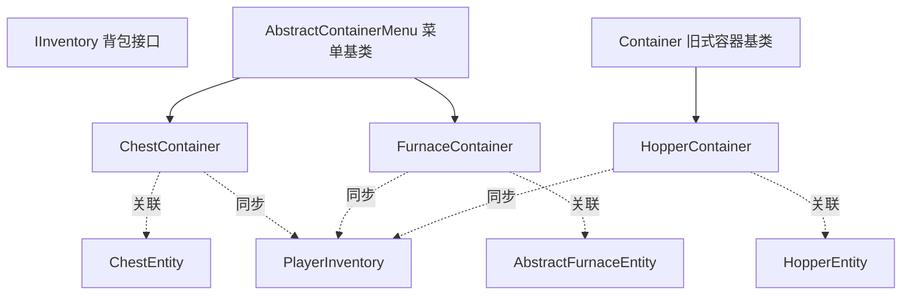

# Container 模块

提供GUI容器（Container/Menu）的实现，用于客户端-服务端同步玩家与方块实体的交互。

当前这一层里，`ChestContainer` 和 `FurnaceContainer` 已迁移到 `AbstractContainerMenu` 菜单基类；`Container` 仍保留给旧式槽位容器和 `HopperContainer` 这类轻量实现使用。

## 目录结构

```
container/
├── ChestContainer.hpp/cpp   # 箱子菜单（单箱27格/双箱54格，基于 AbstractContainerMenu）
├── FurnaceContainer.hpp/cpp # 熔炉菜单（输入/燃料/输出槽，基于 AbstractContainerMenu）
├── HopperContainer.hpp/cpp  # 漏斗容器（5格）
└── README.md
```

## 文件详解

### ChestContainer.hpp/cpp

**职责**：箱子GUI菜单，处理玩家与箱子之间的物品交换，并与客户端/服务端菜单同步层对齐。

**主要功能**：
- 单箱模式：27格存储
- 双箱模式：54格存储（合并两个箱子）
- 玩家物品栏同步
- 打开/关闭计数管理

**槽位布局**：
```
单箱 (27格):
+----------------------------------+
| 0  1  2  3  4  5  6  7  8        |
| 9  10 11 12 13 14 15 16 17      |
| 18 19 20 21 22 23 24 25 26      |
+----------------------------------+

双箱 (54格):
+----------------------------------+
| 上半部分（LEFT箱子）              |
| 0-26                             |
+----------------------------------+
| 下半部分（RIGHT箱子）             |
| 27-53                            |
+----------------------------------+
```

### FurnaceContainer.hpp/cpp

**职责**：熔炉GUI菜单，处理玩家与熔炉之间的物品交换，并与客户端/服务端菜单同步层对齐。

**主要功能**：
- 3槽熔炉背包（输入/燃料/输出）
- 熔炼进度显示
- 燃烧时间显示
- 快速移动支持

**槽位布局**：
```
熔炉容器:
+------------+
| 输入 (0)   |
| 燃料 (1)   |
| 输出 (2)   |
+------------+
```

### HopperContainer.hpp/cpp

**职责**：漏斗GUI容器，处理玩家与漏斗之间的物品交换。

**主要功能**：
- 5格漏斗背包
- 快速移动支持

**槽位布局**：
```
漏斗容器 (5格):
+---------------------+
| 0  1  2  3  4       |
+---------------------+
```

## 模块关系



## 依赖项

### 内部依赖
- `entity/inventory/IInventory.hpp` - 背包接口
- `entity/inventory/PlayerInventory.hpp` - 玩家背包
- `world/blockentity/storage/ChestEntity.hpp` - 箱子实体
- `world/blockentity/processing/AbstractFurnaceEntity.hpp` - 熔炉实体
- `world/blockentity/transport/HopperEntity.hpp` - 漏斗实体

### 外部依赖
- `<memory>` - 智能指针
- `<vector>` - 动态数组

## 使用方法

### 创建箱子容器

```cpp
// 单箱
mc::PlayerInventory playerInventory(nullptr);
auto chestContainer = std::make_unique<ChestContainer>(
    containerId,
    &playerInventory,
    chestEntity->getInventory()
);

// 双箱
auto doubleContainer = std::make_unique<ChestContainer>(
    containerId,
    &playerInventory,
    chestA->getInventory(),
    chestB->getInventory()
);
```

### 创建熔炉容器

```cpp
auto furnaceContainer = std::make_unique<FurnaceContainer>(
    containerId,
    &playerInventory,
    furnaceEntity->getFurnaceInventory()
);
```

### 创建漏斗容器

```cpp
auto hopperContainer = std::make_unique<HopperContainer>(
    containerId,
    playerInventory,
    hopperEntity->getInventory()
);
```

## 容易踩的坑

### 1. 双箱槽位映射

双箱容器需要正确映射槽位到两个箱子：

```cpp
// 错误：直接访问槽位
ItemStack item = chestA->getItem(slot);

// 正确：根据槽位选择箱子
if (slot < 27) {
    return chestA->getItem(slot);
} else {
    return chestB->getItem(slot - 27);
}
```

### 2. 容器ID管理

每个容器需要唯一的ID用于网络同步：

```cpp
// 服务端分配ID
u32 containerId = nextContainerId++;

// 客户端接收时验证
if (containerId != expectedId) {
    // ID不匹配，忽略
}
```

### 3. 玩家背包同步

打开容器时需要同步玩家背包状态：

```cpp
void onContainerOpen(Player& player) {
    // 添加玩家背包槽位到容器
    for (int i = 0; i < 36; ++i) {
        addSlot(new PlayerInventorySlot(player.getInventory(), i));
    }
}
```

### 4. 容器关闭处理

关闭容器时需要正确处理物品返回：

```cpp
void onContainerClose(Player& player) {
    // 返回容器中的物品
    for (auto& slot : m_slots) {
        if (!slot.getItem().isEmpty()) {
            player.getInventory().addItem(slot.getItem());
        }
    }
}
```

## 测试用例

测试文件位于 `tests/common/entity/inventory/container/`：

- `ChestContainerTest.cpp` - 箱子菜单测试，覆盖槽位布局和快速移动
- `FurnaceContainerTest.cpp` - 熔炉菜单测试，覆盖槽位布局和快速移动
- `HopperContainerTest.cpp` - 漏斗容器测试

### 测试覆盖

- 槽位访问和修改
- 双箱槽位映射
- 快速移动（Shift+点击）
- 物品交换和堆叠
- 容器打开/关闭
- 网络同步
