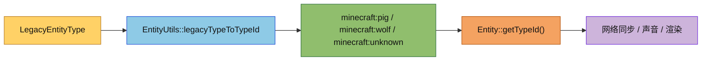

# Entity Utils Module

实体系统的非模板工具函数模块，当前主要负责旧实体类型到类型标识符的映射。

## 目录结构

```text
src/common/entity/utils/
├── EntityUtils.hpp   # 非模板工具声明
├── EntityUtils.cpp   # LegacyEntityType 映射实现
└── README.md         # 模块说明
```

## 文件介绍

- `EntityUtils.hpp`：声明 `legacyTypeToTypeId(...)`，供实体基类和其他调用方引用。
- `EntityUtils.cpp`：保存 `LegacyEntityType` 到 `minecraft:*` 字符串的完整 switch 表。
- `README.md`：说明该目录的职责、依赖和使用方式。

## 模块关系

- `src/common/entity/core/Entity.cpp` 在 `getTypeId()` 中调用这里的映射函数。
- `src/common/entity/core/EntityUtils.hpp` 继续承载模板型搜索、距离和筛选工具。
- `tests/entity/EntityCoreTests.cpp` 验证 `Entity::getTypeId()` 的回退结果没有变化。

## 整体职责

1. 为旧实体类型枚举提供稳定的字符串映射。
2. 将非模板实现从高频实体核心头文件中拆出，降低头文件膨胀。
3. 让 `Entity::getTypeId()` 的回退逻辑保持单点维护。

## 输入 / 输出

- 输入：`LegacyEntityType`
- 输出：`const char*` 类型的实体类型标识符，例如 `minecraft:pig`

## 依赖项

- 内部依赖：`src/common/entity/core/Entity.hpp`
- 内部依赖：`src/common/entity/core/EntityUtils.hpp`
- 构建依赖：`mc_common` 目标和测试目标都必须编译 `EntityUtils.cpp`

## 使用方法

```cpp
#include "entity/utils/EntityUtils.hpp"

using namespace mc;

const char* typeId = EntityUtils::legacyTypeToTypeId(LegacyEntityType::Pig);
```

在 `Entity` 之外如果需要复用旧类型到字符串的映射，直接调用这个函数即可。

## 容易踩的坑

- 不要把这个 switch 表重新塞回 `Entity.cpp`，否则会把实现细节重新绑死在实体核心类里。
- 不要把模板型搜索函数迁到这里，`findClosestEntity(...)` 仍然属于 `core/EntityUtils.hpp`。
- 新增旧实体枚举时，要同步补全这里的映射和相关回退测试。

## 测试用例

- `tests/entity/EntityCoreTests.cpp` 验证 `Entity(LegacyEntityType::Pig)`、`Entity(LegacyEntityType::Wolf)` 和 `Entity(LegacyEntityType::Unknown)` 的 `getTypeId()` 回退结果。

## Mermaid 图表

