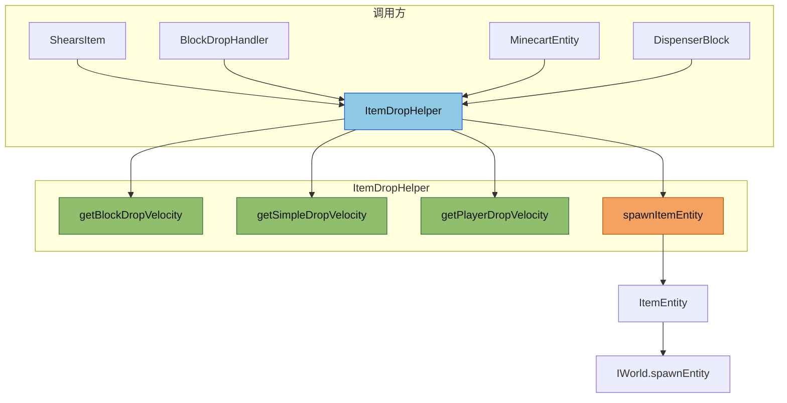

# Entity Utils Module

实体系统的非模板工具函数模块，负责物品掉落、实体类型映射等工具功能。

## 目录结构

```text
src/common/entity/utils/
├── ItemDropHelper.hpp   # 物品掉落工具类（统一随机速度、生成物品实体）
├── ItemDropHelper.cpp   # 物品掉落工具实现
├── EntityUtils.hpp      # 非模板工具声明
├── EntityUtils.cpp      # LegacyEntityType 映射实现
└── README.md            # 模块说明
```

## 文件介绍

### ItemDropHelper.hpp / ItemDropHelper.cpp

**职责**：提供统一的物品实体生成接口，封装随机速度计算逻辑。

**主要功能**：

1. **随机速度计算**：
   - `getBlockDropVelocity()` - 方块掉落式（用于方块破坏）
   - `getSimpleDropVelocity()` - 简单随机式（用于实体丢弃）
   - `getPlayerDropVelocity()` - 玩家丢弃式（Q键/Ctrl+Q）
   - `getGaussianVelocity()` - 高斯分布式（用于发射器）

2. **物品实体生成**：
   - `spawnItemEntity()` - 在指定位置生成物品实体
   - `spawnItemAtEntity()` - 在实体位置生成物品实体
   - `spawnItemEntities()` - 批量生成物品实体

**用法示例**：
```cpp
#include "entity/utils/ItemDropHelper.hpp"

using namespace mc;

// 在实体位置生成单个物品（剪羊毛等场景）
ItemDropHelper::spawnItemEntity(world, stack, entity->x(), entity->y(), entity->z(), rng);

// 在方块位置生成多个物品（方块掉落）
ItemDropHelper::spawnItemEntities(world, pos, drops, rng, throwerUuid);

// 获取随机速度向量
Vector3 velocity = ItemDropHelper::getBlockDropVelocity(rng);
```

**参考**：MC 1.16.5 `InventoryHelper.spawnItemStack()`, `Entity.entityDropItem()`, `PlayerEntity.dropItem()`

### EntityUtils.hpp / EntityUtils.cpp

**职责**：旧实体类型到类型标识符的映射。

**主要功能**：
- `legacyTypeToTypeId(LegacyEntityType)` - 将旧实体类型枚举转换为 `minecraft:*` 字符串

## 模块关系

```
┌──────────────────┐
│   ItemEntity     │
└────────┬─────────┘
         │ 使用
         ▼
┌──────────────────┐     ┌──────────────────┐
│ ItemDropHelper   │     │  EntityUtils     │
│ (物品掉落工具)    │     │  (类型映射)      │
└────────┬─────────┘     └────────┬─────────┘
         │                        │
         │ 调用                    │ 调用
         ▼                        ▼
┌──────────────────────────────────────────┐
│              IWorld / Entity              │
└──────────────────────────────────────────┘
```

**依赖关系**：
- `ItemDropHelper` 依赖 `IWorld`, `ItemEntity`, `ItemStack`, `Random`
- `EntityUtils` 依赖 `Entity`, `LegacyEntityType`
- `src/common/entity/core/Entity.cpp` 在 `getTypeId()` 中调用 `EntityUtils::legacyTypeToTypeId()`
- `src/common/entity/core/EntityUtils.hpp` 继续承载模板型搜索、距离和筛选工具

## 整体职责

1. **ItemDropHelper**：统一物品掉落的随机速度计算，消除项目中的重复代码
2. **EntityUtils**：为旧实体类型枚举提供稳定的字符串映射，降低头文件膨胀

## 输入 / 输出

### ItemDropHelper

| 输入 | 输出 |
|------|------|
| 世界指针、物品堆、位置、随机数生成器 | 物品实体指针 / 实体ID列表 |
| 随机数生成器 | 随机速度向量 (Vector3) |

### EntityUtils

| 输入 | 输出 |
|------|------|
| `LegacyEntityType` | `const char*` (如 `minecraft:pig`) |

## 依赖项

### 内部依赖
- `src/common/entity/core/Entity.hpp`
- `src/common/entity/entities/item/ItemEntity.hpp`
- `src/common/item/core/ItemStack.hpp`
- `src/common/world/IWorld.hpp`
- `src/common/util/math/random/Random.hpp`
- `src/common/util/math/MathConstants.hpp`

### 外部依赖
- 无外部库依赖

## 使用方法

### 物品掉落（剪羊毛场景）

```cpp
#include "entity/utils/ItemDropHelper.hpp"

// 在 ShearsItem::itemInteractionForEntity 中
for (auto& drop : drops) {
    ItemDropHelper::spawnItemEntity(
        world, drop,
        target.x(), target.y() + 0.5, target.z(),
        rng, 10, player.uuid()
    );
}
```

### 方块掉落

```cpp
#include "entity/utils/ItemDropHelper.hpp"

// 在 BlockDropHandler 中
auto spawnedIds = ItemDropHelper::spawnItemEntities(
    world, pos, drops, rng, throwerUuid
);
```

### 获取随机速度

```cpp
#include "entity/utils/ItemDropHelper.hpp"

// 方块掉落式随机速度
Vector3 vel = ItemDropHelper::getBlockDropVelocity(rng);

// 简单随机速度
Vector3 vel = ItemDropHelper::getSimpleDropVelocity(rng);

// 玩家丢弃物品速度
Vector3 vel = ItemDropHelper::getPlayerDropVelocity(rng, true);  // Q键丢弃
Vector3 vel = ItemDropHelper::getPlayerDropVelocity(rng, false, yaw, pitch);  // Ctrl+Q
```

## 容易踩的坑

### 1. 随机数生成器生命周期

**问题**：`ItemDropHelper` 的方法接受 `math::Random&` 引用，需要调用方提供有效的随机数生成器。

**解决方案**：通常可以从 `IWorld::getRandom()` 或 `Entity::getRandom()` 获取。

### 2. 物品实体指针的有效性

**问题**：`spawnItemEntity()` 返回的指针可能在后续操作后失效。

**解决方案**：如果需要后续操作，应保存 `EntityId` 而非原始指针：
```cpp
EntityId id = world->spawnEntity(std::move(entity));
// 通过 world->getEntity(id) 获取实体
```

### 3. 拾取延迟设置

**问题**：新生成的物品立即被拾取。

**解决方案**：使用 `DEFAULT_PICKUP_DELAY = 10` ticks（0.5秒），或根据场景调整。

### 4. 不要把模板型搜索函数迁到这里

`findClosestEntity(...)` 等模板函数仍然属于 `core/EntityUtils.hpp`。

### 5. 新增旧实体枚举时同步更新

新增 `LegacyEntityType` 枚举时，要同步补全 `EntityUtils::legacyTypeToTypeId()` 的映射。

## 测试用例

- `tests/entity/EntityCoreTests.cpp` - 验证 `Entity::getTypeId()` 回退结果
- `tests/common/entity/utils/ItemDropHelperTest.cpp` - 验证物品掉落随机速度和实体生成

## Mermaid 图表

