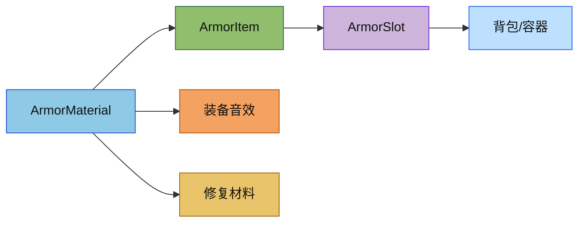

# 盔甲材质模块

本目录负责盔甲材质数据，包含耐久、防御、附魔权重、装备音效和修复材料等原版语义。

## 目录结构

```
armor/
├── ArmorMaterial.hpp  # 盔甲材质接口与原版材质定义
├── ArmorMaterial.cpp  # 原版材质常量与数据实现
└── README.md         # 本说明
```

## 文件介绍

### ArmorMaterial.hpp

定义 `ArmorSlot`、`ArmorMaterial` 接口以及 `LeatherArmorMaterial`、`ChainArmorMaterial`、`IronArmorMaterial`、`GoldArmorMaterial`、`DiamondArmorMaterial`、`TurtleArmorMaterial`、`NetheriteArmorMaterial` 七种原版材质。

### ArmorMaterial.cpp

提供七种材质的具体数值实现，并导出 `ArmorMaterials::LEATHER` 等全局常量。

## 模块关系

`ArmorMaterial` 被 `item/items/armor/ArmorItem` 消费，用于决定单件盔甲的防御值、韧性和修复规则；`Slot::ArmorSlot` 再基于 `ArmorItem` 的槽位帮助函数做放置约束。

## 整体职责

这个模块只负责“盔甲材质数据”，不处理穿戴逻辑，也不负责背包槽位分发。穿戴与槽位限制应由物品层和容器层完成。

## 输入 / 输出

输入是 `ArmorSlot` 枚举和物品注册后的基础物品常量；输出是材质名称、耐久、护甲值、附魔能力、装备音效和修复原料。

## 依赖项

内部依赖包括 `item/crafting/Ingredient.hpp`、`item/Items.hpp` 和 `sound/SoundEvent.hpp`。外部依赖主要是 C++17 标准库和项目的 `ResourceLocation`、`Item`、`Ingredient` 类型。

## 使用方法

```cpp
const auto& material = item::armor::ArmorMaterials::DIAMOND;
const i32 durability = material.getDurability(item::armor::ArmorSlot::Head);
const auto repairMaterial = material.getRepairMaterial();
const auto equipSound = material.getEquipSound();
```

在创建盔甲物品时，应把 `ArmorMaterial::getDurability(...)` 作为 `ItemProperties::maxDamage(...)` 的来源。

## 容易踩的坑

`getRepairMaterial()` 依赖 `Items::initialize()` 之后的物品指针，测试或启动代码如果在物品注册前调用，会得到空原料。

另一个常见错误是把装备音效写成空 `SoundEvent`；这里必须返回原版的 `minecraft:item.armor.equip_*` 标识。

## 测试用例

- `tests/common/test_item.cpp`：验证七种材质的装备音效与修复材料。
- `tests/common/test_inventory.cpp`：验证护甲槽只接受对应类型的 `ArmorItem`。

## Mermaid 图表

