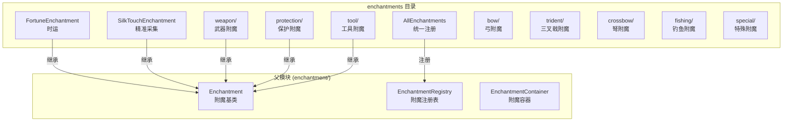

# Enchantments 模块

本目录包含具体附魔实现，是附魔系统的核心实现部分。

## 目录结构

```
enchantments/
├── AllEnchantments.hpp            # 所有附魔统一包含头文件
├── AllEnchantments.cpp            # 所有附魔注册实现
├── FortuneEnchantment.hpp         # 时运附魔（头文件）
├── SilkTouchEnchantment.hpp       # 精准采集附魔（头文件）
├── README.md                      # 本文件
├── bow/                           # 弓附魔
│   ├── FlameEnchantment.hpp       # 火焰附魔
│   ├── InfinityEnchantment.hpp    # 无限附魔
│   ├── PowerEnchantment.hpp       # 力量附魔
│   └── PunchEnchantment.hpp       # 冲击附魔
├── crossbow/                      # 弩附魔
│   ├── MultishotEnchantment.hpp   # 多重射击附魔
│   ├── PiercingEnchantment.hpp    # 穿透附魔
│   └── QuickChargeEnchantment.hpp # 快速装填附魔
├── fishing/                       # 钓鱼附魔
│   ├── LuckOfTheSeaEnchantment.hpp # 海之眷顾附魔
│   └── LureEnchantment.hpp        # 饵钓附魔
├── protection/                    # 保护类附魔（11种）
│   ├── ProtectionEnchantment.hpp/cpp  # 保护基类
│   ├── AllProtectionEnchantment.hpp   # 全保护
│   ├── AquaAffinityEnchantment.hpp    # 水下速掘
│   ├── BlastProtectionEnchantment.hpp # 爆炸保护
│   ├── DepthStriderEnchantment.hpp/cpp # 深海探索者
│   ├── FeatherFallingEnchantment.hpp  # 摔落保护
│   ├── FireProtectionEnchantment.hpp  # 火焰保护
│   ├── FrostWalkerEnchantment.hpp/cpp # 冰霜行者（位置依赖：水面冻结）
│   ├── ProjectileProtectionEnchantment.hpp # 弹射物保护
│   ├── RespirationEnchantment.hpp     # 水下呼吸
│   └── ThornsEnchantment.hpp/cpp      # 荆棘
├── special/                       # 特殊附魔（4种）
│   ├── BindingCurseEnchantment.hpp  # 绑定诅咒
│   ├── MendingEnchantment.hpp       # 经验修补
│   ├── SoulSpeedEnchantment.hpp/cpp # 灵魂疾行（位置依赖：灵魂沙/土速度加成）
│   └── VanishingCurseEnchantment.hpp # 消失诅咒
├── tool/                          # 工具类附魔（4种）
│   ├── EfficiencyEnchantment.hpp    # 效率附魔
│   ├── FortuneEnchantment.cpp       # 时运附魔（实现）
│   ├── SilkTouchEnchantment.cpp     # 精准采集附魔（实现）
│   └── UnbreakingEnchantment.hpp/cpp # 耐久附魔
├── trident/                       # 三叉戟附魔（4种）
│   ├── ChannelingEnchantment.hpp   # 引雷附魔
│   ├── ImpalingEnchantment.hpp     # 穿刺附魔
│   ├── LoyaltyEnchantment.hpp      # 忠诚附魔
│   └── RiptideEnchantment.hpp      # 激流附魔
├── mace/                          # 重锤附魔（3种）
│   ├── BreachEnchantment.hpp/cpp  # 破甲附魔
│   ├── DensityEnchantment.hpp/cpp # 致密附魔
│   └── WindBurstEnchantment.hpp/cpp # 风爆附魔
└── weapon/                        # 武器类附魔（7种）
    ├── BaneOfArthropodsEnchantment.hpp/cpp # 节肢杀手
    ├── DamageEnchantment.hpp/cpp   # 伤害附魔基类
    ├── FireAspectEnchantment.hpp   # 火焰附加
    ├── KnockbackEnchantment.hpp    # 击退
    ├── LootingEnchantment.hpp      # 抢夺
    ├── SharpnessEnchantment.hpp    # 锋利
    ├── SmiteEnchantment.hpp        # 亡灵杀手
    └── SweepingEnchantment.hpp     # 横扫之刃
```

## 内部模块关系



## 上下游外部依赖关系

### 上游依赖（本模块依赖的模块）

| 依赖 | 路径 | 用途 |
|------|------|------|
| Enchantment | `../Enchantment.hpp` | 附魔基类，所有附魔继承此类 |
| EnchantmentType/Rarity | `../Enchantment.hpp` | 附魔类型和稀有度枚举 |
| math::Random | `common/util/math/random/Random.hpp` | 随机数生成（耐久、荆棘等） |
| i32, f32, u8 | `common/core/Types.hpp` | 基础类型定义 |

### 下游依赖（依赖本模块的模块）

| 模块 | 路径 | 用途 |
|------|------|------|
| EnchantmentRegistry | `../EnchantmentRegistry.cpp` | 注册所有附魔实例 |
| EnchantmentHelper | `../EnchantmentHelper.cpp` | 附魔查询工具类 |
| 战利品表系统 | `loot/functions/ApplyBonusFunction.hpp` | 时运计算 |
| 方块掉落系统 | `world/block/` | 精准采集判断、时运加成 |
| 实体系统 | `entity/` | 附魔回调（荆棘反伤、节肢杀手等）|

## 容易踩的坑

### 1. 时运/精准采集 cpp 文件位置

`FortuneEnchantment.cpp` 和 `SilkTouchEnchantment.cpp` 位于 `tool/` 目录下，而对应的 `.hpp` 文件在 `enchantments/` 根目录。这是为了与 `UnbreakingEnchantment.cpp` 等其他工具附魔实现放在一起。

### 2. 时运效果不由本模块计算

`FortuneEnchantment` 类只定义附魔属性，**实际的时运计算由战利品表的 `ApplyBonusFunction` 处理**。如果需要在代码中计算时运加成，使用：
- `loot::ApplyBonusFunction::OreDrops` - 钻石矿、绿宝石矿
- `loot::ApplyBonusFunction::Uniform` - 煤矿、红石矿
- `loot::ApplyBonusFunction::Binomial` - 树叶、萤石

### 3. 附魔 ID 大小写敏感

```cpp
// 错误
if (other.id() == "Minecraft:Fortune") { ... }

// 正确
if (other.id() == "minecraft:fortune") { ... }
```

### 4. 附魔注册表必须先初始化

```cpp
// 错误：未初始化就使用，返回 nullptr
const Enchantment* e = EnchantmentRegistry::get("minecraft:fortune");

// 正确：先初始化
EnchantmentRegistry::initialize();
const Enchantment* e = EnchantmentRegistry::get("minecraft:fortune");
```

### 5. 互斥关系需要双向检查

时运与精准采集互斥是通过双方各自的 `isCompatibleWith()` 方法实现的，添加新附魔时需确保互斥逻辑完整。

### 6. 耐久附魔对盔甲有特殊处理

盔甲的耐久保护概率只有工具的 40%（`UnbreakingEnchantment::shouldArmorConsumeDurability`），不要误用工具的方法。

### 7. 位置依赖附魔的激活/停用成对性

冰霜行者和灵魂疾行是位置依赖附魔，覆写了 `Enchantment::onLocationChanged()` 和 `onLocationEffectDeactivated()`：
- **冰霜行者**：`onLocationChanged()` 在地面时放置霜冰，`onLocationEffectDeactivated()` 为空实现（霜冰自行融化）
- **灵魂疾行**：`onLocationChanged()` 在灵魂沙/土上添加速度修饰符，`onLocationEffectDeactivated()` 必须移除修饰符

新增位置依赖附魔时，**必须同时覆写两个方法**，即使停用时无需清理也应提供空实现。

### 8. 冰霜行者只冻结水源方块

`FrostWalkerEnchantment::placeFrostedIce()` 使用 `isWaterAt()` + `FluidState::isSource()` 双重检查，
确保只冻结水源方块而不冻结流动水，与原版 ReplaceDisk 效果中 matchesFluids(WATER) 行为一致。
