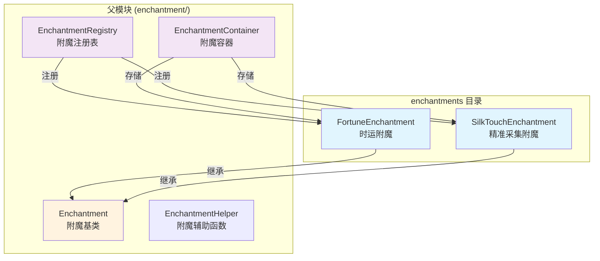
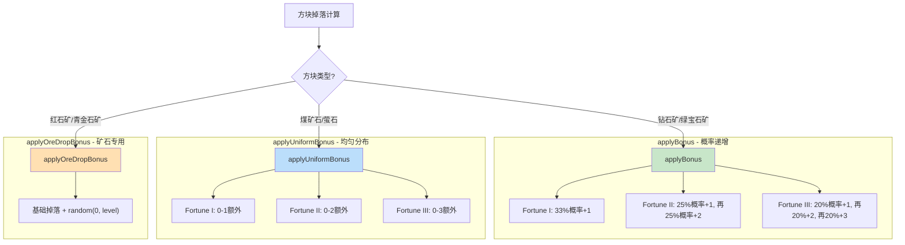
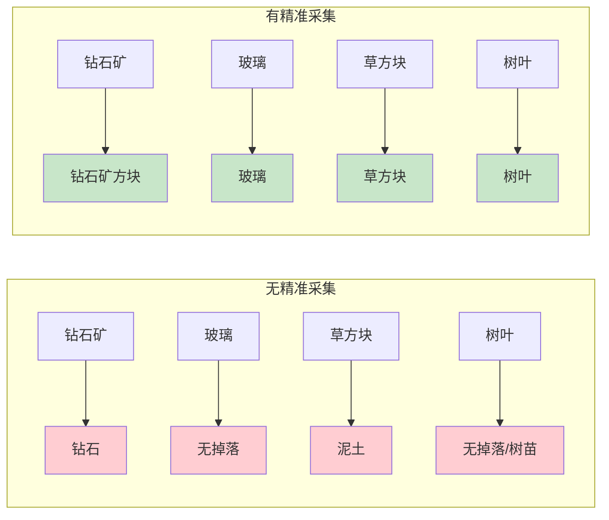
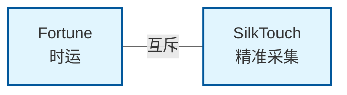
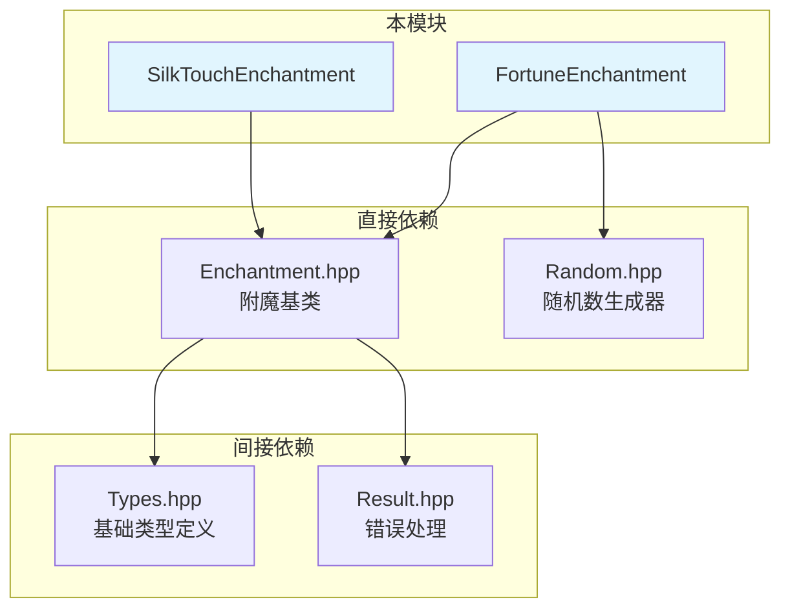

# Enchantments 模块

本目录包含具体附魔实现，是附魔系统的核心实现部分。

## 目录结构

```
enchantments/
├── FortuneEnchantment.hpp      # 时运附魔
├── FortuneEnchantment.cpp
├── SilkTouchEnchantment.hpp    # 精准采集附魔
├── SilkTouchEnchantment.cpp
├── AllEnchantments.hpp         # 所有附魔注册
├── AllEnchantments.cpp
├── bow/                        # 弓附魔
│   ├── PowerEnchantment.hpp    # 力量附魔
│   ├── FlameEnchantment.hpp    # 火焰附魔
│   ├── InfinityEnchantment.hpp # 无限附魔
│   └── PunchEnchantment.hpp    # 冲击附魔
├── crossbow/                   # 弩附魔
├── fishing/                    # 钓鱼附魔
├── protection/                 # 保护附魔
├── special/                    # 特殊附魔
├── tool/                       # 工具附魔
├── trident/                    # 三叉戟附魔
└── weapon/                     # 武器附魔
    ├── SharpnessEnchantment.hpp    # 锋利附魔
    ├── SmiteEnchantment.hpp        # 亡灵杀手附魔
    └── BaneOfArthropodsEnchantment.hpp # 节肢杀手附魔
```

## 模块概述



## 文件详细介绍

### FortuneEnchantment.hpp / FortuneEnchantment.cpp

**职责**: 实现时运附魔（Fortune），增加方块掉落物的数量。

**类定义**:
```cpp
class FortuneEnchantment : public Enchantment {
public:
    // Enchantment 接口实现
    String id() const override;           // "minecraft:fortune"
    i32 minLevel() const override;        // 1
    i32 maxLevel() const override;        // 3
    EnchantmentType type() const override; // Digger
    EnchantmentRarity rarity() const override; // Rare
    bool isCompatibleWith(const Enchantment& other) const override;

    // 时运特有方法
    static i32 applyBonus(i32 baseCount, i32 level, math::Random& random);
    static i32 applyUniformBonus(i32 level, math::Random& random);
    static i32 applyOreDropBonus(i32 baseMin, i32 baseMax, i32 level, math::Random& random);
};
```

**主要属性**:

| 属性 | 值 | 说明 |
|------|-----|------|
| ID | `minecraft:fortune` | 资源标识符 |
| 最小等级 | 1 | - |
| 最大等级 | 3 | Fortune I, II, III |
| 类型 | Digger | 挖掘工具（镐、铲、斧、锄） |
| 稀有度 | Rare | 2权重，较罕见 |
| 最小经验成本 | 15 + (level-1) * 9 | 等级1: 15, 等级2: 24, 等级3: 33 |
| 最大经验成本 | 最小成本 + 50 | 等级1: 65, 等级2: 74, 等级3: 83 |

**时运加成计算方法**:



**适用方块示例**:

| 方法 | 适用方块 | 计算逻辑 |
|------|----------|----------|
| `applyBonus` | 钻石矿、绿宝石矿、下界石英矿 | 概率递增加成 |
| `applyUniformBonus` | 煤矿石、萤石 | 0~level 均匀随机 |
| `applyOreDropBonus` | 红石矿、青金石矿 | 基础掉落 + 时运加成 |

---

### SilkTouchEnchantment.hpp / SilkTouchEnchantment.cpp

**职责**: 实现精准采集附魔（Silk Touch），允许采集方块本身而不是其掉落物。

**类定义**:
```cpp
class SilkTouchEnchantment : public Enchantment {
public:
    // Enchantment 接口实现
    String id() const override;           // "minecraft:silk_touch"
    i32 minLevel() const override;        // 1
    i32 maxLevel() const override;        // 1 (只有I级)
    EnchantmentType type() const override; // Digger
    EnchantmentRarity rarity() const override; // VeryRare
    bool isCompatibleWith(const Enchantment& other) const override;
};
```

**主要属性**:

| 属性 | 值 | 说明 |
|------|-----|------|
| ID | `minecraft:silk_touch` | 资源标识符 |
| 最小等级 | 1 | - |
| 最大等级 | 1 | 仅 Silk Touch I |
| 类型 | Digger | 挖掘工具（镐、铲、斧、锄、剪刀） |
| 稀有度 | VeryRare | 1权重，极罕见 |
| 最小经验成本 | 15 | 固定值 |
| 最大经验成本 | 65 | 固定值 |

**效果**:



**适用物品**: 镐、铲、斧、锄、剪刀

---

## 附魔互斥关系



两个附魔都通过重写 `isCompatibleWith()` 方法实现互斥：

```cpp
// FortuneEnchantment
bool FortuneEnchantment::isCompatibleWith(const Enchantment& other) const override {
    if (other.id() == "minecraft:silk_touch") {
        return false;
    }
    return Enchantment::isCompatibleWith(other);
}

// SilkTouchEnchantment
bool SilkTouchEnchantment::isCompatibleWith(const Enchantment& other) const override {
    if (other.id() == "minecraft:fortune") {
        return false;
    }
    return Enchantment::isCompatibleWith(other);
}
```

---

## 整体职责

| 职责 | 描述 |
|------|------|
| 具体附魔实现 | 实现每个附魔的具体逻辑和属性 |
| 掉落计算 | 提供方块掉落物计算方法（时运） |
| 兼容性检查 | 实现附魔之间的互斥关系 |
| 附魔台参数 | 提供经验成本和可附魔等级范围 |

---

## 输入和输出

### 输入

| 输入类型 | 来源 | 说明 |
|----------|------|------|
| 附魔等级 | 调用者 | 用于计算经验成本和效果强度 |
| 基础掉落数量 | 方块破坏系统 | 用于计算时运加成后的掉落 |
| 随机数生成器 | 调用者 | 用于概率计算 |
| 其他附魔 | EnchantmentContainer | 用于兼容性检查 |

### 输出

| 输出类型 | 说明 |
|----------|------|
| 附魔属性 | ID、等级范围、类型、稀有度 |
| 经验成本 | 附魔台显示的最小/最大等级要求 |
| 兼容性结果 | 是否可以与其他附魔共存 |
| 掉落数量 | 时运加成后的掉落数量 |

---

## 依赖项



### 外部依赖

| 依赖 | 路径 | 用途 |
|------|------|------|
| `Enchantment` | `../Enchantment.hpp` | 附魔基类 |
| `math::Random` | `common/util/math/random/Random.hpp` | 随机数生成 |
| `String`, `i32` | `common/core/Types.hpp` | 基础类型 |

---

## 使用方法

### 获取附魔实例

```cpp
#include "item/enchantment/EnchantmentRegistry.hpp"
#include "item/enchantment/enchantments/FortuneEnchantment.hpp"

// 方法1：通过注册表获取
const Enchantment* fortune = EnchantmentRegistry::get("minecraft:fortune");
if (fortune) {
    i32 maxLevel = fortune->maxLevel(); // 3
}

// 方法2：直接实例化（用于测试）
FortuneEnchantment fortuneInstance;
i32 minCost = fortuneInstance.getMinCost(3); // 33
```

### 计算时运加成

```cpp
#include "item/enchantment/enchantments/FortuneEnchantment.hpp"
#include "util/math/random/Random.hpp"

mc::math::Random random(seed);

// 方法1：标准时运加成（钻石矿等）
i32 diamondDrop = FortuneEnchantment::applyBonus(1, 3, random);
// 结果范围: 1-4

// 方法2：均匀分布加成（煤矿石等）
i32 coalBonus = FortuneEnchantment::applyUniformBonus(3, random);
// 结果范围: 0-3

// 方法3：矿石掉落加成（红石矿、青金石矿）
i32 redstoneDrop = FortuneEnchantment::applyOreDropBonus(4, 5, 3, random);
// 结果范围: 4-8
```

### 检查兼容性

```cpp
#include "item/enchantment/enchantments/FortuneEnchantment.hpp"
#include "item/enchantment/enchantments/SilkTouchEnchantment.hpp"

FortuneEnchantment fortune;
SilkTouchEnchantment silkTouch;

// 检查兼容性
bool compatible = fortune.isCompatibleWith(silkTouch); // false
```

### 在 EnchantmentContainer 中使用

```cpp
#include "item/enchantment/EnchantmentContainer.hpp"
#include "item/enchantment/EnchantmentRegistry.hpp"

EnchantmentContainer container;

// 添加时运 III
container.set("minecraft:fortune", 3);

// 检查是否可以添加精准采集（与时运互斥）
bool canAdd = container.canAdd("minecraft:silk_touch"); // false

// 获取时运等级
i32 level = container.getLevel("minecraft:fortune"); // 3
```

---

## 容易踩的坑

### 1. 时运等级为 0 的边界情况

```cpp
// 错误：没有处理 level <= 0 的情况
i32 FortuneEnchantment::applyBonus(i32 baseCount, i32 level, math::Random& random) {
    // 这里的循环会在 level = 0 时不执行，返回 baseCount
    // 但如果没有检查，可能会产生意外行为
}

// 正确：显式检查
i32 FortuneEnchantment::applyBonus(i32 baseCount, i32 level, math::Random& random) {
    if (level <= 0) {
        return baseCount;
    }
    // ... 正常逻辑
}
```

**说明**: 代码已正确处理此情况，所有时运方法都会检查 `level <= 0`。

### 2. 随机数生成器的复用

```cpp
// 错误：循环中使用同一个 Random 对象但期望独立结果
for (int i = 0; i < 10; ++i) {
    math::Random random(12345); // 种子相同，每次循环结果相同
    i32 drop = FortuneEnchantment::applyBonus(1, 3, random);
}

// 正确：复用同一个 Random 对象
math::Random random(12345);
for (int i = 0; i < 10; ++i) {
    i32 drop = FortuneEnchantment::applyBonus(1, 3, random);
}
```

### 3. 附魔 ID 比较大小写敏感

```cpp
// 错误：ID 比较大小写错误
if (other.id() == "Minecraft:Fortune") { // 错误
    return false;
}

// 正确：使用正确的命名空间格式
if (other.id() == "minecraft:fortune") { // 正确
    return false;
}
```

### 4. 精准采集cpp文件为空

`SilkTouchEnchantment.cpp` 文件目前为空，所有逻辑都在头文件中。如果将来需要添加复杂逻辑，记得在 cpp 文件中实现。

### 5. 附魔注册表必须先初始化

```cpp
// 错误：未初始化就使用
const Enchantment* enchant = EnchantmentRegistry::get("minecraft:fortune");
// 返回 nullptr！

// 正确：先初始化
EnchantmentRegistry::initialize();
const Enchantment* enchant = EnchantmentRegistry::get("minecraft:fortune");
// 正确返回
```

---

## 涉及的测试用例

测试文件: `tests/common/item/enchantment/EnchantmentTest.cpp`

### FortuneEnchantment 测试

| 测试名称 | 测试内容 |
|----------|----------|
| `FortuneEnchantmentTest.GetMinCost` | 验证各等级的最小经验成本 |
| `FortuneEnchantmentTest.GetMaxCost` | 验证各等级的最大经验成本 |
| `FortuneEnchantmentTest.IsIncompatibleWithSilkTouch` | 验证与时运互斥 |
| `FortuneEnchantmentTest.ApplyBonus` | 验证标准时运加成计算 |
| `FortuneEnchantmentTest.ApplyUniformBonus` | 验证均匀分布加成计算 |
| `FortuneEnchantmentTest.ApplyOreDropBonus` | 验证矿石掉落加成计算 |

### SilkTouchEnchantment 测试

| 测试名称 | 测试内容 |
|----------|----------|
| `SilkTouchEnchantmentTest.Properties` | 验证基本属性（ID、等级、类型、稀有度） |
| `SilkTouchEnchantmentTest.GetMinCost` | 验证经验成本 |

### EnchantmentRegistry 测试

| 测试名称 | 测试内容 |
|----------|----------|
| `EnchantmentRegistryTest.GetFortuneEnchantment` | 验证时运附魔注册 |
| `EnchantmentRegistryTest.GetSilkTouchEnchantment` | 验证精准采集附魔注册 |

### EnchantmentContainer 测试

| 测试名称 | 测试内容 |
|----------|----------|
| `EnchantmentContainerTest.CompatibilityCheck` | 验证时运与精准采集互斥 |

---

## 扩展指南

如需添加新附魔，请按以下步骤：

1. 在 `enchantments/` 目录下创建新文件
2. 继承 `Enchantment` 基类
3. 实现所有纯虚函数
4. 在 `EnchantmentRegistry::initialize()` 中注册

```cpp
// 新附魔示例
class NewEnchantment : public Enchantment {
public:
    String id() const override { return "minecraft:new_enchantment"; }
    i32 minLevel() const override { return 1; }
    i32 maxLevel() const override { return 5; }
    EnchantmentType type() const override { return EnchantmentType::Weapon; }
    EnchantmentRarity rarity() const override { return EnchantmentRarity::Common; }
    // ... 其他方法
};
```

---

## 参考

- MC 1.16.5 源码: `net.minecraft.enchantment.FortuneEnchantment`
- MC 1.16.5 源码: `net.minecraft.enchantment.SilkTouchEnchantment`
- Minecraft Wiki: [时运](https://minecraft.fandom.com/zh/wiki/时运)
- Minecraft Wiki: [精准采集](https://minecraft.fandom.com/zh/wiki/精准采集)
