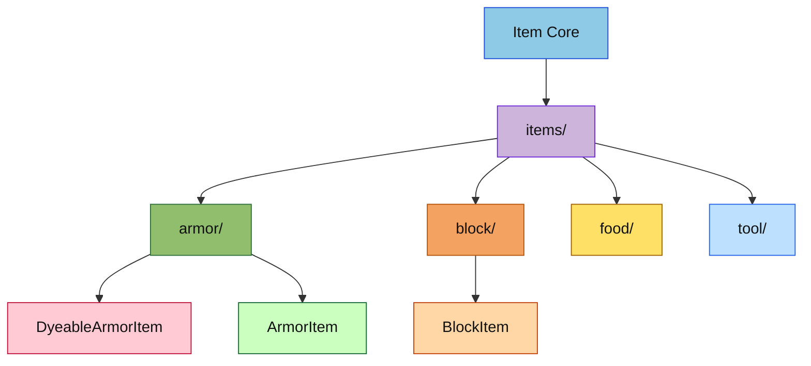

# Item 具体实现目录

本目录保存所有具体物品实现的聚合入口，按物品大类继续拆分到更细的子目录，避免把实现堆在一个目录里。

## 目录结构

```text
items/
├── armor/        # 盔甲物品：ArmorItem、DyeableArmorItem、ElytraItem
├── block/        # 方块物品：各类可放置方块的 Item 实现
├── food/         # 食物物品：可食用 Item 实现
├── tool/         # 工具物品：镐、斧、锹、锄、剑等
├── weapon/       # 武器物品：弓、弩、三叉戟、盾等
├── special/      # 特殊物品：指南针、时钟、钓鱼竿、蛋等
└── README.md     # 本文件
```

## 文件介绍

- `armor/`：负责盔甲穿戴、染色、属性统计和装备槽位适配。
- `block/`：负责方块物品与世界放置交互。
- `food/`：负责食物恢复、饱和度与使用动作。
- `tool/`：负责工具挖掘速度、材质加成和攻击行为。
- `weapon/`、`special/`：预留给尚未完全展开的专用物品子类。

## 模块关系

`items/` 依赖 `item/core/` 提供的 `Item`、`ItemStack` 和注册机制，同时向上层世界、实体、容器和渲染系统暴露具体行为。具体物品实现不应反向耦合到同级目录中的其他实现类，跨类协作应尽量回到核心抽象层。

## 整体职责

这个目录的职责是承载“可实例化的物品行为”，把共性留在 `item/core/`，把领域逻辑拆分到各个子目录，确保新增物品类型时不会污染核心接口。

## 输入 / 输出

输入通常是 `ItemProperties`、`ItemStack`、`Player`、`IWorld` 和各类上下文对象；输出通常是动作结果、物品堆变化、属性修正、状态写回或容器交互结果。

## 依赖项

内部依赖主要是 `item/core/`、`item/armor/`、`item/tier/`、`entity/` 和 `world/`。外部依赖主要是 C++20 标准库，以及少量第三方库用于序列化和测试。

## 使用方法

新增物品实现时，优先在对应子目录下创建头文件和源文件，再在 `Items.hpp/cpp` 中注册。例如盔甲类物品应放在 `items/armor/`，而不是直接放进 `items/` 根目录。

## 容易踩的坑

- 不要把所有物品都塞到一个目录里，这会让注册、测试和导航迅速失控。
- 不要让具体物品直接依赖另一个具体物品的实现细节，应该回退到共享抽象。
- 新增物品后如果涉及测试或注册表，必须同步更新 `Items::initialize()` 和相关单测。

## 测试用例

- `tests/common/test_item.cpp`：物品注册、材质和基础物品行为。
- `tests/common/test_inventory.cpp`：盔甲槽位、装备和右键穿戴行为。
- `tests/common/item/ItemStackJsonTest.cpp`：物品堆序列化和自定义数据回环。

## Mermaid 图表


