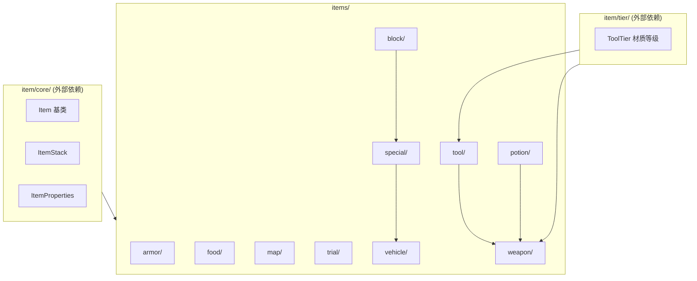

# Item 具体实现目录

本目录保存所有具体物品实现的聚合入口，按物品大类继续拆分到更细的子目录，避免把实现堆在一个目录里。

## 目录结构

```text
items/
├── BannerPatternItem.hpp/cpp   # 旗帜图案物品
├── README.md                   # 本文件
├── armor/                      # 盔甲物品
│   ├── ArmorItem.hpp/cpp       # 盔甲基类（防御值、韧性、装备槽位）
│   ├── DyeableArmorItem.hpp/cpp # 可染色盔甲（皮革套装）
│   ├── ElytraItem.hpp/cpp      # 鞘翅（滑翔飞行）
│   └── HorseArmorItem.hpp/cpp  # 马铠（马匹装备）
├── block/                      # 方块物品
│   ├── BannerItem.hpp/cpp      # 旗帜物品
│   ├── BlockItem.hpp/cpp       # 方块物品基类（放置逻辑、NBT数据传递）
│   ├── BlockItemRegistry.hpp/cpp # 方块物品注册表
│   └── WallOrFloorItem.hpp/cpp # 墙上/地面放置物品（按钮、压力板等）
├── food/                       # 食物物品
│   ├── ChorusFruitItem.hpp/cpp # 紫颂果（传送效果）
│   ├── FoodItem.hpp/cpp        # 食物基类（饥饿值、饱和度、狼食性）
│   ├── GoldenAppleItem.hpp/cpp # 金苹果（增益效果）
│   └── HoneyBottleItem.hpp/cpp # 蜂蜜瓶（解毒、可饮用）
├── map/                        # 地图物品
│   ├── AbstractMapItem.hpp/cpp # 地图物品抽象基类
│   ├── EmptyMapItem.hpp/cpp    # 空地图
│   └── FilledMapItem.hpp/cpp   # 已填充地图（渲染、更新、玩家标记）
├── potion/                     # 药水物品
│   ├── GlassBottleItem.hpp/cpp # 玻璃瓶（装水、装蜂蜜）
│   ├── LingeringPotionItem.hpp/cpp # 滞留药水（区域云雾效果）
│   ├── PotionItem.hpp/cpp      # 饮用药水
│   ├── SplashPotionItem.hpp/cpp # 喷溅药水
│   └── ThrowablePotionItem.hpp/cpp # 投掷药水基类
├── special/                    # 特殊物品
│   ├── BoneMealItem.hpp/cpp    # 骨粉（催熟、染色）
│   ├── BucketItem.hpp/cpp      # 桶（装水、岩浆、鱼）
│   ├── EnchantedBookItem.hpp/cpp # 附魔书
│   ├── FishBucketItem.hpp/cpp  # 鱼桶（桶装鱼实体）
│   ├── FlintAndSteelItem.hpp/cpp # 打火石
│   ├── HoneycombItem.hpp/cpp   # 蜜脾（涂蜡铜方块、阻止氧化）
│   ├── MilkBucketItem.hpp/cpp  # 奶桶（清除效果）
│   ├── MusicDiscItem.hpp/cpp   # 音乐唱片（放入唱片机播放，比较器信号1-15）
│   ├── NameTagItem.hpp/cpp     # 命名牌
│   ├── OnAStickItem.hpp/cpp    # 钓鱼竿类物品基类
│   ├── SaddleItem.hpp/cpp      # 鞍
│   ├── SpawnEggItem.hpp/cpp    # 刷怪蛋
│   └── StickItems.hpp/cpp      # 各类棍状物品（胡萝卜钓竿等）
├── tool/                       # 工具物品
│   ├── AxeItem.hpp/cpp         # 斧（砍伐、攻击、除蜡）
│   ├── HoeItem.hpp/cpp         # 锄（耕地）
│   ├── PickaxeItem.hpp/cpp     # 镐（挖掘石质方块）
│   ├── ShearsItem.hpp/cpp      # 剪刀（剪羊毛、树叶）
│   ├── ShovelItem.hpp/cpp      # 锹（挖掘土质方块）
│   ├── SwordItem.hpp/cpp       # 剑（近战武器）
│   ├── TieredItem.hpp/cpp      # 材质分级物品基类
│   ├── ToolItem.hpp/cpp        # 工具基类
│   └── ToolType.hpp/cpp        # 工具类型枚举
├── trial/                      # 试炼密室物品（1.21+）
│   ├── MaceItem.hpp/cpp        # 重锤（重击伤害）
│   ├── OminousBottleItem.hpp/cpp # 不祥之瓶
│   ├── OminousTrialKeyItem.hpp/cpp # 不祥试炼钥匙
│   ├── TrialChamberSpecialItems.hpp # 试炼密室物品汇总头文件
│   ├── TrialKeyItem.hpp/cpp    # 试炼钥匙
│   └── WindChargeItem.hpp/cpp  # 风弹（右键投掷+冷却，产生风爆击退）
├── vehicle/                    # 载具物品
│   ├── BoatItem.hpp/cpp        # 船（水域交通工具）
│   └── MinecartItem.hpp/cpp    # 矿车（轨道交通工具）
└── weapon/                     # 武器物品
    ├── ArrowItem.hpp/cpp       # 箭矢
    ├── BowItem.hpp/cpp         # 弓
    ├── CrossbowItem.hpp/cpp    # 弩（多箭、烟花）
    ├── FishingRodItem.hpp/cpp  # 钓鱼竿
    ├── ShieldItem.hpp/cpp      # 盾牌（格挡伤害）
    ├── ThrowableItem.hpp/cpp   # 投掷物基类
    ├── ThrowableItems.hpp/cpp  # 各类投掷物（雪球、鸡蛋等）
    ├── TippedArrowItem.hpp/cpp # 药水箭
    └── TridentItem.hpp/cpp     # 三叉戟（近战+投掷）
```

## 内部模块关系



各子目录间的依赖极少，具体物品实现应通过 `item/core/` 的抽象层协作，避免直接耦合同级实现。

## 上下游外部依赖关系

**依赖上游（本目录依赖）：**
- `item/core/` - Item 基类、ItemStack、ItemProperties、注册机制
- `item/tier/` - ToolTier 材质等级定义（工具、武器使用）
- `entity/` - 实体交互、玩家、物品实体
- `world/` - 方块放置、世界交互
- `block/` - BlockItem 关联的方块定义
- `util/math/` - 随机数、数学工具

**被下游依赖（依赖本目录）：**
- `server/` - 服务端物品注册、玩家物品管理
- `client/` - 客户端物品渲染、模型加载
- `recipe/` - 配方系统引用物品类型
- `inventory/` - 容器、物品栏管理

## 容易踩的坑

- 不要把所有物品都塞到一个目录里，这会让注册、测试和导航迅速失控
- 不要让具体物品直接依赖另一个具体物品的实现细节，应该回退到 `item/core/` 共享抽象
- 新增物品后必须同步更新 `Items::initialize()` 注册表
- BlockItem 放置时会排除放置者实体进行碰撞检查，无碰撞箱方块（水、空气）跳过此检查
- BlockItem 的 `applyBlockStateFromNBT` 和 `setTileEntityNBT` 已实现，分别处理物品 NBT 中的 BlockStateTag 和 BlockEntityTag 传递到放置的方块/方块实体
- 投掷类物品（药水、箭矢、雪球等）都继承自 ThrowableItem 或 ThrowablePotionItem，不要重复实现投掷逻辑
- **新增木材变体物品时** 需要同时更新三处：`Items.hpp`（静态指针声明）、`Items.cpp`（静态指针定义+注册调用）、`BlockItemRegistry.cpp`（方块→物品映射）。告示牌使用 `WallOrFloorItem`（站立+墙壁双变体），在 `Items._registerSigns()` 中注册；普通方块物品使用 `registerBlockBackedItem` 或 `registerSimpleBlock`
- **BlockItemRegistry 初始化顺序**：必须在 `Items::initialize()` 之后调用，因为 `registerSimpleBlock` 和 `registerWallSign` lambda 会查找 `ItemRegistry` 中已注册的物品。顺序错误会导致物品映射缺失
- **HoneycombItem 涂蜡映射使用 "construct on first use" 模式**：`getWaxablesMap()` 和 `getWaxOffMap()` 是函数局部静态变量，首次调用时初始化。必须确保 `VanillaBlocks` 已初始化后再调用，否则所有铜方块指针为 nullptr，映射表将为空
- **HoneycombItem::getWaxedOff 供 AxeItem 使用**：AxeItem 除蜡逻辑调用此静态方法，无需实例化 HoneycombItem
