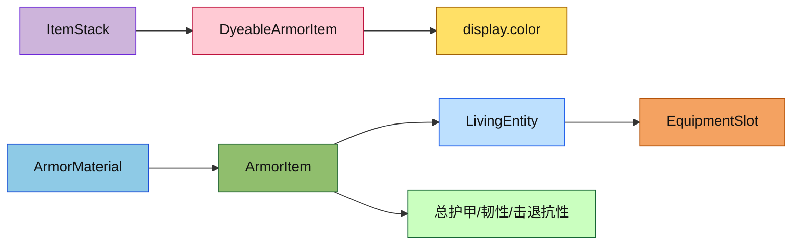

# 盔甲物品目录

本目录保存所有盔甲相关的具体物品实现，负责装备槽位、属性统计、染色、渲染颜色和右键穿戴逻辑。

## 目录结构

```text
armor/
├── ArmorItem.hpp/cpp        # 盔甲基类：防御值、韧性、击退抗性、穿戴逻辑
├── DyeableArmorItem.hpp/cpp # 可染色盔甲：display.color 读写
├── ElytraItem.hpp/cpp       # 鞘翅
├── HorseArmorItem.hpp/cpp   # 马铠：护甲值、材质路径
└── README.md                # 本文件
```

## 文件介绍

### ArmorItem

盔甲物品的公共基类，负责：
- 根据材质和槽位返回防御、韧性和击退抗性
- 右键尝试装备到对应槽位
- 汇总实体当前穿戴的总护甲值

### DyeableArmorItem

皮革盔甲的染色实现，使用 `ItemStack` 的自定义标签保存 `display.color`，并提供读取、设置和清除颜色的接口。

### ElytraItem

鞘翅物品，虽然也属于盔甲相关类别，但行为更接近功能物品，因此单独保留。

### HorseArmorItem

马铠物品，用于装备马类实体（仅限 HorseEntity）提供护甲值。马铠有四种类型：
- 皮革马铠：+3 护甲
- 铁马铠：+5 护甲
- 金马铠：+7 护甲
- 钻石马铠：+11 护甲

**核心方法**：
- `getArmorValue()` - 获取护甲值
- `getTexturePath()` - 获取马铠材质路径（用于渲染）

**马铠判断**：

```cpp
// 在 HorseEntity 中判断是否为有效马铠
bool HorseEntity::isValidArmorForSlot(const ItemStack& item) const
{
    const Item* itemPtr = item.getItem();
    if (itemPtr == nullptr) {
        return false;
    }
    return dynamic_cast<const item::items::HorseArmorItem*>(itemPtr) != nullptr;
}
```

## 模块关系

`ArmorItem` 依赖 `armor/ArmorMaterial.hpp` 提供材质数值，依赖 `LivingEntity` 和 `EquipmentSlot` 读取装备槽位。`DyeableArmorItem` 在此基础上进一步依赖 `ItemStack` 的自定义标签能力。上层的背包槽位、右键使用和渲染系统都会消费这些结果。

## 整体职责

这个目录的职责是把“穿戴型物品”的行为收敛到一起，既保证物理属性和材质数据一致，又让染色、显示和交互逻辑保持可维护。

## 输入 / 输出

输入包括 `ItemStack`、`ArmorSlot`、`ArmorMaterial` 和 `LivingEntity`；输出包括总护甲值、总韧性、总击退抗性、装备结果以及颜色数据。

## 依赖项

内部依赖主要是 `item/core/`、`item/armor/ArmorMaterial.hpp`、`entity/core/LivingEntity.hpp`、`entity/inventory/PlayerInventory.hpp` 和 `world/`。外部依赖主要是 C++20 标准库与 `nlohmann::json`。

## 使用方法

创建盔甲物品时，先根据材质和槽位设置最大耐久，再在注册表中注册对象：

```cpp
auto& leatherHelmet = ItemRegistry::instance().registerItem<item::items::DyeableArmorItem>(
    ResourceLocation("minecraft:leather_helmet"),
    item::armor::ArmorMaterials::LEATHER,
    item::armor::ArmorSlot::Head,
    ItemProperties().maxDamage(item::armor::ArmorMaterials::LEATHER.getDurability(item::armor::ArmorSlot::Head))
);
```

需要染色时，通过 `DyeableArmorItem::setColor(stack, color)` 写入颜色，再交由 JSON 或网络序列化保存。

## 容易踩的坑

- 不要把颜色直接写到别的字段里，统一使用 `display.color`。
- 清除颜色后要把空掉的 `display` 子标签一并删除，否则物品堆比较会认为元数据不同。
- 汇总装备属性时只应该看四个护甲槽，不要把主手、副手混进去。
- `ArmorItem` 的总属性统计应忽略非盔甲物品，避免把无关物品算进防御值。

## 测试用例

- `tests/common/test_inventory.cpp`：装备槽匹配、总属性统计和染色盔甲颜色回环。
- `tests/common/item/ItemStackJsonTest.cpp`：自定义标签 JSON round-trip。
- `tests/common/test_item.cpp`：材质修复材料与装备音效。

## Mermaid 图表


