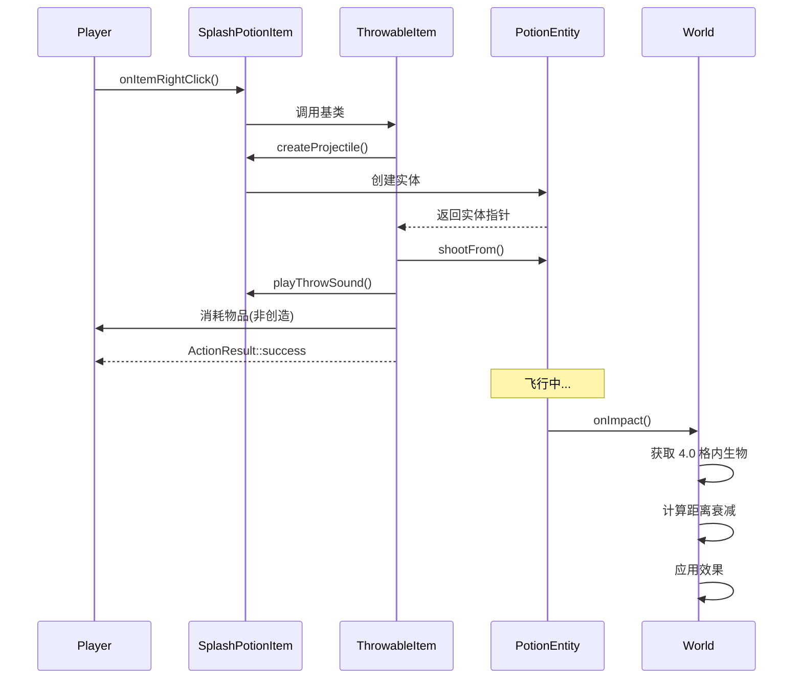

# 药水物品模块

本目录包含所有药水相关物品的实现。

## 文件结构

```
potion/
├── GlassBottleItem.hpp/cpp     # 玻璃瓶物品
├── PotionItem.hpp/cpp          # 普通药水物品（饮用型）
├── ThrowablePotionItem.hpp/cpp # 可投掷药水基类
├── SplashPotionItem.hpp/cpp    # 喷溅药水物品
├── LingeringPotionItem.hpp/cpp # 滞留药水物品
└── README.md                   # 本文件
```

## 类继承关系

```
Item
└── ThrowableItem (投掷物品基类)
    └── ThrowablePotionItem (可投掷药水基类)
        ├── SplashPotionItem (喷溅药水)
        └── LingeringPotionItem (滞留药水)

Item
└── PotionItem (饮用型药水)

Item
└── GlassBottleItem (玻璃瓶)
```

## 已实现的物品

### ThrowablePotionItem（可投掷药水基类）

提供喷溅药水和滞留药水的共享功能：

**共享功能：**
- `hasEffect()` - 检测药水是否有效果（用于附魔光效）
- `getTranslationKey()` - 生成带药水类型的翻译键
- `playThrowSound()` - 播放投掷音效（ENTITY_SPLASH_POTION_THROW）
- `getThrowVelocity()` - 返回 0.5（MC 1.16.5 药水投掷速度）
- `getThrowInaccuracy()` - 返回 0.0（无偏移）

**子类需要实现：**
- `createProjectile()` - 创建药水实体
- `getBaseTranslationKey()` - 基础翻译键
- `getEffectTranslationKeyPrefix()` - 带效果后缀的翻译键前缀

### SplashPotionItem（喷溅药水）

投掷后在落点产生喷溅效果，影响半径 4.0 格内的生物。

**MC 1.16.5 特性：**
- 投掷速度: 0.5
- 影响半径: 4.0 格
- 效果强度随距离衰减
- 默认堆叠数: 1（相同药水类型才可堆叠）

**关键方法：**
- `createProjectile()` - 创建 PotionEntity，设置 `lingering = false`

### LingeringPotionItem（滞留药水）

投掷后产生滞留区域效果云，持续约 30 秒。

**MC 1.16.5 特性：**
- 投掷速度: 0.5
- 滞留云持续时间: 30 秒
- 滞留云半径: 3.0 格
- 每秒应用一次效果
- 默认堆叠数: 1

**关键方法：**
- `createProjectile()` - 创建 PotionEntity，设置 `lingering = true`

**待实现：**
- `AreaEffectCloudEntity` - 滞留云实体（目前 PotionEntity 中有 TODO 标记）

### PotionItem（普通药水）

可饮用的药水，饮用后应用效果到玩家。

**MC 1.16.5 特性：**
- 饮用时间: 32 tick
- 使用动作: Drink
- 使用后返回玻璃瓶
- 默认堆叠数: 1

### GlassBottleItem（玻璃瓶）

用于装水的空容器。

**MC 1.16.5 特性：**
- 右键水源方块装水
- 可用于酿造台
- 默认堆叠数: 64

## 投掷药水流程



## 依赖关系

```
ThrowablePotionItem
├── ThrowableItem (基类)
├── PotionUtils (药水工具)
├── SoundEvents (音效)
└── Random (随机数)

SplashPotionItem
├── ThrowablePotionItem (基类)
├── PotionEntity (投掷实体)
├── Player
└── IWorld

LingeringPotionItem
├── ThrowablePotionItem (基类)
├── PotionEntity (投掷实体)
├── Player
└── IWorld
```

## 测试覆盖

- `tests/common/item/NewItemTest.cpp` - 药水物品测试
  - SplashPotionItem: 注册检查、堆叠数
  - LingeringPotionItem: 注册检查、堆叠数

## 参考

- MC 1.16.5: `net.minecraft.item.SplashPotionItem`
- MC 1.16.5: `net.minecraft.item.LingeringPotionItem`
- MC 1.16.5: `net.minecraft.item.PotionItem`
- MC 1.16.5: `net.minecraft.entity.projectile.PotionEntity`
- MC 1.16.5: `net.minecraft.entity.AreaEffectCloudEntity`
