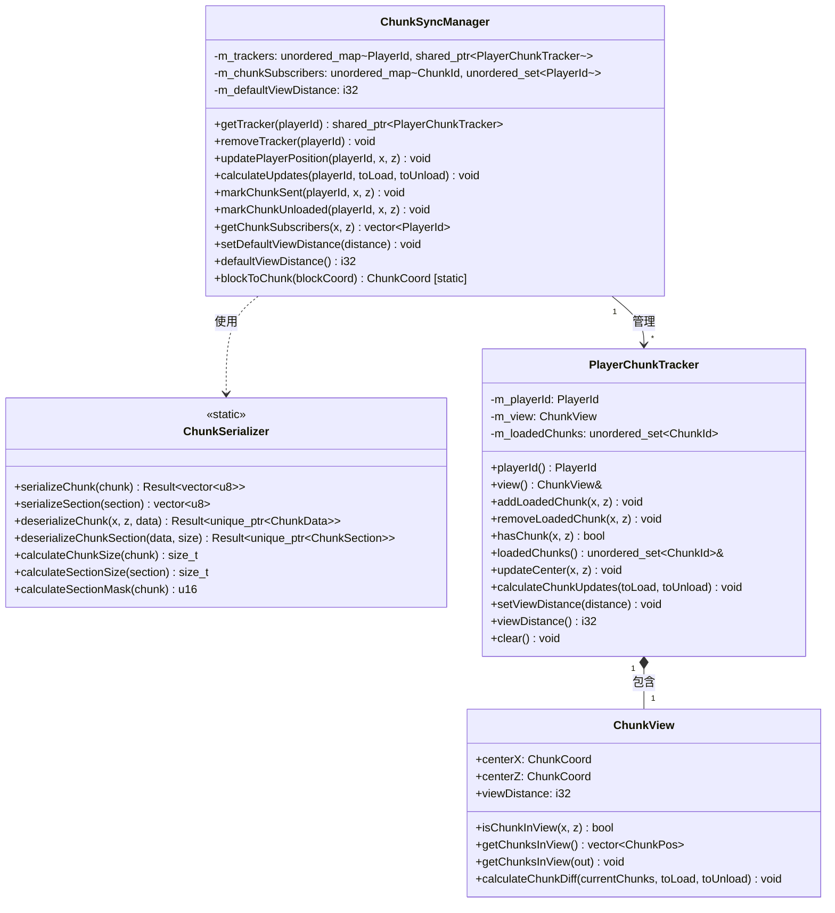
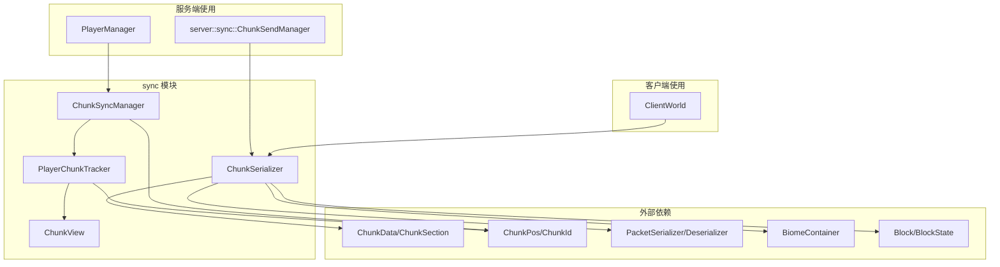

# 网络同步模块 (Network Sync Module)

本模块提供Minecraft服务端与客户端之间的区块同步功能，包括区块数据序列化、玩家视距管理和区块跟踪。

## 目录结构

```
src/common/network/sync/
├── Sync.hpp           # 统一头文件（便捷包含）
├── ChunkSync.hpp      # 区块同步相关类定义
└── ChunkSync.cpp      # 区块同步相关类实现
```

## 文件详解

### Sync.hpp

**职责**: 统一头文件，提供便捷的模块包含入口。

**内容**:
```cpp
#include "ChunkSync.hpp"
```

只需要包含此文件即可使用整个同步模块。

---

### ChunkSync.hpp / ChunkSync.cpp

**职责**: 定义和实现区块同步的核心类，是模块的主要组成部分。

#### 类一览



#### ChunkSerializer - 区块序列化器

**职责**: 负责区块数据的二进制序列化与反序列化，用于网络传输。

**主要方法**:

| 方法 | 说明 |
|------|------|
| `serializeChunk()` | 将完整区块数据序列化为二进制格式 |
| `serializeSection()` | 将单个区块段（16x16x16）序列化 |
| `deserializeChunk()` | 从二进制数据重建区块 |
| `deserializeChunkSection()` | 从二进制数据重建区块段 |
| `calculateChunkSize()` | 计算序列化后的区块大小 |
| `calculateSectionSize()` | 计算序列化后的区块段大小 |
| `calculateSectionMask()` | 计算区块段位掩码（标识哪些段非空） |

**序列化格式**:

```
区块数据格式:
┌──────────────────────────────────────────────────────┐
│ 区块X坐标 (i32)                                       │
│ 区块Z坐标 (i32)                                       │
│ 区块段位掩码 (u16)                                    │
│ 高度图 (256 bytes)                                   │
│ 生物群系数据 (变长)                                   │
│ ┌──────────────────────────────────────────────────┐ │
│ │ 区块段数据 (每个非空段):                           │ │
│ │   - 段大小 (u16)                                  │ │
│ │   - 非空方块数 (u16)                              │ │
│ │   - 方块状态ID (4096 * u32)                       │ │
│ │   - 天空光照 (2048 bytes, NibbleArray)            │ │
│ │   - 方块光照 (2048 bytes, NibbleArray)            │ │
│ └──────────────────────────────────────────────────┘ │
└──────────────────────────────────────────────────────┘
```

#### ChunkView - 区块视图

**职责**: 管理玩家的视距范围，计算哪些区块需要加载/卸载。

**核心属性**:

| 属性 | 类型 | 说明 |
|------|------|------|
| `centerX` | `ChunkCoord` | 视距中心X坐标（区块坐标） |
| `centerZ` | `ChunkCoord` | 视距中心Z坐标（区块坐标） |
| `viewDistance` | `i32` | 视距半径（区块数），默认10 |

**核心方法**:

- `isChunkInView(x, z)`: 判断指定区块是否在视距内
- `getChunksInView()`: 获取视距内所有区块坐标
- `calculateChunkDiff()`: 计算区块差异（需要加载/卸载的区块）

**视距计算**:
```
视距 n 表示以玩家为中心，半径 n 的正方形区域
区块数量 = (2n + 1)²

例如：视距10 = 21×21 = 441个区块
```

#### PlayerChunkTracker - 玩家区块跟踪器

**职责**: 跟踪单个玩家已加载的区块，管理玩家的视距状态。

**核心功能**:

1. **已加载区块管理**:
   - 维护玩家已加载区块的集合
   - 支持添加/移除/查询区块

2. **视距更新**:
   - 更新视距中心
   - 计算区块加载/卸载列表

3. **视距控制**:
   - 设置视距（范围限制：2-32）

**使用示例**:
```cpp
PlayerChunkTracker tracker(playerId);
tracker.setViewDistance(10);
tracker.updateCenter(5, 5);  // 移动到区块(5,5)

std::vector<ChunkPos> toLoad, toUnload;
tracker.calculateChunkUpdates(toLoad, toUnload);
// toLoad: 需要发送给玩家的区块
// toUnload: 需要从玩家卸载的区块
```

#### ChunkSyncManager - 区块同步管理器

**职责**: 管理所有玩家的区块同步，维护区块到玩家的订阅关系。

**核心功能**:

1. **玩家跟踪器管理**:
   - 创建/获取/移除玩家跟踪器
   - 自动分配默认视距

2. **位置更新**:
   - 根据玩家位置更新视距中心
   - 自动计算区块变化

3. **区块订阅管理**:
   - 记录哪些玩家订阅了哪些区块
   - 支持区块广播（向所有订阅者发送）

**使用示例**:
```cpp
ChunkSyncManager manager;
manager.setDefaultViewDistance(10);

// 玩家连接
manager.updatePlayerPosition(playerId, 100.0, 200.0);

// 计算需要加载的区块
std::vector<ChunkPos> toLoad, toUnload;
manager.calculateUpdates(playerId, toLoad, toUnload);

// 标记区块已发送
manager.markChunkSent(playerId, 10, 20);

// 查询区块订阅者
auto subscribers = manager.getChunkSubscribers(10, 20);

// 玩家断开连接
manager.removeTracker(playerId);
```

## 模块关系图



## 整体职责

本模块负责客户端-服务端之间区块数据同步的核心逻辑：

1. **序列化**: 将区块数据转换为网络传输格式
2. **视距管理**: 计算玩家视距范围内的区块
3. **跟踪管理**: 跟踪每个玩家已加载的区块
4. **订阅关系**: 维护区块→玩家的映射，支持广播

## 输入与输出

### 输入

| 输入类型 | 说明 |
|----------|------|
| `ChunkData` | 待序列化的区块数据 |
| `PlayerId` | 玩家标识符 |
| 区块坐标 | 区块位置信息 |
| 玩家位置 | 用于计算视距中心 |

### 输出

| 输出类型 | 说明 |
|----------|------|
| `std::vector<u8>` | 序列化后的区块数据 |
| 区块加载列表 | 需要发送给玩家的区块 |
| 区块卸载列表 | 需要从玩家卸载的区块 |
| 订阅者列表 | 订阅某区块的所有玩家 |

## 依赖项

### 内部依赖

```cpp
#include "../../world/chunk/ChunkData.hpp"      // ChunkData, ChunkSection
#include "../../world/chunk/ChunkPos.hpp"       // ChunkPos, ChunkCoord, ChunkId
#include "../packet/ProtocolPackets.hpp"        // PacketSerializer, PacketDeserializer
#include "../../core/Result.hpp"                // Result<T>
```

### 间接依赖

- `BiomeContainer`: 生物群系序列化
- `Block`/`BlockState`: 方块状态ID查询
- `NibbleArray`: 光照数据存储

## 使用方法

### 服务端使用

```cpp
#include "common/network/sync/ChunkSync.hpp"
#include "server/core/PlayerManager.hpp"

// 在 PlayerManager 中已集成 ChunkSyncManager
PlayerManager playerManager;
playerManager.setConfig(config);  // 自动设置默认视距

// 玩家加入
auto* playerData = playerManager.addPlayer(playerId, username, connection);
auto& syncManager = playerManager.chunkSyncManager();

// 更新玩家位置
syncManager.updatePlayerPosition(playerId, x, z);

// 计算区块更新
std::vector<ChunkPos> toLoad, toUnload;
syncManager.calculateUpdates(playerId, toLoad, toUnload);

// 发送区块后标记
syncManager.markChunkSent(playerId, chunkX, chunkZ);

// 区块卸载
syncManager.markChunkUnloaded(playerId, chunkX, chunkZ);

// 玩家离开
playerManager.removePlayer(playerId);
```

### 客户端使用

```cpp
#include "common/network/sync/ChunkSync.hpp"

// 接收服务端区块数据
auto result = ChunkSerializer::deserializeChunk(x, z, packetData);
if (result.success()) {
    auto chunkData = result.value();
    world->loadChunk(std::move(chunkData));
}
```

### 区块序列化

```cpp
#include "common/network/sync/ChunkSync.hpp"

// 序列化区块
auto result = ChunkSerializer::serializeChunk(chunkData);
if (result.success()) {
    const auto& buffer = result.value();
    // 发送 buffer 到客户端
}

// 反序列化区块
auto result = ChunkSerializer::deserializeChunk(x, z, buffer);
if (result.success()) {
    auto chunkData = result.value();
    // 使用 chunkData
}
```

## 容易踩的坑

### 1. 视距范围限制

```cpp
// 错误：视距范围是 2-32，超出范围会被 clamp
tracker.setViewDistance(1);   // 实际设置为 2
tracker.setViewDistance(100); // 实际设置为 32

// 正确：使用有效范围内的值
tracker.setViewDistance(10);  // 正常
```

### 2. 区块坐标转换

```cpp
// 注意：blockToChunk 使用 floor，负坐标向下取整
ChunkSyncManager::blockToChunk(15.9)   // = 0
ChunkSyncManager::blockToChunk(16.0)   // = 1
ChunkSyncManager::blockToChunk(-0.1)   // = -1  (不是 0!)
ChunkSyncManager::blockToChunk(-16.0)  // = -1
ChunkSyncManager::blockToChunk(-16.1)  // = -2
```

### 3. 反序列化坐标验证

```cpp
// 反序列化会验证坐标是否匹配
auto result = ChunkSerializer::deserializeChunk(100, 200, data);
// 如果 data 中的坐标不是 (100, 200)，将返回错误

// 正确：使用序列化时的坐标
auto serializeResult = ChunkSerializer::serializeChunk(chunk);
auto x = chunk.x();
auto z = chunk.z();
auto deserializeResult = ChunkSerializer::deserializeChunk(x, z, serializeResult.value());
```

### 4. 区块订阅者管理

```cpp
// 错误：只调用 markChunkSent 但忘记在玩家离开时清理
manager.markChunkSent(playerId, x, z);
// 玩家离开时必须调用 removeTracker 或 markChunkUnloaded
manager.removeTracker(playerId);  // 会自动清理所有订阅

// 或者逐个卸载
manager.markChunkUnloaded(playerId, x, z);
```

### 5. 光照数据大小

```cpp
// 序列化区块段时，光照数据固定占用 4096 字节
// 天空光照: 2048 bytes (NibbleArray)
// 方块光照: 2048 bytes (NibbleArray)
// 每个方块用 4 bits 存储 (0-15 级光照)

// 计算段大小时需包含光照数据
size_t sectionSize = 2 + ChunkSection::VOLUME * 4 + 2048 + 2048;  // = 18434 bytes
```

### 6. 线程安全

```cpp
// ChunkSyncManager 本身不是线程安全的
// 在多线程环境中使用时需要外部同步

// 错误：多线程直接访问
// 线程1
manager.markChunkSent(playerId, x, z);
// 线程2
manager.calculateUpdates(playerId, toLoad, toUnload);  // 数据竞争!

// 正确：使用锁保护
std::mutex syncMutex;
{
    std::lock_guard lock(syncMutex);
    manager.markChunkSent(playerId, x, z);
}
```

### 7. 空区块段处理

```cpp
// calculateSectionMask 只包含非空区块段
u16 mask = ChunkSerializer::calculateSectionMask(chunk);
// 空段（所有方块都是空气）不会包含在位掩码中
// 序列化时空段不会被写入

// 反序列化时，未设置的段不会创建
// 检查段是否存在：
if (chunk.hasSection(sectionY)) {
    const ChunkSection* section = chunk.getSection(sectionY);
}
```

## 测试用例

测试文件位于 `tests/common/test_chunksync.cpp`，包含以下测试套件：

### ChunkView 测试

| 测试用例 | 说明 |
|----------|------|
| `IsChunkInView` | 测试区块是否在视距内的判断 |
| `GetChunksInView` | 测试获取视距内所有区块 |
| `CalculateChunkDiff` | 测试区块差异计算 |
| `NegativeCoordinates` | 测试负坐标处理 |
| `LargeViewDistance` | 测试最大视距边界 |
| `ZeroViewDistance` | 测试零视距特殊情况 |
| `GetChunksInViewCount` | 测试区块数量计算 |
| `GetChunksInViewOffsetCenter` | 测试偏移中心的视距 |
| `CalculateChunkDiffPartialOverlap` | 测试部分重叠的区块差异 |
| `CalculateChunkDiffMoveAway` | 测试玩家移动远离的区块差异 |
| `CalculateChunkDiffSamePosition` | 测试同一位置的区块差异（无变化） |
| `ViewDistanceChangeEffect` | 测试视距变化的影响 |

### PlayerChunkTracker 测试

| 测试用例 | 说明 |
|----------|------|
| `Construction` | 测试构造函数和初始状态 |
| `AddRemoveChunk` | 测试区块添加/移除 |
| `UpdateCenter` | 测试视距中心更新 |
| `SetViewDistance` | 测试视距设置和边界 |
| `CalculateChunkUpdates` | 测试区块更新计算 |
| `Clear` | 测试清空所有区块 |
| `MultipleChunkOperations` | 测试大量区块操作 |
| `DuplicateOperations` | 测试重复添加/移除的幂等性 |
| `NegativeChunkCoordinates` | 测试负区块坐标 |
| `ViewDistanceBoundaryValues` | 测试视距边界值 |
| `CalculateChunkUpdatesWithExistingChunks` | 测试已有区块时的更新计算 |
| `CalculateChunkUpdatesPlayerMove` | 测试玩家移动时的更新 |
| `ClearTracker` | 测试大规模清理 |
| `LargeCoordinateValues` | 测试大坐标值 |

### ChunkSyncManager 测试

| 测试用例 | 说明 |
|----------|------|
| `GetTracker` | 测试获取/创建跟踪器 |
| `RemoveTracker` | 测试移除跟踪器 |
| `UpdatePlayerPosition` | 测试位置更新和坐标转换 |
| `MarkChunkSent` | 测试标记区块已发送 |
| `MarkChunkUnloaded` | 测试标记区块已卸载 |
| `MultiplePlayers` | 测试多玩家场景 |
| `CalculateUpdates` | 测试更新计算 |
| `BlockToChunk` | 测试方块坐标到区块坐标转换 |
| `MultiplePlayersSameChunk` | 测试多玩家同区块 |
| `PlayerDisconnectionCleanup` | 测试玩家断开连接的清理 |
| `CalculateUpdatesForMultiplePlayers` | 测试多玩家独立更新 |
| `ViewDistanceChange` | 测试视距变化对玩家的影响 |
| `BlockToChunkEdgeCases` | 测试坐标转换边界情况 |
| `UpdatePlayerPositionTriggersCenterChange` | 测试位置变化触发中心更新 |
| `ChunkSentAndUnloadSequence` | 测试发送/卸载序列 |
| `ReconnectPlayer` | 测试玩家重连 |
| `GetNonExistentTracker` | 测试获取不存在的跟踪器 |
| `NonExistentChunkSubscribers` | 测试不存在的区块订阅者 |

### ChunkSerializer 测试

| 测试用例 | 说明 |
|----------|------|
| `SerializeEmptyChunk` | 测试空区块序列化 |
| `SerializeChunkWithBlocks` | 测试有方块的区块序列化 |
| `DeserializeChunk` | 测试区块反序列化 |
| `DeserializeChunkPreservesBiomeData` | 测试生物群系数据保留 |
| `SectionMask` | 测试区块段位掩码计算 |
| `SectionSize` | 测试区块段大小计算 |
| `SerializeDeserializeConsistency` | 测试序列化/反序列化一致性 |
| `SerializeChunkWithAir` | 测试空气区块序列化 |
| `EmptySectionMask` | 测试空区块的位掩码 |
| `MultipleSectionsMask` | 测试多段区块的位掩码 |
| `DeserializeInvalidData` | 测试无效数据处理 |
| `ChunkSizeCalculation` | 测试区块大小计算 |
| `SerializeDeserializeLightData` | 测试光照数据序列化 |
| `LightDataNibbleArrayFormat` | 测试NibbleArray格式光照 |
| `MultipleSectionsLightData` | 测试多段光照数据 |
| `LightDataSectionSizeCalculation` | 测试光照数据大小计算 |

**测试统计**: 共 60+ 测试用例，覆盖所有核心功能和边界情况。

## 性能考虑

1. **区块差异计算**: 使用 `std::unordered_set` 进行 O(n) 的差异计算
2. **内存预分配**: `getChunksInView()` 提供输出参数版本避免内存分配
3. **区块订阅查询**: 使用哈希表实现 O(1) 的订阅者查询
4. **序列化缓冲区**: 序列化时预分配足够大的缓冲区避免重新分配

## 相关模块

- **server/sync/ChunkSendManager**: 服务端区块发送管理，使用本模块的序列化功能
- **server/core/PlayerManager**: 玩家管理器，包含 `ChunkSyncManager` 实例
- **server/world/ServerChunkManager**: 区块生命周期管理，配合同步模块使用
- **client/world/ClientWorld**: 客户端世界，使用本模块的反序列化功能
