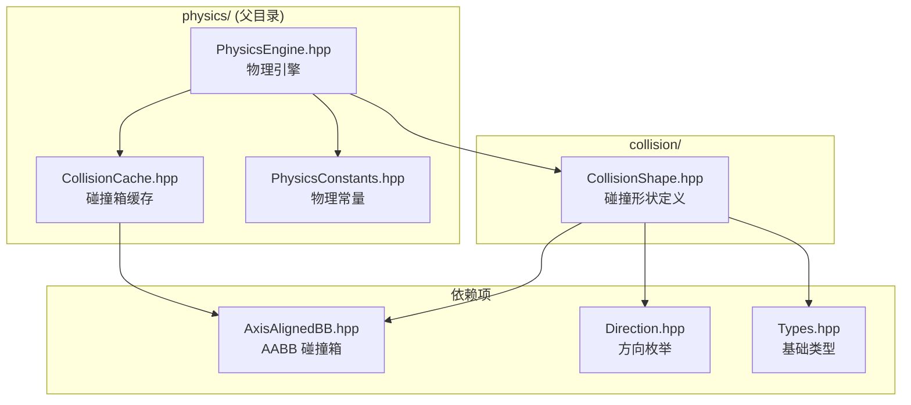

# Collision Module

Minecraft 兼容的碰撞形状系统，提供方块碰撞箱的定义和操作。

## 目录结构

```
collision/
└── CollisionShape.hpp    # 碰撞形状定义（VoxelShape 简化实现）
```

## 文件详解

### CollisionShape.hpp

**职责**：定义方块的碰撞形状，是 MC `VoxelShape` 的简化实现。

#### 形状类型枚举

```cpp
enum class Type : u8 {
    Empty,      // 无碰撞（空气、水、岩浆等）
    FullBlock,  // 完整方块 (0,0,0) -> (1,1,1)
    SimpleBox   // 简单盒（支持多个碰撞箱）
};
```

#### 核心方法

| 方法 | 描述 |
|------|------|
| `empty()` | 创建空形状（无碰撞） |
| `fullBlock()` | 创建完整方块形状 |
| `box(minX, minY, minZ, maxX, maxY, maxZ)` | 创建自定义碰撞盒 |
| `addBox(...)` | 添加额外碰撞盒（用于复杂形状） |
| `isEmpty()` | 检查是否为空形状 |
| `isFullBlock()` | 检查是否为完整方块 |
| `intersects(entityBox, blockX, blockY, blockZ)` | 检测与实体碰撞箱是否相交 |
| `getWorldBoxes(blockX, blockY, blockZ)` | 获取世界坐标碰撞箱列表 |
| `getFaceShape(direction)` | 获取形状在指定方向的面投影（用于光照遮挡检测） |

#### 关键特性

1. **方块本地坐标**：碰撞箱使用 0-1 范围的本地坐标
2. **多碰撞箱支持**：通过 `addBox()` 支持复杂形状（如楼梯、栅栏）
3. **性能优化**：`FullBlock` 类型有专用优化路径
4. **世界坐标转换**：`getWorldBoxes()` 自动转换为世界坐标
5. **面投影支持**：`getFaceShape()` 用于光照遮挡检测

#### 使用示例

```cpp
#include "physics/collision/CollisionShape.hpp"

// 完整方块（石头、泥土等）
auto stone = CollisionShape::fullBlock();

// 空形状（空气、水、岩浆）
auto air = CollisionShape::empty();

// 半砖（下半砖，高度 0.5）
auto slab = CollisionShape::box(0.0f, 0.0f, 0.0f, 1.0f, 0.5f, 1.0f);

// 上半砖
auto upperSlab = CollisionShape::box(0.0f, 0.5f, 0.0f, 1.0f, 1.0f, 1.0f);

// 楼梯（多个碰撞箱组合）
auto stairs = CollisionShape::box(0.0f, 0.0f, 0.0f, 1.0f, 0.5f, 1.0f)
                 .addBox(0.0f, 0.5f, 0.0f, 1.0f, 1.0f, 0.5f);

// 栅栏（细长柱子 + 顶部横梁）
auto fence = CollisionShape::box(0.375f, 0.0f, 0.375f, 0.625f, 1.0f, 0.625f);

// 检测碰撞
AxisAlignedBB entityBox(5.0f, 64.0f, 5.0f, 5.6f, 65.8f, 5.6f);
if (!shape.isEmpty() && shape.intersects(entityBox, blockX, blockY, blockZ)) {
    // 发生碰撞，处理碰撞响应
}

// 获取世界坐标碰撞箱列表
auto worldBoxes = shape.getWorldBoxes(10, 64, 20);
for (const auto& box : worldBoxes) {
    // box 是世界坐标：(10, 64, 20) -> (11, 65, 21) 对于 fullBlock
}
```

---

## 模块关系图



---

## 整体职责

`collision` 子模块专门负责：

1. **碰撞形状抽象**：统一表示各种方块的碰撞形状
2. **碰撞检测**：提供快速相交检测方法
3. **坐标转换**：将方块本地坐标转换为世界坐标
4. **性能优化**：针对常见形状（完整方块、空）提供优化路径

---

## 输入和输出

### 输入

| 输入 | 类型 | 描述 |
|------|------|------|
| 形状类型 | `Type` | Empty / FullBlock / SimpleBox |
| 本地坐标 | `f32` | 0-1 范围的碰撞盒坐标 |
| 实体碰撞箱 | `AxisAlignedBB` | 世界坐标的实体 AABB |
| 方块位置 | `i32` | 方块的世界坐标 |

### 输出

| 输出 | 类型 | 描述 |
|------|------|------|
| 相交结果 | `bool` | 是否与实体碰撞箱相交 |
| 世界碰撞箱 | `std::vector<AxisAlignedBB>` | 世界坐标的碰撞箱列表 |
| 形状属性 | `bool` | isEmpty / isFullBlock |

---

## 依赖项

### 内部依赖

```cpp
#include "../../util/AxisAlignedBB.hpp"  // AABB 碰撞箱
#include "../../util/Direction.hpp"       // 方向枚举（Axis 枚举）
#include "../../core/Types.hpp"           // 基础类型（u8, f32 等）
```

### 外部依赖

- `<vector>` - 存储多个碰撞箱

---

## 与其他模块的关系

### 与 PhysicsEngine 的关系

`CollisionShape` 是 `PhysicsEngine` 的基础组件：

```cpp
// PhysicsEngine 使用 CollisionShape 进行碰撞检测
void PhysicsEngine::getBlockCollisionBoxes(i32 x, i32 y, i32 z,
                                            std::vector<AxisAlignedBB>& boxes) const {
    const BlockState* state = m_world->getBlockState(x, y, z);
    if (!state || state->isAir()) return;

    const CollisionShape& shape = state->getCollisionShape();  // 获取碰撞形状
    if (shape.isEmpty()) return;

    auto worldBoxes = shape.getWorldBoxes(x, y, z);  // 转换为世界坐标
    boxes.insert(boxes.end(), worldBoxes.begin(), worldBoxes.end());
}
```

### 与 Block/BlockState 的关系

方块通过 `BlockState` 提供 `CollisionShape`：

```cpp
class BlockState {
public:
    const CollisionShape& getCollisionShape() const {
        return m_block->getCollisionShape(*this);
    }
};
```

### 与 AxisAlignedBB 的关系

`AxisAlignedBB` 提供实际的碰撞检测算法：

```cpp
// CollisionShape::intersects() 内部调用 AABB::intersects()
bool CollisionShape::intersects(const AxisAlignedBB& entityBox,
                                 i32 blockX, i32 blockY, i32 blockZ) const {
    for (const auto& localBox : m_boxes) {
        AxisAlignedBB worldBox(
            blockX + localBox.minX, blockY + localBox.minY, blockZ + localBox.minZ,
            blockX + localBox.maxX, blockY + localBox.maxY, blockZ + localBox.maxZ
        );
        if (entityBox.intersects(worldBox)) {
            return true;
        }
    }
    return false;
}
```

---

## 使用方法

### 在方块定义中使用

```cpp
// 定义方块碰撞形状
class StoneBlock : public Block {
public:
    CollisionShape getCollisionShape(const BlockState& state) const override {
        return CollisionShape::fullBlock();
    }
};

class WaterBlock : public Block {
public:
    CollisionShape getCollisionShape(const BlockState& state) const override {
        return CollisionShape::empty();  // 水无碰撞
    }
};

class SlabBlock : public Block {
public:
    CollisionShape getCollisionShape(const BlockState& state) const override {
        if (state.get(SlabBlock::TYPE) == SlabType::BOTTOM) {
            return CollisionShape::box(0.0f, 0.0f, 0.0f, 1.0f, 0.5f, 1.0f);
        } else if (state.get(SlabBlock::TYPE) == SlabType::TOP) {
            return CollisionShape::box(0.0f, 0.5f, 0.0f, 1.0f, 1.0f, 1.0f);
        } else {
            return CollisionShape::fullBlock();  // 双半砖
        }
    }
};
```

### 在实体移动中使用

```cpp
// 实体移动时检测碰撞
bool checkBlockCollision(const Vector3& pos, const AxisAlignedBB& entityBox) {
    i32 minX = static_cast<i32>(std::floor(entityBox.minX));
    i32 maxX = static_cast<i32>(std::ceil(entityBox.maxX));
    i32 minY = static_cast<i32>(std::floor(entityBox.minY));
    i32 maxY = static_cast<i32>(std::ceil(entityBox.maxY));
    i32 minZ = static_cast<i32>(std::floor(entityBox.minZ));
    i32 maxZ = static_cast<i32>(std::ceil(entityBox.maxZ));

    for (i32 x = minX; x <= maxX; ++x) {
        for (i32 y = minY; y <= maxY; ++y) {
            for (i32 z = minZ; z <= maxZ; ++z) {
                const BlockState* state = world->getBlockState(x, y, z);
                if (!state || state->isAir()) continue;

                const CollisionShape& shape = state->getCollisionShape();
                if (shape.isEmpty()) continue;

                if (shape.intersects(entityBox, x, y, z)) {
                    return true;  // 发生碰撞
                }
            }
        }
    }
    return false;
}
```

---

## 容易踩的坑

### 1. 坐标系混淆

**问题**：`CollisionShape` 使用方块本地坐标（0-1），而 `AxisAlignedBB` 使用世界坐标。

```cpp
// 错误：直接使用世界坐标
CollisionShape shape = CollisionShape::box(10.0f, 64.0f, 20.0f, 11.0f, 65.0f, 21.0f);  // 错！

// 正确：使用本地坐标，通过 getWorldBoxes 转换
CollisionShape shape = CollisionShape::box(0.0f, 0.0f, 0.0f, 1.0f, 1.0f, 1.0f);  // 对
auto worldBoxes = shape.getWorldBoxes(10, 64, 20);  // 转换为世界坐标
```

### 2. 空形状 vs 完整方块

**问题**：混淆 `empty()` 和 `fullBlock()` 会导致碰撞逻辑错误。

```cpp
// 空形状：无碰撞（空气、水、岩浆、花等）
auto air = CollisionShape::empty();
air.isEmpty();  // true

// 完整方块：有碰撞
auto stone = CollisionShape::fullBlock();
stone.isEmpty();     // false
stone.isFullBlock(); // true

// 检查顺序很重要
if (!shape.isEmpty() && shape.intersects(entityBox, x, y, z)) {
    // 先检查是否为空，避免不必要的相交检测
}
```

### 3. 多碰撞箱的累积

**问题**：使用 `addBox()` 会改变形状类型。

```cpp
// 初始是 FullBlock
CollisionShape shape = CollisionShape::fullBlock();
shape.isFullBlock();  // true

// 添加额外碰撞箱后变为 SimpleBox
shape.addBox(0.0f, 1.0f, 0.0f, 1.0f, 1.5f, 1.0f);
shape.isFullBlock();  // false
shape.type();         // Type::SimpleBox
```

### 4. 相交检测的短路

**问题**：多碰撞箱的 `intersects()` 找到第一个相交就返回。

```cpp
// intersects() 在找到第一个相交时就返回 true
// 如果需要获取所有相交的碰撞箱，使用 getWorldBoxes() 逐个检测
auto worldBoxes = shape.getWorldBoxes(blockX, blockY, blockZ);
for (const auto& box : worldBoxes) {
    if (entityBox.intersects(box)) {
        // 处理每个相交的碰撞箱
    }
}
```

### 5. 性能考虑

**问题**：频繁创建 `CollisionShape` 会有开销。

```cpp
// 不推荐：每次调用都创建新对象
CollisionShape getShape() {
    return CollisionShape::box(0.0f, 0.0f, 0.0f, 1.0f, 0.5f, 1.0f);
}

// 推荐：使用静态缓存
class SlabBlock {
    static const CollisionShape& getBottomShape() {
        static CollisionShape shape = CollisionShape::box(0.0f, 0.0f, 0.0f, 1.0f, 0.5f, 1.0f);
        return shape;
    }
};
```

---

## 涉及的测试用例

`CollisionShape` 作为基础组件，主要通过物理引擎测试间接验证：

### ServerWorldCollisionTests.cpp

| 测试名称 | 描述 |
|---------|------|
| `HasBlockCollisionWithGround` | 地面碰撞检测（验证 `intersects()`） |
| `PhysicsEngineMoveEntity` | 实体移动测试（验证 `getWorldBoxes()`） |
| `PhysicsEngineIsOnGround` | 地面检测（验证碰撞检测正确性） |

### 测试代码示例

```cpp
// 验证 CollisionShape 基本功能
TEST(CollisionShapeTest, FullBlockIntersects) {
    auto shape = CollisionShape::fullBlock();
    EXPECT_FALSE(shape.isEmpty());
    EXPECT_TRUE(shape.isFullBlock());
    EXPECT_EQ(shape.boxCount(), 1);

    // 实体在方块内部
    AxisAlignedBB entityBox(0.5f, 0.5f, 0.5f, 0.6f, 1.8f, 0.6f);
    EXPECT_TRUE(shape.intersects(entityBox, 0, 0, 0));

    // 实体在方块外部
    AxisAlignedBB outsideBox(2.0f, 0.0f, 2.0f, 2.6f, 1.8f, 2.6f);
    EXPECT_FALSE(shape.intersects(outsideBox, 0, 0, 0));
}

TEST(CollisionShapeTest, EmptyShapeNoCollision) {
    auto shape = CollisionShape::empty();
    EXPECT_TRUE(shape.isEmpty());
    EXPECT_FALSE(shape.isFullBlock());
    EXPECT_EQ(shape.boxCount(), 0);

    AxisAlignedBB entityBox(0.0f, 0.0f, 0.0f, 1.0f, 2.0f, 1.0f);
    EXPECT_FALSE(shape.intersects(entityBox, 0, 0, 0));
}

TEST(CollisionShapeTest, MultiBoxShape) {
    auto shape = CollisionShape::box(0.0f, 0.0f, 0.0f, 1.0f, 0.5f, 1.0f)
                    .addBox(0.0f, 0.5f, 0.0f, 1.0f, 1.0f, 0.5f);
    EXPECT_FALSE(shape.isEmpty());
    EXPECT_FALSE(shape.isFullBlock());
    EXPECT_EQ(shape.boxCount(), 2);
}
```

---

## 与 MC 1.16.5 VoxelShape 的差异

| 特性 | MC VoxelShape | CollisionShape |
|------|---------------|----------------|
| 复杂度 | 支持任意多边形、镂空 | 仅支持简单盒组合 |
| 性能 | 较复杂，支持布尔运算 | 简单高效 |
| 内存 | 可变大小 | 固定 `std::vector` |
| 精度 | 高精度双精度 | 单精度浮点 |
| 用途 | 完整碰撞系统 | 简化实现 |

当前 `CollisionShape` 是 `VoxelShape` 的简化实现，满足大部分方块碰撞需求。对于需要复杂碰撞形状的方块（如栅栏门、活塞头等），可以通过多个 `addBox()` 组合实现。

---

## 未来扩展方向

1. **形状缓存**：为常用形状（半砖、楼梯等）提供全局缓存
2. **VoxelShape 完整实现**：支持镂空形状和布尔运算
3. **旋转/镜像支持**：根据方块朝向自动变换碰撞形状
4. **碰撞层分离**：区分碰撞箱、视野箱、选取箱

---

## 面投影（Face Shape）详细说明

### 概述

`getFaceShape(Direction)` 方法返回碰撞形状在指定方向上的投影，用于光照系统判断光线是否能穿过相邻方块之间的边界。

### 算法原理

参考 MC 1.16.5 `VoxelShapes.getFaceShape()`：

1. **空形状**：返回空形状
2. **完整方块**：返回完整方块（每个面都是完整覆盖）
3. **非完整方块**：
   - 检查形状是否延伸到指定面的边界
   - 如果是，返回该面上所有碰撞箱的投影
   - 否则返回空形状

### 方向与边界检查

| 方向 | 轴 | 边界条件 | 说明 |
|------|------|----------|------|
| Down (0) | Y | min(Y) ≈ 0.0 | 底面 |
| Up (1) | Y | max(Y) ≈ 1.0 | 顶面 |
| North (2) | Z | min(Z) ≈ 0.0 | 北面 |
| South (3) | Z | max(Z) ≈ 1.0 | 南面 |
| West (4) | X | min(X) ≈ 0.0 | 西面 |
| East (5) | X | max(X) ≈ 1.0 | 东面 |

### 使用示例

```cpp
// 下半砖的面投影
auto slab = CollisionShape::box(0.0f, 0.0f, 0.0f, 1.0f, 0.5f, 1.0f);

// 底面：延伸到边界，返回投影
auto bottomFace = slab.getFaceShape(Direction::Down);
// bottomFace 是一个完整面 (0,0,0)->(1,0,1) 的投影

// 顶面：不延伸到边界（maxY = 0.5），返回空
auto topFace = slab.getFaceShape(Direction::Up);
// topFace.isEmpty() == true

// 侧面：都延伸到边界，返回完整面
auto northFace = slab.getFaceShape(Direction::North);
// northFace 覆盖整个北面
```

### 在光照系统中的应用

```cpp
// Block::getFaceOcclusionShape 使用示例
CollisionShape Block::getFaceOcclusionShape(const BlockState& state, Direction direction) const {
    const CollisionShape& occlusion = getOcclusionShape(state);
    if (occlusion.isFullBlock()) {
        return CollisionShape::fullBlock();
    }
    return occlusion.getFaceShape(direction);
}

// 光照引擎中的使用
bool isLightBlocked(const BlockState* from, const BlockState* to, Direction dir) {
    CollisionShape fromFace = from->getFaceOcclusionShape(dir);
    CollisionShape toFace = to->getFaceOcclusionShape(Directions::opposite(dir));
    
    // 检查两个面投影是否完全遮挡
    return fromFace.isFullBlock() && toFace.isFullBlock();
}
```

### 精度考虑

边界检查使用 `EPSILON = 1.0e-4f` 容差，与 MC 1.16.5 的 `1.0E-7D` 相似但适应单精度浮点。
