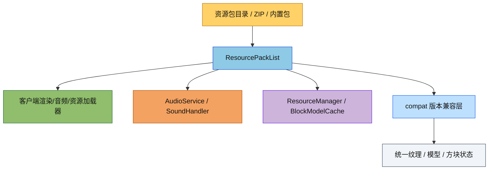

# 资源模块

资源模块负责资源包发现、优先级管理、资源读取、版本兼容和统一资源加载。当前 `ResourcePackList` 已支持并发读写，并被客户端主线程与音频线程共享使用。

## 目录结构

```text
src/common/resource/
├── ResourceLocation.hpp/cpp        # 资源定位符（namespace:path）
├── IResourcePack.hpp/cpp           # 资源包接口
├── FolderResourcePack.hpp/cpp      # 文件夹资源包
├── ZipResourcePack.hpp/cpp         # ZIP 资源包
├── InMemoryResourcePack.hpp/cpp    # 内存资源包
├── PackMetadata.hpp/cpp            # pack.mcmeta 解析
├── ResourcePackList.hpp/cpp        # 资源包列表与优先级管理
├── VanillaResources.hpp/cpp        # 原版基础资源
├── compat/                         # 版本兼容层
│   ├── PackFormat.hpp/cpp
│   ├── ResourceMapper.hpp/cpp
│   ├── TextureMapper.hpp/cpp
│   ├── v1_12/ResourceMapperV112.hpp/cpp
│   ├── v1_13/ResourceMapperV113.hpp/cpp
│   └── unified/                    # 统一资源表示
│       ├── UnifiedResource.hpp
│       ├── UnifiedModel.hpp
│       └── UnifiedBlockState.hpp
└── loader/
    └── ResourceLoader.hpp/cpp       # 统一资源加载管线
```

## 文件介绍

- `ResourceLocation`：统一的资源定位符，负责 `namespace:path` 解析与路径转换。
- `IResourcePack`：资源包抽象接口，文件夹包、ZIP 包和内存包都实现它。
- `FolderResourcePack`：从目录读取资源。
- `ZipResourcePack`：从 ZIP 读取资源，当前内部缓存已加锁。
- `InMemoryResourcePack`：内置资源包，适合原版默认资源。
- `PackMetadata`：读取 `pack.mcmeta`。
- `ResourcePackList`：资源包列表、启用状态、优先级、并发查询、`containsPack()`、`getPackInfo()` 和变更通知。
- `VanillaResources`：原版模型/方块状态等基础资源。
- `compat/`：旧版与新版资源路径兼容。
- `loader/`：统一资源加载流程，面向纹理/模型/方块状态等上层消费。

## 模块关系

- `ClientApplication` 在启动期收集、加载并监听资源包变化。
- `AudioService` / `SoundHandler` 共享同一个 `ResourcePackList` 读取 `sounds.json`。
- `ResourceManager` 消费 `ResourcePackList` 和 `VanillaResources` 构建纹理图集与模型缓存。
- `ZipResourcePack`、`FolderResourcePack` 是 `ResourcePackList` 的具体数据源。
- `ResourceLoader` 适合做统一格式读取，`ResourcePackList` 更偏“资源包集合管理”。

## 整体职责

1. 发现并管理资源包。
2. 维护资源包优先级和启用状态。
3. 为客户端渲染、音频、模型和 UI 提供统一资源访问。
4. 处理 MC 不同版本资源路径/格式兼容。
5. 保障主线程和音频线程同时读取资源时的安全性。

## 输入 / 输出

- 输入：
  - 资源包目录中的文件夹或 ZIP
  - `pack.mcmeta`
  - 资源路径，例如 `minecraft:textures/block/stone.png`
  - 启动设置中的资源包配置
- 输出：
  - 二进制资源数据
  - 文本资源
  - 纹理像素数据
  - 统一模型/方块状态表示

## 依赖项

- 内部依赖：
  - `common/core/Result.hpp`
  - `common/core/settings/ResourcePackListOption.hpp`
  - `common/util/assert/AssertAll.hpp`
  - `common/resource/FolderResourcePack.hpp`
  - `common/resource/ZipResourcePack.hpp`
- 外部依赖：
  - `nlohmann-json`
  - `libarchive`
  - `stb_image`
  - `spdlog`
  - `shared_mutex`（标准库）

## 使用方法

```cpp
using namespace mc;

ResourcePackList packList;
packList.scanDirectory("resourcepacks");
packList.loadFromSettings(settings.resourcePacks);

auto packs = packList.getEnabledPacks();
auto resource = packList.readResource("assets/minecraft/textures/block/stone.png");
```

如果要在音频侧使用：

```cpp
AudioService audioService(packList, settings);
audioService.initialize();
```

## 容易踩的坑

- 不能长期保存 `ResourcePackList` 内部元素地址，现在查询接口返回的是拷贝。
- `containsPack()` 只做存在性判断，不要拿它代替实际加载。
- `addPack()` 会在锁外创建和初始化资源包，再做二次插入校验，不能把它当成纯内存操作。
- `ZipResourcePack` 的缓存已经加锁，但资源包本身仍然应该通过 `ResourcePackList` 统一访问。
- 资源路径统一使用 `/`，Windows 路径分隔符会在内部规范化。

## 测试用例

- `tests/common/resource/ResourcePackListSelfContainedTest.cpp`：自包含资源包读取测试。
- `tests/client/resource/test_resource_location.cpp`：资源定位符相关测试。
- 全量回归：`ctest --test-dir build -C RelWithDebInfo --output-on-failure`

## Mermaid 图表


