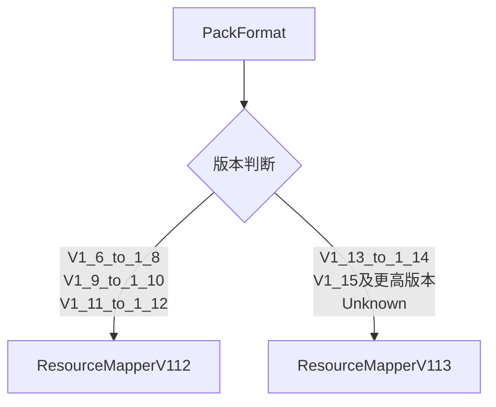
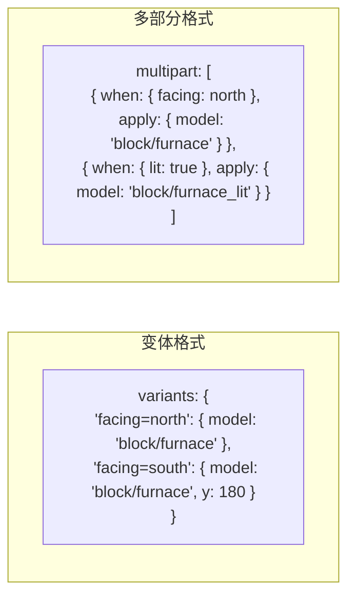
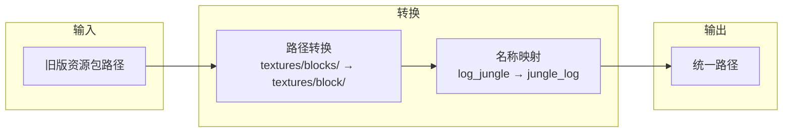
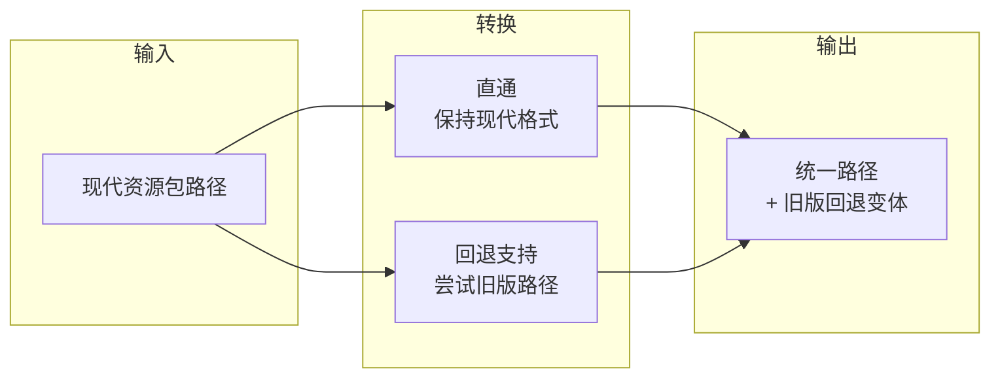
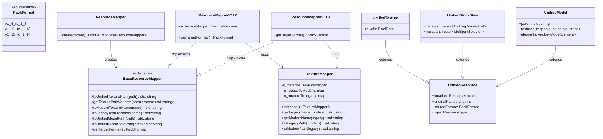
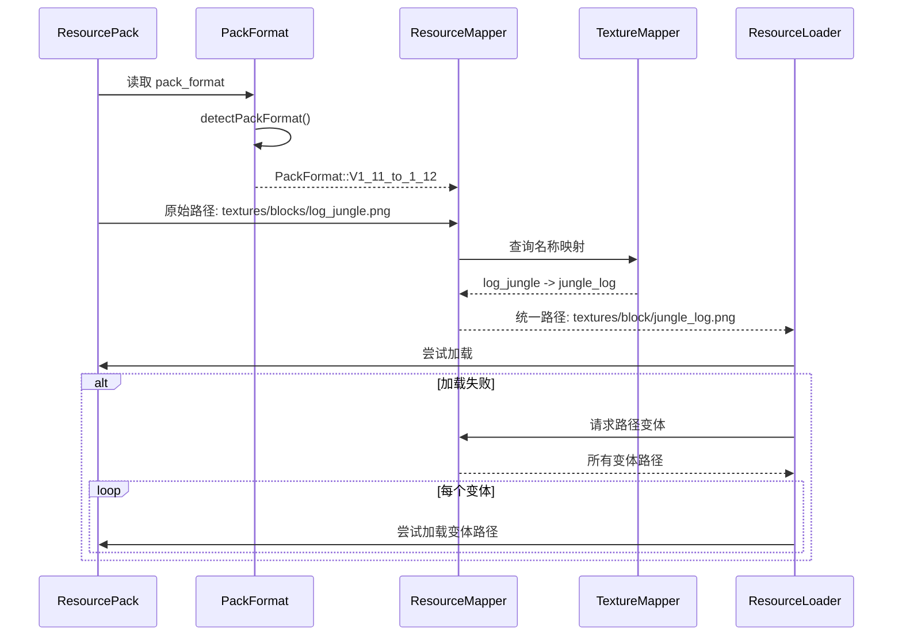

# MC 资源包兼容层 (compat)

本目录实现了 Minecraft 资源包版本兼容层，用于处理不同版本资源包之间的格式差异，使游戏能够加载从 MC 1.6 到 MC 1.19+ 的各类资源包。

## 目录结构

```
compat/
├── PackFormat.hpp/cpp          # 资源包格式版本定义与检测
├── ResourceMapper.hpp/cpp      # 资源映射器抽象接口与工厂
├── TextureMapper.hpp/cpp       # 纹理名称双向映射表
├── unified/                    # 统一资源表示层
│   ├── UnifiedResource.hpp     # 统一资源基类与纹理表示
│   ├── UnifiedBlockState.hpp   # 统一方块状态表示
│   └── UnifiedModel.hpp        # 统一模型表示
├── v1_12/                      # MC 1.11-1.12.2 兼容层
│   └── ResourceMapperV112.hpp/cpp
└── v1_13/                      # MC 1.13+ 兼容层
    └── ResourceMapperV113.hpp/cpp
```

## 文件详解

### PackFormat.hpp / PackFormat.cpp

**职责**：定义资源包格式版本枚举，提供版本检测和路径风格判断功能。

**核心内容**：

```cpp
enum class PackFormat : i32 {
    Unknown = 0,
    V1_6_to_1_8 = 1,
    V1_9_to_1_10 = 2,
    V1_11_to_1_12 = 3,   // 旧版纹理路径: textures/blocks/
    V1_13_to_1_14 = 4,   // 新版纹理路径: textures/block/ (扁平化)
    V1_15_to_1_16_1 = 5,
    V1_16_2_to_1_16_5 = 6,
    V1_17 = 7,
    V1_18 = 8,
    V1_19 = 9,
};
```

**主要函数**：

| 函数 | 说明 |
|------|------|
| `detectPackFormat(i32)` | 从 pack.mcmeta 的 pack_format 值检测版本 |
| `usesOldTexturePaths(format)` | 判断是否使用旧版路径 (`textures/blocks/`) |
| `usesNewTexturePaths(format)` | 判断是否使用新版路径 (`textures/block/`) |
| `requiresTextureNameMapping(format)` | 判断是否需要纹理名称映射 |
| `packFormatToString(format)` | 转换为可读字符串 |

**关键版本差异**：

| 版本 | pack_format | 纹理路径 | 物品路径 | 名称映射 |
|------|-------------|----------|----------|----------|
| 1.11-1.12 | 3 | `textures/blocks/` | `textures/items/` | 需要 |
| 1.13+ | 4+ | `textures/block/` | `textures/item/` | 不需要 |

---

### TextureMapper.hpp / TextureMapper.cpp

**职责**：提供纹理名称的**双向映射**表，处理 MC 1.12 到 1.13+ 扁平化前后的纹理名称差异。

**映射数量**：250+ 条双向映射记录

**核心功能**：

| 函数 | 说明 |
|------|------|
| `getLegacyName(modern)` | 现代名称 → 旧版名称 |
| `getModernName(legacy)` | 旧版名称 → 现代名称 |
| `hasMapping(name)` | 检查是否存在映射 |
| `getNameVariants(name)` | 获取所有名称变体 |
| `toLegacyPath(modernPath)` | 现代路径 → 旧版路径 |
| `toModernPath(legacyPath)` | 旧版路径 → 现代路径 |
| `getPathVariants(path)` | 获取所有路径变体 |

**典型映射示例**：

| 现代名称 (1.13+) | 旧版名称 (1.12) |
|------------------|-----------------|
| `oak_log` | `log_oak` |
| `jungle_log` | `log_jungle` |
| `dark_oak_log` | `log_big_oak` |
| `white_wool` | `wool_colored_white` |
| `granite` | `stone_granite` |
| `grass_block_top` | `grass_top` |
| `poppy` | `flower_rose` |
| `white_terracotta` | `hardened_clay_stained_white` |
| `cut_sandstone` | `sandstone_carved` |
| `short_grass` | `tallgrass` |

**设计模式**：单例模式 (`TextureMapper::instance()`)

---

### ResourceMapper.hpp / ResourceMapper.cpp

**职责**：定义资源映射器抽象接口，提供工厂方法创建版本特定的映射器实例。

**接口定义**：

```cpp
class BaseResourceMapper {
public:
    virtual ~BaseResourceMapper() = default;
    
    // 纹理路径转换
    virtual std::string toUnifiedTexturePath(std::string_view path) const = 0;
    virtual std::vector<std::string> getTexturePathVariants(std::string_view unifiedPath) const = 0;
    virtual std::string toModernTextureName(std::string_view name) const = 0;
    virtual std::string toLegacyTextureName(std::string_view name) const = 0;
    
    // 模型路径转换
    virtual std::string toUnifiedModelPath(std::string_view path) const = 0;
    virtual std::vector<std::string> getModelPathVariants(std::string_view unifiedPath) const = 0;
    
    // 方块状态路径转换
    virtual std::string toUnifiedBlockStatePath(std::string_view path) const = 0;
    
    // 包格式
    virtual PackFormat getTargetFormat() const = 0;
};
```

**工厂方法**：

```cpp
// 根据 PackFormat 创建对应的映射器
std::unique_ptr<BaseResourceMapper> ResourceMapper::create(PackFormat format);
```

**映射器选择策略**：



---

### unified/UnifiedResource.hpp

**职责**：定义统一资源表示的基类和纹理数据结构，是所有统一资源类型的基础。

**核心类型**：

| 类型 | 说明 |
|------|------|
| `ResourceType` | 资源类型枚举（Texture, Model, BlockState, Sound, Language, Data） |
| `UnifiedResource` | 统一资源基类，包含位置、原始路径、源格式 |
| `PixelData` | RGBA 像素数据容器 |
| `UnifiedTexture` | 统一纹理表示，包含像素数据 |

**统一路径规范**：

所有纹理都被规范化为 1.13+ 风格：
- 方块纹理：`textures/block/<name>.png`
- 物品纹理：`textures/item/<name>.png`

---

### unified/UnifiedBlockState.hpp

**职责**：定义统一方块状态表示，解析 JSON 方块状态文件为版本无关的数据结构。

**核心类型**：

| 类型 | 说明 |
|------|------|
| `ModelVariant` | 单个模型变体（模型引用、旋转、UV锁定、权重） |
| `VariantList` | 带权重的变体列表，支持按权重随机选择 |
| `MultipartCondition` | 多部分条件（属性匹配、OR 条件） |
| `MultipartSelector` | 条件 + 变体列表的组合 |
| `UnifiedBlockState` | 统一方块状态，支持变体和多部分两种格式 |

**两种方块状态格式**：



**使用示例**：

```cpp
UnifiedBlockState blockState;
// 变体格式
if (blockState.isVariantFormat()) {
    auto* variants = blockState.getVariants("facing=north,half=top");
}
// 多部分格式
if (blockState.isMultipartFormat()) {
    auto parts = blockState.getApplicableMultipart({{"facing", "north"}});
}
```

---

### unified/UnifiedModel.hpp

**职责**：定义统一模型表示，解析 JSON 模型文件为版本无关的数据结构。

**核心类型**：

| 类型 | 说明 |
|------|------|
| `Direction` | 模型面朝向枚举（Down, Up, North, South, West, East） |
| `ModelFaceUV` | 面 UV 坐标（u1, v1, u2, v2，范围 0-16） |
| `ModelFace` | 模型面定义（朝向、纹理引用、UV、旋转、着色索引） |
| `ModelElement` | 模型元素/立方体（from/to、面列表、旋转） |
| `GuiLight` | GUI 光照模式（Side/Front） |
| `UnifiedModel` | 统一模型，包含父模型引用、纹理变量、元素列表 |

**模型解析示例**：

```cpp
UnifiedModel model;
model.parent = "block/cube_all";
model.textures = {{"all", "block/stone"}};
model.ambientOcclusion = true;

// 解析纹理引用
std::string texture = model.resolveTexture("#all");  // -> "block/stone"
```

---

### v1_12/ResourceMapperV112.hpp / ResourceMapperV112.cpp

**职责**：实现 MC 1.11-1.12.2 资源包的路径和名称转换。

**转换逻辑**：



**主要实现**：

| 方法 | 行为 |
|------|------|
| `toUnifiedTexturePath` | 转换旧版路径 + 旧版名称为统一格式 |
| `getTexturePathVariants` | 返回现代路径、旧版路径、名称变体等所有可能路径 |
| `toModernTextureName` | 旧版名称 → 现代名称 |
| `toLegacyTextureName` | 现代名称 → 旧版名称 |

**路径转换示例**：

```
输入: textures/blocks/log_jungle.png
输出: textures/block/jungle_log.png
```

---

### v1_13/ResourceMapperV113.hpp / ResourceMapperV113.cpp

**职责**：实现 MC 1.13+ 资源包的路径处理（本质上是直通，但提供旧版回退）。

**转换逻辑**：



**主要实现**：

| 方法 | 行为 |
|------|------|
| `toUnifiedTexturePath` | 直接返回（现代路径已是统一格式） |
| `getTexturePathVariants` | 返回现代路径 + 旧版回退路径 |
| `toModernTextureName` | 直接返回（已是现代格式） |
| `toLegacyTextureName` | 现代名称 → 旧版名称（兼容用） |

---

## 模块架构



---

## 模块职责总结

**整体职责**：
- 检测资源包版本
- 将不同版本的资源路径/名称转换为统一的现代格式
- 提供资源加载时的回退路径搜索
- 定义版本无关的资源数据结构

**输入**：
- `pack.mcmeta` 中的 `pack_format` 数值
- 原始资源路径（如 `textures/blocks/log_jungle.png`）
- 原始纹理名称（如 `log_oak`）

**输出**：
- 统一的现代格式路径（如 `textures/block/oak_log.png`）
- 所有可能的路径变体列表（用于回退搜索）
- 统一的资源数据结构（`UnifiedTexture`, `UnifiedModel`, `UnifiedBlockState`）

**依赖项**：
- `common/core/Types.hpp` - 基础类型定义
- `common/resource/ResourceLocation.hpp` - 资源定位符

---

## 使用方法

### 1. 检测资源包版本

```cpp
#include "resource/compat/PackFormat.hpp"

// 从 pack.mcmeta 读取 pack_format 值
i32 packFormatValue = 3;  // 来自 pack.mcmeta
PackFormat format = detectPackFormat(packFormatValue);

if (usesOldTexturePaths(format)) {
    // 需要路径转换
}
```

### 2. 创建资源映射器

```cpp
#include "resource/compat/ResourceMapper.hpp"

// 根据版本创建映射器
auto mapper = ResourceMapper::create(packFormat);

// 转换纹理路径
std::string unifiedPath = mapper->toUnifiedTexturePath("textures/blocks/log_jungle.png");
// 结果: "textures/block/jungle_log.png"

// 获取所有可能的路径变体（用于回退搜索）
auto variants = mapper->getTexturePathVariants("textures/block/jungle_log.png");
// 结果: ["textures/block/jungle_log.png", "textures/blocks/log_jungle.png", ...]
```

### 3. 使用纹理名称映射

```cpp
#include "resource/compat/TextureMapper.hpp"

auto& mapper = TextureMapper::instance();

// 现代名称 -> 旧版名称
std::string legacy = mapper.getLegacyName("jungle_log");  // "log_jungle"

// 旧版名称 -> 现代名称
std::string modern = mapper.getModernName("log_jungle");  // "jungle_log"

// 路径转换
std::string legacyPath = mapper.toLegacyPath("textures/block/jungle_log.png");
// "textures/blocks/log_jungle.png"
```

### 4. 完整资源加载流程

```cpp
#include "resource/compat/PackFormat.hpp"
#include "resource/compat/ResourceMapper.hpp"
#include "resource/compat/TextureMapper.hpp"

// 1. 检测版本
PackFormat format = detectPackFormat(packFormatValue);

// 2. 创建映射器
auto mapper = ResourceMapper::create(format);

// 3. 获取统一路径
std::string unifiedPath = mapper->toUnifiedTexturePath(originalPath);

// 4. 尝试加载，带回退
auto variants = mapper->getTexturePathVariants(unifiedPath);
for (const auto& path : variants) {
    if (resourcePack->hasResource(path)) {
        return resourcePack->loadResource(path);
    }
}
```

---

## 容易踩的坑

### 1. 路径末尾的斜杠

**问题**：路径比较时可能因末尾斜杠不一致导致匹配失败。

**解决**：统一使用无末尾斜杠的路径格式。

```cpp
// 错误
std::string path = "textures/block/";  // 末尾有斜杠

// 正确
std::string path = "textures/block";   // 无末尾斜杠
```

### 2. 名称映射不完整

**问题**：并非所有纹理都需要映射，如 `stone` 在新旧版本中名称相同。

**解决**：使用 `TextureMapper::hasMapping()` 检查是否存在映射。

```cpp
if (mapper.hasMapping("stone")) {
    // 需要映射
    legacyName = mapper.getLegacyName("stone");
} else {
    // 名称不变
    legacyName = "stone";
}
```

### 3. 路径变体顺序

**问题**：`getTexturePathVariants()` 返回的路径有优先级顺序，第一项是首选路径。

**解决**：按顺序尝试路径变体，第一个成功加载的路径即为正确路径。

```cpp
auto variants = mapper->getTexturePathVariants(unifiedPath);
// variants[0] 是首选路径（现代格式）
// variants[1..n] 是回退路径
```

### 4. 花的特殊重命名

**问题**：某些花的名称在新版本中完全改变，而非简单的词序交换。

| 旧版名称 | 现代名称 |
|----------|----------|
| `flower_rose` | `poppy` |
| `flower_houstonia` | `azure_bluet` |
| `flower_dandelion` | `dandelion` |

**解决**：使用 `TextureMapper` 的完整映射表，不要假设简单的词序交换。

### 5. 颜色名称差异

**问题**：某些颜色在新版本中有不同名称。

| 旧版名称 | 现代名称 |
|----------|----------|
| `silver` | `light_gray` |

**解决**：使用 `TextureMapper` 进行转换。

### 6. 多部分方块状态的条件匹配

**问题**：多部分方块状态的 `when` 条件可以是单个属性或 OR 条件数组。

**解决**：`MultipartCondition::matches()` 已正确处理两种情况。

```cpp
// 单条件
// "when": { "facing": "north" }

// OR 条件
// "when": { "OR": [ { "facing": "north" }, { "facing": "south" } ] }
```

---

## 测试用例

测试文件位于 `tests/common/resource/compat/CompatLayerTest.cpp`。

### PackFormatTest

| 测试用例 | 描述 |
|----------|------|
| `DetectFormat_ValidValues` | 验证 1-9 的 pack_format 值正确映射 |
| `DetectFormat_UnknownValue` | 验证无效值返回 Unknown |
| `UsesOldTexturePaths` | 验证旧版路径判断 |
| `UsesNewTexturePaths` | 验证新版路径判断 |
| `RequiresTextureNameMapping` | 验证名称映射需求判断 |
| `PackFormatToString` | 验证字符串转换 |

### TextureMapperTest

| 测试用例 | 描述 |
|----------|------|
| `LogTextures` | 原木纹理映射 |
| `LeafTextures` | 树叶纹理映射 |
| `WoolTextures` | 羊毛纹理映射 |
| `StoneVariants` | 石头变种映射 |
| `GrassBlock` | 草方块纹理映射 |
| `FlowerTextures` | 花纹理映射（包含特殊重命名） |
| `ConcreteTextures` | 混凝土纹理映射 |
| `TerracottaTextures` | 陶瓦纹理映射 |
| `SandstoneTextures` | 砂岩纹理映射 |
| `TallGrassTextures` | 高草纹理映射 |
| `HasMapping` | 映射存在性检查 |
| `GetNameVariants` | 名称变体获取 |
| `PathTransformation` | 路径转换 |
| `GetPathVariants` | 路径变体获取 |

### ResourceMapperFactoryTest

| 测试用例 | 描述 |
|----------|------|
| `CreateV112Mapper` | 创建 1.12 映射器 |
| `CreateV113Mapper` | 创建 1.13 映射器 |
| `CreateV116Mapper` | 创建 1.16 映射器（使用 1.13 映射器） |
| `CreateUnknownMapper` | 创建未知版本映射器（默认 1.13） |

### ResourceMapperV112Test

| 测试用例 | 描述 |
|----------|------|
| `ToUnifiedTexturePath` | 旧版路径转统一路径 |
| `GetTexturePathVariants` | 获取所有路径变体 |

---

## 数据流图



---

## 版本兼容性矩阵

| 资源包版本 | pack_format | 使用映射器 | 路径转换 | 名称映射 |
|------------|-------------|------------|----------|----------|
| 1.6-1.8 | 1 | V112 | 是 | 是 |
| 1.9-1.10 | 2 | V112 | 是 | 是 |
| 1.11-1.12 | 3 | V112 | 是 | 是 |
| 1.13-1.14 | 4 | V113 | 否 | 否 |
| 1.15-1.16.1 | 5 | V113 | 否 | 否 |
| 1.16.2-1.16.5 | 6 | V113 | 否 | 否 |
| 1.17 | 7 | V113 | 否 | 否 |
| 1.18 | 8 | V113 | 否 | 否 |
| 1.19+ | 9+ | V113 | 否 | 否 |

---

## 更新日志

- **2024-03**: 初始实现，支持 MC 1.6 - 1.19+ 资源包
- **当前**: 250+ 纹理名称映射，完整的路径转换支持
