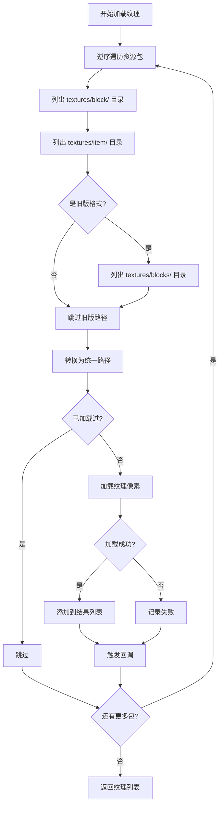
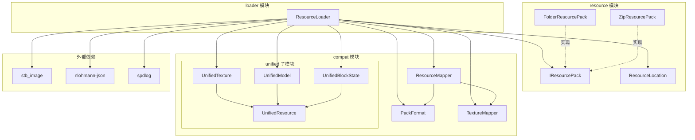

# ResourceLoader 模块

资源加载管道模块，负责协调资源包的加载过程，将不同版本的 Minecraft 资源包转换为统一的内部表示。

## 目录结构

```
loader/
├── ResourceLoader.hpp    # 资源加载器头文件
└── ResourceLoader.cpp    # 资源加载器实现
```

## 文件详解

### ResourceLoader.hpp

资源加载器的头文件，定义了以下核心类型：

#### `ResourceLoadStats` 结构体

资源加载统计信息，用于跟踪加载进度和结果：

| 字段 | 类型 | 说明 |
|------|------|------|
| `texturesLoaded` | `u32` | 成功加载的纹理数量 |
| `texturesFailed` | `u32` | 加载失败的纹理数量 |
| `modelsLoaded` | `u32` | 成功加载的模型数量 |
| `modelsFailed` | `u32` | 加载失败的模型数量 |
| `blockStatesLoaded` | `u32` | 成功加载的方块状态数量 |
| `blockStatesFailed` | `u32` | 加载失败的方块状态数量 |

#### `ResourceLoader` 类

资源加载管道的核心类，协调整个加载过程：

**资源包管理**
- `addResourcePack(ResourcePackPtr)` - 添加资源包（自动检测格式）
- `addResourcePack(ResourcePackPtr, PackFormat)` - 添加资源包（指定格式）
- `clearResourcePacks()` - 清除所有资源包
- `getPackCount()` - 获取已加载资源包数量

**纹理加载**
- `loadTextures()` - 加载所有纹理
- `loadTexture(ResourceLocation)` - 加载单个纹理
- `setTextureCallback(callback)` - 设置纹理加载回调

**模型加载**
- `loadModels()` - 加载所有模型（TODO）
- `loadModel(ResourceLocation)` - 加载单个模型（TODO）

**方块状态加载**
- `loadBlockStates()` - 加载所有方块状态（TODO）
- `loadBlockState(ResourceLocation)` - 加载单个方块状态（TODO）

**工具方法**
- `getStats()` - 获取加载统计
- `resetStats()` - 重置统计
- `detectFormat(IResourcePack)` - 检测包格式（静态方法）

#### `PackContext` 内部结构体

存储每个资源包的上下文信息：

```cpp
struct PackContext {
    ResourcePackPtr pack;                      // 资源包指针
    compat::PackFormat format;                  // 包格式版本
    std::unique_ptr<compat::ResourceMapper> mapper;  // 资源映射器
};
```

### ResourceLoader.cpp

资源加载器的实现文件，包含以下核心逻辑：

#### 包格式检测 (`detectFormat`)

1. 读取 `pack.mcmeta` 文件
2. 解析 JSON 获取 `pack_format` 值
3. 调用 `compat::detectPackFormat()` 转换为枚举
4. 默认返回 `V1_13_to_1_14`（现代格式）

#### 纹理加载 (`loadTextures`)



#### 纹理像素读取 (`readTexturePixels`)

1. 从资源包读取原始字节
2. 使用 `stbi_load_from_memory` 解码为 RGBA
3. 封装为 `PixelData` 结构

## 模块关系图



## 整体职责

ResourceLoader 模块是资源加载管道的核心协调者，负责：

1. **格式检测** - 自动检测资源包的 Minecraft 版本格式
2. **映射器创建** - 为每个包创建适当的资源路径映射器
3. **优先级管理** - 后添加的包具有更高优先级（覆盖机制）
4. **统一转换** - 将不同版本的资源转换为统一的内部表示
5. **加载统计** - 跟踪加载成功/失败数量

## 输入和输出

### 输入

| 类型 | 说明 |
|------|------|
| `IResourcePack` | 资源包接口实例（FolderResourcePack、ZipResourcePack 等） |
| `PackFormat` | 可选的显式格式指定 |

### 输出

| 类型 | 说明 |
|------|------|
| `UnifiedTexture` | 统一格式的纹理数据（RGBA 像素） |
| `UnifiedModel` | 统一格式的模型数据（TODO） |
| `UnifiedBlockState` | 统一格式的方块状态数据（TODO） |
| `ResourceLoadStats` | 加载统计信息 |

## 依赖项

### 内部依赖

```cpp
#include "../compat/PackFormat.hpp"           // 包格式枚举和检测
#include "../compat/ResourceMapper.hpp"        // 资源路径映射器
#include "../compat/TextureMapper.hpp"         // 纹理名称映射器
#include "../compat/unified/UnifiedResource.hpp"  // 统一资源基类
#include "../compat/unified/UnifiedModel.hpp"  // 统一模型类型
#include "../compat/unified/UnifiedBlockState.hpp"  // 统一方块状态类型
#include "../IResourcePack.hpp"                // 资源包接口
#include "../../core/Result.hpp"               // 结果类型
```

### 外部依赖

| 库 | 用途 |
|---|------|
| `stb_image` | PNG 图像解码 |
| `nlohmann-json` | pack.mcmeta JSON 解析 |
| `spdlog` | 日志输出 |

## 使用方法

### 基本用法

```cpp
#include "resource/loader/ResourceLoader.hpp"
#include "resource/FolderResourcePack.hpp"

using namespace mc;
using namespace mc::resource::loader;

// 创建加载器
ResourceLoader loader;

// 添加资源包（自动检测格式）
auto pack = std::make_shared<FolderResourcePack>("path/to/resource/pack");
auto result = loader.addResourcePack(pack);
if (result.failed()) {
    // 处理错误
}

// 添加多个包（后添加的优先级更高）
auto vanillaPack = std::make_shared<InMemoryResourcePack>();
loader.addResourcePack(vanillaPack);

// 设置加载回调（可选）
loader.setTextureCallback([](const String& path, bool success) {
    if (success) {
        spdlog::info("加载纹理: {}", path);
    } else {
        spdlog::warn("加载失败: {}", path);
    }
});

// 加载纹理
auto textures = loader.loadTextures();

// 使用纹理
for (const auto& texture : textures) {
    // texture.location - 统一资源位置
    // texture.pixels - RGBA 像素数据
    // texture.sourceFormat - 源包格式
}

// 获取统计
const auto& stats = loader.getStats();
spdlog::info("加载完成: {} 成功, {} 失败",
             stats.texturesLoaded, stats.texturesFailed);
```

### 指定格式加载

```cpp
// 显式指定包格式
loader.addResourcePack(pack, compat::PackFormat::V1_11_to_1_12);
```

### 加载单个纹理

```cpp
ResourceLocation loc("minecraft:textures/block/stone");
auto result = loader.loadTexture(loc);
if (result.success()) {
    const auto& texture = result.value();
    // 使用纹理...
}
```

## 容易踩的坑

### 1. 包优先级顺序

**问题**: 后添加的包会覆盖前面包的同名资源。

**解决**: 按照从低到高的优先级添加包，最后添加的包（如用户自定义包）具有最高优先级。

```cpp
// 正确的添加顺序
loader.addResourcePack(vanillaPack);      // 最低优先级
loader.addResourcePack(defaultPack);       // 中等优先级
loader.addResourcePack(customPack);        // 最高优先级（会覆盖前面的）
```

### 2. 旧版资源包路径差异

**问题**: MC 1.12 及更早版本使用 `textures/blocks/` 和 `textures/items/`，而 1.13+ 使用 `textures/block/` 和 `textures/item/`。

**解决**: ResourceLoader 会自动处理路径差异，但需要确保正确检测包格式。如果 `pack.mcmeta` 缺失，默认使用 1.13+ 格式。

```cpp
// 如果确定是旧版包，显式指定格式
loader.addResourcePack(oldPack, compat::PackFormat::V1_11_to_1_12);
```

### 3. 纹理名称映射

**问题**: MC 1.12 和 1.13+ 的纹理名称不同（如 `log_jungle` vs `jungle_log`）。

**解决**: ResourceLoader 通过 TextureMapper 自动转换名称，但加载完成后返回的是统一（现代）名称。

### 4. 空指针检查

**问题**: `addResourcePack` 接受 `ResourcePackPtr`（`shared_ptr`），传入空指针会导致错误。

**解决**: 始终检查资源包是否有效。

```cpp
if (!pack) {
    return Error(ErrorCode::InvalidArgument, "资源包为空");
}
```

### 5. 异步加载

**问题**: 当前实现是同步的，大量纹理加载可能阻塞主线程。

**解决**: 未来可考虑在后台线程中调用 `loadTextures()`。

### 6. 内存管理

**问题**: 加载的纹理数据会占用内存，大量纹理可能导致内存不足。

**解决**: 及时调用 `clearResourcePacks()` 释放不再需要的资源。

### 7. 模型和方块状态加载未完成

**问题**: `loadModels()` 和 `loadBlockStates()` 当前返回空向量或错误。

**解决**: 这些功能标记为 TODO，需要后续实现。

## 涉及的测试用例

### CompatLayerTest.cpp

测试兼容层的各个组件：

| 测试类 | 测试内容 |
|--------|----------|
| `PackFormatTest` | 包格式检测和转换 |
| `TextureMapperTest` | 纹理名称双向映射 |
| `ResourceMapperFactoryTest` | 映射器工厂方法 |
| `ResourceMapperV112Test` | 1.12 版本映射器功能 |

### 关键测试用例

```cpp
// PackFormat 检测测试
TEST_F(PackFormatTest, DetectFormat_ValidValues) {
    EXPECT_EQ(detectPackFormat(1), PackFormat::V1_6_to_1_8);
    EXPECT_EQ(detectPackFormat(3), PackFormat::V1_11_to_1_12);
    EXPECT_EQ(detectPackFormat(6), PackFormat::V1_16_2_to_1_16_5);
}

// 纹理映射测试
TEST_F(TextureMapperTest, LogTextures) {
    EXPECT_EQ(mapper.getLegacyName("oak_log"), "log_oak");
    EXPECT_EQ(mapper.getModernName("log_oak"), "oak_log");
}

// 路径转换测试
TEST_F(TextureMapperTest, PathTransformation) {
    String legacy = mapper.toLegacyPath("textures/block/jungle_log.png");
    EXPECT_EQ(legacy, "textures/blocks/log_jungle.png");
}
```

## 实现状态

| 功能 | 状态 | 说明 |
|------|------|------|
| 纹理加载 | **完成** | 支持 PNG 格式，自动路径转换 |
| 模型加载 | TODO | 需要实现 JSON 模型解析 |
| 方块状态加载 | TODO | 需要实现 JSON 方块状态解析 |
| 异步加载 | 未计划 | 当前为同步实现 |
| 进度回调 | 部分 | 仅有纹理加载回调 |

## 扩展建议

### 模型加载实现

```cpp
Result<compat::unified::UnifiedModel> ResourceLoader::loadModel(const ResourceLocation& location) {
    // 1. 遍历资源包查找模型文件
    // 2. 读取 JSON 内容
    // 3. 解析元素、面、纹理引用
    // 4. 处理父模型继承
    // 5. 返回 UnifiedModel
}
```

### 方块状态加载实现

```cpp
Result<compat::unified::UnifiedBlockState> ResourceLoader::loadBlockState(const ResourceLocation& location) {
    // 1. 遍历资源包查找方块状态文件
    // 2. 读取 JSON 内容
    // 3. 解析 variants 或 multipart 格式
    // 4. 返回 UnifiedBlockState
}
```

## 参考资料

- Minecraft Wiki: [Resource Pack](https://minecraft.wiki/w/Resource_pack)
- Minecraft Wiki: [Model](https://minecraft.wiki/w/Model)
- Minecraft Wiki: [Block states](https://minecraft.wiki/w/Block_states)
- MC Java 源码: `net.minecraft.client.resources.LegacyResourcePackWrapper`
