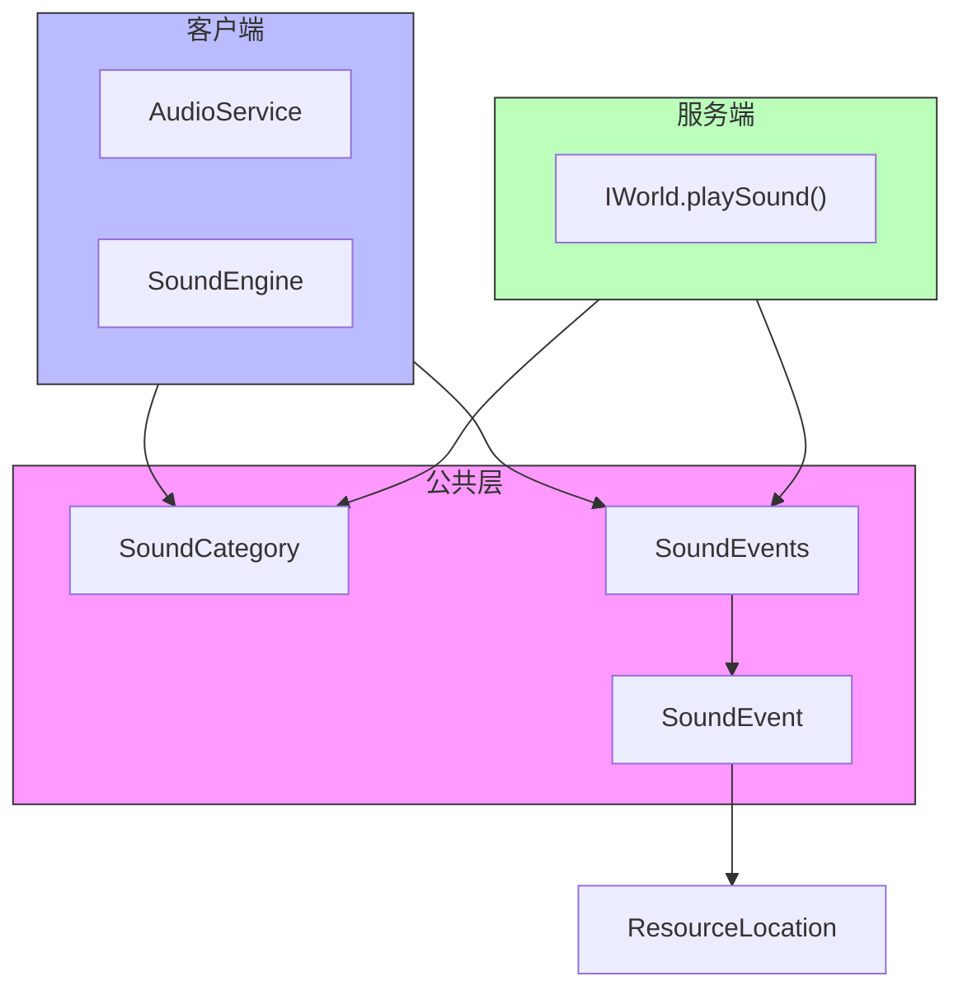

# 音效系统公共模块

本模块定义了音效系统在客户端和服务端共享的基础类型和音效事件常量。

## 目录结构

```text
src/common/sound/
├── SoundCategory.hpp/cpp    # 音效分类枚举
├── SoundEvent.hpp/cpp       # 音效事件定义
├── SoundEvents.hpp/cpp      # 音效事件常量（700+ MC 1.16.5 音效）
├── SoundTypes.hpp           # 音效类型定义
└── network/
    └── SoundPackets.hpp/cpp # 音效网络数据包
```

## 文件介绍

### SoundCategory

音效分类枚举，用于音量控制和分类播放。

```cpp
enum class SoundCategory : u8 {
    Master,    // 主音量
    Music,     // 音乐
    Records,   // 唱片机
    Weather,   // 天气
    Blocks,    // 方块
    Hostile,   // 敌对生物
    Neutral,   // 中立生物
    Players,   // 玩家
    Ambient,   // 环境音
    Voice      // 语音
};
```

### SoundEvents

包含 1000+ 音效事件常量，与 MC 1.16.5 的 `SoundEvents.java` 完全对齐。

**音效命名规范**：
- 方块音效：`BLOCK_<方块名>_<动作>`，如 `BLOCK_STONE_BREAK`, `BLOCK_WOOD_STEP`
- 实体音效：`ENTITY_<实体名>_<动作>`，如 `ENTITY_PLAYER_HURT`, `ENTITY_ZOMBIE_AMBIENT`
- 环境音效：`AMBIENT_<环境名>_<类型>`，如 `AMBIENT_CAVE`, `AMBIENT_UNDERWATER_LOOP`
- 物品音效：`ITEM_<物品名>_<动作>`，如 `ITEM_BUCKET_EMPTY`, `ITEM_ARMOR_EQUIP_IRON`
- 音乐音效：`MUSIC_<场景>`，如 `MUSIC_MENU`, `MUSIC_GAME`

**使用示例**：

```cpp
#include "common/sound/SoundEvents.hpp"

// 播放方块破坏音效
world.playSound(
    SoundEvents::BLOCK_STONE_BREAK,
    sound::SoundCategory::Blocks,
    pos.center(),
    1.0f,  // 音量
    1.0f   // 音调
);

// 播放玩家受伤音效
player.playSound(SoundEvents::ENTITY_PLAYER_HURT, 1.0f, 1.0f);
```

## 音效事件分类

### 环境音效 (AMBIENT_)

- 洞穴环境音：`AMBIENT_CAVE`
- 下界群系环境音：`AMBIENT_BASALT_DELTAS_*`, `AMBIENT_CRIMSON_FOREST_*` 等
- 水下环境音：`AMBIENT_UNDERWATER_*`

### 方块音效 (BLOCK_)

- 门音效：`BLOCK_WOODEN_DOOR_OPEN/CLOSE`, `BLOCK_IRON_DOOR_OPEN/CLOSE`
- 按钮音效：`BLOCK_STONE_BUTTON_CLICK_ON/OFF`, `BLOCK_WOODEN_BUTTON_CLICK_ON/OFF`
- 压力板音效：`BLOCK_STONE_PRESSURE_PLATE_CLICK_ON/OFF`
- 音符盒音效：`BLOCK_NOTE_BLOCK_*`（bass, snare, hat, bell 等）
- 活塞音效：`BLOCK_PISTON_EXTEND/CONTRACT`
- 传送门音效：`BLOCK_PORTAL_AMBIENT/TRAVEL/TRIGGER`
- 信标音效：`BLOCK_BEACON_ACTIVATE/AMBIENT/DEACTIVATE`
- 基础方块音效：`BLOCK_STONE_*`, `BLOCK_GRASS_*`, `BLOCK_GRAVEL_*`, `BLOCK_SAND_*`, `BLOCK_WOOD_*`, `BLOCK_METAL_*` 等（break/fall/hit/place/step）
- 下界方块音效：`BLOCK_BASALT_*`, `BLOCK_NETHERRACK_*`, `BLOCK_SOUL_SAND_*`, `BLOCK_NYLIUM_*` 等
- 气泡柱音效：`BLOCK_BUBBLE_COLUMN_*`

### 实体音效 (ENTITY_)

- 玩家音效：`ENTITY_PLAYER_HURT`, `ENTITY_PLAYER_DEATH`, `ENTITY_PLAYER_BURP` 等
- 友好生物：鸡、牛、猪、羊、马、猫、狼、兔子、海豚、鱼等
- 敌对生物：僵尸、骷髅、苦力怕、末影人、恶魂、烈焰人、守卫者等
- Boss：末影龙、凋灵

### 物品音效 (ITEM_)

- 盔甲装备：`ITEM_ARMOR_EQUIP_CHAIN/DIAMOND/GOLD/IRON/LEATHER/NETHERITE/TURTLE`
- 桶音效：`ITEM_BUCKET_EMPTY/FILL`, `ITEM_BUCKET_EMPTY_LAVA/FILL_LAVA`
- 工具音效：`ITEM_AXE_STRIP`, `ITEM_HOE_TILL`, `ITEM_SHOVEL_FLATTEN`
- 鞘翅音效：`ITEM_ELYTRA_FLYING` - 鞘翅飞行时的循环音效

### 音乐音效 (MUSIC_)

- 菜单音乐：`MUSIC_MENU`
- 主世界音乐：`MUSIC_GAME`
- 创造模式音乐：`MUSIC_CREATIVE`
- 下界群系音乐：`MUSIC_NETHER_BASALT_DELTAS` 等
- 末地音乐：`MUSIC_END`, `MUSIC_DRAGON`
- 水下音乐：`MUSIC_UNDER_WATER`

## 已实现的方块音效触发

以下方块已在服务端实现了音效触发逻辑：

### 机械类方块

| 方块 | 音效事件 | 触发时机 | 文件 |
|------|----------|----------|------|
| 发射器 | `BLOCK_DISPENSER_DISPENSE` | 发射物品时 | `DispenserBlock.cpp` |
| 投掷器 | `BLOCK_DISPENSER_DISPENSE` | 投掷物品时 | 继承自 `DispenserBlock` |
| 木压力板 | `BLOCK_WOODEN_PRESSURE_PLATE_CLICK_ON/OFF` | 按下/抬起时 | `WoodPressurePlateBlock.cpp` |
| 测重压力板 | `BLOCK_METAL_PRESSURE_PLATE_CLICK_ON/OFF` | 按下/抬起时 | `WeightedPressurePlateBlock.cpp` |
| TNT | `ENTITY_TNT_PRIMED` | 被点燃时 | `TNTBlock.cpp` |

### 生物相关方块

| 方块 | 音效事件 | 触发时机 | 文件 |
|------|----------|----------|------|
| 海龟蛋 | `ENTITY_TURTLE_EGG_CRACK` | 孵化进度增加时 | `MobBlocks.cpp` |
| 海龟蛋 | `ENTITY_TURTLE_EGG_HATCH` | 孵化完成时 | `MobBlocks.cpp` |
| 海龟蛋 | `ENTITY_TURTLE_EGG_BREAK` | 被踩破时 | `MobBlocks.cpp` |

### 投掷物发射行为

| 行为 | 音效事件 | 触发时机 | 文件 |
|------|----------|----------|------|
| 默认发射 | `BLOCK_DISPENSER_DISPENSE` | 发射物品时 | `IDispenseItemBehavior.cpp` |

## 网络数据包

### PlaySoundPacket

服务端向客户端发送的播放声音数据包：

```cpp
// 在指定位置播放声音
PlaySoundPacket packet(
    SoundEvents::BLOCK_STONE_BREAK,  // 声音事件ID
    SoundCategory::Blocks,            // 类别
    glm::vec3(100.0f, 64.0f, 200.0f), // 位置
    1.0f,  // 音量
    1.0f   // 音调
);
server.connectionManager().sendToPlayer(playerId, PacketType::PlaySound, packet.serialize());
```

### StopSoundPacket

服务端向客户端发送的停止声音数据包：

```cpp
// 停止所有声音
StopSoundPacket stopAll(std::nullopt, std::nullopt);

// 停止特定类别的声音
StopSoundPacket stopCategory(std::nullopt, SoundCategory::Music);

// 停止特定声音事件
StopSoundPacket stopSound(SoundEvents::MUSIC_GAME, std::nullopt);
```

### MovingSoundPacket

服务端向客户端发送的移动声音数据包（跟随实体）：

```cpp
// 播放跟随实体的声音（如闪电、守卫者激光等）
MovingSoundPacket packet(
    SoundEvents::ENTITY_LIGHTNING_BOLT_THUNDER,
    SoundCategory::Weather,
    entityId,
    1.0f,  // 音量
    1.0f   // 音调
);
```

### PlaySoundEffectPacket

用于播放与实体或方块关联的声音效果，格式与 PlaySoundPacket 相同。

## 依赖项

- `common/resource/ResourceLocation.hpp` - 资源位置标识
- `common/core/Types.hpp` - 基础类型定义

## 技术限制

以下音效因需要客户端基础设施而暂未实现：

### 需要 animateTick 的音效

`animateTick` 是 MC 客户端专用方法，用于在方块附近播放粒子效果和环境音效。当前项目尚未实现此基础设施。

| 方块 | 音效事件 | 说明 |
|------|----------|------|
| 传送门 | `BLOCK_PORTAL_AMBIENT` | 需要在传送门方块附近随机播放 |
| 传送门 | `BLOCK_PORTAL_TRIGGER` | 玩家站在传送门中时播放 |
| 营火 | `BLOCK_CAMPFIRE_CRACKLE` | 营火燃烧时的噼啪声 |
| 岩浆块 | `BLOCK_LAVA_AMBIENT` | 岩浆冒泡声 |
| 末地传送门框架 | `BLOCK_END_PORTAL_FRAME_FILL` | 放置末影之眼时 |

**实现方案**：
1. 在 `Block` 基类添加 `animateTick(IWorld&, BlockPos, BlockState&, IRandom&)` 虚方法
2. 在客户端区块渲染器中调用 `animateTick`
3. 在服务端通过 `playEvent` 广播事件给客户端

### 需要 playEvent 的音效

`playEvent` 是服务端向客户端广播游戏事件（音效/粒子）的系统，用于非方块状态变化的事件。

| 方块 | 音效事件 | 说明 |
|------|----------|------|
| 铁砧 | `BLOCK_ANVIL_USE` | 修复/重命名物品时 |
| 铁砧 | `BLOCK_ANVIL_DESTROY` | 铁砧损坏时 |
| 铁砧 | `BLOCK_ANVIL_LAND` | 铁砧落地时 |
| 营火 | `BLOCK_FIRE_EXTINGUISH` | 用水/雨熄灭时 |

**实现方案**：
1. 在 `IWorld` 添加 `playEvent(i32 eventId, BlockPos, i32 data)` 方法
2. 定义事件ID常量（对齐 MC 1.16.5 `Events.java`）
3. 客户端处理 `PlayEventPacket` 并播放对应音效/粒子

## 测试用例

音效事件常量为静态定义，通过编译期检查确保正确性。网络数据包测试在 `tests/common/network/` 中覆盖。

## Mermaid 图表


