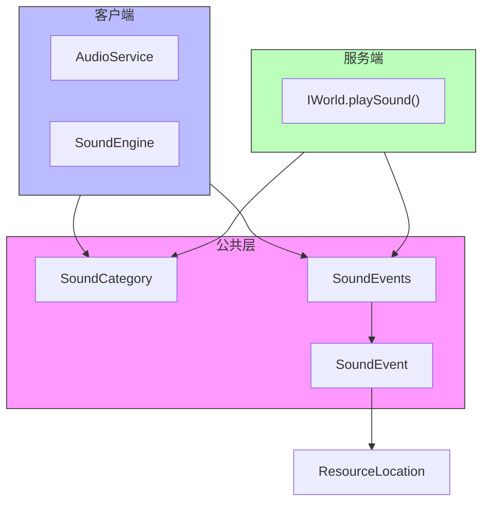

# 音效系统公共模块

本模块定义了音效系统在客户端和服务端共享的基础类型和音效事件常量。

## 目录结构

```text
src/common/sound/
├── SoundCategory.hpp/cpp    # 音效分类枚举
├── SoundEvent.hpp/cpp       # 音效事件定义
├── SoundEvents.hpp/cpp      # 音效事件常量（500+ MC 1.16.5 音效）
├── SoundTypes.hpp           # 音效类型定义
└── network/
    └── SoundPackets.hpp/cpp # 音效网络数据包
```

## 文件介绍

### SoundCategory

音效分类枚举，用于音量控制和分类播放。

```cpp
enum class SoundCategory : u8 {
    Master,    // 主音量
    Music,     // 音乐
    Records,   // 唱片机
    Weather,   // 天气
    Blocks,    // 方块
    Hostile,   // 敌对生物
    Neutral,   // 中立生物
    Players,   // 玩家
    Ambient,   // 环境音
    Voice      // 语音
};
```

### SoundEvents

包含 500+ 音效事件常量，与 MC 1.16.5 的 `SoundEvents.java` 对应。

**音效命名规范**：
- 方块音效：`BLOCK_<方块名>_<动作>`，如 `BLOCK_STONE_BREAK`, `BLOCK_WOOD_STEP`
- 实体音效：`ENTITY_<实体名>_<动作>`，如 `ENTITY_PLAYER_HURT`, `ENTITY_ZOMBIE_AMBIENT`
- 环境音效：`AMBIENT_<环境名>_<类型>`，如 `AMBIENT_CAVE`, `AMBIENT_UNDERWATER_LOOP`
- 物品音效：`ITEM_<物品名>_<动作>`，如 `ITEM_BUCKET_EMPTY`, `ITEM_ARMOR_EQUIP_IRON`
- 音乐音效：`MUSIC_<场景>`，如 `MUSIC_MENU`, `MUSIC_GAME`

**使用示例**：

```cpp
#include "common/sound/SoundEvents.hpp"

// 播放方块破坏音效
world.playSound(
    SoundEvents::BLOCK_STONE_BREAK,
    sound::SoundCategory::Blocks,
    pos.center(),
    1.0f,  // 音量
    1.0f   // 音调
);

// 播放玩家受伤音效
player.playSound(SoundEvents::ENTITY_PLAYER_HURT, 1.0f, 1.0f);
```

## 音效事件分类

### 环境音效 (AMBIENT_)

- 洞穴环境音：`AMBIENT_CAVE`
- 下界群系环境音：`AMBIENT_BASALT_DELTAS_*`, `AMBIENT_CRIMSON_FOREST_*` 等
- 水下环境音：`AMBIENT_UNDERWATER_*`

### 方块音效 (BLOCK_)

- 门音效：`BLOCK_WOODEN_DOOR_OPEN/CLOSE`, `BLOCK_IRON_DOOR_OPEN/CLOSE`
- 按钮音效：`BLOCK_STONE_BUTTON_CLICK_ON/OFF`, `BLOCK_WOODEN_BUTTON_CLICK_ON/OFF`
- 压力板音效：`BLOCK_STONE_PRESSURE_PLATE_CLICK_ON/OFF`
- 音符盒音效：`BLOCK_NOTE_BLOCK_*`（bass, snare, hat, bell 等）
- 活塞音效：`BLOCK_PISTON_EXTEND/CONTRACT`
- 传送门音效：`BLOCK_PORTAL_AMBIENT/TRAVEL/TRIGGER`
- 信标音效：`BLOCK_BEACON_ACTIVATE/AMBIENT/DEACTIVATE`

### 实体音效 (ENTITY_)

- 玩家音效：`ENTITY_PLAYER_HURT`, `ENTITY_PLAYER_DEATH`, `ENTITY_PLAYER_BURP` 等
- 友好生物：鸡、牛、猪、羊、马、猫、狼、兔子、海豚、鱼等
- 敌对生物：僵尸、骷髅、苦力怕、末影人、恶魂、烈焰人、守卫者等
- Boss：末影龙、凋灵

### 物品音效 (ITEM_)

- 盔甲装备：`ITEM_ARMOR_EQUIP_CHAIN/DIAMOND/GOLD/IRON/LEATHER/NETHERITE/TURTLE`
- 桶音效：`ITEM_BUCKET_EMPTY/FILL`, `ITEM_BUCKET_EMPTY_LAVA/FILL_LAVA`
- 工具音效：`ITEM_AXE_STRIP`, `ITEM_HOE_TILL`, `ITEM_SHOVEL_FLATTEN`

### 音乐音效 (MUSIC_)

- 菜单音乐：`MUSIC_MENU`
- 主世界音乐：`MUSIC_GAME`
- 创造模式音乐：`MUSIC_CREATIVE`
- 下界群系音乐：`MUSIC_NETHER_BASALT_DELTAS` 等
- 末地音乐：`MUSIC_END`, `MUSIC_DRAGON`
- 水下音乐：`MUSIC_UNDER_WATER`

## 依赖项

- `common/resource/ResourceLocation.hpp` - 资源位置标识
- `common/core/Types.hpp` - 基础类型定义

## 测试用例

音效事件常量为静态定义，通过编译期检查确保正确性。网络数据包测试在 `tests/common/network/` 中覆盖。

## Mermaid 图表


