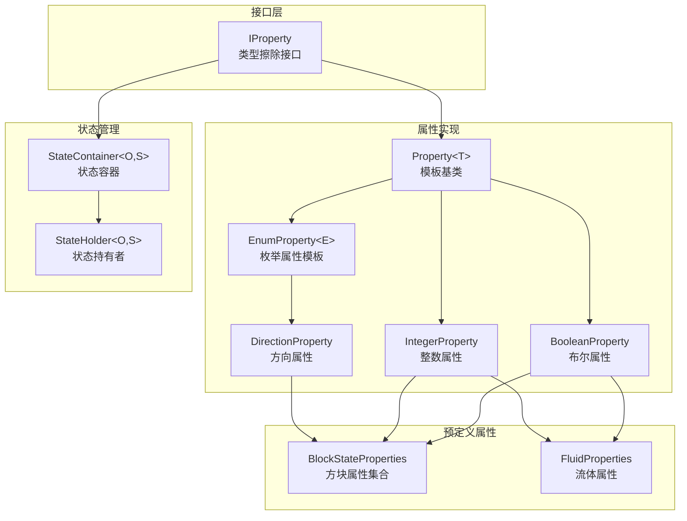

# Property 模块

方块状态属性系统，参考 Minecraft Java 1.16.5 的 `net.minecraft.state` 包实现。

## 目录结构

```
src/common/util/property/
├── IProperty.hpp           # 属性接口基类（类型擦除）
├── Property.hpp            # 类型安全的属性模板基类
├── BooleanProperty.hpp     # 布尔属性
├── IntegerProperty.hpp     # 整数属性
├── EnumProperty.hpp        # 枚举属性模板
├── DirectionProperty.hpp   # 方向属性（DirectionProperty、AxisProperty）
├── StateContainer.hpp      # 状态容器模板
├── StateHolder.hpp         # 状态持有者基类模板
├── Properties.hpp          # 预定义方块状态属性集合
└── FluidProperties.hpp     # 流体专用属性定义
```

## 文件详解

### IProperty.hpp

**职责**: 提供类型擦除的属性接口基类。

**内容**:
- 定义属性的核心接口
- 所有具体属性类型（BooleanProperty、IntegerProperty等）都继承此接口
- 允许在运行时统一处理不同类型的属性

**核心方法**:
```cpp
class IProperty {
    virtual const std::string& name() const = 0;           // 属性名称
    virtual size_t valueCount() const = 0;            // 允许值的数量
    virtual std::string valueToString(size_t index) const; // 值索引转字符串
    virtual std::optional<size_t> parseValue(std::string_view);  // 字符串解析为索引
    virtual size_t hashCode() const = 0;              // 哈希值
    virtual bool equals(const IProperty&) const = 0;  // 相等比较
    virtual const char* typeName() const = 0;         // 类型名称
};
```

---

### Property.hpp

**职责**: 类型安全的属性模板基类。

**内容**:
- 模板类 `Property<T>` 继承 `IProperty`
- 提供类型安全的属性访问
- 管理允许的值列表和值到索引的映射

**核心方法**:
```cpp
template<typename T>
class Property : public IProperty {
    const std::vector<T>& allowedValues() const;  // 获取所有允许值
    std::optional<size_t> indexOf(const T& value) const; // 查找值索引
    ValueReturnType valueAt(size_t index) const;   // 获取索引处的值
    virtual std::string valueToString(const T&) const;  // 值转字符串
    virtual std::optional<T> parse(std::string_view) const;   // 字符串解析为值
};
```

**注意**: 对于 `bool` 类型，`valueAt()` 返回值而非引用（因为 `std::vector<bool>` 特化）。

---

### BooleanProperty.hpp

**职责**: 布尔类型的方块状态属性。

**内容**:
- 继承 `Property<bool>`
- 固定值集合：`{false, true}`
- 用于表示开关状态（如 lit、powered、open、waterlogged 等）

**用法示例**:
```cpp
auto lit = BooleanProperty::create("lit");
bool isLit = state.get(*lit);
const BlockState& newState = state.with(*lit, true);
```

---

### IntegerProperty.hpp

**职责**: 整数范围的方块状态属性。

**内容**:
- 继承 `Property<i32>`
- 支持指定范围 `[min, max]`
- 用于表示等级、年龄、信号强度等

**用法示例**:
```cpp
auto power = IntegerProperty::create("power", 0, 15);  // 红石信号强度
auto age = IntegerProperty::create("age", 0, 7);       // 作物生长阶段

i32 powerLevel = state.get(*power);
const BlockState& newState = state.with(*power, 10);
```

**限制**:
- 最小值必须 `>= 0`
- 最大值必须 `> 最小值`
- 值的数量不宜过大（避免状态空间爆炸）

---

### EnumProperty.hpp

**职责**: 枚举类型的方块状态属性模板。

**内容**:
- 模板类 `EnumProperty<E>` 继承 `Property<E>`
- 通过 `Traits` 特化提供枚举的字符串转换
- 已特化：`EnumProperty<Direction>`、`EnumProperty<Axis>`

**用法示例**:
```cpp
// 为自定义枚举特化 Traits
template<>
struct EnumProperty<MyEnum>::Traits {
    static std::string toString(const MyEnum& value) { ... }
    static std::optional<MyEnum> fromName(std::string_view name) { ... }
};

auto prop = EnumProperty<MyEnum>::create("my_enum", {MyEnum::A, MyEnum::B});
```

---

### DirectionProperty.hpp

**职责**: 方向专用的属性类型。

**内容**:
- `DirectionProperty` - 方向属性（继承 `EnumProperty<Direction>`）
- `AxisProperty` - 坐标轴属性工具类

**工厂方法**:
```cpp
// 创建包含所有6个方向的属性
auto facing = DirectionProperty::create("facing");

// 创建仅包含水平方向的属性（N/E/S/W）
auto horizontal = DirectionProperty::createHorizontal("facing");

// 使用过滤器创建
auto noUp = DirectionProperty::create("facing", [](Direction d) {
    return d != Direction::Up;
});
```

---

### StateContainer.hpp

**职责**: 预计算并管理所有可能的状态组合。

**内容**:
- 模板类 `StateContainer<Owner, State>`
- Builder 模式构建
- 生成所有状态组合并建立转换表

**核心概念**:
- 状态数量 = 各属性值数量的乘积
- 所有状态在构建时预计算
- 状态转换 O(1) 时间复杂度（通过预计算的转换表）

**用法示例**:
```cpp
auto container = StateContainer<Block, BlockState>::Builder(*this)
    .addHorizontalDirection("facing")  // 4 个值
    .addBoolean("lit")                  // 2 个值
    .create([](const Block& block, auto values, u32 id) {
        return std::make_unique<BlockState>(block, std::move(values), id);
    });
// 总状态数 = 4 * 2 = 8
```

**验证规则**:
- 属性名称必须符合 `[a-z0-9_]+` 格式
- 每个属性至少需要 2 个值
- 不允许重复属性名称

---

### StateHolder.hpp

**职责**: 不可变状态对象的基类模板。

**内容**:
- 模板类 `StateHolder<Owner, State>`（CRTP 模式）
- 持有属性值索引映射
- 提供类型安全的状态转换

**核心方法**:
```cpp
template<typename Owner, typename State>
class StateHolder {
    // 获取属性值
    template<typename T>
    typename Property<T>::ValueReturnType get(const Property<T>& prop) const;

    // 尝试获取属性值
    template<typename T>
    std::optional<T> getOptional(const Property<T>& prop) const;

    // 设置属性值（返回新状态引用）
    template<typename T>
    const State& with(const Property<T>& prop, const T& value) const;

    // 循环切换到下一个值
    template<typename T>
    const State& cycle(const Property<T>& prop) const;

    // 检查是否有此属性
    template<typename T>
    bool hasProperty(const Property<T>& prop) const;

    // 状态ID（用于序列化）
    u32 stateId() const;
};
```

**不可变性**: `with()` 方法返回新状态的引用，原状态不变。

---

### Properties.hpp

**职责**: 预定义的方块状态属性集合。

**内容**: 提供所有标准方块状态属性的静态访问（懒加载单例模式）。

**布尔属性**:
| 属性 | 名称 | 说明 |
|------|------|------|
| `ATTACHED()` | attached | 是否被激活（绊线钩等） |
| `BOTTOM()` | bottom | 是否在底部（门、活板门） |
| `LIT()` | lit | 是否点亮（火把、熔炉等） |
| `POWERED()` | powered | 是否被充能 |
| `OPEN()` | open | 是否打开（门、栅栏门等） |
| `WATERLOGGED()` | waterlogged | 是否含水 |
| `UP/DOWN/NORTH/SOUTH/EAST/WEST()` | up/down/north/... | 连接方向（栅栏、墙等） |

**方向属性**:
| 属性 | 名称 | 值数量 | 说明 |
|------|------|--------|------|
| `FACING()` | facing | 6 | 所有方向 |
| `HORIZONTAL_FACING()` | facing | 4 | 仅水平方向 |
| `FACING_EXCEPT_UP()` | facing | 5 | 除上之外 |

**坐标轴属性**:
| 属性 | 名称 | 值数量 | 说明 |
|------|------|--------|------|
| `AXIS()` | axis | 3 | X/Y/Z |
| `HORIZONTAL_AXIS()` | axis | 2 | X/Z |

**整数属性**:
| 属性 | 名称 | 范围 | 说明 |
|------|------|------|------|
| `AGE_0_1()` ~ `AGE_0_25()` | age | 各异 | 生长阶段 |
| `LAYERS_1_8()` | layers | 1-8 | 雪层厚度 |
| `LEVEL_0_8()` | level | 0-8 | 液体等级 |
| `LEVEL_0_15()` | level | 0-15 | 液体等级 |
| `POWER_0_15()` | power | 0-15 | 红石信号强度 |
| `DELAY_1_4()` | delay | 1-4 | 中继器延迟 |
| `DISTANCE_1_7()` | distance | 1-7 | 树叶距离 |
| `MOISTURE_0_7()` | moisture | 0-7 | 农田湿度 |
| `NOTE_0_24()` | note | 0-24 | 音符盒音高 |
| `ROTATION_0_15()` | rotation | 0-15 | 旗帜/告示牌旋转 |
| `STAGE_0_1()` | stage | 0-1 | 树苗阶段 |

---

### FluidProperties.hpp

**职责**: 流体专用属性定义。

**内容**:
```cpp
namespace mc::fluid {
    class FluidProperties {
        static const IntegerProperty& LEVEL_1_8();   // 流体等级 (1-8)
        static const BooleanProperty& FALLING();     // 是否下落
    };
}
```

**流体等级说明**:
- `level=1` = 最远的流动（即将消失）
- `level=8` = 源头方块
- 注意：与方块的 `LEVEL_0_15` 不同！

**方块与流体等级映射**:
| 方块 level | 流体 level | falling |
|------------|------------|---------|
| 0 | 8 | false |
| 1-7 | 1-7 | false |
| 8-15 | 8 | true |

---

## 模块关系图



---

## 模块概述

### 整体职责

Property 模块实现了 Minecraft 的方块状态属性系统，用于：

1. **定义方块属性** - 布尔、整数、枚举类型的属性
2. **管理状态组合** - 预计算所有可能的状态
3. **提供状态转换** - O(1) 复杂度的属性修改
4. **序列化支持** - 字符串与值的相互转换

### 输入和输出

**输入**:
- 属性定义（类型、名称、值范围）
- 状态创建请求（属性值组合）

**输出**:
- 不可变的状态对象
- 状态转换结果
- 序列化字符串

### 依赖项

```cpp
// 核心类型
#include "common/core/Types.hpp"        // std::string, std::string_view, Optional, i32, u32
#include "common/util/Direction.hpp"    // Direction, Axis, Directions, Axes

// 标准库
#include <string>
#include <vector>
#include <unordered_map>
#include <memory>
#include <functional>
#include <stdexcept>
```

### 使用方法

#### 1. 定义方块属性

```cpp
class TorchBlock : public Block {
public:
    explicit TorchBlock(BlockProperties properties)
        : Block(properties) {
        auto container = StateContainer<Block, BlockState>::Builder(*this)
            .addBoolean("lit")
            .create([](const Block& block, auto values, u32 id) {
                return std::make_unique<BlockState>(block, std::move(values), id);
            });
        createBlockState(std::move(container));
    }

    static const BooleanProperty& LIT(const Block& block) {
        return *static_cast<const BooleanProperty*>(
            block.stateContainer().getProperty("lit"));
    }
};
```

#### 2. 使用预定义属性

```cpp
// 获取属性引用
const BooleanProperty& lit = BlockStateProperties::LIT();
const DirectionProperty& facing = BlockStateProperties::FACING();
const IntegerProperty& power = BlockStateProperties::POWER_0_15();

// 使用属性
bool isLit = state.get(lit);
Direction dir = state.get(facing);
i32 powerLevel = state.get(power);

// 修改属性
const BlockState& newState = state.with(lit, true);
const BlockState& rotatedState = state.with(facing, Direction::East);
```

#### 3. 状态转换

```cpp
// 设置属性值
const BlockState& litState = state.with(BlockStateProperties::LIT(), true);

// 循环切换值
const BlockState& nextState = state.cycle(BlockStateProperties::FACING());

// 检查属性是否存在
if (state.hasProperty(BlockStateProperties::LIT())) {
    // ...
}

// 获取状态ID（用于序列化）
u32 id = state.stateId();

// 转换为字符串
std::string str = state.toString();  // "minecraft:torch[lit=true]"
```

---

## 容易踩的坑

### 1. 状态空间爆炸

**问题**: 多个属性的组合会导致状态数量急剧增长。

```cpp
// 危险！状态数 = 16 * 16 * 16 * 2 * 6 = 49,152
auto container = StateContainer<Block, BlockState>::Builder(*this)
    .addInteger("prop1", 0, 15)   // 16 values
    .addInteger("prop2", 0, 15)   // 16 values
    .addInteger("prop3", 0, 15)   // 16 values
    .addBoolean("prop4")          // 2 values
    .addDirection("prop5")        // 6 values
    .create(...);
```

**解决**: 限制属性数量和值范围，Minecraft 通常限制在 16 个属性以内。

### 2. 属性实例必须唯一

**问题**: 使用不同的属性实例会导致查找失败。

```cpp
// 错误：创建了两个同名属性实例
auto lit1 = BooleanProperty::create("lit");
auto lit2 = BooleanProperty::create("lit");
// lit1 != lit2（指针不同）

// 正确：使用静态属性或预定义属性
const BooleanProperty& lit = BlockStateProperties::LIT();
```

### 3. 整数属性范围限制

**问题**: 负数范围会抛出异常。

```cpp
// 错误：min < 0
auto prop = IntegerProperty::create("level", -5, 5);  // 抛出异常

// 正确：最小值必须 >= 0
auto prop = IntegerProperty::create("level", 0, 10);
```

### 4. 状态不可变

**问题**: 尝试修改状态对象。

```cpp
// 错误：状态是不可变的
state.set(prop, value);  // 不存在此方法

// 正确：with() 返回新状态
const BlockState& newState = state.with(prop, value);
```

### 5. 布尔属性返回值类型

**问题**: `std::vector<bool>` 特化导致的引用问题。

```cpp
// Property<bool>::valueAt() 返回值而非引用
bool value = prop.valueAt(0);  // 正确
// bool& value = prop.valueAt(0);  // 错误！
```

### 6. 属性名称格式

**问题**: 属性名称不符合格式要求。

```cpp
// 错误：包含大写字母或特殊字符
auto prop = BooleanProperty::create("Lit");     // 抛出异常
auto prop = BooleanProperty::create("lit-up");  // 抛出异常

// 正确：小写字母、数字、下划线
auto prop = BooleanProperty::create("lit_up");  // 正确
```

### 7. 懒加载单例的线程安全

**问题**: 预定义属性使用函数内静态变量，C++11 保证线程安全初始化。

```cpp
// 这是线程安全的（C++11 magic statics）
const BooleanProperty& lit = BlockStateProperties::LIT();
```

---

## 涉及的测试用例

### 测试文件位置

- `tests/common/test_property.cpp` - 属性系统核心测试
- `tests/common/test_block.cpp` - 方块状态集成测试
- `tests/common/world/fluid/FluidTest.cpp` - 流体属性测试

### 测试覆盖范围

| 测试类 | 测试内容 |
|--------|----------|
| `BooleanPropertyTest` | 创建、值访问、字符串转换、解析、相等比较、哈希 |
| `IntegerPropertyTest` | 创建、范围、值访问、字符串转换、解析、无效范围、相等比较 |
| `EnumPropertyDirectionTest` | 方向属性创建、值转换、解析、子集创建 |
| `EnumPropertyAxisTest` | 坐标轴属性创建、值转换、解析 |
| `DirectionPropertyTest` | 所有方向、仅水平方向、过滤器创建 |
| `BlockStatePropertiesTest` | 预定义属性访问、值数量验证 |
| `StateContainerTest` | 空容器、单属性、多属性、状态数量、属性获取 |
| `BlockStateTest` | 属性获取、设置、循环切换、状态ID、字符串转换、缓存 |
| `DirectionUtilTest` | 方向工具函数（opposite、offset、rotateY等） |
| `AxisUtilTest` | 坐标轴工具函数 |

### 运行测试

```powershell
# 运行所有测试
./build/bin/Release/mc_tests.exe

# 运行特定测试
./build/bin/Release/mc_tests.exe --gtest_filter="BooleanPropertyTest.*"
./build/bin/Release/mc_tests.exe --gtest_filter="StateContainerTest.*"
./build/bin/Release/mc_tests.exe --gtest_filter="BlockStateTest.*"
```

---

## 性能考虑

1. **状态预计算**: 所有状态在 `StateContainer` 构建时预计算，运行时无动态分配
2. **O(1) 状态转换**: 通过预计算的转换表实现常数时间状态切换
3. **内存开销**: 状态数量 * 每个状态的属性值映射
4. **懒加载单例**: 预定义属性按需创建，减少启动时间

---

## 参考

- Minecraft Java 1.16.5: `net.minecraft.state.Property`
- Minecraft Java 1.16.5: `net.minecraft.state.StateHolder`
- Minecraft Java 1.16.5: `net.minecraft.state.StateContainer`
- Minecraft Java 1.16.5: `net.minecraft.state.properties.BlockStateProperties`
