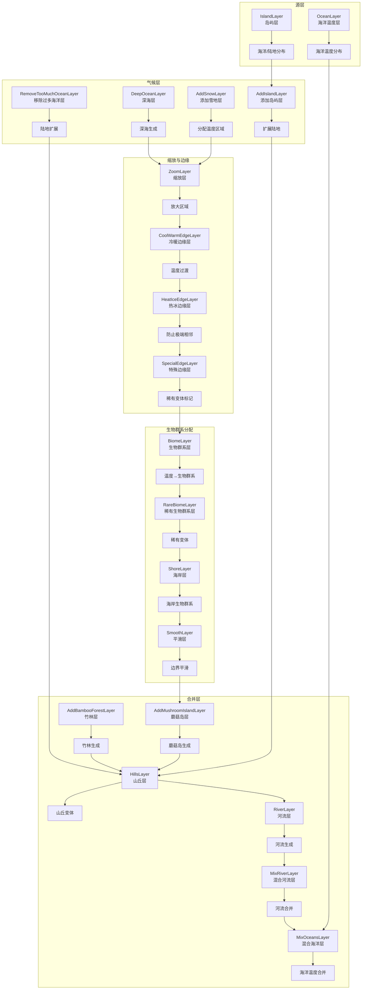
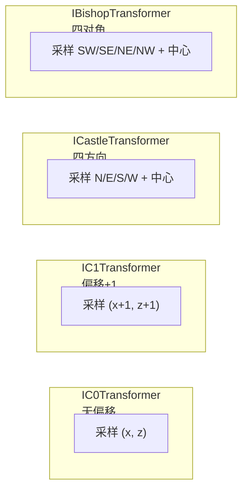
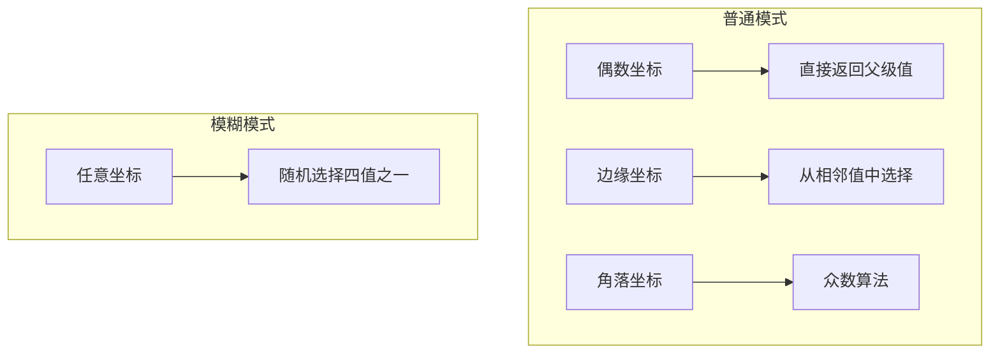
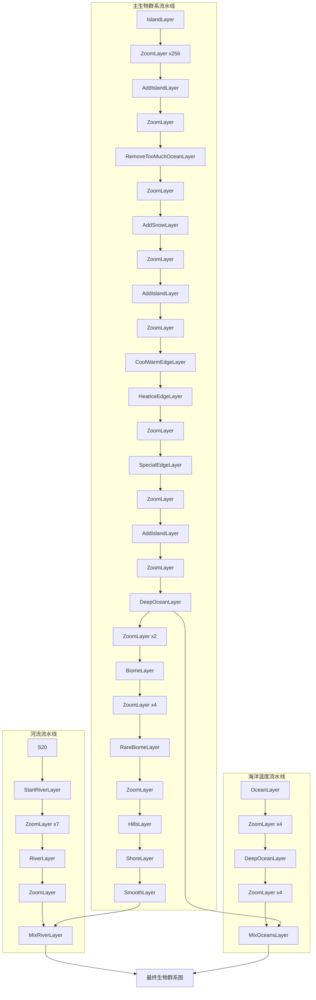
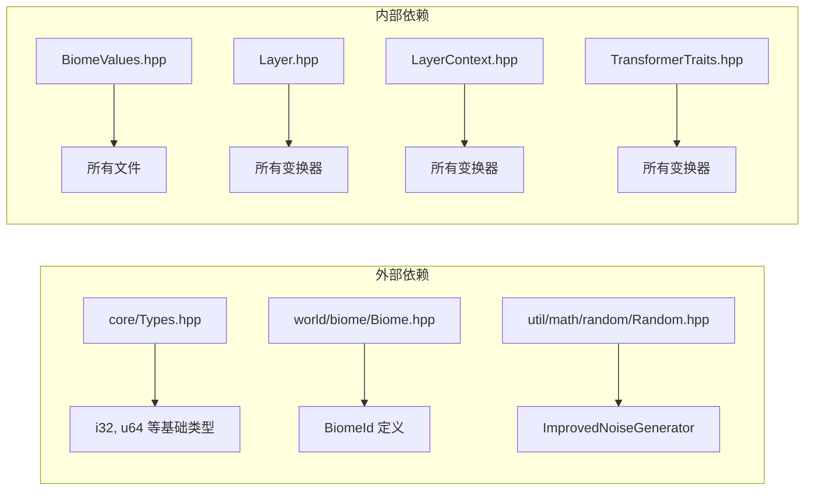

# 生物群系层系统 (Biome Layer System)

## 目录结构

```
layer/
├── BiomeValues.hpp          # 生物群系值常量定义
├── BiomeValues.cpp          # 生物群系值辅助函数实现
├── Layer.hpp                # 层系统核心接口定义
├── LayerCacheConfig.hpp     # 层缓存配置
├── LayerContext.hpp         # 层上下文接口
├── LayerContext.cpp         # 层上下文实现
├── LayerUtil.hpp            # 层工具函数
├── LayerUtil.cpp            # 层工具函数实现
└── transformers/            # 变换器实现
    ├── TransformerTraits.hpp    # 变换器特征类（采样模式）
    ├── TransformerTraits.cpp    # 变换器特征类实现
    ├── SourceLayers.hpp         # 源层（岛屿、海洋温度）
    ├── SourceLayers.cpp         # 源层实现
    ├── ClimateLayers.hpp        # 气候层（岛屿扩展、雪地、深海）
    ├── ClimateLayers.cpp        # 气候层实现
    ├── ZoomLayers.hpp           # 缩放层
    ├── ZoomLayers.cpp           # 缩放层实现
    ├── EdgeLayers.hpp           # 边缘层（冷暖、热冰、特殊边缘）
    ├── EdgeLayers.cpp           # 边缘层实现
    ├── BiomeLayers.hpp          # 生物群系分配层
    ├── BiomeLayers.cpp          # 生物群系分配层实现
    └── MergeLayers.hpp          # 合并层（蘑菇岛、竹林、河流、山丘）
    └── MergeLayers.cpp          # 合并层实现
```

## 整体职责

本模块实现了 Minecraft 1.16.5 的生物群系层生成系统，采用分层叠加的方式生成世界生物群系分布。



## 核心文件详解

### BiomeValues.hpp / BiomeValues.cpp

**职责**: 定义生物群系层系统使用的所有常量值和辅助函数。

**主要内容**:

```cpp
namespace BiomeValues {
    // 基础生物群系 ID (与 MC 1.16.5 完全一致)
    constexpr i32 Ocean = 0;
    constexpr i32 Plains = 1;
    constexpr i32 Desert = 2;
    // ... 170+ 生物群系常量

    // 气候区域值
    namespace Climate {
        constexpr i32 Warm = 1;    // 温暖区域
        constexpr i32 Medium = 2;  // 中等温度
        constexpr i32 Cool = 3;    // 凉爽区域
        constexpr i32 Icy = 4;     // 冰冻区域
    }

    // 特殊位操作
    namespace SpecialBits {
        constexpr i32 Mask = 0xF00;
        i32 extract(i32 value);
        i32 set(i32 value, i32 special);
    }

    // 辅助判断函数
    bool isOcean(i32 biome);
    bool isShallowOcean(i32 biome);
    bool isBadlands(i32 biome);
    bool isJungle(i32 biome);
    bool isSnowy(i32 biome);
    bool isMountain(i32 biome);
    bool areBiomesSimilar(i32 a, i32 b);
}
```

**关键概念**:
- 生物群系 ID 直接使用 MC 1.16.5 的数值
- 气候区域值用于中间处理（1=温暖, 2=中等, 3=凉爽, 4=冰冻）
- 特殊位存储在 bits 8-11，用于稀有变体生成

---

### Layer.hpp

**职责**: 定义层系统的核心接口。

**主要接口**:

```cpp
// 区域接口 - 表示一个二维值矩阵
class IArea {
public:
    virtual ~IArea() = default;
    [[nodiscard]] virtual i32 getValue(i32 x, i32 z) const = 0;
};

// 区域工厂接口 - 创建区域
class IAreaFactory {
public:
    virtual ~IAreaFactory() = default;
    [[nodiscard]] virtual std::unique_ptr<IArea> create(i32 x, i32 z, u32 size) = 0;
};

// 区域上下文接口 - 提供随机数和噪声
class IAreaContext {
public:
    virtual ~IAreaContext() = default;
    virtual void setPosition(i64 x, i64 z) = 0;
    [[nodiscard]] virtual i32 nextInt(i32 bound) = 0;
    [[nodiscard]] virtual i32 pickRandom(i32 a, i32 b) = 0;
    [[nodiscard]] virtual i32 pickRandom(i32 a, i32 b, i32 c, i32 d) = 0;
    [[nodiscard]] virtual ImprovedNoiseGenerator* getNoiseGenerator() = 0;
};

// 变换器接口
class ITransformer0 { ... };  // 无输入（源层）
class ITransformer1 { ... };  // 单输入
class ITransformer2 { ... };  // 双输入
```

---

### LayerContext.hpp / LayerContext.cpp

**职责**: 提供层变换所需的上下文（随机数生成、噪声、缓存管理）。

**主要内容**:

```cpp
class LayerContext : public IExtendedAreaContext,
                     public std::enable_shared_from_this<LayerContext> {
public:
    // 初始化
    void init(u64 worldSeed, u64 layerSeed);

    // 随机数生成
    void setPosition(i64 x, i64 z) override;
    i32 nextInt(i32 bound) override;

    // 噪声生成器
    ImprovedNoiseGenerator* getNoiseGenerator() override;

    // 缓存配置
    void setCacheConfig(const LayerCacheConfig& config);

private:
    u64 m_worldSeed;
    u64 m_layerSeed;
    u64 m_currentSeed;
    std::unique_ptr<ImprovedNoiseGenerator> m_noise;
};
```

---

### transformers/TransformerTraits.hpp / TransformerTraits.cpp

**职责**: 定义不同的邻域采样模式，简化变换器实现。

**采样模式对比**:



**采样坐标详解**:

| 变换器 | 偏移 | 采样点 | 用途 |
|--------|------|--------|------|
| `IC0Transformer` | 无 | `(x, z)` | 单点变换 |
| `IC1Transformer` | +1 | `(x+1, z+1)` | 需要周围上下文 |
| `ICastleTransformer` | +1 | N:`(x+1,z)` E:`(x+2,z+1)` S:`(x+1,z+2)` W:`(x,z+1)` C:`(x+1,z+1)` | 边缘检测、平滑 |
| `IBishopTransformer` | +1 | SW:`(x,z+2)` SE:`(x+2,z+2)` NE:`(x+2,z)` NW:`(x,z)` C:`(x+1,z+1)` | 岛屿扩展 |

---

### transformers/SourceLayers.hpp / SourceLayers.cpp

**职责**: 生成初始数据（岛屿分布、海洋温度）。

**变换器**:

| 类 | 描述 | 输出值 |
|----|------|--------|
| `IslandLayer` | 初始岛屿生成 | 0=海洋, 1=陆地 |
| `OceanLayer` | 海洋温度分布 | 44=暖海洋, 45=温水海洋, 0=普通海洋, 46=冷水海洋, 10=冻结海洋 |

---

### transformers/ClimateLayers.hpp / ClimateLayers.cpp

**职责**: 处理气候相关的变换。

**变换器**:

| 类 | 采样模式 | 描述 |
|----|----------|------|
| `AddIslandLayer` | Bishop | 在海洋中扩展陆地 |
| `AddSnowLayer` | C1 | 为陆地分配温度区域 |
| `RemoveTooMuchOceanLayer` | Castle | 减少过多海洋 |
| `DeepOceanLayer` | Castle | 生成深海区域 |

---

### transformers/ZoomLayers.hpp / ZoomLayers.cpp

**职责**: 将区域放大 2 倍。

**缩放算法**:



**众数算法 (pickZoomed)**:
1. 如果三值相同，返回该值
2. 如果两值相同且另外两个不同，返回相同的值
3. 全部不同，随机选择

---

### transformers/EdgeLayers.hpp / EdgeLayers.cpp

**职责**: 处理生物群系边缘过渡。

**变换器**:

| 类 | 功能 |
|----|------|
| `CoolWarmEdgeLayer` | 防止温暖区域直接接触冰冻区域 |
| `HeatIceEdgeLayer` | 防止炎热区域直接接触冰冻区域 |
| `SpecialEdgeLayer` | 为非海洋区域添加特殊变体位 (1/13 概率) |
| `BiomeEdgeLayer` | 处理生物群系边缘过渡（沼泽、沙漠、山地等） |

---

### transformers/BiomeLayers.hpp / BiomeLayers.cpp

**职责**: 将气候值转换为实际生物群系 ID。

**主要变换器**:

```cpp
class BiomeLayer : public IC0Transformer {
    // 温度值 → 生物群系
    // Warm (1) → Desert, Savanna, Plains
    // Medium (2) → Forest, DarkForest, Mountains, Plains, BirchForest, Swamp
    // Cool (3) → Forest, GiantTreeTaigaHills, Mountains, Plains, BirchForest, Swamp
    // Icy (4) → SnowyPlains, WoodedMountains
};

class RareBiomeLayer : public IC1Transformer {
    // Plains → SunflowerPlains (1/57 概率)
};

class ShoreLayer : public ICastleTransformer {
    // 处理海岸生物群系
    // MushroomFields → MushroomFieldShore
    // Jungle → JungleEdge
    // Snowy → SnowyBeach
    // Mountains → StoneShore
    // 其他 → Beach
};

class SmoothLayer : public ICastleTransformer {
    // 平滑生物群系边界
};
```

---

### transformers/MergeLayers.hpp / MergeLayers.cpp

**职责**: 合并多个输入层，生成复杂变体。

**变换器**:

| 类 | 输入数 | 功能 |
|----|--------|------|
| `AddMushroomIslandLayer` | 1 | 在被浅海包围的位置生成蘑菇岛 (1% 概率) |
| `AddBambooForestLayer` | 1 | 在丛林中生成竹林 (1/10 概率) |
| `StartRiverLayer` | 1 | 为非海洋位置生成河流噪声值 |
| `RiverLayer` | 1 | 从河流噪声值生成河流通道 |
| `HillsLayer` | 2 | 合并生物群系层和河流噪声层，生成山丘变体 |
| `MixRiverLayer` | 2 | 将河流与生物群系层合并 |
| `MixOceansLayer` | 2 | 将海洋温度与生物群系层合并 |

---

## 层生成流水线



## 输入和输出

### 输入

| 输入项 | 类型 | 描述 |
|--------|------|------|
| 世界种子 | `u64` | 用于生成确定性的随机序列 |
| 层种子 | `u64` | 每层的独立种子 |
| 坐标 | `(i32, i32)` | 要查询的世界坐标 |

### 输出

| 输出项 | 类型 | 描述 |
|--------|------|------|
| 生物群系 ID | `i32` | MC 1.16.5 兼容的生物群系 ID |
| 区域数据 | `IArea` | 二维生物群系矩阵 |

## 依赖项



## 使用方法

### 基本用法

```cpp
#include "world/biome/layer/LayerContext.hpp"
#include "world/biome/layer/transformers/SourceLayers.hpp"
#include "world/biome/layer/transformers/ClimateLayers.hpp"
#include "world/biome/layer/transformers/ZoomLayers.hpp"
#include "world/biome/layer/transformers/BiomeLayers.hpp"

using namespace mc::layer;

// 创建上下文
auto context = std::make_shared<LayerContext>();
context->init(worldSeed, 1000);

// 构建层流水线
IslandLayer islandLayer;
auto factory = islandLayer.apply(*context);

ZoomLayer zoom(ZoomLayer::Mode::Normal);
factory = zoom.apply(*context, std::move(factory));

AddSnowLayer addSnow;
factory = addSnow.apply(*context, std::move(factory));

// ... 继续添加更多层

// 查询生物群系
auto area = factory->create(chunkX, chunkZ, 16);
for (i32 z = 0; z < 16; ++z) {
    for (i32 x = 0; x < 16; ++x) {
        i32 biomeId = area->getValue(x, z);
        // 使用 biomeId
    }
}
```

### 使用 LayerBiomeProvider

```cpp
#include "world/biome/layer/LayerUtil.hpp"

// 创建生物群系提供者
LayerBiomeProvider provider(worldSeed);

// 查询生物群系
BiomeId biome = provider.getBiome(blockX, 64, blockZ);

// 查询噪声坐标生物群系（1 噪声单元 = 4 方块）
BiomeId noiseBiome = provider.getNoiseBiome(noiseX, 0, noiseZ);
```

## 容易踩的坑

### 1. 坐标系混淆

**问题**: MC 坐标系与层内部坐标系不同。

```cpp
// 错误：直接使用世界坐标
auto area = factory->create(worldX, worldZ, size);

// 正确：使用区块坐标
auto area = factory->create(chunkX, chunkZ, size);
```

### 2. 变换器偏移

**问题**: 不同变换器有不同的偏移要求。

```cpp
// IC1Transformer 的采样点偏移 +1
// 内部调用: area.getValue(x + 1, z + 1)

// 如果需要获取正确的世界坐标，需要考虑偏移
i32 worldBiome = area.getValue(x + 1, z + 1);  // 对于 IC1Transformer
```

### 3. 缓存失效

**问题**: 未正确设置缓存配置导致性能问题。

```cpp
// 设置缓存配置
LayerCacheConfig config;
config.maxCacheSize = 1024 * 1024;  // 1MB
context->setCacheConfig(config);
```

### 4. 随机种子一致性

**问题**: 多次查询同一坐标应返回相同结果。

```cpp
// 必须先调用 setPosition 设置坐标
context->setPosition(x, z);
i32 value = transformer.apply(*context, ...);
```

### 5. 海洋温度判断

**问题**: `isShallowOcean` 与 `isOcean` 的区别。

```cpp
// isShallowOcean: 仅浅海 (Ocean, WarmOcean, LukewarmOcean, ColdOcean, FrozenOcean)
// isOcean: 所有海洋（包括深海）

// DeepOceanLayer 使用 isShallowOcean 判断
if (BiomeValues::isShallowOcean(center)) {
    // 只有浅海才能变成深海
}
```

### 6. 特殊位处理

**问题**: BiomeLayer 使用特殊位标记稀有变体。

```cpp
// 特殊位存储在 bits 8-11
i32 special = BiomeValues::SpecialBits::extract(value);
value = value & ~BiomeValues::SpecialBits::Mask;  // 清除特殊位

// 带 SpecialEdgeLayer 后，特殊位可能被设置
// BiomeLayer 会根据特殊位生成恶地变体
```

### 7. 噪声坐标批量采样步长

**问题**: 将噪声坐标批量采样错误地当作连续方块坐标会压缩采样窗口，导致地形起伏异常偏小。

```cpp
// 错误：起点放大后直接按 1 方块步长连续采样
sampleBatch(startNoiseX << 2, startNoiseZ << 2, width, height, output);

// 正确：保持噪声网格语义，与 getNoiseBiome(startNoiseX + x, ...) 一致
for (i32 z = 0; z < height; ++z) {
    for (i32 x = 0; x < width; ++x) {
        output[idx++] = sample(startNoiseX + x, startNoiseZ + z);
    }
}
```

## 涉及的测试用例

### tests/common/world/biome/layer/BiomeLayerTest.cpp

| 测试类 | 测试内容 |
|--------|----------|
| `BiomeLayerTest` | 海洋值保持、气候→生物群系映射、特殊位处理 |
| `RareBiomeLayerTest` | 平原→向日葵平原转换 |
| `SmoothLayerTest` | 边界平滑算法 |
| `ShoreLayerTest` | 海岸生物群系生成 |
| `BiomeValuesTest` | 辅助函数正确性 |

### tests/common/world/biome/layer/MergeLayersTest.cpp

| 测试类 | 测试内容 |
|--------|----------|
| `AddMushroomIslandLayerTest` | 蘑菇岛生成条件 |
| `AddBambooForestLayerTest` | 竹林生成概率 |
| `RiverLayerTest` | 河流生成逻辑 |
| `MixRiverLayerTest` | 河流与生物群系合并 |
| `MixOceansLayerTest` | 海洋温度合并 |
| `HillsLayerTest` | 山丘变体生成 |
| `StartRiverLayerTest` | 河流噪声生成 |

---

## 参考资料

- [Minecraft 1.16.5 源码](https://minecraft.gamepedia.com/Java_Edition_1.16.5)
- [生物群系 ID 列表](https://minecraft.gamepedia.com/Biome#Biome_IDs)
- MC 源码路径: `D:\Minecraft\MC研究\Minecraft1.16.5源码\net\minecraft\world\biome\layer`
