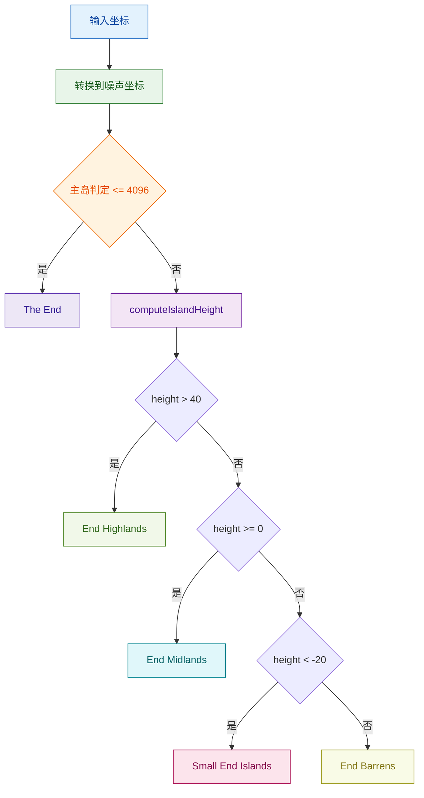

# 末地生物群系提供者模块

该模块实现末地维度生物群系分布，当前逻辑按 MC 1.16.5 对齐：
- 采用原版岛屿高度函数（`func_235317_a_` 对应实现）
- 使用原版阈值选择 Highlands/Midlands/Small Islands/Barrens
- 使用噪声网格坐标填充 `BiomeContainer`

## 目录结构树

```text
provider/end/
├── EndBiomeProvider.hpp  # 接口与常量定义
├── EndBiomeProvider.cpp  # 原版对齐实现
└── README.md             # 本文档
```

## 文件介绍

- `EndBiomeProvider.hpp`
    - 提供 `getBiome/getNoiseBiome/fillBiomeContainer` 等接口。
    - 暴露 `isInMainIsland` 与 `getIslandHeight` 供调试与测试使用。
- `EndBiomeProvider.cpp`
    - 构造时执行与原版一致的随机数跳过（`skip(17292)`）后初始化 `SimplexNoiseGenerator`。
    - 使用 `computeIslandHeight`（原版 `func_235317_a_`）计算外岛高度。
    - 按阈值映射到 5 种末地生物群系。

## 模块关系

- 依赖：`BiomeProvider`、`SimplexNoiseGenerator`、`BiomeContainer`。
- 被调用方：末地区块生成器在生物群系采样阶段调用本模块。
- 数据流：
    - 输入世界/噪声坐标与种子
    - 输出 `BiomeId` 或填充后的 `BiomeContainer`

## 整体职责

1. 判断主岛范围（`(noiseX>>2)^2 + (noiseZ>>2)^2 <= 4096`）。
2. 对外岛执行岛屿高度计算，模拟原版远端浮岛地形权重。
3. 根据高度阈值返回生物群系：
     - `> 40` -> `EndHighlands`
     - `>= 0` -> `EndMidlands`
     - `< -20` -> `SmallEndIslands`
     - 其余 -> `EndBarrens`
4. 以噪声网格坐标填充整块生物群系容器（垂直方向复用）。

## 输入/输出

- 输入：
    - `seed`：世界种子
    - `(x, y, z)` 或 `(noiseX, noiseY, noiseZ)`
    - `chunkX/chunkZ`（容器填充）
- 输出：
    - 单点 `BiomeId`
    - 已填充的 `BiomeContainer`

## 依赖项

- 内部依赖：
    - `world/biome/BiomeProvider.hpp`
    - `world/gen/noise/OctavesNoiseGenerator.hpp`（含 `SimplexNoiseGenerator`）
    - `world/biome/layer/BiomeValues.hpp`
- 关键常量：
    - `MAIN_ISLAND_RADIUS_SQ = 4096`

## 使用方法

```cpp
#include "world/biome/provider/end/EndBiomeProvider.hpp"

mc::biome::end::EndBiomeProvider provider(seed);

mc::BiomeId biome = provider.getBiome(x, 0, z);
mc::BiomeId noiseBiome = provider.getNoiseBiome(noiseX, 0, noiseZ);

mc::BiomeContainer container;
provider.fillBiomeContainer(container, chunkX, chunkZ);
```

## 容易踩的坑

- `getBiome` 会将世界坐标转为噪声坐标（右移 2 位）后再走统一逻辑。
- `fillBiomeContainer` 使用噪声网格起点 `chunkX<<2`/`chunkZ<<2`，不是方块坐标中心采样。
- 主岛判定与外岛阈值都以噪声空间计算，不能直接套用方块空间半径常量。
- 构造阶段缺少 `skip(17292)` 会导致远岛分布与原版偏移。

## 测试用例

- `tests/common/test_biome.cpp`
    - `EndBiomeProviderTest.FillBiomeContainerMatchesHorizontalSamplingGrid`

## Mermaid 图表


