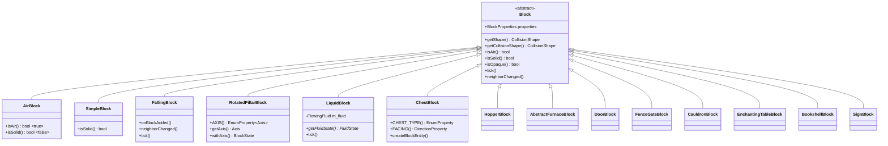

# Blocks 模块

本目录包含 Minecraft 中方块的专用基类实现。这些类继承自 `Block` 基类，为特定类型的方块提供专门的行为和属性。

## 目录结构

```
blocks/
├── AirBlock.hpp/cpp             # 空气方块（无碰撞、非固体、非不透明）
├── SimpleBlock.hpp/cpp          # 简单方块基类（无状态的静态方块）
├── FallingBlock.hpp/cpp         # 可下落方块基类（沙子、砾石等）
├── RotatedPillarBlock.hpp/cpp   # 旋转柱状方块（原木、玄武岩等，有 AXIS 属性）
├── LiquidBlock.hpp/cpp          # 液体方块（水、岩浆，关联 FlowingFluid）
├── ChestBlock.hpp/cpp           # 箱子方块（27格存储，支持双箱合并）
├── TrappedChestBlock.hpp/cpp    # 陷阱箱方块（红石信号输出，重写createBlockEntity返回TrappedChestEntity）
├── HopperBlock.hpp/cpp          # 漏斗方块（物品自动传输）
├── ShulkerBoxBlock.hpp/cpp      # 潜影盒方块（27格存储，防递归嵌套）
├── AbstractFurnaceBlock.hpp     # 熔炉方块基类（FACING + LIT 属性）
├── FurnaceBlock.hpp/cpp         # 普通熔炉方块
├── BlastFurnaceBlock.hpp/cpp    # 高炉方块（冶炼速度2x）
├── SmokerBlock.hpp/cpp          # 烟熏炉方块（食物烹饪2x）
├── DoorBlock.hpp/cpp            # 门方块（双方块结构，HALF/FACING/OPEN/HINGE/POWERED 属性）
├── FenceGateBlock.hpp/cpp       # 栅栏门方块（FACING/OPEN/IN_WALL/POWERED 属性）
├── CauldronBlock.hpp/cpp        # 炼药锅方块（LEVEL_0_3 属性，无方块实体）
├── EnchantingTableBlock.hpp/cpp # 附魔台方块（书架增强附魔力量、延迟tick初始化、邻居通知）
├── BookshelfBlock.hpp/cpp       # 书架方块（附魔力量提供者、主动通知附近附魔台）
├── SignBlock.hpp/cpp            # 告示牌方块（站立/墙面两种形式，含水支持）
├── redstone/                    # 红石方块子目录
│   ├── README.md                # 红石方块文档
│   └── ...（红石相关方块）
├── end/                         # 末地方块子目录
│   ├── README.md                # 末地方块文档
│   └── EndPortalBlock.hpp/cpp   # 末地传送门相关方块
├── building/                    # 建筑方块子目录（楼梯、台阶、墙、栅栏等）
│   └── README.md
├── agricultural/                # 农业方块子目录（农作物、农田等）
├── coral/                       # 珊瑚方块子目录
├── decorative/                  # 装饰方块子目录
├── functional/                  # 功能方块子目录
├── ice/                         # 冰方块子目录
├── mob/                         # 生物相关方块子目录
├── nether/                      # 下界方块子目录
├── ocean/                       # 海洋方块子目录
├── special/                     # 特殊方块子目录（海绵、屏障、命令方块等）
├── vegetation/                  # 植被方块子目录
└── README.md                    # 本文档
```

**子目录文档**：
- 红石方块详情请参阅 [redstone/README.md](redstone/README.md)
- 末地方块详情请参阅 [end/README.md](end/README.md)
- 建筑方块详情请参阅 [building/README.md](building/README.md)
- 特殊方块详情请参阅 [special/README.md](special/README.md)

## 内部模块关系



## 上下游依赖关系

### 上游依赖

| 依赖 | 用途 |
|------|------|
| `Block.hpp` | 基类定义 |
| `BlockState.hpp` | 状态管理 |
| `Material.hpp` | 材质定义 |
| `VoxelShapes.hpp` | 碰撞形状 |
| `Fluid.hpp` / `FlowingFluid.hpp` | LiquidBlock 关联的流体系统 |
| `Properties.hpp` | 方块属性（DirectionProperty、BooleanProperty 等） |
| `Direction.hpp` | 方向定义 |

### 下游依赖

| 模块 | 用途 |
|------|------|
| `VanillaBlocks.hpp` | 注册原版方块 |
| `BlockRegistry` | 方块注册表 |
| 世界生成 | 使用方块实例 |
| 渲染系统 | 方块渲染 |

## 容易踩的坑

### 1. 液体等级映射错误

方块 LEVEL（0-15）与流体 LEVEL（1-8）的映射关系容易混淆。始终使用静态转换方法：

```cpp
i32 fluidLevel = LiquidBlock::blockLevelToFluidLevel(blockLevel);
i32 blockLevel = LiquidBlock::fluidLevelToBlockLevel(fluidLevel, falling);
```

### 2. 状态缓存生命周期

`LiquidBlock::m_fluidStateCache` 存储 `FluidState` 对象而非指针，因为 FluidState 可能被修改。不要缓存返回的 `FluidState*` 指针，每次都调用 `getFluidState()`。

### 3. AirBlock 的特殊性

AirBlock 的 `isSolid()` 返回 `false`，可能导致意外的碰撞检测通过。在碰撞检测时同时检查 `isAir()`：

```cpp
if (!state.isAir() && state.isSolid()) {
    // 执行碰撞检测
}
```

### 4. RotatedPillarBlock 的默认轴向

默认轴向是 `Axis::X`（枚举第一个值），但大多数原木默认应该是 `Axis::Y`。在注册时设置默认状态：

```cpp
auto& block = BlockRegistry::instance().registerBlock<RotatedPillarBlock>(...);
block.setDefaultState(block.withAxis(block.defaultState(), Axis::Y));
```

### 5. FallingBlock 火焰穿透机制

`canFallThrough()` 检查火焰标签（`BlockTags::FIRE`），下落过程中 `FireBlock::getCollisionShape()` 返回空碰撞形状，双重保障确保下落方块能穿透火焰。

### 6. 门方块的双方块结构

DoorBlock 使用 `HALF` 属性区分上下半部分，操作时需要同时处理两个方块位置。破坏、放置、红石控制都需要正确处理上下半部分的同步。

### 7. 炼药锅使用方块状态存储水位

CauldronBlock 没有方块实体，使用 `LEVEL_0_3` 属性存储水位（0-3）。交互操作直接修改方块状态，不需要额外实体数据。

### 8. TrappedChestBlock 红石信号与双箱支持

`TrappedChestBlock` 重写了 `createBlockEntity()` 返回 `TrappedChestEntity`（而非继承自 `ChestBlock` 的默认 `ChestEntity`）。红石信号通过 `TrappedChestEntity::getRedstoneSignal(world)` 计算，该方法会自动聚合双箱两侧的打开玩家数，信号强度 = 打开玩家总数（最大15）。`TrappedChestBlock::getWeakPower()` 调用此方法而非直接读取 `openCount`，确保双陷阱箱的红石信号正确。强充能仅从顶面输出（`getStrongPower` 仅 `Direction::Up` 返回有效信号）。

### 9. 附魔台与书架的距离通知机制

附魔台检测书架的范围是水平2格、垂直0-1格（MC的BOOKSHELF_OFFSETS，共30个候选位置）。而 `ServerWorld::setBlockState` 的 `neighborChanged` 只通知1格距离的直接邻居。因此书架放置/移除时，`BookshelfBlock` 必须主动扫描5x3x5范围（dx∈[-2,2], dy∈[-1,1], dz∈[-2,2]）通知附近的附魔台重新计算附魔力量。附魔台自身的 `onBlockAdded` 会调度1tick延迟（因为方块实体在 `onBlockAdded` 之后才创建），在 `tick` 中完成首次附魔力量计算。

### 10. 书架方块使用 BlockTags 而非硬编码

`BookshelfBlock` 和 `EnchantingTableEntity` 使用 `BlockTags::ENCHANTMENT_POWER_PROVIDER` 标签判断书架（而非硬编码 `VanillaBlocks::BOOKSHELF` 指针），使用 `BlockState::canBeReplaced()` 判断中间方块是否可穿透（对应MC的 `ENCHANTMENT_POWER_TRANSMITTER` 标签）。这意味着任何被添加到 `minecraft:enchantment_power_provider` 标签的方块都会增强附魔力量。
