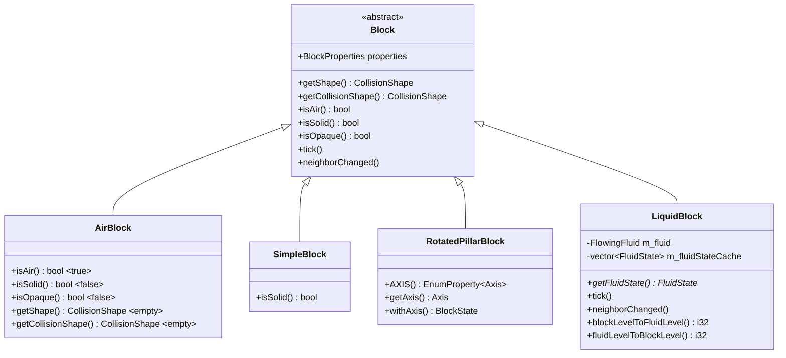
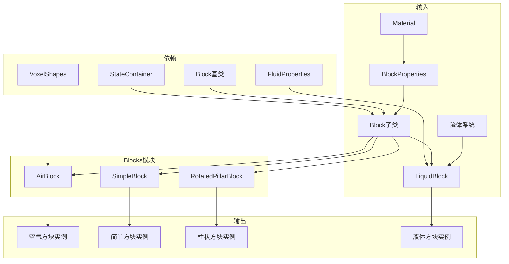
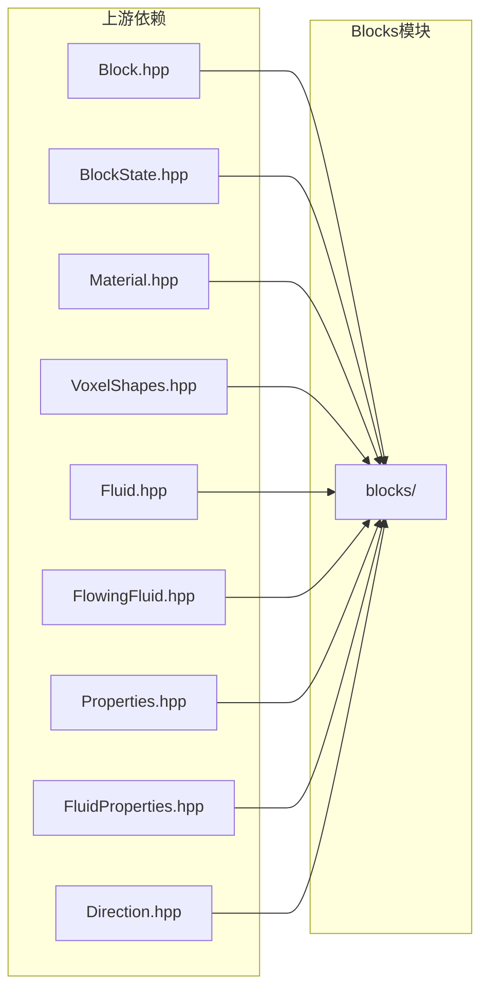

# Blocks 模块

本目录包含Minecraft中方块的专用基类实现。这些类继承自`Block`基类，为特定类型的方块提供专门的行为和属性。

## 目录结构

```
blocks/
├── AirBlock.hpp         # 空气方块头文件
├── AirBlock.cpp         # 空气方块实现
├── LiquidBlock.hpp      # 液体方块头文件
├── LiquidBlock.cpp      # 液体方块实现
├── RotatedPillarBlock.hpp  # 旋转柱状方块头文件
├── RotatedPillarBlock.cpp  # 旋转柱状方块实现
├── SimpleBlock.hpp      # 简单方块头文件
├── SimpleBlock.cpp      # 简单方块实现
└── README.md            # 本文档
```

## 类继承关系



## 文件详解

### AirBlock.hpp/cpp

**职责**: 定义空气方块，表示世界中空的空间。

**主要特性**:
- 无碰撞形状（`VoxelShapes::empty()`）
- 非固体、非不透明
- `isAir()`始终返回`true`
- 没有任何属性，状态容器为空

**使用场景**:
- 世界中未被任何方块占据的位置
- 方块被破坏后的默认状态

**参考**: `net.minecraft.block.AirBlock`

```cpp
// 使用示例
auto airBlock = std::make_unique<AirBlock>(
    BlockProperties(Material::AIR)
        .noCollision()
        .notSolid()
);
```

---

### SimpleBlock.hpp/cpp

**职责**: 简单方块基类，用于没有状态属性的静态方块。

**主要特性**:
- 没有任何属性
- `isSolid()`委托给材质的`isSolid()`
- 适合石头、泥土、基岩等基础方块

**使用场景**:
- 大多数静态方块（石头、泥土、沙子等）
- 不需要状态变化的方块

**参考**: `net.minecraft.block.Block`（无属性的简单情况）

```cpp
// 使用示例
auto stoneBlock = std::make_unique<SimpleBlock>(
    BlockProperties(Material::ROCK)
        .hardness(1.5f)
        .resistance(6.0f)
        .requiresTool()
);
```

---

### RotatedPillarBlock.hpp/cpp

**职责**: 旋转柱状方块，用于可绕轴旋转的方块。

**主要特性**:
- 拥有`AXIS`属性（X、Y、Z三个值）
- 提供`getAxis()`和`withAxis()`便捷方法
- 用于原木、柱状玄武岩、石英柱等

**状态数量**: 3个（X、Y、Z轴）

**使用场景**:
- 原木类方块（橡木、云杉、白桦等）
- 玄武岩、石英柱
- 任何需要轴向旋转的柱状方块

**参考**: `net.minecraft.block.RotatedPillarBlock`

```cpp
// 使用示例
auto oakLog = std::make_unique<RotatedPillarBlock>(
    BlockProperties(Material::WOOD)
        .hardness(2.0f)
);

// 设置轴向
const auto& state = oakLog->defaultState();
const auto& yState = oakLog->withAxis(state, Axis::Y);
const auto& xState = oakLog->withAxis(state, Axis::X);
```

---

### LiquidBlock.hpp/cpp

**职责**: 液体方块，作为流体系统与方块系统的桥梁。

**主要特性**:
- 关联`FlowingFluid`实例
- 拥有`LEVEL`属性（0-15）
- 实现方块等级与流体等级的双向转换
- 处理流体tick调度

**等级映射**:

| 方块LEVEL | 流体LEVEL | 说明 |
|-----------|-----------|------|
| 0 | 8 | 源头 |
| 1-7 | 7-1 | 流动（递减） |
| 8-15 | 8 + falling | 下落 |

**缓存机制**:
- 预缓存16种流体状态对应方块LEVEL 0-15
- 避免运行时频繁创建FluidState对象

**使用场景**:
- 水方块（`minecraft:water`）
- 岩浆方块（`minecraft:lava`）

**参考**: `net.minecraft.block.LiquidBlock`

```cpp
// 使用示例（水的注册）
auto waterFluid = FluidRegistry::getFlowingWater();
auto waterBlock = std::make_unique<LiquidBlock>(
    *waterFluid,
    BlockProperties(Material::WATER)
        .noCollision()
        .notSolid()
);
```

## 模块整体职责



### 整体职责

1. **提供方块类型特化**：为不同类型的方块提供专门的基类
2. **属性管理**：为需要属性的方块（如轴向）定义属性
3. **系统集成**：将流体系统集成到方块系统中
4. **行为定制**：重写Block基类方法实现特定行为

### 输入

| 输入类型 | 来源 | 用途 |
|----------|------|------|
| `BlockProperties` | 调用方提供 | 配置方块属性（硬度、材质等） |
| `Material` | 调用方提供 | 定义方块材质特性 |
| `FlowingFluid` | 流体系统 | LiquidBlock关联的流体实例 |

### 输出

| 输出类型 | 说明 |
|----------|------|
| `Block`实例 | 注册到BlockRegistry的方块对象 |
| `BlockState`实例 | 通过状态容器生成的状态对象 |

## 依赖关系

### 上游依赖



| 依赖 | 用途 |
|------|------|
| `Block.hpp` | 基类定义 |
| `BlockState.hpp` | 状态管理 |
| `Material.hpp` | 材质定义 |
| `VoxelShapes.hpp` | 碰撞形状 |
| `Fluid.hpp` | 流体基类 |
| `FlowingFluid.hpp` | 流动流体 |
| `Properties.hpp` | 方块属性 |
| `FluidProperties.hpp` | 流体属性 |
| `Direction.hpp` | 方向定义 |

### 下游依赖

| 模块 | 用途 |
|------|------|
| `VanillaBlocks.hpp` | 注册原版方块 |
| `BlockRegistry` | 方块注册表 |
| 世界生成 | 使用方块实例 |
| 渲染系统 | 方块渲染 |

## 使用方法

### 注册简单方块

```cpp
// 在VanillaBlocks中
auto stone = BlockRegistry::instance().registerBlock<SimpleBlock>(
    ResourceLocation("minecraft:stone"),
    BlockProperties(Material::ROCK)
        .hardness(1.5f)
        .resistance(6.0f)
        .requiresTool()
        .harvestTool(HarvestTool::Pickaxe)
        .harvestLevel(0)
);
```

### 注册旋转柱状方块

```cpp
auto oakLog = BlockRegistry::instance().registerBlock<RotatedPillarBlock>(
    ResourceLocation("minecraft:oak_log"),
    BlockProperties(Material::WOOD)
        .hardness(2.0f)
);
```

### 注册液体方块

```cpp
// 获取流体实例
auto& waterFluid = FluidRegistry::instance().getWater();

auto waterBlock = BlockRegistry::instance().registerBlock<LiquidBlock>(
    ResourceLocation("minecraft:water"),
    waterFluid,
    BlockProperties(Material::WATER)
        .noCollision()
        .notSolid()
        .propagatesSkylightDown()
);
```

### 方块状态操作

```cpp
// 获取轴向
Axis axis = logBlock->getAxis(state);

// 设置轴向
const auto& newState = logBlock->withAxis(state, Axis::Y);

// 检查是否为空气
if (block->isAir(state)) {
    // 处理空气
}

// 检查是否为液体
const auto* fluidState = block->getFluidState(state);
if (fluidState && !fluidState->isEmpty()) {
    // 处理液体
}
```

## 容易踩的坑

### 1. 液体等级映射错误

**问题**: 方块LEVEL与流体LEVEL的映射关系容易混淆。

| 类型 | 范围 | 说明 |
|------|------|------|
| 方块LEVEL | 0-15 | 用于方块状态存储 |
| 流体LEVEL | 1-8 | 用于流体逻辑 |

**解决方案**: 始终使用静态转换方法：
```cpp
i32 fluidLevel = LiquidBlock::blockLevelToFluidLevel(blockLevel);
i32 blockLevel = LiquidBlock::fluidLevelToBlockLevel(fluidLevel, falling);
```

### 2. 状态缓存生命周期

**问题**: `LiquidBlock::m_fluidStateCache`存储`FluidState`对象而非指针，这是因为FluidState可能被修改。

**解决方案**: 不要缓存返回的`FluidState*`指针，每次都调用`getFluidState()`。

### 3. AirBlock的特殊性

**问题**: AirBlock的`isSolid()`返回`false`，可能导致意外的碰撞检测通过。

**解决方案**: 在碰撞检测时同时检查`isAir()`：
```cpp
if (!state.isAir() && state.isSolid()) {
    // 执行碰撞检测
}
```

### 4. RotatedPillarBlock的默认轴向

**问题**: 默认轴向是`Axis::X`（枚举第一个值），但大多数原木默认应该是`Axis::Y`。

**解决方案**: 在注册时设置默认状态：
```cpp
auto& block = BlockRegistry::instance().registerBlock<RotatedPillarBlock>(...);
block.setDefaultState(block.withAxis(block.defaultState(), Axis::Y));
```

### 5. 简单方块的状态

**问题**: SimpleBlock虽然没有属性，但仍然有一个状态（空状态）。

**说明**: 状态容器不为空，包含一个默认状态。这是为了保持Block接口的一致性。

## 测试覆盖

### test_block.cpp

| 测试用例 | 覆盖内容 |
|----------|----------|
| `MaterialTest.PredefinedMaterials` | 材质特性测试 |
| `MaterialTest.MaterialBuilder` | 材质构建器测试 |
| `BlockPropertiesTest.*` | 方块属性配置测试 |
| `StateContainerTest.*` | 状态容器测试 |
| `BlockStateTest.*` | 状态操作测试 |
| `BlockTest.*` | 方块基础测试 |
| `BlockRegistryTest.*` | 注册表测试 |
| `VanillaBlocksTest.Initialization` | 原版方块初始化测试 |

### test_block_item.cpp

| 测试用例 | 覆盖内容 |
|----------|----------|
| `BlockItemTest.RegistryMapsStoneBlockItem` | 方块物品映射测试 |
| `BlockItemTest.CreativeInventoryGetsRegisteredBlockItems` | 创造模式物品栏测试 |
| `BlockItemTest.PlacementContextUsesAdjacentPosForSolidBlock` | 放置上下文测试 |

### 运行测试

```powershell
# 运行所有方块相关测试
./build/bin/Release/mc_tests.exe --gtest_filter="*Block*"

# 运行特定测试
./build/bin/Release/mc_tests.exe --gtest_filter="VanillaBlocksTest.*"
```

## 扩展指南

### 添加新的方块基类

1. 在`blocks/`目录下创建新的头文件和源文件
2. 继承自`Block`基类
3. 在构造函数中创建状态容器
4. 重写需要的虚方法
5. 更新本README文档

```cpp
// 示例：添加新的FacingBlock
class FacingBlock : public Block {
public:
    static const DirectionProperty& FACING();

    explicit FacingBlock(BlockProperties properties)
        : Block(properties) {
        auto container = StateContainer<Block, BlockState>::Builder(*this)
            .add(FACING())
            .create([](const Block& block, auto values, u32 id) {
                return std::make_unique<BlockState>(block, std::move(values), id);
            });
        createBlockState(std::move(container));
    }

    Direction getFacing(const BlockState& state) const;
    const BlockState& withFacing(const BlockState& state, Direction facing) const;
};
```

### 添加新的方块属性

1. 在`Properties.hpp`中定义属性
2. 在方块构造函数中使用`.add()`添加
3. 使用`state.with()`设置属性值

## 参考资料

- **Minecraft Wiki**: [Block](https://minecraft.wiki/w/Block)
- **Minecraft源码**: `net.minecraft.block` 包
- **项目架构文档**: `/CLAUDE.md`
