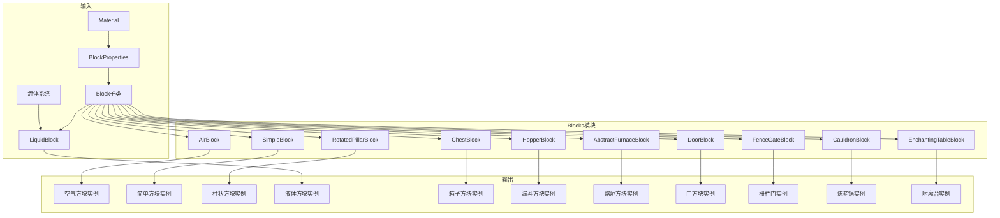
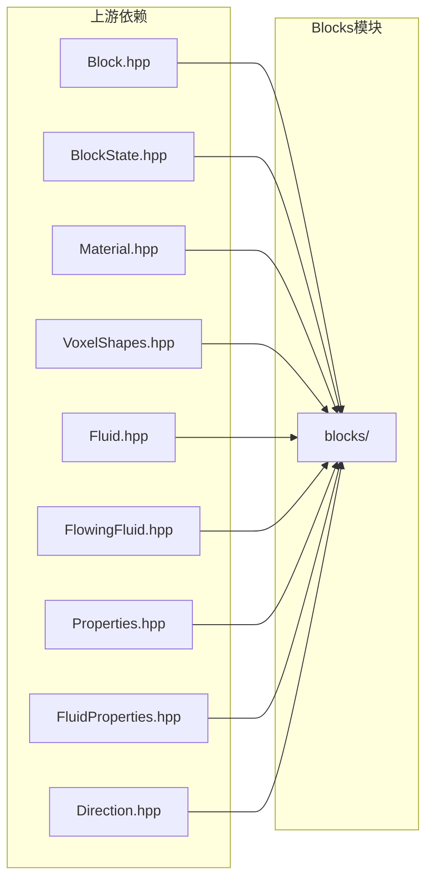

# Blocks 模块

本目录包含Minecraft中方块的专用基类实现。这些类继承自`Block`基类，为特定类型的方块提供专门的行为和属性。

## 目录结构

```
blocks/
├── AirBlock.hpp             # 空气方块头文件
├── AirBlock.cpp             # 空气方块实现
├── LiquidBlock.hpp          # 液体方块头文件
├── LiquidBlock.cpp          # 液体方块实现
├── RotatedPillarBlock.hpp   # 旋转柱状方块头文件
├── RotatedPillarBlock.cpp   # 旋转柱状方块实现
├── SimpleBlock.hpp          # 简单方块头文件
├── SimpleBlock.cpp          # 简单方块实现
├── FallingBlock.hpp         # 可下落方块头文件
├── FallingBlock.cpp         # 可下落方块实现
├── ChestBlock.hpp           # 箱子方块头文件
├── ChestBlock.cpp           # 箱子方块实现
├── TrappedChestBlock.hpp    # 陷阱箱方块头文件
├── TrappedChestBlock.cpp    # 陷阱箱方块实现
├── HopperBlock.hpp          # 漏斗方块头文件
├── HopperBlock.cpp          # 漏斗方块实现
├── AbstractFurnaceBlock.hpp # 熔炉方块基类头文件
├── FurnaceBlocks.hpp        # 熔炉方块实现（熔炉/高炉/烟熏炉）
├── FurnaceBlocks.cpp        # 熔炉方块实现
├── DoorBlock.hpp            # 门方块头文件
├── DoorBlock.cpp            # 门方块实现
├── FenceGateBlock.hpp       # 栅栏门方块头文件
├── FenceGateBlock.cpp       # 栅栏门方块实现
├── CauldronBlock.hpp        # 炼药锅方块头文件
├── CauldronBlock.cpp        # 炼药锅方块实现
├── EnchantingTableBlock.hpp # 附魔台方块头文件
├── EnchantingTableBlock.cpp # 附魔台方块实现
├── SignBlock.hpp            # 告示牌方块头文件
├── SignBlock.cpp            # 告示牌方块实现
├── redstone/                # 红石方块子目录
│   ├── README.md            # 红石方块文档
│   ├── RedstoneBlock.hpp/cpp
│   ├── RedstoneTorchBlock.hpp/cpp
│   ├── RedstoneWallTorchBlock.hpp/cpp
│   ├── RedstoneWireBlock.hpp/cpp
│   ├── RedstoneDiodeBlock.hpp/cpp
│   ├── RedstoneRepeaterBlock.hpp/cpp
│   ├── RedstoneComparatorBlock.hpp/cpp
│   ├── ObserverBlock.hpp/cpp
│   ├── AbstractButtonBlock.hpp/cpp
│   ├── StoneButtonBlock.hpp/cpp
│   ├── WoodButtonBlock.hpp/cpp
│   ├── LeverBlock.hpp/cpp
│   ├── AbstractPressurePlateBlock.hpp/cpp
│   ├── StonePressurePlateBlock.hpp/cpp
│   ├── WoodPressurePlateBlock.hpp/cpp
│   ├── WeightedPressurePlateBlock.hpp/cpp
│   ├── DaylightDetectorBlock.hpp/cpp
│   ├── PistonBlock.hpp/cpp
│   ├── PistonHeadBlock.hpp/cpp
│   ├── MovingPistonBlock.hpp/cpp
│   ├── DispenserBlock.hpp/cpp
│   ├── DropperBlock.hpp/cpp
│   ├── TripWireBlock.hpp/cpp
│   ├── TripWireHookBlock.hpp/cpp
│   ├── NoteBlock.hpp/cpp
│   ├── TNTBlock.hpp/cpp
│   ├── TargetBlock.hpp/cpp
│   └── RedstoneLampBlock.hpp/cpp
├── end/                     # 末地方块子目录
│   ├── README.md            # 末地方块文档
│   └── EndPortalBlock.hpp/cpp # 末地传送门、传送门框架、折跃门、紫颂植物、紫颂花、龙蛋
├── building/                # 建筑方块子目录（楼梯、台阶、墙、栅栏等）
│   └── README.md
├── agricultural/            # 农业方块子目录（农作物、农田等）
├── coral/                   # 珊瑚方块子目录
├── decorative/              # 装饰方块子目录
├── functional/              # 功能方块子目录
├── ice/                     # 冰方块子目录
├── mob/                     # 生物相关方块子目录
├── nether/                  # 下界方块子目录
├── ocean/                   # 海洋方块子目录
├── special/                 # 特殊方块子目录
├── vegetation/              # 植被方块子目录
└── README.md                # 本文档
```

**注意**：
- 红石方块详情请参阅 [redstone/README.md](redstone/README.md)
- 末地方块详情请参阅 [end/README.md](end/README.md)
- 建筑方块详情请参阅 [building/README.md](building/README.md)
- 特殊方块详情请参阅 [special/README.md](special/README.md)（海绵、屏障、命令方块等）

## 类继承关系

```mermaid
classDiagram
    class Block {
        <<abstract>>
        +BlockProperties properties
        +getShape() CollisionShape
        +getCollisionShape() CollisionShape
        +isAir() bool
        +isSolid() bool
        +isOpaque() bool
        +tick()
        +neighborChanged()
    }

    class AirBlock {
        +isAir() bool ~true~
        +isSolid() bool ~false~
        +isOpaque() bool ~false~
        +getShape() CollisionShape ~empty~
        +getCollisionShape() CollisionShape ~empty~
    }

    class SimpleBlock {
        +isSolid() bool
    }

    class FallingBlock {
        +onBlockAdded()
        +neighborChanged()
        +tick()
    }

    class RotatedPillarBlock {
        +AXIS() EnumProperty~Axis~
        +getAxis() Axis
        +withAxis() BlockState
    }

    class LiquidBlock {
        -FlowingFluid m_fluid
        -vector~FluidState~ m_fluidStateCache
        +getFluidState() FluidState*
        +tick()
        +neighborChanged()
        +blockLevelToFluidLevel() i32
        +fluidLevelToBlockLevel() i32
    }

    class ChestBlock {
        +CHEST_TYPE() EnumProperty
        +FACING() DirectionProperty
        +createBlockEntity()
        +getShape()
    }

    class HopperBlock {
        +FACING() DirectionProperty
        +ENABLED() BooleanProperty
        +createBlockEntity()
    }

    class AbstractFurnaceBlock {
        +FACING() DirectionProperty
        +LIT() BooleanProperty
        +createBlockEntity()
    }

    class DoorBlock {
        +HALF() EnumProperty
        +FACING() DirectionProperty
        +OPEN() BooleanProperty
        +HINGE() EnumProperty
        +POWERED() BooleanProperty
        +toggleDoor()
    }

    class FenceGateBlock {
        +FACING() DirectionProperty
        +OPEN() BooleanProperty
        +IN_WALL() BooleanProperty
        +POWERED() BooleanProperty
        +getShape()
    }

    class CauldronBlock {
        +LEVEL_0_3() IntegerProperty
        +getLevel() i32
        +setLevel()
        +getComparatorInputOverride() i32
        +randomTick()
    }

    class EnchantingTableBlock {
        +createBlockEntity()
        +getShape()
        +getOcclusionShape()
        +onBlockAdded()
    }

    Block <|-- AirBlock
    Block <|-- SimpleBlock
    Block <|-- FallingBlock
    Block <|-- RotatedPillarBlock
    Block <|-- LiquidBlock
    Block <|-- ChestBlock
    Block <|-- HopperBlock
    Block <|-- AbstractFurnaceBlock
    Block <|-- DoorBlock
    Block <|-- FenceGateBlock
    Block <|-- CauldronBlock
    Block <|-- EnchantingTableBlock
```



## 文件详解

### AirBlock.hpp/cpp

**职责**: 定义空气方块，表示世界中空的空间。

**主要特性**:
- 无碰撞形状（`VoxelShapes::empty()`）
- 非固体、非不透明
- `isAir()`始终返回`true`
- 没有任何属性，状态容器为空

**使用场景**:
- 世界中未被任何方块占据的位置
- 方块被破坏后的默认状态

**参考**: `net.minecraft.block.AirBlock`

```cpp
// 使用示例
auto airBlock = std::make_unique<AirBlock>(
    BlockProperties(Material::AIR)
        .noCollision()
        .notSolid()
);
```

---

### SimpleBlock.hpp/cpp

**职责**: 简单方块基类，用于没有状态属性的静态方块。

**主要特性**:
- 没有任何属性
- `isSolid()`委托给材质的`isSolid()`
- 适合石头、泥土、基岩等基础方块

**使用场景**:
- 大多数静态方块（石头、泥土、沙子等）
- 不需要状态变化的方块

**参考**: `net.minecraft.block.Block`（无属性的简单情况）

```cpp
// 使用示例
auto stoneBlock = std::make_unique<SimpleBlock>(
    BlockProperties(Material::ROCK)
        .hardness(1.5f)
        .resistance(6.0f)
        .requiresTool()
);
```

---

### FallingBlock.hpp/cpp

**职责**: 可受重力影响的方块基类，用于沙子、红沙、砾石等。

**主要特性**:
- 放置后和邻居变化后会调度计划刻
- 在计划刻中检测下方支撑是否可通过
- 当下方不可支撑时，移除方块并生成 `FallingBlockEntity`

**canFallThrough 方法** (静态方法，判断方块是否可穿透):

根据 MC 1.16.5 `FallingBlock.canFallThrough()` 实现，按以下顺序检查：

| 检查顺序 | 条件 | 说明 |
|---------|------|------|
| 1 | `state->isAir()` | 空气方块 |
| 2 | `BlockTags::FIRE().contains(*state)` | 火焰标签（普通火、灵魂火） |
| 3 | `state->getMaterial().isLiquid()` | 液体材质（水、岩浆） |
| 4 | `state->getMaterial().isReplaceable()` | 可替换材质（草、火把等） |
| 5 | `!state->blocksMovement()` | 不阻挡移动的方块 |

**火焰穿透机制**:
- 下落方块开始下落时通过 `canFallThrough()` 检查火焰标签
- 下落过程中 `FireBlock::getCollisionShape()` 返回空碰撞形状，自然穿透
- 双重保障确保火焰穿透完整实现

**使用场景**:
- 沙子（`minecraft:sand`）
- 红沙（`minecraft:red_sand`）
- 砾石（`minecraft:gravel`）

**参考**: `net.minecraft.block.FallingBlock`

---

### RotatedPillarBlock.hpp/cpp

**职责**: 旋转柱状方块，用于可绕轴旋转的方块。

**主要特性**:
- 拥有`AXIS`属性（X、Y、Z三个值）
- 提供`getAxis()`和`withAxis()`便捷方法
- 用于原木、柱状玄武岩、石英柱等

**状态数量**: 3个（X、Y、Z轴）

**使用场景**:
- 原木类方块（橡木、云杉、白桦等）
- 玄武岩、石英柱
- 任何需要轴向旋转的柱状方块

**参考**: `net.minecraft.block.RotatedPillarBlock`

```cpp
// 使用示例
auto oakLog = std::make_unique<RotatedPillarBlock>(
    BlockProperties(Material::WOOD)
        .hardness(2.0f)
);

// 设置轴向
const auto& state = oakLog->defaultState();
const auto& yState = oakLog->withAxis(state, Axis::Y);
const auto& xState = oakLog->withAxis(state, Axis::X);
```

---

### LiquidBlock.hpp/cpp

**职责**: 液体方块，作为流体系统与方块系统的桥梁。

**主要特性**:
- 关联`FlowingFluid`实例
- 拥有`LEVEL`属性（0-15）
- 实现方块等级与流体等级的双向转换
- 处理流体tick调度

**等级映射**:

| 方块LEVEL | 流体LEVEL | 说明 |
|-----------|-----------|------|
| 0 | 8 | 源头 |
| 1-7 | 7-1 | 流动（递减） |
| 8-15 | 8 + falling | 下落 |

**缓存机制**:
- 预缓存16种流体状态对应方块LEVEL 0-15
- 避免运行时频繁创建FluidState对象

**使用场景**:
- 水方块（`minecraft:water`）
- 岩浆方块（`minecraft:lava`）

**参考**: `net.minecraft.block.LiquidBlock`

```cpp
// 使用示例（水的注册）
auto waterFluid = FluidRegistry::getFlowingWater();
auto waterBlock = std::make_unique<LiquidBlock>(
    *waterFluid,
    BlockProperties(Material::WATER)
        .noCollision()
        .notSolid()
);
```

---

### ChestBlock.hpp/cpp

**职责**: 箱子方块实现，提供27格存储容器。

**主要特性**:
- 拥有`CHEST_TYPE`属性（Single, Left, Right）用于双箱合并
- 拥有`HORIZONTAL_FACING`属性控制朝向
- 创建`ChestEntity`方块实体
- 支持红石比较器信号输出
- 右键交互通过 `IWorld::openContainer(...)` 进入共享菜单工厂，锁箱音效和猫坐阻挡仍由方块/方块实体负责

**状态数量**: 12个（4朝向 × 3类型）

**参考**: `net.minecraft.block.ChestBlock`

---

### HopperBlock.hpp/cpp

**职责**: 漏斗方块实现，提供物品自动传输功能。

**主要特性**:
- 拥有`FACING`属性控制输出方向（下、北、南、东、西）
- 拥有`ENABLED`属性控制红石禁用状态
- 创建`HopperEntity`方块实体
- 支持物品拉取和推送

**状态数量**: 10个（5方向 × 2启用状态）

**参考**: `net.minecraft.block.HopperBlock`

---

### AbstractFurnaceBlock.hpp / FurnaceBlocks.hpp/cpp

**职责**: 熔炉方块基类及实现（普通熔炉、高炉、烟熏炉）。

**主要特性**:
- 拥有`FACING`属性控制朝向
- 拥有`LIT`属性表示燃烧状态
- 创建对应的`FurnaceEntity`/`BlastFurnaceEntity`/`SmokerEntity`
- 支持交互打开GUI，并通过 `IWorld::openContainer(...)` 进入统一菜单入口

**状态数量**: 8个（4朝向 × 2燃烧状态）

**参考**: `net.minecraft.block.AbstractFurnaceBlock`, `net.minecraft.block.FurnaceBlock`

---

### DoorBlock.hpp/cpp

**职责**: 门方块实现，支持双方块结构和红石控制。

**主要特性**:
- 拥有`HALF`属性区分上下半部分
- 拥有`FACING`属性控制朝向
- 拥有`OPEN`属性控制开关状态
- 拥有`HINGE`属性区分左/右铰链
- 拥有`POWERED`属性表示红石充能

**状态数量**: 64个（2半 × 4朝向 × 2开关 × 2铰链 × 2充能）

**参考**: `net.minecraft.block.DoorBlock`

---

### FenceGateBlock.hpp/cpp

**职责**: 栅栏门方块实现，支持开关和围墙连接。

**主要特性**:
- 拥有`FACING`属性控制朝向
- 拥有`OPEN`属性控制开关状态
- 拥有`IN_WALL`属性表示在围墙中的状态
- 支持红石控制

**状态数量**: 32个（4朝向 × 2开关 × 2围墙 × 2充能）

**参考**: `net.minecraft.block.FenceGateBlock`

---

### CauldronBlock.hpp/cpp

**职责**: 炼药锅方块实现，使用方块状态存储水位。

**主要特性**:
- 拥有`LEVEL_0_3`属性表示水位（0-3）
- 无方块实体，使用状态存储
- 支持水桶、玻璃瓶、皮革盔甲、旗帜清洗交互
- 雨天自动填充水
- 支持红石比较器信号（水位）

**状态数量**: 4个（0-3水位）

**交互操作**:
- 水桶：装水（水位→3）、取水（水位-1）
- 玻璃瓶：取水（水位-1，变为水瓶）、倒水（水位+1，变为玻璃瓶）
- 皮革盔甲：清洗（水位-1，移除颜色）
- 旗帜/潜影盒：清洗（水位-1，移除图案/颜色）

**参考**: `net.minecraft.block.CauldronBlock`

---

### EnchantingTableBlock.hpp/cpp

**职责**: 附魔台方块实现，提供附魔功能。

**主要特性**:
- 创建`EnchantingTableEntity`方块实体
- 支持书架增强附魔力量
- 特殊形状和遮挡
- **客户端/服务端分流**：客户端直接返回Success，服务端打开附魔台GUI
- **容器打开**：通过`IWorld::openContainer(ContainerType::Enchantment, pos, player)`进入统一菜单入口

**交互逻辑**:
1. 客户端调用`onBlockActivated()`直接返回`ActionResultType::Success`
2. 服务端检查方块实体是否存在且类型正确
3. 服务端调用`openContainer()`打开附魔台GUI
4. 成功打开返回`ActionResultType::Consume`，失败返回`ActionResultType::Pass`

**附魔力量计算**:
- 有效书架：距离附魔台水平2格，垂直0-1格
- 书架与附魔台之间必须是空气
- 每个有效书架增加1点附魔力量（最大15）

**参考**: `net.minecraft.block.EnchantingTableBlock`

---

### SignBlock.hpp/cpp

**职责**: 告示牌方块实现，支持站立和墙面两种放置形式。

**类继承关系**:
```
Block
  └── AbstractSignBlock (抽象基类，实现 IWaterLoggable)
        ├── StandingSignBlock (站立告示牌)
        └── WallSignBlock (墙面告示牌)
```

**主要特性**:
- **AbstractSignBlock** (抽象基类):
  - 实现 `IWaterLoggable` 接口，支持含水
  - 创建 `SignEntity` 方块实体
  - 存储 `WoodType` 木材类型（8种）
  - `onBlockActivated()` 处理玩家右键点击，触发 `SignEntity::executeCommand()`

- **StandingSignBlock** (站立告示牌):
  - 拥有 `ROTATION_0_15` 属性（16个旋转方向，每22.5度）
  - 拥有 `WATERLOGGED` 属性
  - 需要下方固体方块支撑
  - 状态数量：32个（16旋转 × 2含水）

- **WallSignBlock** (墙面告示牌):
  - 拥有 `FACING` 属性（4个水平方向）
  - 拥有 `WATERLOGGED` 属性
  - 需要墙面固体方块附着
  - 状态数量：8个（4朝向 × 2含水）

**木材类型**:
| 枚举值 | 方块ID前缀 |
|--------|-----------|
| Oak | oak_sign, oak_wall_sign |
| Spruce | spruce_sign, spruce_wall_sign |
| Birch | birch_sign, birch_wall_sign |
| Jungle | jungle_sign, jungle_wall_sign |
| Acacia | acacia_sign, acacia_wall_sign |
| DarkOak | dark_oak_sign, dark_oak_wall_sign |
| Crimson | crimson_sign, crimson_wall_sign |
| Warped | warped_sign, warped_wall_sign |

**方块实体**:
- `SignEntity` 存储4行富文本
- 支持染色（16种染料颜色）
- 支持发光效果（荧光墨囊）
- 支持点击命令执行

**交互逻辑** (MC 1.16.5 参考: SignBlock.onBlockActivated()):
1. 玩家右键点击告示牌
2. 检查方块实体是否存在且为 SignEntity 类型
3. 调用 `SignEntity::executeCommand()` 处理点击事件
4. 返回 `ActionResultType::Success`（成功执行）或 `ActionResultType::Pass`（无处理）

**碰撞形状**:
- 站立告示牌：细长杆状（0.25-0.75 × 0-1 × 0.25-0.75）
- 墙面告示牌：薄板状（按朝向不同）

**参考**: `net.minecraft.block.AbstractSignBlock`, `net.minecraft.block.StandingSignBlock`, `net.minecraft.block.WallSignBlock`

---

## 模块整体职责



    subgraph "依赖"
        M[Block基类] --> B
        N[StateContainer] --> B
        O[VoxelShapes] --> F
        P[FluidProperties] --> E
    end
```

### 整体职责

1. **提供方块类型特化**：为不同类型的方块提供专门的基类
2. **属性管理**：为需要属性的方块（如轴向）定义属性
3. **系统集成**：将流体系统集成到方块系统中
4. **行为定制**：重写Block基类方法实现特定行为

### 输入

| 输入类型 | 来源 | 用途 |
|----------|------|------|
| `BlockProperties` | 调用方提供 | 配置方块属性（硬度、材质等） |
| `Material` | 调用方提供 | 定义方块材质特性 |
| `FlowingFluid` | 流体系统 | LiquidBlock关联的流体实例 |

### 输出

| 输出类型 | 说明 |
|----------|------|
| `Block`实例 | 注册到BlockRegistry的方块对象 |
| `BlockState`实例 | 通过状态容器生成的状态对象 |

## 依赖关系

### 上游依赖



| 依赖 | 用途 |
|------|------|
| `Block.hpp` | 基类定义 |
| `BlockState.hpp` | 状态管理 |
| `Material.hpp` | 材质定义 |
| `VoxelShapes.hpp` | 碰撞形状 |
| `Fluid.hpp` | 流体基类 |
| `FlowingFluid.hpp` | 流动流体 |
| `Properties.hpp` | 方块属性 |
| `FluidProperties.hpp` | 流体属性 |
| `Direction.hpp` | 方向定义 |

### 下游依赖

| 模块 | 用途 |
|------|------|
| `VanillaBlocks.hpp` | 注册原版方块 |
| `BlockRegistry` | 方块注册表 |
| 世界生成 | 使用方块实例 |
| 渲染系统 | 方块渲染 |

## 使用方法

### 注册简单方块

```cpp
// 在VanillaBlocks中
auto stone = BlockRegistry::instance().registerBlock<SimpleBlock>(
    ResourceLocation("minecraft:stone"),
    BlockProperties(Material::ROCK)
        .hardness(1.5f)
        .resistance(6.0f)
        .requiresTool()
        .harvestTool(HarvestTool::Pickaxe)
        .harvestLevel(0)
);
```

### 注册旋转柱状方块

```cpp
auto oakLog = BlockRegistry::instance().registerBlock<RotatedPillarBlock>(
    ResourceLocation("minecraft:oak_log"),
    BlockProperties(Material::WOOD)
        .hardness(2.0f)
);
```

### 注册液体方块

```cpp
// 获取流体实例
auto& waterFluid = FluidRegistry::instance().getWater();

auto waterBlock = BlockRegistry::instance().registerBlock<LiquidBlock>(
    ResourceLocation("minecraft:water"),
    waterFluid,
    BlockProperties(Material::WATER)
        .noCollision()
        .notSolid()
        .propagatesSkylightDown()
);
```

### 方块状态操作

```cpp
// 获取轴向
Axis axis = logBlock->getAxis(state);

// 设置轴向
const auto& newState = logBlock->withAxis(state, Axis::Y);

// 检查是否为空气
if (block->isAir(state)) {
    // 处理空气
}

// 检查是否为液体
const auto* fluidState = block->getFluidState(state);
if (fluidState && !fluidState->isEmpty()) {
    // 处理液体
}
```

## 容易踩的坑

### 1. 液体等级映射错误

**问题**: 方块LEVEL与流体LEVEL的映射关系容易混淆。

| 类型 | 范围 | 说明 |
|------|------|------|
| 方块LEVEL | 0-15 | 用于方块状态存储 |
| 流体LEVEL | 1-8 | 用于流体逻辑 |

**解决方案**: 始终使用静态转换方法：
```cpp
i32 fluidLevel = LiquidBlock::blockLevelToFluidLevel(blockLevel);
i32 blockLevel = LiquidBlock::fluidLevelToBlockLevel(fluidLevel, falling);
```

### 2. 状态缓存生命周期

**问题**: `LiquidBlock::m_fluidStateCache`存储`FluidState`对象而非指针，这是因为FluidState可能被修改。

**解决方案**: 不要缓存返回的`FluidState*`指针，每次都调用`getFluidState()`。

### 3. AirBlock的特殊性

**问题**: AirBlock的`isSolid()`返回`false`，可能导致意外的碰撞检测通过。

**解决方案**: 在碰撞检测时同时检查`isAir()`：
```cpp
if (!state.isAir() && state.isSolid()) {
    // 执行碰撞检测
}
```

### 4. RotatedPillarBlock的默认轴向

**问题**: 默认轴向是`Axis::X`（枚举第一个值），但大多数原木默认应该是`Axis::Y`。

**解决方案**: 在注册时设置默认状态：
```cpp
auto& block = BlockRegistry::instance().registerBlock<RotatedPillarBlock>(...);
block.setDefaultState(block.withAxis(block.defaultState(), Axis::Y));
```

### 5. 简单方块的状态

**问题**: SimpleBlock虽然没有属性，但仍然有一个状态（空状态）。

**说明**: 状态容器不为空，包含一个默认状态。这是为了保持Block接口的一致性。

## 测试覆盖

### test_block.cpp

| 测试用例 | 覆盖内容 |
|----------|----------|
| `MaterialTest.PredefinedMaterials` | 材质特性测试 |
| `MaterialTest.MaterialBuilder` | 材质构建器测试 |
| `BlockPropertiesTest.*` | 方块属性配置测试 |
| `StateContainerTest.*` | 状态容器测试 |
| `BlockStateTest.*` | 状态操作测试 |
| `BlockTest.*` | 方块基础测试 |
| `BlockRegistryTest.*` | 注册表测试 |
| `VanillaBlocksTest.Initialization` | 原版方块初始化测试 |

### test_block_item.cpp

| 测试用例 | 覆盖内容 |
|----------|----------|
| `BlockItemTest.RegistryMapsStoneBlockItem` | 方块物品映射测试 |
| `BlockItemTest.CreativeInventoryGetsRegisteredBlockItems` | 创造模式物品栏测试 |
| `BlockItemTest.PlacementContextUsesAdjacentPosForSolidBlock` | 放置上下文测试 |

### EnchantingTableBlockTest.cpp

| 测试用例 | 覆盖内容 |
|----------|----------|
| `EnchantingTableBlockTest.Create_HasCorrectProperties` | 方块创建和属性测试 |
| `EnchantingTableBlockTest.HasBlockEntity_ReturnsTrue` | 方块实体支持测试 |
| `EnchantingTableBlockTest.GetBlockEntityType_ReturnsCorrectType` | 方块实体类型测试 |
| `EnchantingTableBlockTest.GetShape_ReturnsValidShape` | 碰撞形状测试 |
| `EnchantingTableBlockTest.GetOcclusionShape_CanBeEmpty` | 遮挡形状测试 |
| `EnchantingTableBlockTest.GetPushReaction_ReturnsBlock` | 活塞推动反应测试 |
| `EnchantingTableBlockTest.CreateBlockEntity_ReturnsEnchantingTableEntity` | 方块实体创建测试 |
| `EnchantingTableBlockInteractionTest.OnBlockActivated_ClientSide_ReturnsSuccess` | 客户端交互返回Success |
| `EnchantingTableBlockInteractionTest.OnBlockActivated_ServerSide_OpensContainer` | 服务端打开容器测试 |
| `EnchantingTableBlockInteractionTest.OnBlockActivated_NoBlockEntity_ReturnsPass` | 无方块实体返回Pass |
| `EnchantingTableBlockInteractionTest.OnBlockActivated_WrongBlockEntityType_ReturnsPass` | 错误实体类型返回Pass |
| `EnchantingTableBlockInteractionTest.OnBlockActivated_OffHand_SameBehavior` | 副手交互测试 |

### 运行测试

```powershell
# 运行所有方块相关测试
./build/bin/Release/mc_tests.exe --gtest_filter="*Block*"

# 运行特定测试
./build/bin/Release/mc_tests.exe --gtest_filter="VanillaBlocksTest.*"
```

## 扩展指南

### 添加新的方块基类

1. 在`blocks/`目录下创建新的头文件和源文件
2. 继承自`Block`基类
3. 在构造函数中创建状态容器
4. 重写需要的虚方法
5. 更新本README文档

```cpp
// 示例：添加新的FacingBlock
class FacingBlock : public Block {
public:
    static const DirectionProperty& FACING();

    explicit FacingBlock(BlockProperties properties)
        : Block(properties) {
        auto container = StateContainer<Block, BlockState>::Builder(*this)
            .add(FACING())
            .create([](const Block& block, auto values, u32 id) {
                return std::make_unique<BlockState>(block, std::move(values), id);
            });
        createBlockState(std::move(container));
    }

    Direction getFacing(const BlockState& state) const;
    const BlockState& withFacing(const BlockState& state, Direction facing) const;
};
```

### 添加新的方块属性

1. 在`Properties.hpp`中定义属性
2. 在方块构造函数中使用`.add()`添加
3. 使用`state.with()`设置属性值

## 参考资料

- **Minecraft Wiki**: [Block](https://minecraft.wiki/w/Block)
- **Minecraft源码**: `net.minecraft.block` 包
- **项目架构文档**: `/CLAUDE.md`
