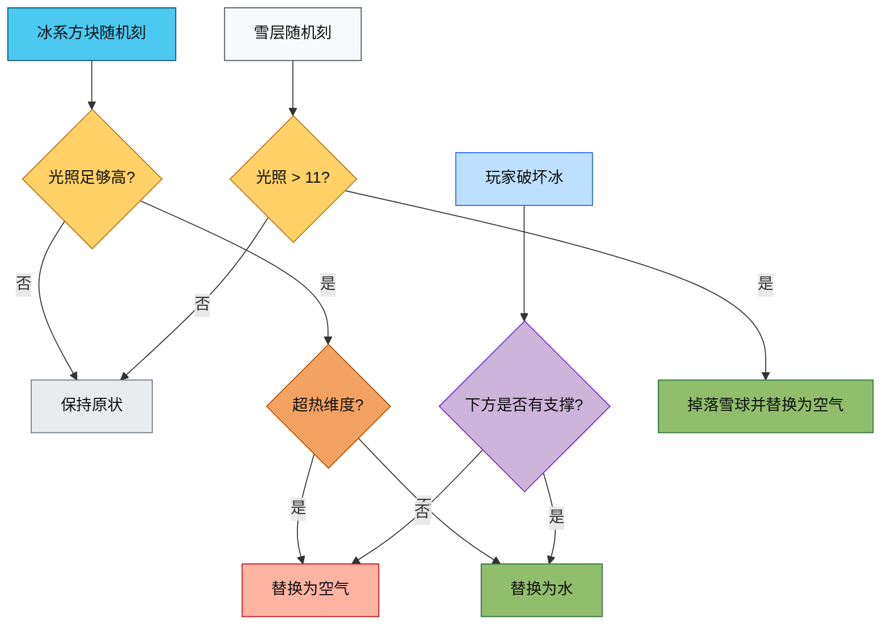

# 冰系方块模块

`ice/` 目录包含普通冰、浮冰、蓝冰、霜冰和雪层的实现。这里的重点是处理冰的融化、雪层融化掉落、挖掘后的替换，以及和世界写入顺序相关的回调安全性。

## 目录结构

```text
ice/
├── IceBlock.hpp
├── IceBlock.cpp
├── SnowBlock.hpp
├── SnowBlock.cpp
└── README.md
```

## 文件介绍

`IceBlock.hpp` 声明四种冰系方块：`IceBlock`、`PackedIceBlock`、`BlueIceBlock` 和 `FrostedIceBlock`。

`IceBlock.cpp` 实现普通冰和霜冰的融化逻辑，以及玩家破坏后是否留下水的判断。

`SnowBlock.hpp/cpp` 实现雪层方块（1-8层），在光照足够高时融化并掉落雪球。

## 模块关系

冰系方块依赖世界接口 `IWorld`、方块注册表 `BlockRegistry`、流体注册表 `FluidRegistry`、物品注册表 `Items` 和随机数接口 `IRandom`。

`IceBlock` 和 `FrostedIceBlock` 会在高光照下把自己替换成水或空气。`PackedIceBlock` 与 `BlueIceBlock` 仅保留基础方块行为。

`SnowBlock` 在光照 > 11 时融化，掉落对应层数的雪球物品。

## 整体职责

该目录的职责是复现原版冰系方块的玩家交互和环境融化行为，同时避免在同一坐标的替换过程中触发递归回调。

## 输入 / 输出

输入包括：

- 当前方块位置 `BlockPos`
- 世界上下文 `IWorld`
- 光照信息
- 随机数生成器

输出包括：

- 普通冰或霜冰在满足条件时转为水
- 在超热维度中融化时转为空气
- 玩家破坏冰时根据下方支撑决定是否留下水
- 雪层融化时掉落对应层数的雪球物品

## 依赖项

- 内部依赖：`Block.hpp`、`BlockRegistry.hpp`、`Fluid.hpp`、`FluidRegistry.hpp`、`Items.hpp`、`ItemStack.hpp`、`ItemDropHelper.hpp`
- 外部依赖：无

## 使用方法

```cpp
IceBlock ice(BlockProperties(Material::ICE).hardness(0.5f));

BlockState state = ice.defaultState();
ice.randomTick(world, pos, state, random);

SnowBlock snow(BlockProperties(Material::SNOW).hardness(0.2f));
snow.randomTick(world, pos, state, random);
```

## 容易踩的坑

- 不要在冰的随机刻里直接调用 `onBlockRemoved()`，否则会把”融化”和”破坏后替换”混成同一条路径。
- 同一坐标的替换必须先完成区块写入，再进入旧方块回调，否则像冰块这种会再次写回自身的逻辑会触发递归。
- 挖掘冰时的逻辑和融化时的逻辑不同，前者要看下方支撑，后者只看维度与光照。
- 雪层融化时掉落的雪球数量等于层数（1-8个）。

## 测试用例

- `tests/common/world/block/blocks/IceBlockTest.cpp`：验证冰和霜冰在普通维度与超热维度下的随机刻结果。
- `tests/server/ServerWorldBlockUpdateCallbackTest.cpp`：验证服务器方块写入时冰块破坏不会递归，并且最终状态正确。

## Mermaid 图表

