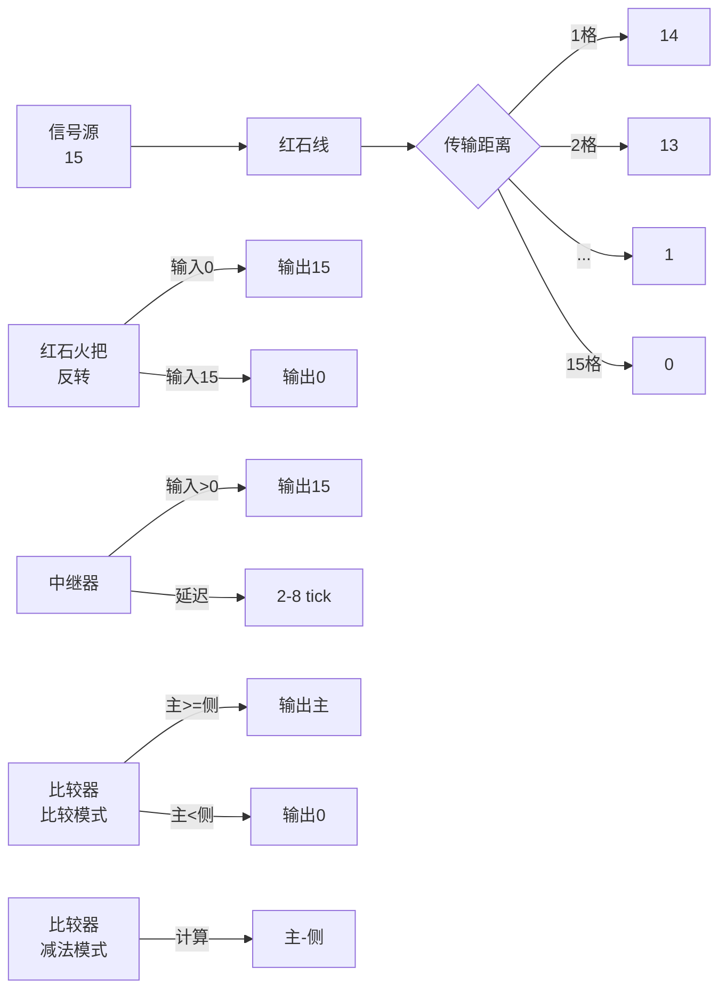

# 红石方块 (Redstone Blocks)

红石方块模块提供所有红石相关方块的实现。

## 目录结构

```
redstone/
├── README.md                    # 本文档
├── RedstoneBlock.hpp            # 红石块（固体信号源）
├── RedstoneBlock.cpp
├── RedstoneTorchBlock.hpp       # 红石火把（信号反转）
├── RedstoneTorchBlock.cpp
├── RedstoneWireBlock.hpp        # 红石线（信号传输）
├── RedstoneWireBlock.cpp
├── RedstoneDiodeBlock.hpp       # 红石二极管基类
├── RedstoneDiodeBlock.cpp
├── RedstoneRepeaterBlock.hpp    # 红石中继器
├── RedstoneRepeaterBlock.cpp
├── RedstoneComparatorBlock.hpp  # 红石比较器
├── RedstoneComparatorBlock.cpp
├── ObserverBlock.hpp            # 侦测器
├── ObserverBlock.cpp
├── AbstractButtonBlock.hpp      # 按钮基类
├── AbstractButtonBlock.cpp
├── StoneButtonBlock.hpp         # 石头按钮
├── StoneButtonBlock.cpp
├── WoodButtonBlock.hpp          # 木按钮
├── WoodButtonBlock.cpp
├── LeverBlock.hpp               # 拉杆
├── LeverBlock.cpp
├── AbstractPressurePlateBlock.hpp  # 压力板基类
├── AbstractPressurePlateBlock.cpp
├── StonePressurePlateBlock.hpp  # 石头压力板
├── StonePressurePlateBlock.cpp
├── WoodPressurePlateBlock.hpp   # 木压力板
├── WoodPressurePlateBlock.cpp
├── WeightedPressurePlateBlock.hpp  # 测重压力板
├── WeightedPressurePlateBlock.cpp
├── DaylightDetectorBlock.hpp    # 日光探测器
├── PistonBlock.hpp            # 活塞
├── PistonBlock.cpp
├── PistonHeadBlock.hpp        # 活塞头
└── PistonHeadBlock.cpp
```

## 类图

```mermaid
classDiagram
    class Block {
        <<abstract>>
        +canProvidePower() bool
        +getWeakPower() i32
        +getStrongPower() i32
        +neighborChanged()
        +tick()
    }

    class RedstoneBlock {
        +getWeakPower() i32
        +getStrongPower() i32
    }

    class RedstoneTorchBlock {
        -m_burnoutHistory: Map
        +LIT() BooleanProperty
        +shouldBeOff() bool
        +isLit() bool
    }

    class RedstoneWireBlock {
        -m_canProvidePower: bool
        +POWER() IntegerProperty
        +NORTH() EnumProperty
        +EAST() EnumProperty
        +SOUTH() EnumProperty
        +WEST() EnumProperty
        +updatePower() bool
        +calculateConnections() BlockState
    }

    class RedstoneDiodeBlock {
        <<abstract>>
        #m_id: String
        +FACING() DirectionProperty
        +POWERED() BooleanProperty
        +getDelay() i32
        +shouldBePowered() bool
        +isLocked() bool
        +getInputSignal() i32
    }

    class RedstoneRepeaterBlock {
        +DELAY() IntegerProperty
        +LOCKED() BooleanProperty
        +getDelay() i32
        +isLocked() bool
    }

    class RedstoneComparatorBlock {
        +MODE() EnumProperty
        +getMode() ComparatorMode
        +isSubtractMode() bool
        +calculateOutput() i32
    }

    class ObserverBlock {
        +FACING() DirectionProperty
        +POWERED() BooleanProperty
        +detect()
        +PULSE_DURATION: i32
    }

    class AbstractButtonBlock {
        #m_ticksToStayPressed: i32
        +POWERED() BooleanProperty
        +press()
    }

    class StoneButtonBlock
    class WoodButtonBlock

    class LeverBlock {
        +POWERED() BooleanProperty
        +toggle()
    }

    class AbstractPressurePlateBlock {
        +POWER() IntegerProperty
        +calculateSignalStrength() i32
    }

    class StonePressurePlateBlock
    class WoodPressurePlateBlock

    class WeightedPressurePlateBlock {
        +Sensitivity: enum
        +getEntityCount() i32
    }

    class DaylightDetectorBlock {
        +POWER() IntegerProperty
        +INVERTED() BooleanProperty
        +toggleMode()
        +calculateSignalStrength() i32
    }

    Block <|-- RedstoneBlock
    Block <|-- RedstoneTorchBlock
    Block <|-- RedstoneWireBlock
    Block <|-- RedstoneDiodeBlock
    Block <|-- ObserverBlock
    Block <|-- AbstractButtonBlock
    Block <|-- LeverBlock
    Block <|-- AbstractPressurePlateBlock
    Block <|-- DaylightDetectorBlock
    RedstoneDiodeBlock <|-- RedstoneRepeaterBlock
    RedstoneDiodeBlock <|-- RedstoneComparatorBlock
    AbstractButtonBlock <|-- StoneButtonBlock
    AbstractButtonBlock <|-- WoodButtonBlock
    AbstractPressurePlateBlock <|-- StonePressurePlateBlock
    AbstractPressurePlateBlock <|-- WoodPressurePlateBlock
    AbstractPressurePlateBlock <|-- WeightedPressurePlateBlock
```



## 信号强度规则



## 使用方法

### 注册红石方块

```cpp
// 在 BlockRegistry 中注册
auto redstoneBlock = BlockRegistry::instance().registerBlock<RedstoneBlock>(
    "redstone_block",
    BlockProperties(Material::AMETHYST)
        .hardness(5.0f)
        .resistance(10.0f)
);

auto redstoneTorch = BlockRegistry::instance().registerBlock<RedstoneTorchBlock>(
    "redstone_torch",
    BlockProperties(Material::MISCELLANEOUS)
        .hardness(0.0f)
        .lightLevel(7)
);

auto redstoneWire = BlockRegistry::instance().registerBlock<RedstoneWireBlock>(
    "redstone_wire",
    BlockProperties(Material::MISCELLANEOUS)
        .hardness(0.0f)
        .noCollision()
        .notSolid()
);

auto comparator = BlockRegistry::instance().registerBlock<RedstoneComparatorBlock>(
    "comparator",
    BlockProperties(Material::MISCELLANEOUS)
        .hardness(0.0f)
);

auto observer = BlockRegistry::instance().registerBlock<ObserverBlock>(
    "observer",
    BlockProperties(Material::STONE)
        .hardness(3.5f)
);
```

### 检测红石信号

```cpp
// 检查位置是否被充能
bool powered = RedstonePower::isPowered(world, pos);

// 获取信号强度
i32 strength = RedstonePower::getWeakPower(world, pos, Direction::North);

// 获取强信号
i32 strong = RedstonePower::getStrongPower(world, pos, Direction::Down);
```

### 更新红石信号

```cpp
auto& redstone = RedstoneSystem::instance();

// 更新相邻方块
redstone.updateNeighbors(world, pos, block);

// 调度延迟更新
redstone.scheduleUpdate(world, pos, block, 2, TickPriority::High);

// 防递归保护
if (!redstone.isUpdating(pos)) {
    redstone.beginUpdate(pos);
    // 执行红石计算...
    redstone.endUpdate(pos);
}
```

### 按钮和拉杆

```cpp
// 按下按钮
button.press(world, pos, state);

// 切换拉杆
LeverBlock::toggle(world, pos, state);

// 检查是否被按下/拉下
bool powered = AbstractButtonBlock::isPowered(state);
bool leverOn = LeverBlock::isPowered(state);
```

### 压力板

```cpp
// 获取压力板信号强度
i32 power = AbstractPressurePlateBlock::getPower(state);

// 石头压力板：只有生物触发
// 木压力板：所有实体触发
// 测重压力板：根据物品数量
```

### 日光探测器

```cpp
// 获取信号强度
i32 power = DaylightDetectorBlock::getPower(state);

// 切换模式（白天/夜间）
DaylightDetectorBlock::toggleMode(world, pos, state);

// 检查是否为夜间模式
bool inverted = DaylightDetectorBlock::isInverted(state);
```

## 容易踩的坑

### 1. 红石火把无限递归

**问题**：红石火把更新可能触发反馈循环。

**解决方案**：使用 `RedstoneContext` 或 `RedstoneSystem` 跟踪更新位置。

```cpp
// 错误：可能无限递归
void updateNeighbors(World& world, BlockPos pos) {
    for (auto dir : Directions::all()) {
        neighborChanged(world, pos.offset(dir));
    }
}

// 正确：使用递归保护
auto& redstone = RedstoneSystem::instance();
if (!redstone.isUpdating(pos)) {
    redstone.beginUpdate(pos);
    redstone.updateNeighbors(world, pos, block);
    redstone.endUpdate(pos);
}
```

### 2. 中继器更新顺序

**问题**：中继器面向另一个中继器时，更新顺序影响结果。

**解决方案**：使用正确的 `TickPriority`。

```cpp
if (isFacingTowardsRepeater(world, pos, state)) {
    // 极高优先级
    world.scheduleBlockTick(pos, *this, delay, TickPriority::ExtremelyHigh);
} else if (isCurrentlyPowered) {
    // 很高优先级
    world.scheduleBlockTick(pos, *this, delay, TickPriority::VeryHigh);
} else {
    // 高优先级
    world.scheduleBlockTick(pos, *this, delay, TickPriority::High);
}
```

### 3. 红石线连接状态

**问题**：忘记更新红石线的连接状态。

**解决方案**：在 `updatePostPlacement` 中重新计算连接。

```cpp
BlockState RedstoneWireBlock::updatePostPlacement(...) {
    // 重新计算连接状态
    RedstoneSide connection = getConnection(world, currentPos, facing);
    return state.with(propertyFor(facing), connection);
}
```

### 4. 强弱信号混淆

**问题**：错误区分强信号和弱信号。

**解决方案**：使用正确的方法。

```cpp
// 强信号：直接从方块输出
i32 strong = block.getStrongPower(state, world, pos, side);

// 弱信号：通过方块传导
i32 weak = block.getWeakPower(state, world, pos, side);

// 检查是否被充能
bool powered = RedstonePower::isPowered(world, pos);
```

### 5. 按钮和拉杆支撑检测

**问题**：按钮/拉杆在支撑方块被移除后不会掉落。

**解决方案**：在 `neighborChanged` 中检测支撑。

```cpp
void neighborChanged(IWorld& world, const BlockPos& pos, ...) {
    // 计算支撑方块位置
    BlockPos supportPos = getSupportPos(pos, state);

    // 如果支撑方块被移除，按钮掉落
    const BlockState* supportState = world.getBlockState(supportPos.x, supportPos.y, supportPos.z);
    if (!supportState || supportState->isAir()) {
        world.setBlockState(pos.x, pos.y, pos.z, nullptr, 2);
    }
}
```

### 6. 侦测器脉冲时长

**问题**：侦测器脉冲时长不正确。

**解决方案**：使用正确的 `PULSE_DURATION`。

```cpp
// 侦测器脉冲持续 2 tick
static constexpr i32 PULSE_DURATION = 2;
world.scheduleBlockTick(pos, *this, PULSE_DURATION, TickPriority::High);
```

## 测试用例

测试文件位于：`tests/common/world/block/blocks/redstone/`

- `RedstoneBlockTest.cpp` - 红石块测试
- `RedstoneTorchBlockTest.cpp` - 红石火把测试
- `RedstoneWireBlockTest.cpp` - 红石线测试
- `RedstoneRepeaterBlockTest.cpp` - 中继器测试
- `RedstoneComparatorBlockTest.cpp` - 比较器测试（待添加）
- `ObserverBlockTest.cpp` - 侦测器测试（待添加）
- `ButtonTest.cpp` - 按钮测试（待添加）
- `LeverTest.cpp` - 拉杆测试（待添加）
- `PressurePlateTest.cpp` - 压力板测试（待添加）
- `DaylightDetectorTest.cpp` - 日光探测器测试（待添加）

## 参考文档

- [Minecraft Wiki - Redstone](https://minecraft.fandom.com/wiki/Redstone)
- [MC 1.16.5 Source - RedstoneWireBlock](net/minecraft/block/RedstoneWireBlock.java)
- [MC 1.16.5 Source - RedstoneTorchBlock](net/minecraft/block/RedstoneTorchBlock.java)
- [MC 1.16.5 Source - RepeaterBlock](net/minecraft/block/RepeaterBlock.java)
- [MC 1.16.5 Source - ComparatorBlock](net/minecraft/block/ComparatorBlock.java)
- [MC 1.16.5 Source - ObserverBlock](net/minecraft/block/ObserverBlock.java)
- [MC 1.16.5 Source - AbstractButtonBlock](net/minecraft/block/AbstractButtonBlock.java)
- [MC 1.16.5 Source - LeverBlock](net/minecraft/block/LeverBlock.java)
- [MC 1.16.5 Source - PressurePlateBlock](net/minecraft/block/PressurePlateBlock.java)
- [MC 1.16.5 Source - DaylightDetectorBlock](net/minecraft/block/DaylightDetectorBlock.java)
