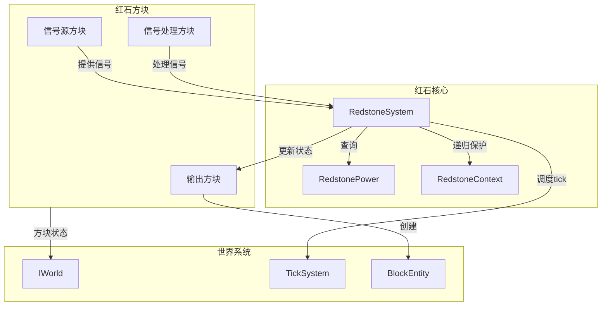
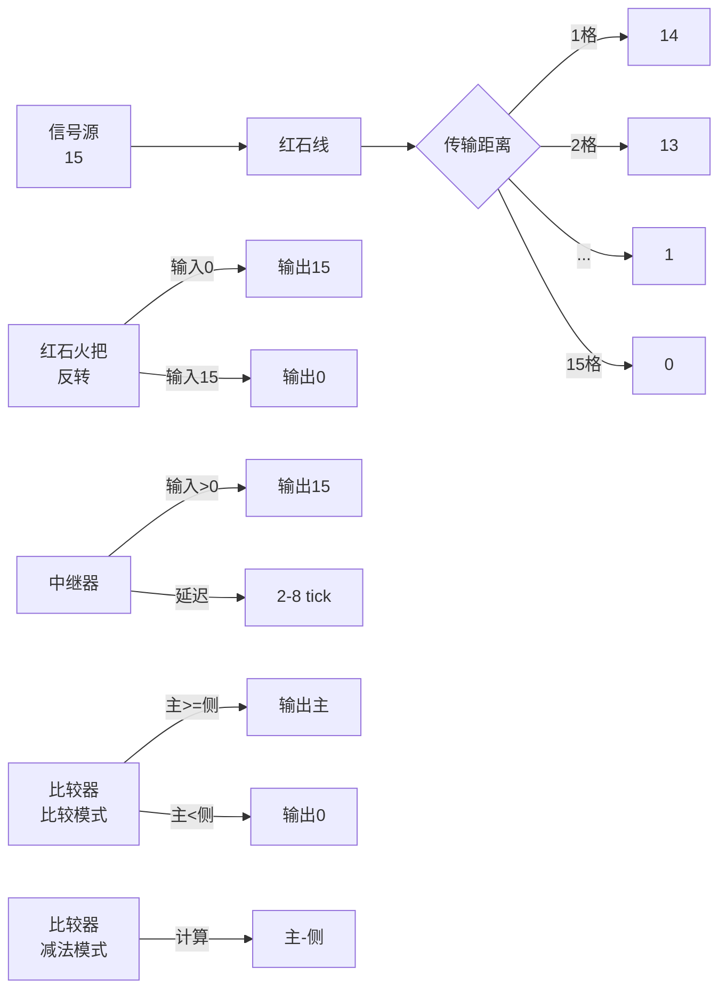

# 红石方块 (Redstone Blocks)

红石方块模块提供所有红石相关方块的实现。

## 目录结构

```
redstone/
├── README.md                    # 本文档
├── RedstoneBlock.hpp            # 红石块（固体信号源）
├── RedstoneBlock.cpp
├── RedstoneTorchBlock.hpp       # 红石火把（信号反转）
├── RedstoneTorchBlock.cpp
├── RedstoneWallTorchBlock.hpp   # 墙上红石火把
├── RedstoneWallTorchBlock.cpp
├── RedstoneWireBlock.hpp        # 红石线（信号传输）
├── RedstoneWireBlock.cpp
├── RedstoneDiodeBlock.hpp       # 红石二极管基类
├── RedstoneDiodeBlock.cpp
├── RedstoneRepeaterBlock.hpp    # 红石中继器
├── RedstoneRepeaterBlock.cpp
├── RedstoneComparatorBlock.hpp  # 红石比较器
├── RedstoneComparatorBlock.cpp
├── ObserverBlock.hpp            # 侦测器
├── ObserverBlock.cpp
├── AbstractButtonBlock.hpp      # 按钮基类
├── AbstractButtonBlock.cpp
├── StoneButtonBlock.hpp         # 石头按钮
├── StoneButtonBlock.cpp
├── WoodButtonBlock.hpp          # 木按钮
├── WoodButtonBlock.cpp
├── LeverBlock.hpp               # 拉杆
├── LeverBlock.cpp
├── AbstractPressurePlateBlock.hpp  # 压力板基类
├── AbstractPressurePlateBlock.cpp
├── StonePressurePlateBlock.hpp  # 石头压力板
├── StonePressurePlateBlock.cpp
├── WoodPressurePlateBlock.hpp   # 木压力板
├── WoodPressurePlateBlock.cpp
├── WeightedPressurePlateBlock.hpp  # 测重压力板
├── WeightedPressurePlateBlock.cpp
├── DaylightDetectorBlock.hpp    # 日光探测器
├── DaylightDetectorBlock.cpp
├── PistonBlock.hpp              # 活塞
├── PistonBlock.cpp
├── PistonStructureHelper.hpp    # 活塞推动结构计算器
├── PistonStructureHelper.cpp
├── PistonHeadBlock.hpp          # 活塞头
├── PistonHeadBlock.cpp
├── MovingPistonBlock.hpp        # 移动中的活塞（动画代理）
├── MovingPistonBlock.cpp
├── DispenserBlock.hpp           # 发射器
├── DispenserBlock.cpp
├── DropperBlock.hpp             # 投掷器
├── DropperBlock.cpp
├── TripWireBlock.hpp            # 绊线
├── TripWireBlock.cpp
├── TripWireHookBlock.hpp        # 绊线钩
├── TripWireHookBlock.cpp
├── NoteBlock.hpp                # 音符盒
├── NoteBlock.cpp
├── TNTBlock.hpp                 # TNT
├── TNTBlock.cpp
├── TargetBlock.hpp              # 标靶
├── TargetBlock.cpp
├── RedstoneLampBlock.hpp        # 红石灯
├── RedstoneLampBlock.cpp
├── AbstractRailBlock.hpp        # 铁轨基类
├── AbstractRailBlock.cpp
├── RailBlock.hpp                # 普通铁轨
├── RailBlock.cpp
├── PoweredRailBlock.hpp         # 动力铁轨
├── PoweredRailBlock.cpp
├── DetectorRailBlock.hpp        # 探测铁轨
├── DetectorRailBlock.cpp
├── ActivatorRailBlock.hpp       # 激活铁轨
└── ActivatorRailBlock.cpp
```

## 文件介绍

### 核心信号方块

| 文件 | 职责 |
|------|------|
| `RedstoneBlock.hpp/cpp` | 红石块，恒定输出15强度信号，无需外部输入 |
| `RedstoneTorchBlock.hpp/cpp` | 红石火把，信号反转器，下方有信号时熄灭 |
| `RedstoneWallTorchBlock.hpp/cpp` | 墙上红石火把，可附着在墙面上的红石火把 |
| `RedstoneWireBlock.hpp/cpp` | 红石线，传输信号，每格衰减1强度 |

### 信号处理方块

| 文件 | 职责 |
|------|------|
| `RedstoneDiodeBlock.hpp/cpp` | 红石二极管基类，提供单向传输基础功能 |
| `RedstoneRepeaterBlock.hpp/cpp` | 红石中继器，信号增强+延迟+锁定 |
| `RedstoneComparatorBlock.hpp/cpp` | 红石比较器，比较/减法模式信号处理 |

### 信号源方块

| 文件 | 职责 |
|------|------|
| `AbstractButtonBlock.hpp/cpp` | 按钮基类，瞬时信号源 |
| `StoneButtonBlock.hpp/cpp` | 石头按钮，10 tick 脉冲 |
| `WoodButtonBlock.hpp/cpp` | 木按钮，15 tick 脉冲 |
| `LeverBlock.hpp/cpp` | 拉杆，持久信号源，手动切换 |
| `AbstractPressurePlateBlock.hpp/cpp` | 压力板基类，实体检测信号源 |
| `StonePressurePlateBlock.hpp/cpp` | 石头压力板，仅生物触发，输出15 |
| `WoodPressurePlateBlock.hpp/cpp` | 木压力板，所有实体触发，输出15 |
| `WeightedPressurePlateBlock.hpp/cpp` | 测重压力板，根据实体数量输出强度 |
| `DaylightDetectorBlock.hpp/cpp` | 日光探测器，根据天空亮度输出信号 |
| `ObserverBlock.hpp/cpp` | 侦测器，检测前方方块变化输出脉冲 |

### 机械方块

| 文件 | 职责 |
|------|------|
| `PistonBlock.hpp/cpp` | 活塞，推动/拉回方块 |
| `PistonHeadBlock.hpp/cpp` | 活塞头，扩展状态的活塞头部 |
| `MovingPistonBlock.hpp/cpp` | 移动中的活塞，动画代理方块 |
| `DispenserBlock.hpp/cpp` | 发射器，发射物品/使用物品 |
| `DropperBlock.hpp/cpp` | 投掷器，投掷物品 |

### 其他方块

| 文件 | 职责 |
|------|------|
| `TripWireBlock.hpp/cpp` | 绊线，检测实体穿越，潜行玩家不触发 |
| `TripWireHookBlock.hpp/cpp` | 绊线钩，绊线连接点 |
| `NoteBlock.hpp/cpp` | 音符盒，播放音符（16种乐器，25个音高） |
| `TNTBlock.hpp/cpp` | TNT，红石触发爆炸 |
| `TargetBlock.hpp/cpp` | 标靶，箭矢命中输出信号 |
| `RedstoneLampBlock.hpp/cpp` | 红石灯，接收信号发光 |

## 模块关系



## 整体职责

红石方块模块负责：

1. **信号源管理**：提供各种信号源（按钮、拉杆、压力板等）
2. **信号传输**：红石线传输信号，中继器增强信号
3. **信号处理**：比较器、火把等进行信号逻辑运算
4. **机械操作**：活塞推动方块，发射器/投掷器操作物品
5. **世界交互**：检测方块变化、实体检测、时间检测等

## 输入/输出

### 输入
- 世界状态（方块位置、状态）
- 方块属性（FACING、POWERED 等）
- 红石信号强度（0-15）
- 实体位置（压力板检测）
- 时间信息（日光探测器）
- 玩家交互（按钮、拉杆）

### 输出
- 红石信号强度（getWeakPower/getStrongPower）
- 方块状态变化（点亮/熄灭、扩展/收回）
- 方块移动（活塞）
- 物品发射（发射器/投掷器）
- 音效（音符盒）
- 爆炸（TNT）

## 依赖项

### 内部依赖

| 模块 | 用途 |
|------|------|
| `world/redstone/RedstoneSystem` | 红石系统核心，信号传播管理 |
| `world/redstone/RedstonePower` | 红石信号查询工具 |
| `world/redstone/RedstoneContext` | 递归保护上下文 |
| `world/tick/TickPriority` | tick 优先级 |
| `world/blockentity/BlockEntity` | 方块实体基类 |
| `world/blockentity/redstone/PistonBlockEntity` | 活塞方块实体 |
| `world/IWorld` | 世界接口 |
| `item/BlockItemUseContext` | 放置上下文 |
| `util/property/Properties` | 方块属性 |

### 外部依赖

- `glm` - 数学库
- `spdlog` - 日志

## 类图

```mermaid
classDiagram
    class Block {
        <<abstract>>
        +canProvidePower() bool
        +getWeakPower() i32
        +getStrongPower() i32
        +neighborChanged()
        +tick()
    }

    class RedstoneBlock {
        +getWeakPower() i32
        +getStrongPower() i32
    }

    class RedstoneTorchBlock {
        -m_burnoutHistory: Map
        +LIT() BooleanProperty
        +shouldBeOff() bool
        +isLit() bool
    }

    class RedstoneWallTorchBlock {
        +HORIZONTAL_FACING() DirectionProperty
        +shouldBeOff() bool
        +getFacing() Direction
        +canPlaceAt() bool
    }

    class RedstoneWireBlock {
        -m_canProvidePower: bool
        +POWER() IntegerProperty
        +NORTH() EnumProperty
        +EAST() EnumProperty
        +SOUTH() EnumProperty
        +WEST() EnumProperty
        +updatePower() bool
        +calculateConnections() BlockState
    }

    class RedstoneDiodeBlock {
        <<abstract>>
        #m_id: std::string
        +FACING() DirectionProperty
        +POWERED() BooleanProperty
        +getDelay() i32
        +shouldBePowered() bool
        +isLocked() bool
        +getInputSignal() i32
    }

    class RedstoneRepeaterBlock {
        +DELAY() IntegerProperty
        +LOCKED() BooleanProperty
        +getDelay() i32
        +isLocked() bool
    }

    class RedstoneComparatorBlock {
        +MODE() EnumProperty
        +getMode() ComparatorMode
        +isSubtractMode() bool
        +calculateOutput() i32
    }

    class ObserverBlock {
        +FACING() DirectionProperty
        +POWERED() BooleanProperty
        +detect()
        +PULSE_DURATION: i32
    }

    class AbstractButtonBlock {
        #m_ticksToStayPressed: i32
        +POWERED() BooleanProperty
        +press()
    }

    class StoneButtonBlock
    class WoodButtonBlock

    class LeverBlock {
        +POWERED() BooleanProperty
        +toggle()
    }

    class AbstractPressurePlateBlock {
        +POWER() IntegerProperty
        +calculateSignalStrength() i32
    }

    class StonePressurePlateBlock
    class WoodPressurePlateBlock

    class WeightedPressurePlateBlock {
        +Sensitivity: enum
        +getEntityCount() i32
    }

    class DaylightDetectorBlock {
        +POWER() IntegerProperty
        +INVERTED() BooleanProperty
        +toggleMode()
        +calculateSignalStrength() i32
    }

    class PistonBlock {
        +EXTENDED() BooleanProperty
        +FACING() DirectionProperty
        +STICKY: bool
        +extend()
        +retract()
        +canPush() bool
    }

    class PistonHeadBlock {
        +FACING() DirectionProperty
        +TYPE() EnumProperty
        +SHORT() BooleanProperty
        +getType() PistonType
    }

    class MovingPistonBlock {
        +FACING() DirectionProperty
        +TYPE() EnumProperty
        +hasBlockEntity() bool
        +createBlockEntity()
    }

    Block <|-- RedstoneBlock
    Block <|-- RedstoneTorchBlock
    RedstoneTorchBlock <|-- RedstoneWallTorchBlock
    Block <|-- RedstoneWireBlock
    Block <|-- RedstoneDiodeBlock
    Block <|-- ObserverBlock
    Block <|-- AbstractButtonBlock
    Block <|-- LeverBlock
    Block <|-- AbstractPressurePlateBlock
    Block <|-- DaylightDetectorBlock
    RedstoneDiodeBlock <|-- RedstoneRepeaterBlock
    RedstoneDiodeBlock <|-- RedstoneComparatorBlock
    AbstractButtonBlock <|-- StoneButtonBlock
    AbstractButtonBlock <|-- WoodButtonBlock
    AbstractPressurePlateBlock <|-- StonePressurePlateBlock
    AbstractPressurePlateBlock <|-- WoodPressurePlateBlock
    AbstractPressurePlateBlock <|-- WeightedPressurePlateBlock
    Block <|-- PistonBlock
    Block <|-- PistonHeadBlock
    Block <|-- MovingPistonBlock
```



## 信号强度规则



## 使用方法

### 注册红石方块

```cpp
// 在 BlockRegistry 中注册
auto redstoneBlock = BlockRegistry::instance().registerBlock<RedstoneBlock>(
    "redstone_block",
    BlockProperties(Material::AMETHYST)
        .hardness(5.0f)
        .resistance(10.0f)
);

auto redstoneTorch = BlockRegistry::instance().registerBlock<RedstoneTorchBlock>(
    "redstone_torch",
    BlockProperties(Material::MISCELLANEOUS)
        .hardness(0.0f)
        .lightLevel(7)
);

auto redstoneWire = BlockRegistry::instance().registerBlock<RedstoneWireBlock>(
    "redstone_wire",
    BlockProperties(Material::MISCELLANEOUS)
        .hardness(0.0f)
        .noCollision()
        .notSolid()
);

auto comparator = BlockRegistry::instance().registerBlock<RedstoneComparatorBlock>(
    "comparator",
    BlockProperties(Material::MISCELLANEOUS)
        .hardness(0.0f)
);

auto observer = BlockRegistry::instance().registerBlock<ObserverBlock>(
    "observer",
    BlockProperties(Material::STONE)
        .hardness(3.5f)
);
```

### 检测红石信号

```cpp
// 检查位置是否被充能
bool powered = RedstonePower::isPowered(world, pos);

// 获取信号强度
i32 strength = RedstonePower::getWeakPower(world, pos, Direction::North);

// 获取强信号
i32 strong = RedstonePower::getStrongPower(world, pos, Direction::Down);
```

### 更新红石信号

```cpp
auto& redstone = RedstoneSystem::instance();

// 更新相邻方块
redstone.updateNeighbors(world, pos, block);

// 调度延迟更新
redstone.scheduleUpdate(world, pos, block, 2, TickPriority::High);

// 防递归保护
if (!redstone.isUpdating(pos)) {
    redstone.beginUpdate(pos);
    // 执行红石计算...
    redstone.endUpdate(pos);
}
```

### 按钮和拉杆

```cpp
// 按下按钮
button.press(world, pos, state);

// 切换拉杆
LeverBlock::toggle(world, pos, state);

// 检查是否被按下/拉下
bool powered = AbstractButtonBlock::isPowered(state);
bool leverOn = LeverBlock::isPowered(state);
```

### 压力板

```cpp
// 获取压力板信号强度
i32 power = AbstractPressurePlateBlock::getPower(state);

// 石头压力板：只有生物触发
// 木压力板：所有实体触发
// 测重压力板：根据物品数量
```

### 日光探测器

```cpp
// 获取信号强度
i32 power = DaylightDetectorBlock::getPower(state);

// 切换模式（白天/夜间）
DaylightDetectorBlock::toggleMode(world, pos, state);

// 检查是否为夜间模式
bool inverted = DaylightDetectorBlock::isInverted(state);
```

### 活塞

```cpp
// 扩展活塞
PistonBlock::extend(world, pos, state);

// 收回活塞
PistonBlock::retract(world, pos, state);

// 检查是否为粘性活塞
bool isSticky = PistonBlock::isSticky(state);

// 检查方块是否可推动
bool canPush = PistonBlock::canPush(blockState, world, pos, direction, false);
```

### 墙上红石火把

```cpp
// 获取火把朝向
Direction facing = RedstoneWallTorchBlock::getFacing(state);

// 检查是否应该熄灭（附着面被充能）
bool shouldOff = wallTorchBlock.shouldBeOff(world, pos, state);

// 放置时自动选择合适的墙面
BlockState placementState = wallTorchBlock.getStateForPlacement(context);
```

### 绊线

绊线检测实体穿越并输出红石信号：

```cpp
// 绊线通过实体碰撞检测触发
// MC 1.16.5: 潜行的玩家不会触发绊线

// 检测实体碰撞
bool TripWireBlock::checkEntityCollision(IWorld& world, const BlockPos& pos) const {
    AxisAlignedBB detectionBox(
        static_cast<f32>(pos.x), static_cast<f32>(pos.y),
        static_cast<f32>(pos.z), static_cast<f32>(pos.x) + 1.0f,
        static_cast<f32>(pos.y) + 0.5f, static_cast<f32>(pos.z) + 1.0f
    );

    for (Entity* entity : world.getEntitiesInAABB(detectionBox, nullptr)) {
        if (entity && !entity->isSneaking()) {
            return true;  // 触发绊线
        }
    }
    return false;
}

// 检查是否被充能
bool powered = TripWireBlock::isPowered(state);

// 检查连接状态
bool connected = TripWireBlock::isConnected(state, Direction::North);
```

**特性说明**：

| 特性 | 描述 |
|------|------|
| 检测范围 | 方块内向上 0.5 格 |
| 触发条件 | 任何非潜行实体穿越 |
| 潜行玩家 | **不会触发绊线**（使用 `entity->isSneaking()` 检测） |
| 连接 | 与绊线钩连接形成完整绊线系统 |
| 信号输出 | 充能时输出 15 强度 |

### 音符盒

音符盒根据下方方块类型/材质播放不同乐器的音符：

```cpp
// 获取音符值 (0-24)
i32 note = NoteBlock::getNote(state);

// 设置音符值
BlockState newState = NoteBlock::withNote(state, 12);

// 循环音符 (0 -> 1 -> ... -> 24 -> 0)
BlockState cycled = NoteBlock::cycleNote(state);

// 触发播放音符
noteBlock.triggerNote(world, pos, state);
```

**乐器类型映射**（参考 MC 1.16.5 `NoteBlockInstrument.byState`）：

| 触发方块 | 乐器 | 声音事件 |
|---------|------|----------|
| 陶土 (CLAY) | 长笛 (FLUTE) | `block.note_block.flute` |
| 金块 (GOLD_BLOCK) | 钟 (BELL) | `block.note_block.bell` |
| 羊毛 (WOOL tag) | 吉他 (GUITAR) | `block.note_block.guitar` |
| 浮冰 (PACKED_ICE) | 管钟 (CHIME) | `block.note_block.chime` |
| 骨块 (BONE_BLOCK) | 木琴 (XYLOPHONE) | `block.note_block.xylophone` |
| 铁块 (IRON_BLOCK) | 铁片琴 (IRON_XYLOPHONE) | `block.note_block.iron_xylophone` |
| 灵魂沙 (SOUL_SAND) | 牛铃 (COW_BELL) | `block.note_block.cow_bell` |
| 南瓜灯 (JACK_O_LANTERN) | 迪吉里杜管 (DIDGERIDOO) | `block.note_block.didgeridoo` |
| 绿宝石块 (EMERALD_BLOCK) | 电子音 (BIT) | `block.note_block.bit` |
| 干草块 (HAY_BLOCK) | 班卓琴 (BANJO) | `block.note_block.banjo` |
| 荧石 (GLOWSTONE) | 电钢琴 (PLING) | `block.note_block.pling` |
| 石头材质 (ROCK) | 底鼓 (BASEDRUM) | `block.note_block.basedrum` |
| 沙子材质 (SAND) | 军鼓 (SNARE) | `block.note_block.snare` |
| 玻璃材质 (GLASS) | 踩镲 (HAT) | `block.note_block.hat` |
| 木头材质 (WOOD/NETHER_WOOD) | 贝斯 (BASS) | `block.note_block.bass` |
| 其他 | 钢琴 (HARP, 默认) | `block.note_block.harp` |

**音高计算**：

公式：`pitch = 2^((note - 12) / 12)`
- 音符范围：0-24（共 25 个音高，两个八度）
- 基准音高：note=12 时 pitch=1.0（标准音高）
- 每增加 1，音高上升一个半音
- 每增加 12，音高上升一个八度（频率翻倍）

**粒子效果**：播放时在方块上方生成音符粒子，颜色由音符值决定。

### TNT

TNT是一种可以被红石信号或火焰点燃的爆炸性方块。

**触发条件**：
- 红石信号：收到红石信号时点燃
- 火焰接触：相邻位置有火焰或灵魂火
- 熔岩接触：相邻位置有熔岩

**点燃流程**：
```cpp
// TNTBlock::ignite() 实现
// 1. 移除TNT方块
world.setBlockState(pos, nullptr, 11);

// 2. 生成TNTEntity
auto& registry = entity::EntityRegistry::instance();
const entity::EntityType* tntType = registry.getType(entity::EntityTypes::TNT);
auto tntEntity = tntType->create(&world);

// 3. 设置位置和随机速度
tnt->setPosition(centerX, centerY, centerZ);
f32 angle = rng.nextFloat() * TWO_PI;
tnt->setVelocity(Vector3(-sin(angle) * 0.02f, 0.2f, -cos(angle) * 0.02f));
tnt->ignite();

// 4. 播放点燃音效
world.playSound(SoundEvents::ENTITY_TNT_PRIMED, ...);
```

**爆炸参数**：
- 默认爆炸半径：4.0（标准TNT威力）
- 爆炸模式：`Break`（破坏方块但不掉落物品）
- 引信时间：80 tick（4秒）

**火焰检测**：
```cpp
bool TNTBlock::hasFlammableNeighbor(IWorld& world, const BlockPos& pos) const {
    for (Direction dir : Directions::values()) {
        const BlockState* neighborState = world.getBlockState(pos.offset(dir));
        if (neighborState != nullptr) {
            // 检查火焰（包括灵魂火）
            if (neighborState->is(VanillaBlocks::FIRE) ||
                neighborState->is(VanillaBlocks::SOUL_FIRE)) {
                return true;
            }
            // 检查熔岩
            if (neighborState->is(VanillaBlocks::LAVA)) {
                return true;
            }
        }
    }
    return false;
}
```

**参考**：MC 1.16.5 `net.minecraft.block.TNTBlock`

## 容易踩的坑

### 1. 红石火把无限递归

**问题**：红石火把更新可能触发反馈循环。

**解决方案**：使用 `RedstoneContext` 或 `RedstoneSystem` 跟踪更新位置。

```cpp
// 错误：可能无限递归
void updateNeighbors(World& world, BlockPos pos) {
    for (auto dir : Directions::all()) {
        neighborChanged(world, pos.offset(dir));
    }
}

// 正确：使用递归保护
auto& redstone = RedstoneSystem::instance();
if (!redstone.isUpdating(pos)) {
    redstone.beginUpdate(pos);
    redstone.updateNeighbors(world, pos, block);
    redstone.endUpdate(pos);
}
```

### 2. 中继器更新顺序

**问题**：中继器面向另一个中继器时，更新顺序影响结果。

**解决方案**：使用正确的 `TickPriority`。

```cpp
if (isFacingTowardsRepeater(world, pos, state)) {
    // 极高优先级
    world.tickManager().scheduleBlockTick(pos, *this, delay, TickPriority::ExtremelyHigh);
} else if (isCurrentlyPowered) {
    // 很高优先级
    world.tickManager().scheduleBlockTick(pos, *this, delay, TickPriority::VeryHigh);
} else {
    // 高优先级
    world.tickManager().scheduleBlockTick(pos, *this, delay, TickPriority::High);
}
```

### 3. 红石线连接状态

**问题**：忘记更新红石线的连接状态。

**解决方案**：在 `updatePostPlacement` 中重新计算连接。

```cpp
BlockState RedstoneWireBlock::updatePostPlacement(...) {
    // 重新计算连接状态
    RedstoneSide connection = getConnection(world, currentPos, facing);
    return state.with(propertyFor(facing), connection);
}
```

### 4. 强弱信号混淆

**问题**：错误区分强信号和弱信号。

**解决方案**：使用正确的方法。

```cpp
// 强信号：直接从方块输出
i32 strong = block.getStrongPower(state, world, pos, side);

// 弱信号：通过方块传导
i32 weak = block.getWeakPower(state, world, pos, side);

// 检查是否被充能
bool powered = RedstonePower::isPowered(world, pos);
```

### 5. 按钮和拉杆支撑检测

**问题**：按钮/拉杆在支撑方块被移除后不会掉落。

**解决方案**：在 `neighborChanged` 中检测支撑。

```cpp
void neighborChanged(IWorld& world, const BlockPos& pos, ...) {
    // 计算支撑方块位置
    BlockPos supportPos = getSupportPos(pos, state);

    // 如果支撑方块被移除，按钮掉落
    const BlockState* supportState = world.getBlockState(supportPos.x, supportPos.y, supportPos.z);
    if (!supportState || supportState->isAir()) {
        world.setBlockState(pos.x, pos.y, pos.z, nullptr, 2);
    }
}
```

### 6. 侦测器脉冲时长

**问题**：侦测器脉冲时长不正确。

**解决方案**：使用正确的 `PULSE_DURATION`。

```cpp
// 侦测器脉冲持续 2 tick
static constexpr i32 PULSE_DURATION = 2;
world.tickManager().scheduleBlockTick(pos, *this, PULSE_DURATION, TickPriority::High);
```

### 7. 墙上红石火把方向计算

**问题**：墙上红石火把的方向和输出信号混淆。

**解决方案**：注意 `HORIZONTAL_FACING` 指向火把朝向的方向，输出信号时需要排除该方向。

```cpp
// 错误：向所有方向输出
i32 getWeakPower(...) {
    return isLit(state) ? 15 : 0;  // 向所有方向输出
}

// 正确：不向附着面方向输出
i32 getWeakPower(..., Direction side) {
    if (!isLit(state)) return 0;
    Direction facing = getFacing(state);  // 火把朝向
    if (side == facing) return 0;  // 不向附着面输出
    return 15;
}
```

### 8. 活塞推动链检测

**问题**：活塞推动时未正确检测推动链长度。

**解决方案**：限制最大推动距离为 12 格。

```cpp
// 推动链检测
std::vector<BlockPos> pushChain;
if (!checkPushChain(world, pos, direction, pushChain, 12)) {
    return;  // 推动链过长或遇到不可推动方块
}
```

### 9. 活塞收回时的方块实体处理

**问题**：活塞收回时方块实体丢失。

**解决方案**：使用 `MovingPistonBlock` 作为动画代理，正确处理方块实体。

```cpp
// 创建移动活塞状态
world.setBlockState(pos, movingPistonState, 3);

// MovingPistonBlock 创建 PistonBlockEntity 管理动画
// 动画结束后恢复原始方块
```

### 10. 信号源强/弱信号区分

**问题**：按钮、拉杆等信号源未正确区分强弱信号。

**解决方案**：强信号只向输出方向输出，弱信号向所有方向输出。

```cpp
// 按钮的强弱信号区分
i32 getWeakPower(..., Direction side) {
    // 弱信号：向所有方向输出
    return isPowered(state) ? 15 : 0;
}

i32 getStrongPower(..., Direction side) {
    // 强信号：只向输出方向输出
    if (!isPowered(state)) return 0;
    Direction outputDir = /* 从附着面计算 */;
    return (side == outputDir) ? 15 : 0;
}
```

## 测试用例

测试文件位于：`tests/common/world/block/blocks/redstone/`

- `RedstoneBlockTest.cpp` - 红石块测试
- `RedstoneTorchBlockTest.cpp` - 红石火把测试
- `RedstoneWireBlockTest.cpp` - 红石线测试
- `RedstoneRepeaterBlockTest.cpp` - 中继器测试
- `RedstoneComparatorBlockTest.cpp` - 比较器测试（待添加）
- `ObserverBlockTest.cpp` - 侦测器测试（待添加）
- `ButtonTest.cpp` - 按钮测试（待添加）
- `LeverTest.cpp` - 拉杆测试（待添加）
- `PressurePlateTest.cpp` - 压力板测试（待添加）
- `DaylightDetectorTest.cpp` - 日光探测器测试（待添加）
- `NoteBlockTest.cpp` - 音符盒测试（乐器类型检测、音高计算、状态属性）

## 参考文档

- [Minecraft Wiki - Redstone](https://minecraft.fandom.com/wiki/Redstone)
- [MC 1.16.5 Source - RedstoneWireBlock](net/minecraft/block/RedstoneWireBlock.java)
- [MC 1.16.5 Source - RedstoneTorchBlock](net/minecraft/block/RedstoneTorchBlock.java)
- [MC 1.16.5 Source - RepeaterBlock](net/minecraft/block/RepeaterBlock.java)
- [MC 1.16.5 Source - ComparatorBlock](net/minecraft/block/ComparatorBlock.java)
- [MC 1.16.5 Source - ObserverBlock](net/minecraft/block/ObserverBlock.java)
- [MC 1.16.5 Source - AbstractButtonBlock](net/minecraft/block/AbstractButtonBlock.java)
- [MC 1.16.5 Source - LeverBlock](net/minecraft/block/LeverBlock.java)
- [MC 1.16.5 Source - PressurePlateBlock](net/minecraft/block/PressurePlateBlock.java)
- [MC 1.16.5 Source - DaylightDetectorBlock](net/minecraft/block/DaylightDetectorBlock.java)
