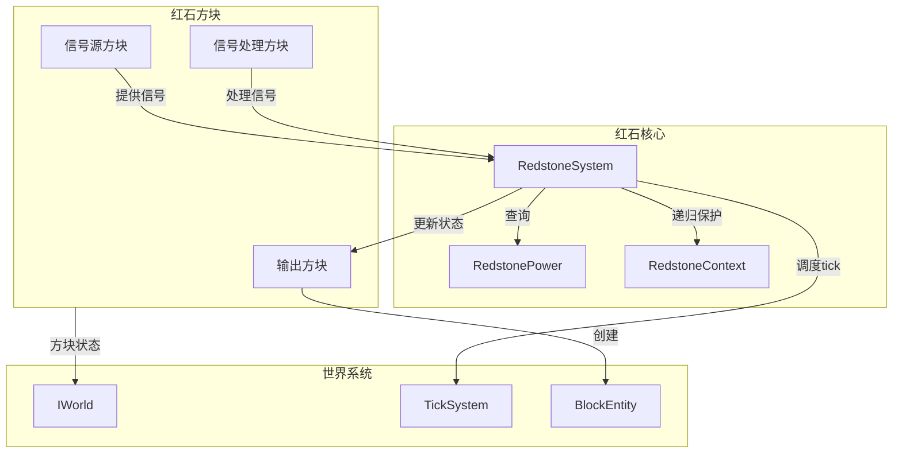

# 红石方块 (Redstone Blocks)

红石方块模块提供所有红石相关方块的实现。

## 目录结构

```
redstone/
├── RedstoneBlock.hpp/cpp              # 红石块（恒定15强度信号源）
├── RedstoneTorchBlock.hpp/cpp         # 红石火把（信号反转器）
├── RedstoneWallTorchBlock.hpp/cpp     # 墙上红石火把
├── RedstoneWireBlock.hpp/cpp          # 红石线（信号传输，每格衰减1）
├── RedstoneDiodeBlock.hpp/cpp         # 红石二极管基类（单向传输）
├── RedstoneRepeaterBlock.hpp/cpp      # 红石中继器（增强+延迟+锁定）
├── RedstoneComparatorBlock.hpp/cpp    # 红石比较器（比较/减法模式，支持容器和物品展示框检测）
├── ObserverBlock.hpp/cpp              # 侦测器（方块变化检测，2tick脉冲）
├── AbstractButtonBlock.hpp/cpp        # 按钮基类（瞬时信号源）
├── StoneButtonBlock.hpp/cpp           # 石头按钮（10tick脉冲）
├── WoodButtonBlock.hpp/cpp            # 木按钮（15tick脉冲）
├── LeverBlock.hpp/cpp                 # 拉杆（持久信号源）
├── AbstractPressurePlateBlock.hpp/cpp # 压力板基类（实体检测信号源）
├── StonePressurePlateBlock.hpp/cpp    # 石头压力板（仅生物触发）
├── WoodPressurePlateBlock.hpp/cpp     # 木压力板（所有实体触发）
├── WeightedPressurePlateBlock.hpp/cpp # 测重压力板（实体数量→信号强度）
├── DaylightDetectorBlock.hpp/cpp      # 日光探测器（天空亮度→信号）
├── PistonBlock.hpp/cpp                # 活塞（推动/拉回方块）
├── PistonStructureHelper.hpp/cpp      # 活塞推动结构计算器
├── PistonHeadBlock.hpp/cpp            # 活塞头
├── MovingPistonBlock.hpp/cpp          # 移动中的活塞（动画代理）
├── DispenserBlock.hpp/cpp             # 发射器
├── DropperBlock.hpp/cpp               # 投掷器
├── TripWireBlock.hpp/cpp              # 绊线（实体穿越检测，潜行不触发）
├── TripWireHookBlock.hpp/cpp          # 绊线钩
├── NoteBlock.hpp/cpp                  # 音符盒（16种乐器，25个音高）
├── TNTBlock.hpp/cpp                   # TNT（红石/火焰触发爆炸）
├── TargetBlock.hpp/cpp                # 标靶（箭矢命中→信号）
├── RedstoneLampBlock.hpp/cpp          # 红石灯（信号控制发光）
├── AbstractRailBlock.hpp/cpp          # 铁轨基类
├── RailBlock.hpp/cpp                  # 普通铁轨
├── PoweredRailBlock.hpp/cpp           # 动力铁轨
├── DetectorRailBlock.hpp/cpp          # 探测铁轨
└── ActivatorRailBlock.hpp/cpp         # 激活铁轨
```

## 内部模块关系



## 上下游外部依赖关系

### 上游依赖（本目录依赖的模块）

| 模块 | 用途 |
|------|------|
| `world/redstone/RedstoneSystem` | 红石系统核心，信号传播管理 |
| `world/redstone/RedstonePower` | 红石信号查询工具 |
| `world/redstone/RedstoneContext` | 递归保护上下文 |
| `world/tick/TickPriority` | tick 优先级 |
| `world/blockentity/BlockEntity` | 方块实体基类 |
| `world/blockentity/redstone/PistonBlockEntity` | 活塞方块实体 |
| `world/IWorld` | 世界接口 |
| `item/BlockItemUseContext` | 放置上下文 |
| `util/property/Properties` | 方块属性 |

### 下游依赖（依赖本目录的模块）

| 模块 | 用途 |
|------|------|
| `world/World` | 红石方块的世界交互 |
| `block/BlockRegistry` | 方块注册 |
| `blockentity/` | 方块实体创建 |

## 容易踩的坑

### 1. 红石火把无限递归

红石火把更新可能触发反馈循环，必须使用 `RedstoneContext` 或 `RedstoneSystem` 跟踪更新位置：

```cpp
auto& redstone = RedstoneSystem::instance();
if (!redstone.isUpdating(pos)) {
    redstone.beginUpdate(pos);
    redstone.updateNeighbors(world, pos, block);
    redstone.endUpdate(pos);
}
```

### 2. 中继器更新顺序

中继器面向另一个中继器时，更新顺序影响结果，必须使用正确的 `TickPriority`：
- 面向另一个中继器：`TickPriority::ExtremelyHigh`
- 当前已充能：`TickPriority::VeryHigh`
- 其他情况：`TickPriority::High`

### 3. 红石线连接状态

忘记更新红石线的连接状态会导致信号传输错误，必须在 `updatePostPlacement` 中重新计算连接。

### 4. 强弱信号混淆

- **强信号**：直接从方块输出（`getStrongPower`），只向输出方向
- **弱信号**：通过方块传导（`getWeakPower`），向所有方向

### 5. 按钮和拉杆支撑检测

按钮/拉杆在支撑方块被移除后不会自动掉落，必须在 `neighborChanged` 中检测支撑方块是否还存在。

### 6. 侦测器脉冲时长

侦测器脉冲持续 **2 tick**，使用 `PULSE_DURATION` 常量。

### 7. 墙上红石火把方向

`HORIZONTAL_FACING` 指向火把朝向的方向，输出信号时需要**排除该方向**（不向附着面输出）。

### 8. 活塞推动链检测

活塞推动时必须限制最大推动距离为 **12 格**，超过则推动失败。

### 9. 活塞收回时的方块实体

活塞收回时方块实体可能丢失，必须使用 `MovingPistonBlock` 作为动画代理。

### 9b. 活塞破坏方块时的 spawnAfterBreak

活塞推出时如果前方的方块无法被推动（如实体方块在推动路径末端），该方块会被破坏。破坏后调用 `spawnAfterBreak(world, pos, *destroyState, nullptr, false)`，使得虫蚀方块等特殊方块能正确触发生成逻辑（如蠹虫）。调用顺序：先 `setBlockState(nullptr)` 移除方块，再调用 `spawnAfterBreak`，与 MC Java 行为一致。

### 10. 信号源强/弱信号区分

按钮、拉杆等信号源必须正确区分：
- 强信号只向输出方向输出
- 弱信号向所有方向输出

### 11. 绊线潜行玩家

**潜行的玩家不会触发绊线**，使用 `entity->isSneaking()` 检测。

### 12. 压力板实体过滤

压力板检测实体时需要调用 `entity->doesEntityNotTriggerPressurePlate()`：
- 玩家、生物：返回 `false`（会触发）
- 物品实体、箭矢等：返回 `true`（不触发）

### 13. 比较器物品展示框检测

比较器检测物品展示框时：
- 物品展示框朝向必须与比较器朝向相同
- 信号强度 = rotation + 1（范围 1-8）
- 只有唯一一个物品展示框时才返回信号

### 14. 红石线形状缓存

红石线形状根据连接状态动态计算，使用 `std::unordered_map<u32, const CollisionShape*>` 缓存组合形状。

### 15. 压力板形状变化

压力板有两种形状：
- 未按下 (power=0)：高度 1 像素
- 按下 (power>0)：高度 0.5 像素

### 16. 绊线形状变化

绊线根据 ATTACHED 属性有不同形状：
- 绷紧 (ATTACHED=true)：悬浮在空中
- 松弛 (ATTACHED=false)：下垂

### 17. 音符盒乐器映射

音符盒根据下方方块材质决定乐器类型，必须使用 `NoteBlockInstrument.byState` 进行映射。

### 18. TNT 火焰检测

TNT 需要检测相邻位置的火焰（包括灵魂火）和熔岩，不仅检测红石信号。
