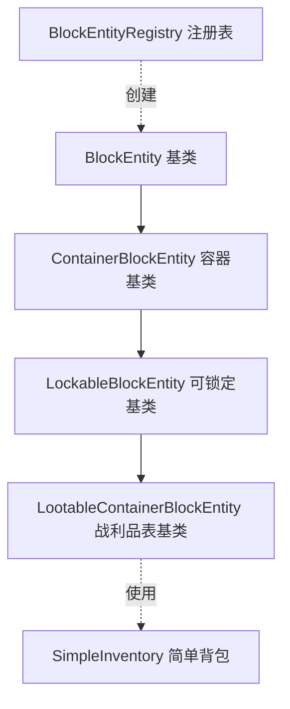

# 方块实体核心模块

方块实体系统的基础设施组件，提供方块实体的注册、锁定、存储、战利品表填充等功能。

## 目录结构

```
core/
├── BlockEntity.hpp              # 方块实体基类
├── BlockEntity.cpp
├── BlockEntityType.hpp          # 类型枚举
├── BlockEntityType.cpp
├── ContainerBlockEntity.hpp     # 容器基类
├── BlockEntityRegistry.hpp      # 方块实体注册表
├── BlockEntityRegistry.cpp
├── LockableBlockEntity.hpp      # 可锁定容器基类
├── LockableBlockEntity.cpp
├── LootableContainerBlockEntity.hpp  # 可填充战利品表的容器基类
├── LootableContainerBlockEntity.cpp
├── SimpleInventory.hpp          # 简单背包实现
├── SimpleInventory.cpp
└── README.md
```

## 文件详解

### BlockEntityRegistry.hpp/cpp

**职责**：管理所有方块实体类型的注册和创建。

**主要功能**：
- `registerType()` - 注册方块实体类型工厂
- `create()` - 根据类型创建方块实体
- `createFromJson()` - 从JSON数据反序列化创建
- `registerBuiltinTypes()` - 注册所有内置类型

**用法示例**：
```cpp
// 注册
BlockEntityRegistry::instance().registerType(
    BlockEntityType::Chest,
    [](const BlockPos& pos) { return std::make_unique<ChestEntity>(pos); }
);

// 创建
auto entity = BlockEntityRegistry::instance().create(BlockEntityType::Chest, BlockPos(0, 0, 0));

// 从JSON创建
nlohmann::json data = {{"id", "minecraft:chest"}, {"x", 0}, {"y", 0}, {"z", 0}};
auto entity = BlockEntityRegistry::instance().createFromJson(data);
```

### LockableBlockEntity.hpp/cpp

**职责**：为容器方块实体提供锁定和自定义名称功能。

**继承关系**：
```
BlockEntity
  └── ContainerBlockEntity
        └── LockableBlockEntity
              ├── LootableContainerBlockEntity
              ├── HopperEntity
              └── AbstractFurnaceEntity
```

**主要功能**：
- `isLocked()` / `setLocked()` - 锁定状态管理
- `getLockKey()` / `setLockKey()` - 钥匙名称
- `canOpen()` - 检查玩家是否可以打开
- `getCustomName()` / `setCustomName()` - 自定义名称
- `getDisplayName()` - 显示名称（优先自定义名）

**锁定机制**：
- 锁定的容器需要手持正确名称的物品才能打开
- 物品显示名匹配锁定钥匙名即为正确钥匙

### LootableContainerBlockEntity.hpp/cpp

**职责**：为容器方块实体提供战利品表自动填充功能。

**继承关系**：
```
LockableBlockEntity
  └── LootableContainerBlockEntity
        ├── ChestEntity
        ├── TrappedChestEntity
        ├── BarrelEntity
        ├── ShulkerBoxEntity
        └── DispenserBlockEntity
```

**主要功能**：
- `hasLootTable()` - 检查是否设置了战利品表
- `getLootTable()` / `getLootTableSeed()` - 获取战利品表信息
- `setLootTable()` - 设置战利品表（结构生成时调用）
- `fillWithLoot()` - 填充战利品（已实现，通过 IWorld::lootTableManager() 获取战利品表管理器）
- `fillWithLootFromTable()` - 使用指定的战利品表管理器填充
- `isEmpty()` - 重写，自动触发战利品表填充
- `openContainer()` - 重写，打开时自动填充

**战利品表填充机制**：
```
1. 结构生成时设置 lootTable 和 lootTableSeed
2. 玩家首次访问容器时自动填充
3. 填充后清除 lootTable 标记，避免重复填充
```

**MC 1.16.5 对齐**：
- 参考 `LockableLootTileEntity.java`
- `isEmpty()`, `getStackInSlot()`, `decrStackSize()`, `removeStackFromSlot()`, `setInventorySlotContents()` 都会触发填充
- `createMenu()` 打开容器时填充
- 通过 `IWorld::lootTableManager()` 获取战利品表管理器（ServerWorld 会返回有效指针）

### SimpleInventory.hpp/cpp

**职责**：通用的背包实现，用于箱子、漏斗等容器。

**主要功能**：
- 指定大小的物品存储
- 物品添加/移除/堆叠
- 变更回调通知
- 序列化支持

**用法示例**：
```cpp
class ChestEntity : public ContainerBlockEntity {
public:
    ChestEntity(const BlockPos& pos)
        : ContainerBlockEntity(BlockEntityType::Chest, pos)
        , m_inventory(27, [this]() { setChanged(); }) {}

    IInventory* getInventory() override { return &m_inventory; }

private:
    SimpleInventory m_inventory;
};
```

## 模块关系



## 依赖项

### 内部依赖
- `world/block/BlockPos.hpp` - 方块位置
- `world/blockentity/BlockEntity.hpp` - 方块实体基类
- `entity/inventory/IInventory.hpp` - 背包接口
- `entity/loot/LootTable.hpp` - 战利品表
- `entity/loot/LootContext.hpp` - 战利品上下文
- `item/ItemStack.hpp` - 物品堆
- `resource/ResourceLocation.hpp` - 资源位置
- `network/PacketSerializer.hpp` - 网络序列化

### 外部依赖
- `nlohmann/json` - JSON 序列化
- `<functional>` - 回调函数
- `<vector>` - 动态数组
- `<array>` - 静态数组

## 容易踩的坑

### 1. 忘记设置变更回调

修改 `SimpleInventory` 的数据后，不会自动通知方块实体保存。必须设置回调：

```cpp
// 正确：设置变更回调
m_inventory(27, [this]() { setChanged(); })

// 错误：忘记回调，数据不会保存
m_inventory(27)
```

### 2. 锁定钥匙匹配逻辑

钥匙匹配使用物品的**显示名**而非物品ID：

```cpp
// 正确：检查显示名
if (heldItem.getCustomName() == m_lockKey) {
    return true;  // 钥匙匹配
}

// 错误：检查物品ID
if (heldItem.getItem()->getId().toString() == m_lockKey) {
    return true;
}
```

### 3. DoubleSidedInventory 生命周期

`DoubleSidedInventory` 不拥有底层容器的所有权：

```cpp
// 错误：返回局部变量的包装器
DoubleSidedInventory getDoubleInventory() {
    SimpleInventory upper(27);
    SimpleInventory lower(27);
    return DoubleSidedInventory(&upper, &lower);  // 悬空指针！
}

// 正确：使用成员变量
DoubleSidedInventory getDoubleInventory() {
    return DoubleSidedInventory(&m_upperChest->getInventory(), &m_lowerChest->getInventory());
}
```

### 4. 战利品表填充时机

`LootableContainerBlockEntity` 的 `fillWithLoot()` 已在基类中实现，子类无需重写。

填充流程：
1. 子类调用 `openContainer()` 或 `isEmpty()` 触发填充
2. 基类 `fillWithLoot()` 通过 `IWorld::lootTableManager()` 获取战利品表管理器
3. 只有 ServerWorld 会返回有效的 `LootTableManager` 指针
4. 调用 `fillWithLootFromTable()` 执行实际的物品生成

```cpp
// 基类已实现，子类无需重写
void LootableContainerBlockEntity::fillWithLoot(Player* player) {
    if (!m_hasLootTable || m_lootFilled) {
        return;
    }
    if (m_world == nullptr) {
        return;
    }
    const loot::LootTableManager* lootTableManager = m_world->lootTableManager();
    if (lootTableManager == nullptr) {
        return;  // 客户端或未初始化的服务端
    }
    fillWithLootFromTable(const_cast<loot::LootTableManager&>(*lootTableManager), player);
}
```

### 5. 注册时序

方块实体注册应在游戏启动时完成：

```cpp
// 在初始化函数中注册
void initializeBlockEntities() {
    auto& registry = BlockEntityRegistry::instance();
    registry.registerType(BlockEntityType::Chest, [](const BlockPos& pos) {
        return std::make_unique<ChestEntity>(pos);
    });
    registry.registerType(BlockEntityType::Sign, [](const BlockPos& pos) {
        return std::make_unique<SignEntity>(pos);
    });
    // ... 其他类型
}
```

## 已注册的方块实体类型

`registerBuiltinTypes()` 方法注册以下方块实体类型：

| 类型 | 类名 | 说明 |
|------|------|------|
| `CraftingTable` | `CraftingTableEntity` | 工作台 |
| `Piston` | `PistonBlockEntity` | 活塞 |
| `Chest` | `ChestEntity` | 箱子 |
| `TrappedChest` | `TrappedChestEntity` | 陷阱箱 |
| `Hopper` | `HopperEntity` | 漏斗 |
| `Dispenser` | `DispenserBlockEntity` | 发射器 |
| `Dropper` | `DropperBlockEntity` | 投掷器 |
| `Furnace` | `FurnaceEntity` | 熔炉 |
| `BlastFurnace` | `BlastFurnaceEntity` | 高炉 |
| `Smoker` | `SmokerEntity` | 烟熏炉 |
| `EnchantingTable` | `EnchantingTableEntity` | 附魔台 |
| `Comparator` | `ComparatorEntity` | 比较器 |
| `DaylightDetector` | `DaylightDetectorEntity` | 日光探测器 |
| `Beacon` | `BeaconEntity` | 信标 |
| `Conduit` | `ConduitEntity` | 潮涌核心 |
| `Sign` | `SignEntity` | 告示牌 |

## 测试用例

测试文件位于 `tests/common/world/blockentity/`：

- `BlockEntityTest.cpp` - 基础方块实体测试和类型ID测试
- `SignEntityTest.cpp` - 告示牌实体测试（类型注册、文本功能）
- `ChestEntityTest.cpp` - 箱子实体测试
- `FurnaceEntityTest.cpp` - 熔炉实体测试
- `HopperEntityTest.cpp` - 漏斗实体测试
- `DoubleSidedInventoryTest.cpp` - 双面背包测试
- `ConduitEntityTest.cpp` - 潮涌核心测试
- `LockableBlockEntityTest.cpp` - 锁定功能测试
- `SimpleInventoryTest.cpp` - 背包功能测试
- `LootableContainerBlockEntityTest.cpp` - 战利品表填充测试
