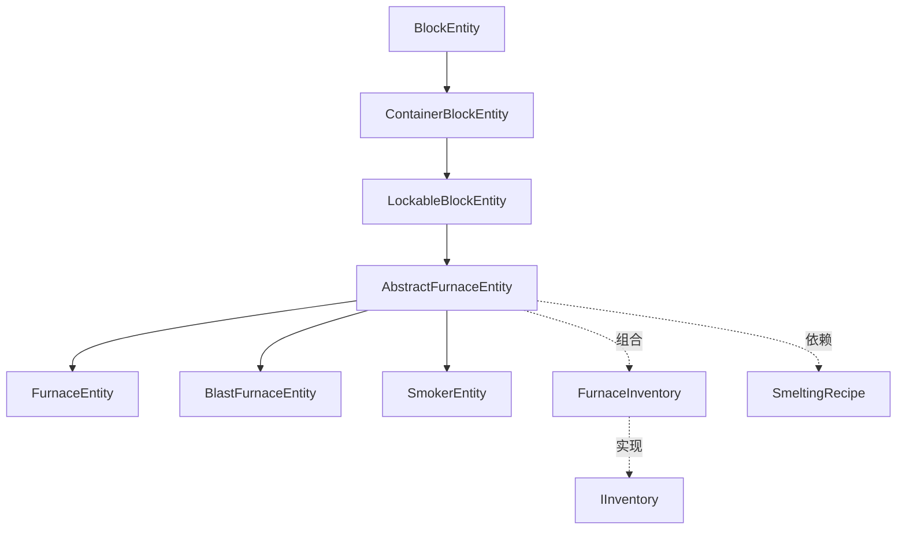

# 加工类方块实体模块

提供熔炉、高炉、烟熏炉等加工类方块实体的实现。

## 目录结构

```
processing/
├── AbstractFurnaceEntity.hpp/cpp  # 熔炉基类
├── FurnaceEntity.hpp/cpp          # 普通熔炉
├── BlastFurnaceEntity.hpp/cpp     # 高炉
├── SmokerEntity.hpp/cpp           # 烟熏炉
├── FurnaceInventory.hpp/cpp       # 熔炉背包
└── README.md
```

## 文件详解

### AbstractFurnaceEntity.hpp/cpp

**职责**：熔炉方块实体基类，提供燃烧和熔炼的通用逻辑。

**主要功能**：
- 燃烧管理（燃烧时间、燃料消耗）
- 熔炼进度（熔炼时间、配方匹配）
- 红石比较器信号
- 锁定功能（继承自LockableBlockEntity）

**熔炼状态机** (参考 MC 1.16.5)：
```
每tick:
1. 如果燃烧中: burnTime--

2. 如果可以熔炼:
   if (burnTime <= 0 && 有燃料):
       消耗燃料
       burnTime = burnTimeTotal
       cookTimeTotal = 配方.熔炼时间

   if (burnTime > 0):
       cookTime++
       if (cookTime >= cookTimeTotal):
           执行熔炼
           cookTime = 0

3. 如果不燃烧但有进度:
   cookTime -= 2  // 进度回退，而非清零
```

**关键方法**：
- `tick()` - 每tick更新
- `isBurning()` - 检查是否正在燃烧
- `getComparatorSignal()` - 红石比较器信号
- `isFuel()` - 检查物品是否为燃料
- `getBurnTime()` - 获取燃料燃烧时间

### FurnaceEntity.hpp/cpp

**职责**：普通熔炉实体。

**特性**：
- 熔炼时间：200 tick
- 配方类型：SMELTING
- 经验倍率：1.0

### BlastFurnaceEntity.hpp/cpp

**职责**：高炉实体，冶炼矿石和金属。

**特性**：
- 熔炼时间：100 tick（2倍速度）
- 配方类型：BLASTING
- 经验倍率：0.5
- 仅能熔炼矿石和金属物品
- **燃料消耗速度是普通熔炉的2倍**（同样燃料只能燃烧一半时间）

**MC 1.16.5 对齐**：
- `canSmelt()` 仅接受 BLASTING 类型配方
- `getBurnTimeForFuel()` 返回基础燃烧时间的一半

### SmokerEntity.hpp/cpp

**职责**：烟熏炉实体，烹饪食物。

**特性**：
- 熔炼时间：100 tick（2倍速度）
- 配方类型：SMOKING
- 经验倍率：0.5
- 仅能烹饪食物
- **燃料消耗速度是普通熔炉的2倍**（同样燃料只能燃烧一半时间）

**MC 1.16.5 对齐**：
- `canSmelt()` 仅接受 SMOKING 类型配方
- `getBurnTimeForFuel()` 返回基础燃烧时间的一半

### FurnaceInventory.hpp/cpp

**职责**：熔炉专用的3槽背包。

**槽位定义**：
```cpp
static constexpr i32 SLOT_INPUT = 0;   // 输入槽
static constexpr i32 SLOT_FUEL = 1;    // 燃料槽
static constexpr i32 SLOT_OUTPUT = 2;  // 输出槽
```

**便捷方法**：
- `getInputItem()` / `setInputItem()` - 输入槽操作
- `getFuelItem()` / `setFuelItem()` - 燃料槽操作
- `getOutputItem()` / `setOutputItem()` - 输出槽操作
- `consumeInput()` / `consumeFuel()` - 消耗物品
- `addToOutput()` - 向输出槽添加物品

## 模块关系



## 依赖项

### 内部依赖
- `world/blockentity/core/LockableBlockEntity.hpp` - 可锁定基类
- `entity/inventory/IInventory.hpp` - 背包接口
- `item/crafting/SmeltingRecipe.hpp` - 熔炼配方

### 外部依赖
- `<memory>` - 智能指针
- `<array>` - 静态数组

## 使用方法

### 创建熔炉实体

```cpp
// 创建普通熔炉
auto furnace = std::make_unique<FurnaceEntity>(BlockPos(0, 0, 0));

// 设置输入物品
furnace->getFurnaceInventory().setInputItem(ItemStack(Items::IRON_ORE, 32));

// 设置燃料
furnace->getFurnaceInventory().setFuelItem(ItemStack(Items::COAL, 64));

// 检查燃烧状态
if (furnace->isBurning()) {
    i32 remaining = furnace->getBurnTime();
    i32 progress = furnace->getCookTime();
}
```

### 创建高炉

```cpp
auto blastFurnace = std::make_unique<BlastFurnaceEntity>(BlockPos(0, 0, 0));
// 高炉只能熔炼矿石和金属
```

### 创建烟熏炉

```cpp
auto smoker = std::make_unique<SmokerEntity>(BlockPos(0, 0, 0));
// 烟熏炉只能烹饪食物
```

## 三种熔炉对比

| 特性 | 普通熔炉 | 高炉 | 烟熏炉 |
|-----|---------|------|-------|
| 熔炼时间 | 200 tick | 100 tick | 100 tick |
| 配方类型 | SMELTING | BLASTING | SMOKING |
| 可熔炼物 | 全部 | 仅矿石/金属 | 仅食物 |
| 经验倍率 | 1.0 | 0.5 | 0.5 |

## 容易踩的坑

### 1. 熔炼进度回退

不燃烧时进度应该回退2，而非清零：

```cpp
// 错误：清零进度
if (!isBurning()) {
    m_cookTime = 0;
}

// 正确：回退进度
if (!isBurning() && m_cookTime > 0) {
    m_cookTime -= 2;
}
```

### 2. 燃料消耗时机

燃料应该在燃烧时间耗尽且需要继续熔炼时才消耗：

```cpp
// 错误：每次都消耗燃料
if (canSmelt()) {
    burnFuel();
}

// 正确：燃烧时间耗尽时才消耗
if (m_burnTime <= 0 && canSmelt() && hasFuel()) {
    burnFuel();
}
```

### 3. 输出槽满检查

熔炼前必须检查输出槽是否可以接受产物：

```cpp
// 错误：未检查输出槽
if (!m_inventory.isInputEmpty()) {
    smelt();
}

// 正确：检查输出槽
if (canSmelt()) {
    smelt();
}

bool canSmelt() const {
    ItemStack output = getRecipeOutput();
    ItemStack current = m_inventory.getOutputItem();
    return current.isEmpty() ||
           (current.canStackWith(output) &&
            current.getCount() + output.getCount() <= current.getMaxStackSize());
}
```

### 4. 配方缓存

每次输入变化时重新查询配方：

```cpp
void tick() {
    // 检查输入是否变化
    ItemStack input = m_inventory.getInputItem();
    if (input != m_lastInput) {
        m_lastRecipe = findRecipe(input);
        m_lastInput = input;
    }
}
```

## 测试用例

测试文件位于 `tests/common/world/blockentity/`：

- `FurnaceEntityTest.cpp` - 熔炉实体测试
- `FurnaceInventoryTest.cpp` - 熔炉背包测试
- `SmeltingRecipeTest.cpp` - 熔炼配方测试

### 测试覆盖

- 燃烧时间管理
- 熔炼进度
- 配方匹配
- 输出槽满处理
- 红石比较器信号
- 锁定功能
- 序列化和反序列化
