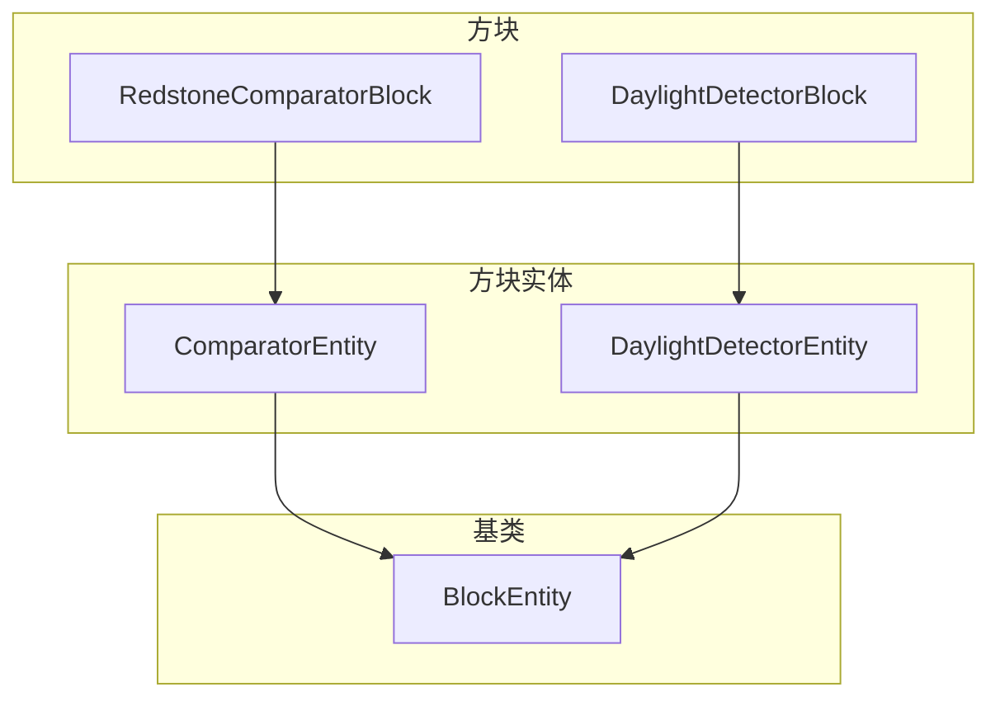

# 红石方块实体 (Redstone Block Entities)

本目录包含红石系统相关的方块实体实现。

## 目录结构

```
redstone/
├── ComparatorEntity.hpp       # 比较器方块实体
├── ComparatorEntity.cpp
├── DaylightDetectorEntity.hpp # 日光探测器方块实体
├── DaylightDetectorEntity.cpp
└── README.md                  # 本文档
```

## 文件介绍

### ComparatorEntity

比较器方块实体，用于存储比较器的输出信号强度。

**核心功能：**
- 存储 `outputSignal` (0-15)
- NBT 序列化/反序列化

**为什么需要 BlockEntity？**

MC Java 中比较器使用 `ComparatorTileEntity` 存储输出信号强度。这实现了"前端信号保持"特性：
- 当比较器从激活变为未激活时，输出信号需要保持一段时间
- 输出信号存储在 BlockEntity 中，而不是实时计算

**MC 1.16.5 参考：** `net.minecraft.tileentity.ComparatorTileEntity`

### DaylightDetectorEntity

日光探测器方块实体，用于管理定期更新。

**核心功能：**
- 每 20 tick 更新一次信号强度
- 检查天空光照条件

**为什么需要 BlockEntity？**

MC Java 中日光探测器有 `DaylightDetectorTileEntity` 实现 `ITickableTileEntity`：
- 避免每 tick 都检测光照（性能优化）
- 每 20 tick 更新一次信号

**MC 1.16.5 参考：** `net.minecraft.tileentity.DaylightDetectorTileEntity`

## 模块关系



## 使用方法

### 创建比较器方块实体

```cpp
#include "world/blockentity/redstone/ComparatorEntity.hpp"

// 创建
auto entity = std::make_unique<ComparatorEntity>(BlockPos(0, 64, 0));

// 设置输出信号
entity->setOutputSignal(10);

// 获取输出信号
i32 signal = entity->getOutputSignal(); // 10
```

### 在方块中使用

```cpp
// RedstoneComparatorBlock.cpp

bool RedstoneComparatorBlock::hasBlockEntity() const {
    return true;
}

std::unique_ptr<BlockEntity> RedstoneComparatorBlock::createBlockEntity(const BlockPos& pos) {
    return std::make_unique<ComparatorEntity>(pos);
}

// 读取存储的信号
i32 RedstoneComparatorBlock::getStoredOutputSignal(IWorld& world, const BlockPos& pos) const {
    BlockEntity* be = world.getBlockEntity(pos);
    if (auto* comparator = dynamic_cast<ComparatorEntity*>(be)) {
        return comparator->getOutputSignal();
    }
    return 0;
}

// 存储信号
void RedstoneComparatorBlock::storeOutputSignal(IWorld& world, const BlockPos& pos, i32 signal) {
    BlockEntity* be = world.getBlockEntity(pos);
    if (auto* comparator = dynamic_cast<ComparatorEntity*>(be)) {
        comparator->setOutputSignal(signal);
    }
}
```

## 依赖项

- `world/blockentity/BlockEntity.hpp` - 方块实体基类
- `world/blockentity/BlockEntityType.hpp` - 方块实体类型枚举
- `world/blockentity/core/BlockEntityRegistry.hpp` - 注册表

## 测试用例

测试文件位于 `tests/common/world/blockentity/`:
- `ComparatorEntityTest.cpp` - 比较器实体测试
- `DaylightDetectorEntityTest.cpp` - 日光探测器实体测试

## 容易踩的坑

### 1. 忘记注册方块实体

必须在 `BlockEntityRegistry::registerBuiltinTypes()` 中注册：

```cpp
registerType(BlockEntityType::Comparator, [](const BlockPos& pos) {
    return std::make_unique<ComparatorEntity>(pos);
});
```

### 2. 信号范围验证

输出信号范围是 0-15，需要在 setter 中验证：

```cpp
void ComparatorEntity::setOutputSignal(i32 signal) {
    MC_ASSERT(signal >= 0 && signal <= 15);
    m_outputSignal = signal;
    setChanged(); // 别忘了标记已修改
}
```

### 3. 方块创建时创建实体

方块放置时需要自动创建 BlockEntity：

```cpp
void RedstoneComparatorBlock::onBlockAdded(IWorld& world, const BlockPos& pos,
                                           const BlockState& state) {
    // 创建 BlockEntity
    if (!world.getBlockEntity(pos)) {
        world.setBlockEntity(pos, createBlockEntity(pos).release());
    }
    // ... 其他逻辑
}
```

### 4. 方块移除时清理实体

方块移除时需要清理 BlockEntity：

```cpp
void RedstoneComparatorBlock::onBlockRemoved(IWorld& world, const BlockPos& pos,
                                             const BlockState& state) {
    world.removeBlockEntity(pos);
    // ... 其他逻辑
}
```
