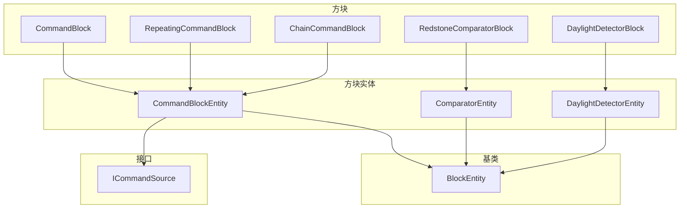
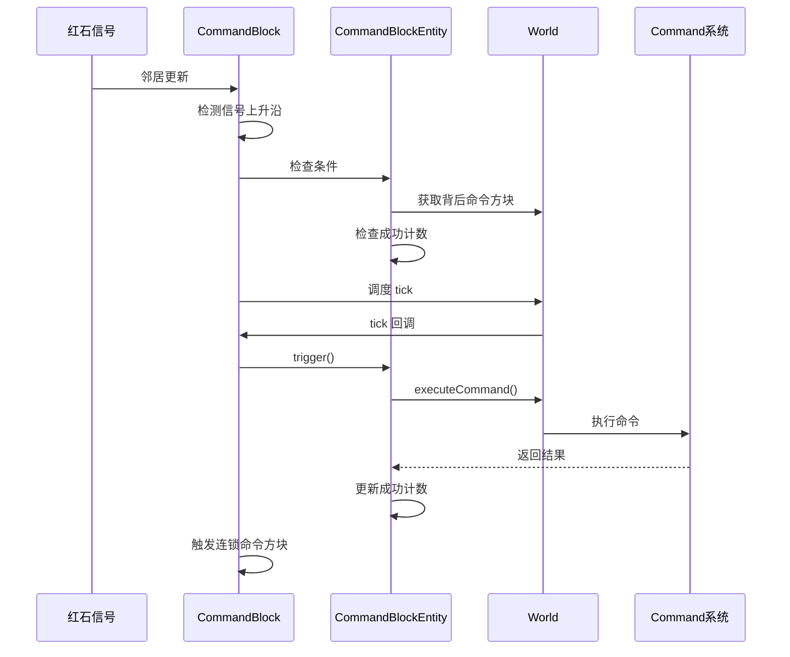

# 红石方块实体 (Redstone Block Entities)

本目录包含红石系统相关的方块实体实现。

## 目录结构

```
redstone/
├── CommandBlockEntity.hpp     # 命令方块实体
├── CommandBlockEntity.cpp
├── ComparatorEntity.hpp       # 比较器方块实体
├── ComparatorEntity.cpp
├── DaylightDetectorEntity.hpp # 日光探测器方块实体
├── DaylightDetectorEntity.cpp
└── README.md                  # 本文档
```

## 文件介绍

### CommandBlockEntity

命令方块实体，存储命令方块的命令、执行状态和输出信息。

**三种模式：**
- `CommandBlockMode::Redstone` - 脉冲模式（红石信号上升沿触发）
- `CommandBlockMode::Auto` - 循环模式（每 tick 自动执行）
- `CommandBlockMode::Sequence` - 连锁模式（被前一个命令方块触发）

**核心功能：**
- 存储命令字符串
- 执行命令并记录成功计数
- 支持条件执行（检测背后命令方块的成功计数）
- JSON 序列化/反序列化
- 实现 `ICommandSource` 接口

**为什么需要 BlockEntity？**

MC Java 中命令方块使用 `CommandBlockTileEntity` 存储命令和状态：
- 命令字符串可能很长，无法存储在方块状态中
- 需要存储成功计数用于比较器输出
- 需要存储最后输出用于日志
- 循环模式需要 tick 更新

**MC 1.16.5 参考：** `net.minecraft.tileentity.CommandBlockTileEntity`

**使用示例：**
```cpp
#include "world/blockentity/redstone/CommandBlockEntity.hpp"

// 创建命令方块实体
auto entity = std::make_unique<CommandBlockEntity>(BlockPos(0, 64, 0));

// 设置命令
entity->setCommand("say Hello World");

// 设置模式
entity->setMode(CommandBlockMode::Auto);
entity->setAuto(true);

// 执行命令（需要世界对象）
entity->trigger(world);

// 获取成功计数（用于比较器输出）
i32 successCount = entity->getSuccessCount();
```

**条件执行：**
```cpp
// 检查条件是否满足（条件模式）
bool conditionMet = entity->checkCondition(world, Direction::North, isConditional);
```

### ComparatorEntity

比较器方块实体，用于存储比较器的输出信号强度。

**核心功能：**
- 存储 `outputSignal` (0-15)
- NBT 序列化/反序列化

**为什么需要 BlockEntity？**

MC Java 中比较器使用 `ComparatorTileEntity` 存储输出信号强度。这实现了"前端信号保持"特性：
- 当比较器从激活变为未激活时，输出信号需要保持一段时间
- 输出信号存储在 BlockEntity 中，而不是实时计算

**MC 1.16.5 参考：** `net.minecraft.tileentity.ComparatorTileEntity`

### DaylightDetectorEntity

日光探测器方块实体，用于管理定期更新。

**核心功能：**
- 每 20 tick 更新一次信号强度
- 检查天空光照条件

**为什么需要 BlockEntity？**

MC Java 中日光探测器有 `DaylightDetectorTileEntity` 实现 `ITickableTileEntity`：
- 避免每 tick 都检测光照（性能优化）
- 每 20 tick 更新一次信号

**MC 1.16.5 参考：** `net.minecraft.tileentity.DaylightDetectorTileEntity`

## 模块关系



## 命令方块执行流程



## 使用方法

### 创建命令方块实体

```cpp
#include "world/blockentity/redstone/CommandBlockEntity.hpp"

// 创建脉冲命令方块
auto entity = std::make_unique<CommandBlockEntity>(BlockPos(0, 64, 0));

// 创建循环命令方块
auto repeating = std::make_unique<CommandBlockEntity>(BlockPos(0, 64, 0), CommandBlockMode::Auto);

// 创建连锁命令方块
auto chain = std::make_unique<CommandBlockEntity>(BlockPos(0, 64, 0), CommandBlockMode::Sequence);
```

### 在方块中使用

```cpp
// CommandBlock.cpp

bool CommandBlock::hasBlockEntity() const {
    return true;
}

std::unique_ptr<BlockEntity> CommandBlock::createBlockEntity(const BlockPos& pos) {
    return std::make_unique<CommandBlockEntity>(pos);
}

// RepeatingCommandBlock.cpp

std::unique_ptr<BlockEntity> RepeatingCommandBlock::createBlockEntity(const BlockPos& pos) {
    return std::make_unique<CommandBlockEntity>(pos, CommandBlockMode::Auto);
}

// ChainCommandBlock.cpp

std::unique_ptr<BlockEntity> ChainCommandBlock::createBlockEntity(const BlockPos& pos) {
    return std::make_unique<CommandBlockEntity>(pos, CommandBlockMode::Sequence);
}
```

### 命令执行

```cpp
// 触发命令执行
if (entity->trigger(world)) {
    // 命令执行成功
    i32 successCount = entity->getSuccessCount();
    const std::string& output = entity->getLastOutput();
}
```

## 依赖项

- `world/blockentity/BlockEntity.hpp` - 方块实体基类
- `world/blockentity/BlockEntityType.hpp` - 方块实体类型枚举
- `world/blockentity/core/BlockEntityRegistry.hpp` - 注册表
- `command/ICommandSource.hpp` - 命令源接口

## 测试用例

测试文件位于 `tests/common/world/blockentity/`:
- `CommandBlockEntityTest.cpp` - 命令方块实体测试
- `ComparatorEntityTest.cpp` - 比较器实体测试
- `DaylightDetectorEntityTest.cpp` - 日光探测器实体测试

## 容易踩的坑

### 1. 忘记注册方块实体

必须在 `BlockEntityRegistry::registerBuiltinTypes()` 中注册：

```cpp
registerType(BlockEntityType::CommandBlock, [](const BlockPos& pos) {
    return std::make_unique<CommandBlockEntity>(pos);
});
```

### 2. 成功计数范围

成功计数范围是 0-15，用于比较器输出信号强度：

```cpp
void CommandBlockEntity::setSuccessCount(i32 count) {
    m_successCount = std::clamp(count, 0, 15);
    setChanged();
}
```

### 3. 同一 tick 防止重复执行

`trigger()` 方法会检查 `m_lastExecution` 防止同一 tick 内重复执行：

```cpp
bool CommandBlockEntity::trigger(IWorld& world) {
    i64 currentTick = world.currentTick();
    if (currentTick == m_lastExecution) {
        return false; // 同一 tick 已执行
    }
    // ... 执行命令
    m_lastExecution = currentTick;
    return true;
}
```

### 4. 条件执行检查

条件模式下需要检查背后命令方块的成功计数：

```cpp
bool CommandBlockEntity::checkCondition(IWorld& world, Direction facing, bool isConditional) {
    if (!isConditional) {
        return true; // 非条件模式
    }
    // 获取背后命令方块并检查成功计数
    BlockPos behindPos = m_pos.offset(Directions::opposite(facing));
    // ...
}
```

### 5. 方块创建时创建实体

方块放置时需要自动创建 BlockEntity：

```cpp
void CommandBlock::onBlockAdded(IWorld& world, const BlockPos& pos,
                                 const BlockState& state) {
    if (!world.getBlockEntity(pos)) {
        world.setBlockEntity(pos, createBlockEntity(pos).release());
    }
}
```

### 6. 方块移除时清理实体

方块移除时需要清理 BlockEntity：

```cpp
void CommandBlock::onBlockRemoved(IWorld& world, const BlockPos& pos,
                                   const BlockState& state) {
    world.removeBlockEntity(pos);
}
```

### 7. 彩蛋命令

输入命令 "Searge" 会返回 "#itzlipofutzli"（MC 开发者彩蛋）：

```cpp
if (m_command == "Searge") {
    m_lastOutput = "#itzlipofutzli";
    m_successCount = 1;
    return true;
}
```
