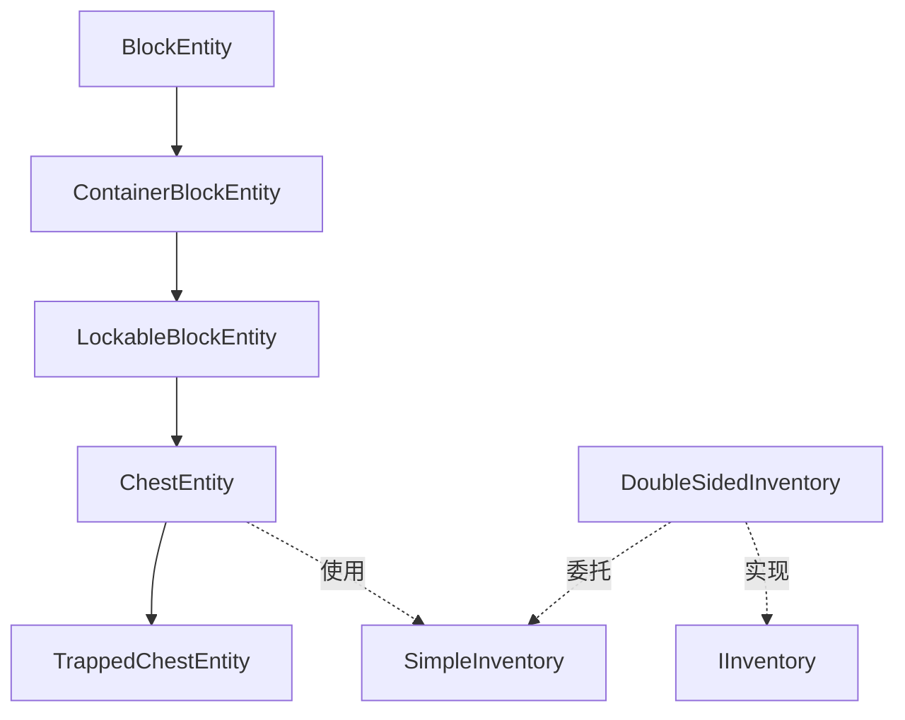

# 存储类方块实体模块

提供箱子、陷阱箱等存储类方块实体的实现。

## 目录结构

```
storage/
├── ChestEntity.hpp/cpp       # 箱子实体
├── TrappedChestEntity.hpp/cpp # 陷阱箱实体
├── DoubleSidedInventory.hpp/cpp # 双箱合并容器
└── README.md
```

## 文件详解

### ChestEntity.hpp/cpp

**职责**：箱子方块实体，存储27格物品。

**主要功能**：
- 27格物品存储
- 打开计数和盖子动画
- 双箱检测与合并
- 红石比较器信号
- 锁定功能（继承自LockableBlockEntity）

**关键方法**：
- `isDoubleChest()` - 检查是否是双箱
- `getConnectedChest()` - 获取相邻箱子
- `getDoubleInventory()` - 获取合并后的双箱容器
- `getComparatorSignal()` - 计算红石信号
- `getLidAngle()` - 获取盖子角度（动画用）
- `tick()` - 更新盖子动画

**动画机制**：
```cpp
// 每tick更新盖子角度
if (m_openCount > 0) {
    m_lidAngle += 0.1f;  // 打开
} else {
    m_lidAngle -= 0.1f;  // 关闭
}
m_lidAngle = clamp(m_lidAngle, 0.0f, 1.0f);
```

### TrappedChestEntity.hpp/cpp

**职责**：陷阱箱实体，输出红石信号。

**主要功能**：
- 继承自ChestEntity
- 红石信号输出 = 打开玩家数（最大15）
- 打开/关闭时通知邻居更新

**关键方法**：
- `getRedstoneSignal()` - 获取红石信号强度
- `openContainer()` / `closeContainer()` - 重写以通知邻居

### DoubleSidedInventory.hpp/cpp

**职责**：双箱合并容器，将两个27格箱子合并为54格。

**主要功能**：
- 委托模式，操作转发到底层两个箱子
- 54格容器（27+27）
- 槽位映射：前27格→上半部分，后27格→下半部分

**使用方式**：
```cpp
if (chestA.isDoubleChest(world)) {
    auto doubleInv = chestA.getDoubleInventory(world);
    // 使用54格容器
    ItemStack item = doubleInv->getItem(0);   // 来自chestA
    ItemStack item2 = doubleInv->getItem(27); // 来自chestB
}
```

## 模块关系



## 依赖项

### 内部依赖
- `world/blockentity/core/LockableBlockEntity.hpp` - 可锁定基类
- `world/blockentity/core/SimpleInventory.hpp` - 简单背包
- `entity/inventory/IInventory.hpp` - 背包接口

### 外部依赖
- `<memory>` - 智能指针
- `<array>` - 静态数组
- `<functional>` - 回调函数

## 使用方法

### 创建箱子实体

```cpp
// 创建箱子
auto chest = std::make_unique<ChestEntity>(BlockPos(0, 0, 0));

// 设置物品
chest->getInventory()->setItem(0, ItemStack(Items::DIAMOND, 64));

// 打开箱子
chest->openContainer();

// 获取红石信号
i32 signal = chest->getComparatorSignal(world);
```

### 双箱合并

```cpp
// 检查双箱
if (chest.isDoubleChest(world)) {
    // 获取合并容器
    auto doubleInv = chest.getDoubleInventory(world);

    // 操作54格容器
    doubleInv->setItem(0, ItemStack(Items::DIAMOND, 32));
    doubleInv->setItem(27, ItemStack(Items::IRON, 64));
}
```

## 容易踩的坑

### 1. 双箱生命周期

DoubleSidedInventory不拥有底层箱子的所有权：

```cpp
// 错误：返回局部变量的包装器
DoubleSidedInventory getDoubleInventory() {
    SimpleInventory temp1(27), temp2(27);
    return DoubleSidedInventory(&temp1, &temp2);  // 悬空指针！
}

// 正确：使用成员变量
DoubleSidedInventory getDoubleInventory() {
    return DoubleSidedInventory(&m_inventory, &connected->m_inventory);
}
```

### 2. 打开计数同步

箱子打开计数需要定期同步，避免客户端和服务端不一致：

```cpp
void tick(World& world) {
    ++m_ticksSinceSync;

    // 每200tick重新计算
    if (!world.isRemote() && m_ticksSinceSync % 200 == 0) {
        m_openCount = calculatePlayersUsing(world);
    }
}
```

### 3. 盖子音效

只在RIGHT或SINGLE类型播放音效，避免双箱重复播放：

```cpp
void playSound(World& world, bool open) {
    ChestType type = getChestType();
    if (type == ChestType::LEFT) {
        return;  // 左半部分不播放
    }
    // ...播放音效
}
```

## 测试用例

测试文件位于 `tests/common/world/blockentity/`：

- `ChestEntityTest.cpp` - 箱子实体测试
- `DoubleSidedInventoryTest.cpp` - 双箱容器测试
- `TrappedChestTest.cpp` - 陷阱箱测试

### 测试覆盖

- 物品存取和堆叠
- 打开计数和动画
- 双箱合并和分离
- 红石比较器信号
- 锁定功能
- 序列化和反序列化
