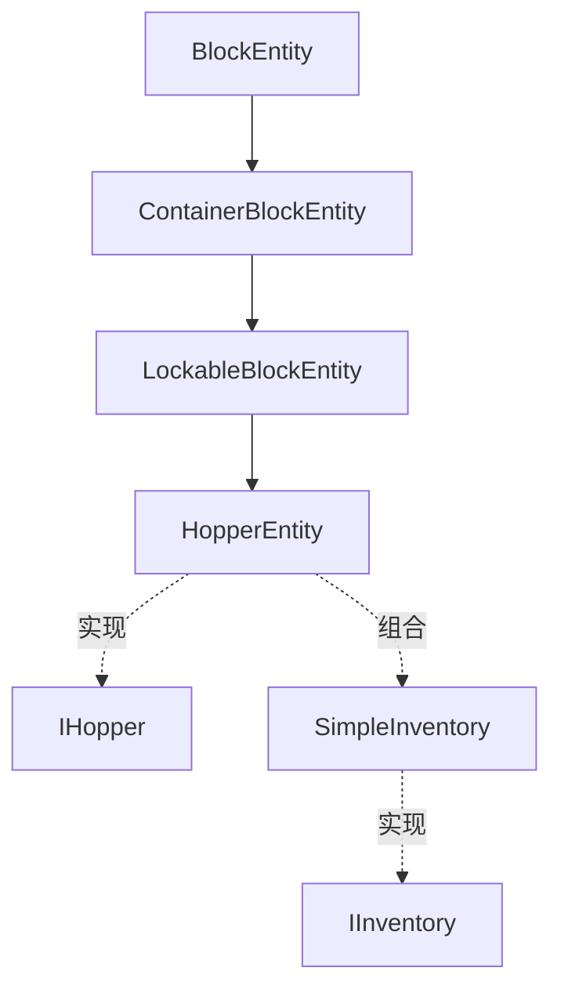

# 传输类方块实体模块

提供漏斗等传输类方块实体的实现。

## 目录结构

```
transport/
├── IHopper.hpp/cpp       # 漏斗接口
├── HopperEntity.hpp/cpp  # 漏斗实体
└── README.md
```

## 文件详解

### IHopper.hpp/cpp

**职责**：漏斗接口，统一处理漏斗方块和漏斗矿车。

**主要功能**：
- 定义漏斗的位置获取接口
- 提供收集区域计算
- 定义输出方向接口

**关键方法**：
```cpp
class IHopper {
public:
    virtual ~IHopper() = default;

    // 位置接口
    virtual IWorld* getWorld() = 0;
    virtual double getXPos() const = 0;
    virtual double getYPos() const = 0;
    virtual double getZPos() const = 0;
    virtual BlockPos getHopperPos() const = 0;

    // 输出方向
    virtual Direction getOutputDirection() const;

    // 静态工具方法
    static AxisAlignedBB getCollectionArea(const IHopper& hopper);
    static BlockPos getOutputPosition(const IHopper& hopper);
};
```

**收集区域**：
- 碗状内部区域：(2/16, 11/16, 2/16) 到 (14/16, 1, 14/16)
- 上方方块：(0, 1, 0) 到 (1, 2, 1)

### HopperEntity.hpp/cpp

**职责**：漏斗方块实体，实现物品传输逻辑。

**主要功能**：
- 5格物品存储
- 8 tick 传输冷却
- 从上方容器拉取物品
- 向下方容器输出物品
- 收集上方物品实体
- 红石信号禁用
- **ISidedInventory 接口支持**（正确处理熔炉等方向性容器）

**MC 1.16.5 对齐**：
- 使用 ISidedInventory.getSlotsForFace() 获取可访问槽位
- 使用 ISidedInventory.canInsertItem() 检查是否可插入
- 使用 ISidedInventory.canExtractItem() 检查是否可提取
- 非方向性容器回退到全槽位访问

**关键常量**：
```cpp
static constexpr i32 HOPPER_SIZE = 5;           // 槽位数量
static constexpr i32 TRANSFER_COOLDOWN = 8;     // 正常冷却
static constexpr i32 TRANSFER_COOLDOWN_CHAIN = 7; // 漏斗链优化
```

**传输逻辑** (参考 MC 1.16.5 HopperTileEntity)：
```cpp
void HopperEntity::tick(IWorld& world) {
    if (!isEnabled()) return;  // 红石禁用

    if (m_transferCooldown > 0) {
        m_transferCooldown--;
        return;
    }

    // 优先输出物品
    if (!isEmpty()) {
        if (transferItemsOut()) {
            setTransferCooldown(TRANSFER_COOLDOWN);
            return;
        }
    }

    // 然后拉取物品
    if (!isFull()) {
        if (pullItems(*this)) {
            setTransferCooldown(TRANSFER_COOLDOWN);
        }
    }
}
```

**静态工具方法**：
- `pullItems(IHopper&)` - 拉取物品到漏斗
- `captureItem(IInventory*, ItemEntity*)` - 捕获物品实体
- `getInventoryAtPosition(IWorld*, BlockPos)` - 获取位置处的容器
- `getSourceInventory(IHopper&)` - 获取漏斗上方容器
- `getCaptureItems(IHopper&)` - 获取收集区域内的物品实体
- `putStackInInventoryAllSlots(...)` - 将物品插入容器

**漏斗链优化**：
- 当物品从一个漏斗传输到另一个漏斗时
- 目标漏斗的冷却时间减少1 tick（7 tick而非8 tick）
- 这允许物品在同tick内继续传输

## 模块关系



## 依赖项

### 内部依赖
- `world/blockentity/core/LockableBlockEntity.hpp` - 可锁定基类
- `world/blockentity/core/SimpleInventory.hpp` - 简单背包
- `entity/inventory/IInventory.hpp` - 背包接口
- `entity/ItemEntity.hpp` - 物品实体

### 外部依赖
- `<memory>` - 智能指针
- `<vector>` - 动态数组
- `<functional>` - 回调函数

## 使用方法

### 创建漏斗实体

```cpp
// 创建漏斗
auto hopper = std::make_unique<HopperEntity>(BlockPos(0, 0, 0));

// 设置物品
hopper->getInventory()->setItem(0, ItemStack(Items::DIAMOND, 64));

// 检查是否已满
if (hopper->isFull()) {
    // 漏斗已满
}

// 设置传输冷却
hopper->setTransferCooldown(8);
```

### 物品传输

```cpp
// 拉取物品
if (HopperEntity::pullItems(*hopper)) {
    // 成功拉取
}

// 获取上方容器
IInventory* sourceInv = HopperEntity::getSourceInventory(*hopper);
```

### 获取输出容器

```cpp
// 获取漏斗输出方向
Direction outputDir = hopper->getOutputDirection();
BlockPos outputPos = hopper->getPos().offset(outputDir);

// 获取输出容器
IInventory* targetInv = HopperEntity::getInventoryAtPosition(world, outputPos);
```

## 容易踩的坑

### 1. 传输冷却管理

传输冷却必须在成功传输后设置，否则会连续传输：

```cpp
// 错误：忘记设置冷却
if (transferItemsOut()) {
    // 漏斗会每tick都传输！
}

// 正确：设置冷却
if (transferItemsOut()) {
    setTransferCooldown(TRANSFER_COOLDOWN);
}
```

### 2. 漏斗自循环

检测目标容器是否是漏斗自己：

```cpp
// 错误：漏斗向自己输出
IInventory* target = getInventoryForHopperTransfer();
if (target == this) {
    return false;  // 避免自循环
}
```

### 3. 空指针检查

获取容器时必须检查空指针：

```cpp
// 危险：未检查空指针
IInventory* inv = getInventoryAtPosition(world, pos);
inv->getItem(0);  // 可能崩溃！

// 正确：检查空指针
IInventory* inv = getInventoryAtPosition(world, pos);
if (inv != nullptr) {
    inv->getItem(0);
}
```

### 4. 物品实体捕获

捕获物品实体后需要正确处理：

```cpp
// 错误：捕获后未更新物品实体
ItemStack remaining = putStackInInventoryAllSlots(...);
// itemEntity 可能还有剩余物品！

// 正确：处理剩余物品
if (remaining.isEmpty()) {
    itemEntity->remove();  // 完全捕获
} else {
    itemEntity->setItemStack(remaining);  // 更新数量
}
```

### 5. 红石状态同步

红石状态变化时需要更新方块状态：

```cpp
void HopperBlock::updateState(IWorld& world, BlockPos pos, BlockState state) {
    bool powered = world.isBlockPowered(pos);
    bool enabled = !powered;
    bool currentEnabled = state.get(ENABLED);

    if (enabled != currentEnabled) {
        world.setBlockState(pos, state.with(ENABLED, enabled), 4);
    }
}
```

## 红石行为

### 红石信号
- **有红石信号**：漏斗禁用，不传输物品
- **无红石信号**：漏斗启用，正常传输

### 比较器信号
- 输出信号基于填充度
- 公式：`signal = floor(fillRatio * 14) + (nonEmpty ? 1 : 0)`
- 最大信号：15

```cpp
i32 getComparatorSignal() {
    i32 totalItems = 0;
    for (i32 i = 0; i < 5; ++i) {
        totalItems += getItem(i).getCount();
    }
    i32 maxItems = 5 * 64;
    f32 fillRatio = totalItems / maxItems;
    i32 signal = static_cast<i32>(fillRatio * 14);
    if (totalItems > 0) signal += 1;
    return std::min(signal, 15);
}
```

## 测试用例

测试文件位于 `tests/common/world/blockentity/`：

- `HopperEntityTest.cpp` - 漏斗实体测试
- `HopperContainerTest.cpp` - 漏斗容器测试

### 测试覆盖

- 物品存取和堆叠
- 传输冷却机制
- 物品拉取和输出
- 物品实体捕获
- 红石禁用
- 红石比较器信号
- 锁定功能
- 序列化和反序列化
