# Chunk 模块

本目录包含 Minecraft 区块系统的核心实现，参考 Minecraft Java Edition 1.16.5 的架构设计。

## 目录结构

```
src/common/world/chunk/
├── ChunkData.hpp/cpp              # 区块数据存储
├── ChunkDistanceGraph.hpp/cpp     # 区块距离图（BFS 级别传播）
├── ChunkLoadTicket.hpp            # 区块加载票据类型定义
├── ChunkLoadTicketManager.hpp/cpp # 票据管理器
├── ChunkPos.hpp                   # 区块/段位置类型
├── ChunkPrimer.hpp/cpp            # 区块生成中间状态
├── ChunkStatus.hpp/cpp            # 区块生成阶段定义
├── IChunk.hpp/cpp                 # 区块接口和基础类型
└── SingleChunkLifecycleManager.hpp/cpp  # 单区块生命周期管理
```

## 文件详解

### ChunkPos.hpp

**职责**：定义区块位置和区块段位置的类型。

**主要内容**：
- `ChunkPos` - 区块位置类，存储区块的 X/Z 坐标
  - 支持从方块位置、Vector3 转换
  - 提供 64 位唯一 ID 转换
  - 曼哈顿距离和切比雪夫距离计算
  - 相邻区块获取（北/南/东/西）
- `SectionPos` - 区块段位置类，标识 16x16x16 的区块段
  - 包含 Y 坐标（段索引）
  - 支持长整型编码/解码
  - 方向偏移

**使用示例**：
```cpp
ChunkPos pos(10, 20);              // 区块 (10, 20)
BlockPos blockPos(160, 64, 320);
ChunkPos fromBlock(blockPos);      // 从方块位置转换
u64 id = pos.toId();               // 唯一 ID
ChunkPos::fromId(id);              // 从 ID 恢复
pos.chebyshevDistance(other);      // 计算距离
```

---

### IChunk.hpp/cpp

**职责**：定义区块接口和基础类型，提供统一的区块访问 API。

**主要内容**：
- `ChunkLoadStatus` - 区块加载状态枚举
  - `Empty` - 空区块，刚创建
  - `Generating` - 正在生成
  - `Generated` - 已生成，完整
  - `Loaded` - 已加载到内存
  - `Unloaded` - 已卸载
- `HeightmapType` - 高度图类型枚举
  - `WorldSurface` - 最高非空气方块
  - `OceanFloor` - 最高固体方块
  - `MotionBlocking` - 最高阻挡运动方块
  - 等 7 种类型
- `IChunk` - 区块接口（抽象类）
  - 位置信息（x, z, pos）
  - 方块访问（getBlock, setBlock）
  - 区块段访问（getSection, createSection）
  - 生物群系访问
  - 高度图操作
  - 状态管理
- `BiomeContainer` - 生物群系容器
  - 4x4x4 采样点（每个区块 64 个采样点）
  - 方块坐标到采样点的映射
  - 序列化/反序列化
- `Heightmap` - 高度图
  - 16x16 高度数据（每个 XZ 位置的最高 Y 坐标）
  - 根据高度图类型判断方块是否"不透明"

**依赖项**：
- `BlockState` - 方块状态
- `ChunkSection` - 区块段

---

### ChunkData.hpp/cpp

**职责**：完整的区块数据存储，是区块系统的核心数据结构。

**主要内容**：
- `ChunkSection` - 区块段（16x16x16 方块）
  - 方块状态 ID 存储（4096 个方块）
  - 天空光照和方块光照（NibbleArray）
  - 非空气方块计数
  - 序列化/反序列化
- `ChunkData` - 完整区块数据（实现 IChunk 接口）
  - 16 个区块段（总高度 256）
  - 高度图（多种类型）
  - 生物群系数据
  - 区块状态（加载状态、脏标记等）
  - 光照数据访问
  - 序列化/反序列化
- `ChunkDataRef` - 区块数据引用（轻量级访问）
- `ChunkId` - 区块唯一标识符（包含维度）

**关键特性**：
- 懒创建区块段（只有设置非空气方块时才创建段）
- 边界检查（越界访问返回安全默认值）
- 高效的光照存储（NibbleArray，每值 4 位）

**依赖项**：
- `IChunk` - 区块接口
- `BlockState` / `BlockRegistry` - 方块状态
- `NibbleArray` - 4 位数组
- `BiomeContainer` - 生物群系容器

---

### ChunkStatus.hpp/cpp

**职责**：定义区块生成的各个阶段，参考 MC 1.16.5。

**主要内容**：
- `ChunkType` - 区块类型枚举
  - `PROTOCHUNK` - 原型区块（生成中）
  - `LEVELCHUNK` - 完整区块（可加载）
- `HeightmapFlag` - 高度图标志位
  - 生成前和生成后两种组合
- `ChunkStatus` - 区块生成阶段类
  - 名称、序号、父阶段
  - 需要的邻居区块范围（taskRange）
  - 更新的高度图类型
  - 区块类型

**生成流程**（13 个阶段）：
```
EMPTY → STRUCTURE_STARTS → STRUCTURE_REFERENCES → BIOMES → NOISE →
SURFACE → CARVERS → LIQUID_CARVERS → FEATURES → LIGHT → SPAWN →
HEIGHTMAPS → FULL
```

**阶段说明**：
| 阶段 | taskRange | 说明 |
|------|-----------|------|
| EMPTY | -1 | 初始状态 |
| STRUCTURE_STARTS | 0 | 结构起点生成 |
| STRUCTURE_REFERENCES | 8 | 结构引用计算 |
| BIOMES | 0 | 生物群系生成 |
| NOISE | 8 | 噪声地形生成 |
| SURFACE | 0 | 地表生成 |
| CARVERS | 0 | 空气雕刻（洞穴、峡谷） |
| LIQUID_CARVERS | 0 | 液体雕刻（水下洞穴） |
| FEATURES | 8 | 地物放置（树木、矿石） |
| LIGHT | 1 | 光照计算 |
| SPAWN | 0 | 生物生成点计算 |
| HEIGHTMAPS | 0 | 最终高度图更新 |
| FULL | 0 | 完成 |

---

### ChunkPrimer.hpp/cpp

**职责**：区块生成过程中的中间状态类。

**主要内容**：
- 继承 `IChunk` 接口
- 管理生成状态（ChunkStatus）
- 生物群系数据
- 高度图（多种类型）
- 光源位置列表
- 雕刻掩码（空气雕刻和液体雕刻）
- 生成的实体数据
- 结构起点（用于 Jigsaw 结构生成）
- 转换为 ChunkData 的方法

**使用流程**：
```cpp
// 1. 创建 ChunkPrimer
ChunkPrimer primer(x, z);

// 2. 按阶段生成
primer.setChunkStatus(ChunkStatuses::BIOMES);
generateBiomes(primer);

primer.setChunkStatus(ChunkStatuses::NOISE);
generateNoise(primer);

// ... 其他阶段 ...

// 3. 转换为 ChunkData
auto chunkData = primer.toChunkData();
```

**关键方法**：
- `initializeSkyLight()` - 初始化天空光照
- `initializeBlockLight()` - 初始化方块光照
- `updateAllHeightmaps()` - 更新所有高度图

**依赖项**：
- `ChunkData` - 底层区块数据
- `ChunkStatus` - 生成阶段
- `Heightmap` - 高度图
- `StructureStart` - 结构起点

---

### ChunkLoadTicket.hpp

**职责**：定义区块加载票据类型，用于管理区块加载优先级。

**主要内容**：
- `Unit` - 空类型，用于不需要值的票据
- `ChunkLoadTicketType<T>` - 票据类型模板
  - 名称、比较器、生命周期
  - 支持带过期时间的票据（如传送门）
- `ChunkLoadTicket` - 区块加载票据
  - 票据类型、级别、时间戳
  - 过期检查
- `ChunkTicketSet` - 票据集合
  - 自动计算最小级别
  - 过期票据清理
- `ChunkLoadLevel` - 区块加载级别枚举
  - `Full (31)` - 完全加载
  - `EntityTicking (32)` - 实体可 tick
  - `Border (33)` - 边界区块
  - `Unloaded (34)` - 未加载
- `TicketTypes` - 预定义票据类型
  - `PLAYER` - 玩家票据
  - `FORCED` - 强制加载
  - `PORTAL` - 传送门（300 tick）
  - `POST_TELEPORT` - 传送后（5 tick）
  - 等

**票据级别说明**：
- 级别越小，优先级越高
- Level <= 33 的区块应该被加载
- 玩家票据级别 = 33 - 视距

---

### ChunkLoadTicketManager.hpp/cpp

**职责**：管理所有区块的票据，计算区块加载级别。

**主要内容**：
- `ChunkLoadTicketManager` - 票据管理器
  - 票据注册/移除
  - 玩家位置更新
  - 玩家追踪管理
  - 级别变化回调
  - 追踪变化回调

**关键方法**：
```cpp
// 注册票据
manager.registerTicket(TicketTypes::FORCED, x, z, level, ChunkPos(x, z));

// 移除票据
manager.releaseTicket(TicketTypes::FORCED, x, z, level, ChunkPos(x, z));

// 更新玩家位置
manager.updatePlayerPosition(playerId, chunkX, chunkZ);

// 移除玩家
manager.removePlayer(playerId);

// 设置视距
manager.setViewDistance(10);

// 获取追踪某区块的玩家
auto players = manager.getTrackingPlayers(x, z);
```

**追踪系统**：

- 玩家进入区块视距范围时触发 `TrackingChangeCallback(playerId, x, z, true)`
- 玩家离开区块视距范围时触发 `TrackingChangeCallback(playerId, x, z, false)`

**当前实现特性**：

- 票据级别变化会统一驱动区块生命周期，而不是只更新数值
- 玩家、强制加载、传送门、传送后、世界启动、末影龙、光照等票据都会进入同一调度管线
- 当区块离开有效加载范围时，会主动触发取消，避免 Worker 继续消耗算力

**依赖项**：

- `ChunkLoadTicket` - 票据类型
- `ChunkDistanceGraph` - 距离图
- `PlayerChunkTracker` - 玩家追踪器

---

### ChunkDistanceGraph.hpp/cpp

**职责**：BFS 级别传播算法，计算区块加载级别。

**主要内容**：

- `ChunkDistanceGraph` - 区块距离图基类
  - 级别传播算法（Dijkstra 风格）
  - 更新队列处理
  - 级别变化回调
- `PlayerChunkTracker` - 玩家区块追踪器
  - 继承 ChunkDistanceGraph
  - 视距管理
  - 视距内区块集合

**算法原理**：

```text
1. 源区块设置初始级别（如玩家位置 level = 23）
2. 级别向相邻区块传播，每次传播 +1
3. 相邻区块的级别 = min(当前级别, 源级别+1)
4. 级别 <= 33 的区块应该被加载
```

**使用示例**：

```cpp
PlayerChunkTracker tracker(10);  // 视距 10
tracker.setLevelChangeCallback([](ChunkCoord x, ChunkCoord z, i32 oldLevel, i32 newLevel) {
    if (newLevel <= 33 && oldLevel > 33) {
        // 区块被加载
    } else if (newLevel > 33 && oldLevel <= 33) {
        // 区块被卸载
    }
});

tracker.setPlayerPosition(5, 3);
tracker.processUpdates(1000);
```

---

### SingleChunkLifecycleManager.hpp/cpp

**职责**：管理单个区块的生命周期、请求代际和取消状态。

**主要内容**：

- `SingleChunkLifecycleManager` - 单区块生命周期管理器
  - 区块状态管理（`ChunkStatus`）
  - 加载级别管理
  - 请求代际与取消令牌
  - 生成中 `ChunkPrimer` 和完成后 `ChunkData` 管理
  - 票据、追踪玩家与回调
- `ChunkLifecycleState` - 生命周期状态
  - `Idle` / `Queued` / `Generating` / `Ready` / `Cancelled` / `Failed` / `Unloaded`
- `ChunkRequestControl` - 请求快照
  - 记录当前代际、优先级、目标阶段、取消令牌

- `ChunkTask` - 区块生成任务
  - 任务类型（Generate, Load, Unload, Save）
  - 优先级
  - 时间戳

**使用示例**：

```cpp
// 创建管理器
SingleChunkLifecycleManager holder(x, z);

// 设置状态
holder.setStatus(ChunkStatuses::NOISE);

// 获取 Future 等待生成完成
auto future = holder.getChunkFuture(ChunkStatuses::FULL);

// 创建生成中的区块
ChunkPrimer* primer = holder.createGeneratingChunk();

// 完成生成
auto chunkData = holder.completeGeneration();

// 票据管理
holder.addTicket(ticket);
holder.removeTicket(ticket);

// 玩家追踪
holder.addTrackingPlayer(playerId);

// 创建/升级请求
auto request = holder.upsertRequest(ChunkStatuses::FULL, 123);
if (request.shouldEnqueue) {
    // 交给调度器排队
}

// 取消当前请求
holder.cancelActiveRequest();
```

**Future 机制**：

- 每个生成阶段对应一个 Future
- 允许多个消费者等待同一区块
- 支持异步生成
- 新实现同时保留 Future 语义和请求代际校验，避免过期任务写回

**与 Worker 的关系**：

- `ChunkWorkerPool` 不再做单纯的“任务执行器”，而是接收带取消令牌的调度任务
- `ServerChunkManager` 统一决定是否入队、是否提升优先级、是否取消旧请求
- 区块离开有效加载范围后，旧请求会被标记取消并在回调阶段失效

## 模块关系

```mermaid
flowchart LR
    A[票据变化] --> B[ChunkLoadTicketManager]
    B --> C[ServerChunkManager]
    C --> D[SingleChunkLifecycleManager]
    D --> E[ChunkWorkerPool]
    E --> F[ChunkPrimer]
    F --> G[ChunkData]

    style A fill:#e3f2fd,stroke:#1e88e5,color:#0d47a1
    style B fill:#f3e5f5,stroke:#8e24aa,color:#4a148c
    style C fill:#e8f5e9,stroke:#43a047,color:#1b5e20
    style D fill:#fff3e0,stroke:#fb8c00,color:#e65100
    style E fill:#ede7f6,stroke:#5e35b1,color:#311b92
    style F fill:#e0f7fa,stroke:#00acc1,color:#006064
    style G fill:#fce4ec,stroke:#d81b60,color:#880e4f
```



---

## 模块整体分析

### 整体职责

chunk 模块负责：

1. **数据存储**：定义区块的数据结构（ChunkData, ChunkSection）
2. **生成流程**：管理区块生成的各个阶段（ChunkStatus, ChunkPrimer）
3. **加载管理**：基于票据系统管理区块加载优先级（ChunkLoadTicket）
4. **生命周期**：管理单个区块从创建到卸载的完整生命周期
5. **位置计算**：提供区块距离、追踪等计算支持

### 模块输入输出

**输入**：

- 区块坐标（ChunkPos）
- 方块数据（BlockState）
- 生物群系数据（BiomeContainer）
- 玩家位置（用于追踪计算）
- 加载票据（ChunkLoadTicket）

**输出**：

- 完整区块数据（ChunkData）
- 区块加载/卸载事件
- 玩家追踪变化通知
- 序列化的区块数据

### 依赖项

**内部依赖**：

- `common/core/Types.hpp` - 基础类型
- `common/core/Result.hpp` - 错误处理
- `common/world/block/Block.hpp` - 方块状态
- `common/world/biome/Biome.hpp` - 生物群系
- `common/world/WorldConstants.hpp` - 世界常量
- `common/util/NibbleArray.hpp` - 4 位数组
- `common/util/math/MathUtils.hpp` - 数学工具

**外部依赖**：

- 标准库：`<vector>`, `<memory>`, `<array>`, `<unordered_map>`, `<mutex>`, `<future>`
- spdlog - 日志

### 使用方法

```cpp
// 1. 创建区块生成器
ChunkPrimer primer(chunkX, chunkZ);

// 2. 按阶段生成
primer.setChunkStatus(ChunkStatuses::BIOMES);
// ... 生成生物群系 ...

primer.setChunkStatus(ChunkStatuses::NOISE);
// ... 生成噪声地形 ...

// 3. 完成生成
auto chunkData = primer.toChunkData();

// 4. 使用票据系统加载区块
ChunkLoadTicketManager ticketManager;
ticketManager.setViewDistance(10);
ticketManager.setLevelChangeCallback([](ChunkCoord x, ChunkCoord z, i32 oldLevel, i32 newLevel) {
    if (newLevel <= 33 && oldLevel > 33) {
        loadChunk(x, z);
    } else if (newLevel > 33 && oldLevel <= 33) {
        unloadChunk(x, z);
    }
});

// 5. 更新玩家位置触发加载
ticketManager.updatePlayerPosition(playerId, chunkX, chunkZ);
```

### 常见陷阱

1. **忘记调用 processUpdates()**
   - 票据和追踪系统的更新是批处理的
   - 必须调用 `processUpdates()` 才能处理更新队列
   - 建议：在主循环每帧或固定间隔调用

2. **线程安全问题**
   - `SingleChunkLifecycleManager` 使用互斥锁保护
   - `ChunkLoadTicketManager` 的追踪玩家映射有单独的锁
   - `ChunkData` 和 `ChunkPrimer` **不是线程安全的**

3. **区块段懒创建**
   - 设置空气方块不会创建区块段
   - 读取未创建段返回空气/安全默认值
   - 写入非空气方块才会创建段

4. **光照初始化**
   - 天空光照默认为 15（全亮）
   - 方块光照默认为 0（无光）
   - 需要显式调用 `initializeSkyLight()` 和 `initializeBlockLight()`

5. **票据级别理解**
   - 级别越小优先级越高
   - 级别 <= 33 的区块应该被加载
   - 玩家票据级别 = 33 - 视距

6. **ChunkStatus 比较**
   - 使用 `isAtLeast()` 和 `isBefore()` 进行状态比较
   - 不要直接比较 ordinal 值

7. **Future 链**
   - 每个 ChunkStatus 对应一个 Future
   - 需要正确处理 Future 完成和错误

8. **请求已取消但仍有回调**

    - 当前实现会保留回调入口，但会将结果标记为失败并返回空指针
    - 不要假设回调一定表示区块可用，必须检查 `success`

### 相关测试用例

| 测试文件 | 测试内容 |
| --- | --- |
| `tests/common/test_chunkloadticket.cpp` | 票据系统、ChunkStatus、ChunkPrimer、SingleChunkLifecycleManager |
| `tests/common/test_chunk_generation.cpp` | 区块生成集成测试 |
| `tests/common/test_world.cpp` | 世界和区块数据测试 |
| `tests/server/test_server_chunk_manager.cpp` | 服务端区块管理器测试 |
| `tests/server/test_chunk_worker_pool.cpp` | 区块工作线程池测试 |

### 设计参考

本模块的设计参考了 Minecraft Java Edition 1.16.5 的架构：

- 区块生成阶段与 MC 1.16.5 完全一致
- 票据系统参考 MC 的 `TicketManager`
- 距离图参考 MC 的 `ChunkDistanceGraph` / `LevelBasedGraph`
- 区块追踪系统参考 MC 的玩家区块追踪机制
