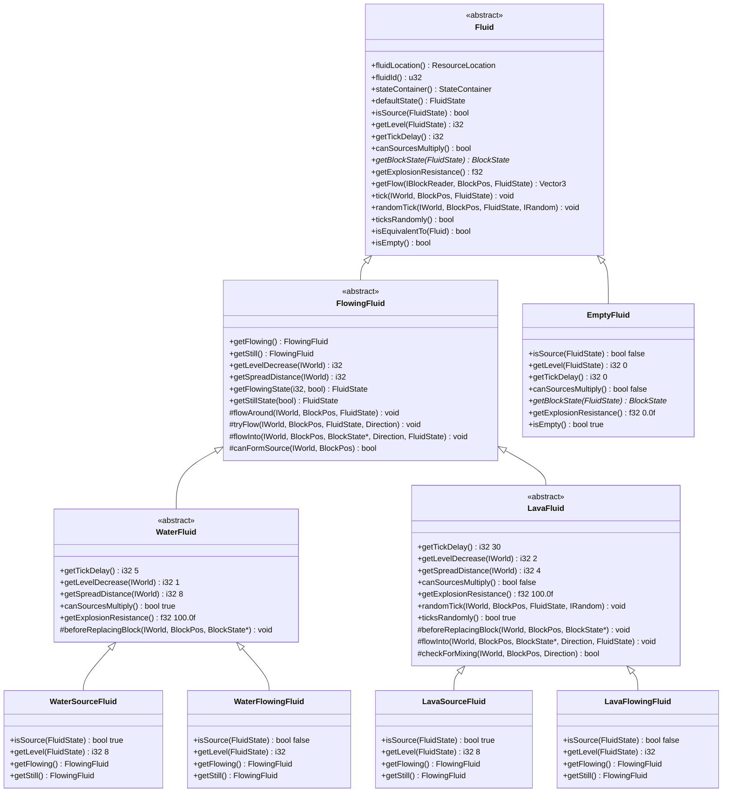
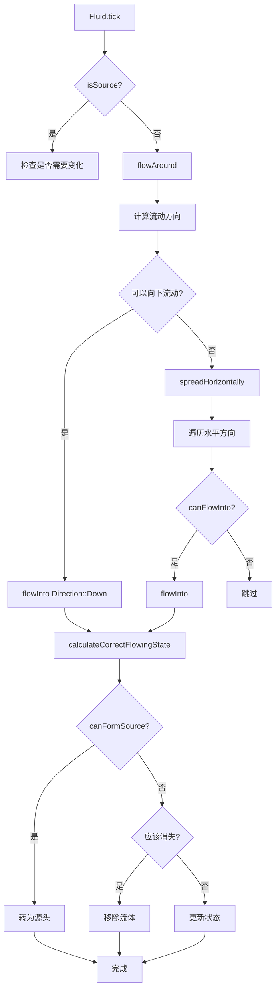
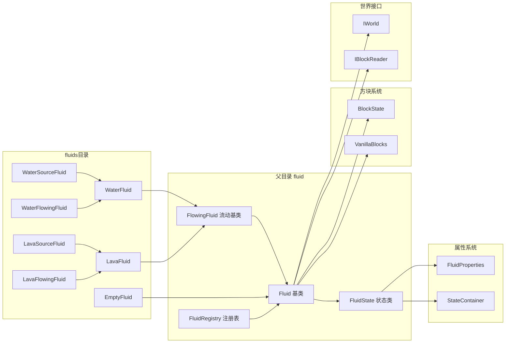

# Fluids 模块

本目录包含 Minecraft 1.16.5 中所有流体类型的具体实现。

## 目录结构

```
fluids/
├── EmptyFluid.hpp        # 空流体头文件
├── EmptyFluid.cpp        # 空流体实现
├── WaterFluid.hpp        # 水流体头文件（含源头和流动变体）
├── WaterFluid.cpp        # 水流体实现
├── LavaFluid.hpp         # 岩浆流体头文件（含源头和流动变体）
├── LavaFluid.cpp         # 岩浆流体实现
└── README.md             # 本文档
```

## 类图



## 文件详细说明

### EmptyFluid.hpp / EmptyFluid.cpp

**职责**: 表示无流体的状态，即空气方块。

**主要特性**:
- 单例模式，全局只有一个实例
- `isEmpty()` 返回 `true`，其他所有流体返回 `false`
- `isSource()` 始终返回 `false`
- `getLevel()` 始终返回 `0`
- `getBlockState()` 返回空气方块状态 (`VanillaBlocks::AIR`)
- 不执行任何 tick 操作

**状态属性**: 无（没有 LEVEL 或 FALLING 属性）

**注册名**: `minecraft:empty`

---

### WaterFluid.hpp / WaterFluid.cpp

**职责**: 水流体的基类，定义水的共同特性。

**主要特性**:
| 属性 | 值 | 说明 |
|------|-----|------|
| Tick 延迟 | 5 tick | 流体更新间隔 |
| 等级衰减 | 1 级/格 | 每流动一格降低 1 级 |
| 最大距离 | 8 格 | 源头可流动的最远距离 |
| 无限源 | ✅ 支持 | 2 个以上相邻源头可形成新源头 |
| 爆炸抗性 | 100.0 | 可阻挡爆炸 |

**状态属性**:
- **源头 (WaterSourceFluid)**: 仅 `FALLING` 属性
- **流动 (WaterFlowingFluid)**: `LEVEL_1_8` + `FALLING` 属性

**特殊行为**:
- `beforeReplacingBlock()`: 水替换方块前会掉落方块物品
- `isEquivalentTo()`: 水和流动水视为等效

**注册名**:
- 源头: `minecraft:water`
- 流动: `minecraft:flowing_water`

---

### LavaFluid.hpp / LavaFluid.cpp

**职责**: 岩浆流体的基类，定义岩浆的共同特性。

**主要特性**:
| 属性 | 值 | 说明 |
|------|-----|------|
| Tick 延迟 | 30 tick | 主世界（下界为 10 tick）|
| 等级衰减 | 2 级/格 | 主世界（下界为 1 级/格）|
| 最大距离 | 4 格 | 主世界（下界为 6 格）|
| 无限源 | ❌ 不支持 | 无法形成无限源 |
| 爆炸抗性 | 100.0 | 可阻挡爆炸 |
| 随机 Tick | ✅ | 可能引燃周围可燃方块 |

**状态属性**:
- **源头 (LavaSourceFluid)**: 仅 `FALLING` 属性
- **流动 (LavaFlowingFluid)**: `LEVEL_1_8` + `FALLING` 属性

**特殊行为**:
- `randomTick()`: 有 1/3 概率检查并引燃周围可燃方块
- `checkForMixing()`: 岩浆遇水生成黑曜石（源头）或石头（流动）
- `flowInto()`: 重写以处理岩浆与水的交互
- `isEquivalentTo()`: 岩浆和流动岩浆视为等效

**注册名**:
- 源头: `minecraft:lava`
- 流动: `minecraft:flowing_lava`

---

## 流体流动流程



## 类之间的关系



## 模块整体说明

### 整体职责

`fluids` 目录负责实现 Minecraft 中的具体流体类型，包括：

1. **空流体 (EmptyFluid)**: 表示无流体的状态
2. **水流体 (WaterFluid)**: 实现水的流动、源头形成逻辑
3. **岩浆流体 (LavaFluid)**: 实现岩浆的流动、引燃、与水交互逻辑

### 输入和输出

**输入**:
- `Fluid` 基类和 `FlowingFluid` 抽象类定义的接口
- `FluidProperties` 提供的属性定义（`LEVEL_1_8`, `FALLING`）
- `VanillaBlocks` 提供的方块定义（`AIR`, `WATER`, `LAVA`）
- `IWorld` 和 `IBlockReader` 世界接口

**输出**:
- 具体流体实现类
- 通过 `FluidRegistry` 注册的流体实例
- 流体状态（`FluidState`）

### 依赖项

| 依赖 | 说明 |
|------|------|
| `../Fluid.hpp` | 流体基类 |
| `../FlowingFluid.hpp` | 流动流体抽象类 |
| `../FluidRegistry.hpp` | 流体注册表 |
| `../../../util/property/FluidProperties.hpp` | 流体属性定义 |
| `../../../util/property/Properties.hpp` | 通用属性 |
| `../../block/VanillaBlocks.hpp` | 原版方块定义 |
| `../../block/Block.hpp` | 方块基类 |
| `../../IWorld.hpp` | 世界接口 |

### 使用方法

```cpp
#include "common/world/fluid/FluidRegistry.hpp"
#include "common/world/fluid/fluids/WaterFluid.hpp"
#include "common/world/fluid/fluids/LavaFluid.hpp"

using namespace mc::fluid;

// 1. 初始化流体注册表（自动注册所有内置流体）
FluidRegistry::instance().initialize();

// 2. 获取流体实例
Fluid* water = FluidRegistry::instance().getFluid(ResourceLocation("minecraft:water"));
Fluid* lava = FluidRegistry::instance().getFluid(ResourceLocation("minecraft:lava"));

// 3. 获取流体状态
const FluidState& waterSource = water->defaultState();  // 源头状态
FluidState flowingWater = static_cast<FlowingFluid*>(water)->getFlowingState(4, false);  // level=4

// 4. 检查流体属性
bool isSource = waterSource.isSource();      // true
i32 level = waterSource.getLevel();          // 8
i32 tickDelay = water->getTickDelay();       // 5
bool canMultiply = water->canSourcesMultiply();  // true

// 5. 获取对应的方块状态
const BlockState* blockState = water->getBlockState(waterSource);

// 6. 检查流体等效性
bool equivalent = water->isEquivalentTo(*flowingWater.getFluid());  // true
```

### 容易踩的坑

#### 1. 源头和流动流体是两个独立的类

```cpp
// ❌ 错误：假设水只有一个类
Fluid* water = FluidRegistry::getFluid("minecraft:water");

// ✅ 正确：理解和区分源头和流动
Fluid* waterSource = FluidRegistry::getFluid(ResourceLocation("minecraft:water"));
Fluid* flowingWater = FluidRegistry::getFluid(ResourceLocation("minecraft:flowing_water"));

// 它们共享相同的基类 WaterFluid
bool equivalent = waterSource->isEquivalentTo(*flowingWater);  // true
```

#### 2. 流体状态属性不同

```cpp
// 源头流体：只有 FALLING 属性
WaterSourceFluid source;
source.stateContainer().stateCount();  // 2 (falling=true/false)

// 流动流体：有 LEVEL_1_8 和 FALLING 属性
WaterFlowingFluid flowing;
flowing.stateContainer().stateCount();  // 16 (8 levels × 2 falling states)
```

#### 3. 方块 LEVEL 与流体 LEVEL 不同

```cpp
// 流体 LEVEL: 1-8 (8=源头, 1-7=流动)
// 方块 LEVEL: 0-15 (0=满, 15=最浅)

// 转换公式（非源头）:
i32 blockLevel = 8 - fluidLevel;  // 流体level=4 -> 方块level=4

// 源头:
i32 blockLevel = isFalling ? 8 : 0;
```

#### 4. 岩浆与水的维度差异（TODO）

```cpp
// 当前实现返回固定值
i32 LavaFluid::getTickDelay() const {
    // TODO: 根据维度返回不同值
    // 主世界: 30 tick
    // 下界: 10 tick
    return 30;
}

// 使用时需要注意维度差异
```

#### 5. getFlowing()/getStill() 缓存

```cpp
// 这些方法使用缓存，第一次调用时会查找注册表
FlowingFluid& flowing = sourceFluid.getFlowing();  // 第一次：查找注册表
FlowingFluid& flowing2 = sourceFluid.getFlowing(); // 第二次：返回缓存

// 如果注册表未初始化，会返回 nullptr 导致崩溃
// 必须确保在调用前已初始化 FluidRegistry
```

#### 6. 空流体的特殊处理

```cpp
const FluidState& state = someFunction();

// ❌ 错误：假设所有流体都有 LEVEL 属性
i32 level = state.getLevel();  // EmptyFluid 返回 0

// ✅ 正确：检查是否为空
if (state.isEmpty()) {
    // 无流体
} else {
    i32 level = state.getLevel();
}
```

### 涉及的测试用例

测试文件位于: `tests/common/world/fluid/FluidTest.cpp`

| 测试用例 | 说明 |
|----------|------|
| `FluidStateTest.EmptyFluidStateIsEmpty` | 验证空流体状态为空 |
| `FluidStateTest.GetFluidReturnsOwner` | 验证状态可获取所属流体 |
| `FluidStateTest.FluidId` | 验证流体ID正确性 |
| `FluidStateTest.StateWithProperties` | 验证状态容器属性计数 |
| `FluidRegistryTest.InitializeRegistersEmptyFluid` | 验证注册表初始化 |
| `FluidRegistryTest.GetFluidByInvalidIdReturnsNull` | 验证无效ID返回空 |
| `FluidRegistryTest.GetFluidByInvalidResourceLocationReturnsNull` | 验证无效资源位置返回空 |
| `FluidPropertiesTest.LevelPropertyHasCorrectRange` | 验证LEVEL属性范围(1-8) |
| `FluidPropertiesTest.FallingPropertyExists` | 验证FALLING属性存在 |
| `FluidTest.DefaultTickDoesNothing` | 验证默认tick方法 |
| `FluidTest.DefaultRandomTickDoesNothing` | 验证默认随机tick方法 |
| `FluidTest.DefaultTicksRandomlyReturnsFalse` | 验证默认不执行随机tick |
| `FluidTest.IsEquivalentTo` | 验证等效性比较 |
| `ResourceLocationHashTest.CanBeUsedInUnorderedMap` | 验证资源位置可作哈希键 |

---

## 未来扩展

1. **维度感知**: 岩浆在下界的流动速度和距离应与主世界不同
2. **火方块放置**: 岩浆引燃逻辑需要 `Blocks::FIRE` 实现
3. **黑曜石/石头生成**: 岩浆与水交互需要 `Blocks::OBSIDIAN` 和 `Blocks::STONE` 实现
4. **方块掉落**: 水替换方块时需要实现物品掉落逻辑
5. **声音效果**: 岩浆与水交互的嘶嘶声效果
