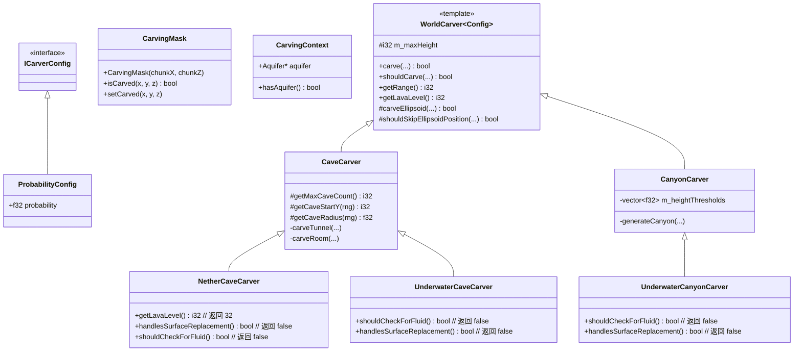

# 雕刻器模块 (Carver)

本模块实现了 Minecraft 1.16.5 的地形雕刻系统，用于生成洞穴、峡谷等地下结构。

## 目录结构

```
carver/
├── WorldCarver.hpp           # 雕刻器基类和通用接口
├── WorldCarver.cpp           # 基类实现
├── CaveCarver.hpp            # 洞穴雕刻器
├── CaveCarver.cpp            # 洞穴雕刻器实现
├── CanyonCarver.hpp          # 峡谷雕刻器
├── CanyonCarver.cpp          # 峡谷雕刻器实现
├── NetherCaveCarver.hpp      # 下界洞穴雕刻器
├── NetherCaveCarver.cpp      # 下界洞穴雕刻器实现
├── UnderwaterCarver.hpp      # 水下雕刻器（水下洞穴和水下峡谷）
├── UnderwaterCarver.cpp      # 水下雕刻器实现
├── CarvingMask.hpp           # 雕刻掩码（防止重复雕刻）
├── CarvingContext.hpp        # 雕刻上下文（含水层引用）
└── Carvers.hpp               # 便捷包含头文件
```

---

## 内部模块关系



**继承关系说明**：
- `WorldCarver<Config>` 是模板基类，定义雕刻器的通用接口
- `CaveCarver` 和 `CanyonCarver` 是两个主要的具体实现
- `NetherCaveCarver` 继承 `CaveCarver`，为下界维度定制
- `UnderwaterCaveCarver` 和 `UnderwaterCanyonCarver` 分别继承对应基类，用于水下雕刻

---

## 上下游外部依赖关系

### 上游依赖（本模块依赖）

| 依赖 | 用途 |
|------|------|
| `ChunkPrimer` | 区块数据存储和修改 |
| `BiomeSource` | 获取生物群系信息（地表方块） |
| `BlockRegistry` / `VanillaBlocks` | 方块注册表和原版方块定义 |
| `Random` | 随机数生成 |
| `MathUtils` | 数学常量 (PI, TWO_PI 等) |
| `Constants` | 游戏常量（MIN_BUILD_HEIGHT, MAX_BUILD_HEIGHT 等） |
| `Aquifer` | 含水层系统（决定雕刻后填充水/熔岩/空气） |
| `WorldGenerationContext` | 世界生成上下文基类 |

### 下游依赖（谁依赖本模块）

| 依赖方 | 用途 |
|--------|------|
| `NoiseChunkGenerator` | 区块生成器（主世界/下界/末地），在 CARVERS 阶段调用雕刻器 |
| `ChunkPrimer` | 包含 `CarvingMask` 头文件 |

---

## 容易踩的坑

### 1. 雕刻掩码坐标必须与区块坐标一致

```cpp
// 错误：掩码坐标与区块坐标不匹配
CarvingMask mask(0, 0);  // 总是使用 (0, 0)
carver.carve(chunk, context, biomeSource, seaLevel, 5, 5, mask, config);

// 正确：掩码坐标与区块坐标一致
CarvingMask mask(chunkX, chunkZ);
carver.carve(chunk, context, biomeSource, seaLevel, chunkX, chunkZ, mask, config);
```

### 2. 雕刻器可能影响相邻区块

`getRange()` 返回影响范围（默认 4），实际影响范围: `(range * 2 - 1) * 16` 方块。需要确保相邻区块已加载或使用正确的范围检查。

### 3. 随机种子一致性

使用确定性随机种子以确保相同输入产生相同输出：
```cpp
math::Random rng(static_cast<u64>(chunkX) * 341873128712ULL +
                 static_cast<u64>(chunkZ) * 132897987541ULL);
```

### 4. 液体检测与水下/下界雕刻器

`checkAreaForFluid` 默认检测区域内的水/熔岩，存在液体时会阻止雕刻。但：
- `UnderwaterCarver` 重写 `shouldCheckForFluid()` 返回 false，可在水中雕刻
- `NetherCaveCarver` 重写 `shouldCheckForFluid()` 返回 false，可在熔岩中雕刻

### 5. Y 坐标与熔岩填充

- 主世界：`getLavaLevel()` 返回 11，Y < 11 的雕刻区域填充熔岩
- 下界：`NetherCaveCarver::getLavaLevel()` 返回 32，Y < 32 填充熔岩

### 6. 高度常量不要硬编码

使用 `mc::world::MIN_BUILD_HEIGHT` 和 `mc::world::MAX_BUILD_HEIGHT`，而不是硬编码 0、256 等数字。`CarvingMask::getIndex()` 已正确使用这些常量。

### 7. 草地表面替换逻辑

`handlesSurfaceReplacement()` 控制是否在雕刻后处理草地/菌丝表面替换：
- 主世界雕刻器：返回 true（默认），雕刻后草方块下方替换为泥土
- 下界/水下雕刻器：返回 false，不执行此处理

### 8. CarvingContext 与含水层系统

新版雕刻器通过 `CarvingContext` 访问含水层（Aquifer），替代旧的硬编码 Y < 11 熔岩填充逻辑。含水层系统会根据世界噪声决定填充空气、水还是熔岩。

---

## 关键配置

| 配置项 | 说明 | 默认值 |
|--------|------|--------|
| `ProbabilityConfig::probability` | 雕刻概率 | 0.14285715f (~1/7) |
| `CaveCarver::getMaxCaveCount()` | 最大洞穴尝试次数 | 15 |
| `CaveCarver::getVerticalScale()` | 垂直缩放因子 | 1.0f |
| `NetherCaveCarver::getMaxCaveCount()` | 下界最大洞穴尝试次数 | 10 |
| `NetherCaveCarver::getVerticalScale()` | 下界垂直缩放因子 | 5.0f（更扁平） |
| `WorldCarver::getRange()` | 雕刻器影响范围（区块） | 4 |

---

## 参考资料

- Minecraft 1.16.5 源码: `net.minecraft.world.gen.carver` 包
- `WorldCarver.java`, `CaveCarver.java`, `CanyonCarver.java`
- `NetherWorldCarver.java`, `UnderwaterCarver.java`
