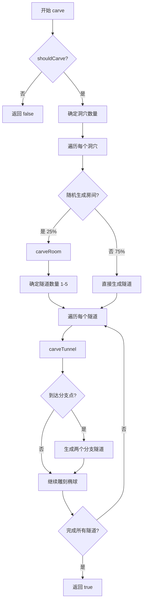
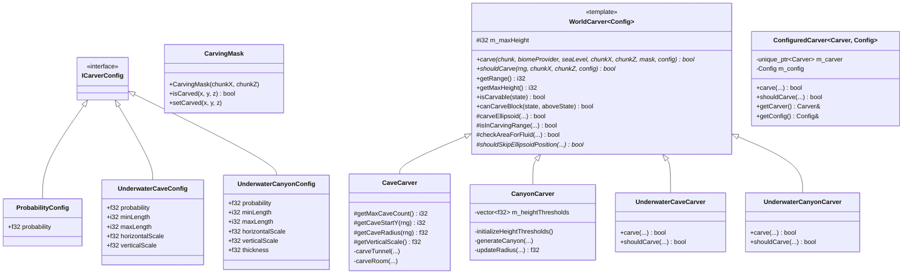
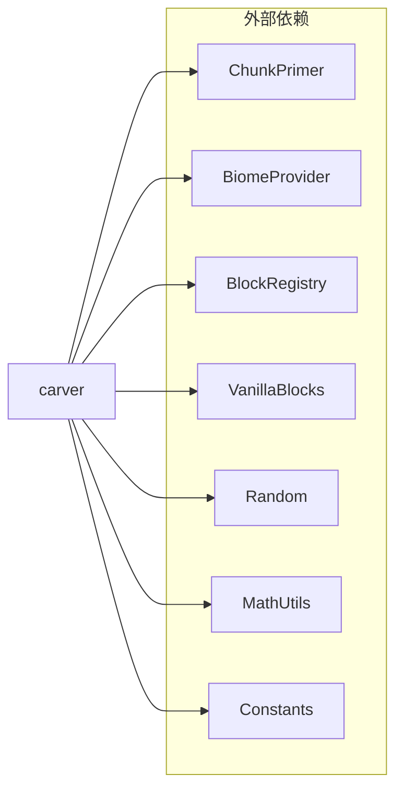
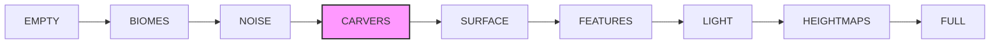

# 世界雕刻器模块 (Carver)

本模块实现了 Minecraft 1.16.5 的地形雕刻系统，用于生成洞穴、峡谷等地下结构。

## 目录结构

```
carver/
├── WorldCarver.hpp       # 雕刻器基类和通用接口
├── WorldCarver.cpp       # 基类实现
├── CaveCarver.hpp        # 洞穴雕刻器
├── CaveCarver.cpp        # 洞穴雕刻器实现
├── CanyonCarver.hpp      # 峡谷雕刻器
├── CanyonCarver.cpp      # 峡谷雕刻器实现
├── UnderwaterCarver.hpp  # 水下雕刻器（水下洞穴和水下峡谷）
├── UnderwaterCarver.cpp  # 水下雕刻器实现
└── Carvers.hpp           # 便捷包含头文件
```

## 文件详解

### WorldCarver.hpp / WorldCarver.cpp

**职责**: 定义雕刻器系统的核心抽象和通用工具方法。

**主要内容**:

#### ICarverConfig
```cpp
struct ICarverConfig {
    virtual ~ICarverConfig() = default;
};
```
雕刻器配置的抽象接口，所有配置类型都继承自此接口。

#### ProbabilityConfig
```cpp
struct ProbabilityConfig : public ICarverConfig {
    f32 probability;  // 生成概率 (0.0 - 1.0)
};
```
概率配置，默认概率为 `0.14285715f` (约 1/7)。

#### CarvingMask
```cpp
class CarvingMask {
public:
    CarvingMask(ChunkCoord chunkX, ChunkCoord chunkZ);
    bool isCarved(BlockCoord x, i32 y, BlockCoord z) const;
    void setCarved(BlockCoord x, i32 y, BlockCoord z);
    static constexpr i32 getIndex(BlockCoord x, i32 y, BlockCoord z);
};
```
雕刻掩码，用于追踪哪些位置已被雕刻，防止重复雕刻。使用 `vector<bool>` 作为位集实现，大小为 65536 位 (16x16x256)。

#### WorldCarver<Config>
```cpp
template<typename Config>
class WorldCarver {
public:
    virtual bool carve(ChunkPrimer& chunk, const BiomeProvider& biomeProvider,
                       i32 seaLevel, ChunkCoord chunkX, ChunkCoord chunkZ,
                       CarvingMask& carvingMask, const Config& config) = 0;

    virtual bool shouldCarve(math::IRandom& rng, ChunkCoord chunkX, ChunkCoord chunkZ,
                             const Config& config) const = 0;

    virtual i32 getRange() const { return 4; }
    i32 getMaxHeight() const { return m_maxHeight; }
    static bool isCarvable(const BlockState& state);
    bool canCarveBlock(const BlockState* state, const BlockState* aboveState) const;

protected:
    bool carveEllipsoid(...);           // 雕刻椭球区域
    static bool isInCarvingRange(...);  // 检查是否在雕刻范围内
    bool checkAreaForFluid(...);        // 检查区域是否有液体
    virtual bool shouldSkipEllipsoidPosition(...) = 0;  // 是否跳过椭球位置
};
```

**可雕刻方块类型**:
- 石头变种: `STONE`, `GRANITE`, `DIORITE`, `ANDESITE`
- 泥土类: `DIRT`, `GRASS_BLOCK`
- 沙子类: `SAND`, `GRAVEL`
- 其他: `COBBLESTONE`, `RED_SANDSTONE`, `SNOW`, `NETHERRACK`, `END_STONE`, `SANDSTONE`

**carveEllipsoid 算法**:
1. 计算椭球边界范围
2. 检查是否与区块相交
3. 检查区域内是否有液体（水/熔岩）
4. 遍历椭球内每个方块
5. 使用椭球方程判断是否在椭球内
6. 可雕刻的方块设为 CAVE_AIR（Y<getLavaLevel() 设为熔岩）
7. 如果上方有草地，替换为泥土

#### ConfiguredCarver<Carver, Config>
```cpp
template<typename Carver, typename Config>
class ConfiguredCarver {
public:
    ConfiguredCarver(std::unique_ptr<Carver> carver, Config config);
    bool carve(ChunkPrimer& chunk, const BiomeProvider& biomeProvider,
               i32 seaLevel, ChunkCoord chunkX, ChunkCoord chunkZ,
               CarvingMask& carvingMask);
    bool shouldCarve(math::IRandom& rng, ChunkCoord chunkX, ChunkCoord chunkZ) const;
};
```
组合雕刻器和配置的便捷类，参考 MC 的 `ConfiguredCarver`。

---

### CaveCarver.hpp / CaveCarver.cpp

**职责**: 生成洞穴系统，包括圆形房间和分支隧道。

**主要特性**:
- 继承 `WorldCarver<ProbabilityConfig>`
- 生成圆形房间和蜿蜒隧道
- 支持隧道分支
- 使用椭球雕刻

**核心方法**:

#### carve()
```cpp
bool carve(ChunkPrimer& chunk, const BiomeProvider& biomeProvider,
           i32 seaLevel, ChunkCoord chunkX, ChunkCoord chunkZ,
           CarvingMask& carvingMask, const ProbabilityConfig& config) override;
```
主入口，根据配置概率决定是否生成洞穴，然后调用 `carveRoom()` 和 `carveTunnel()`。

#### carveRoom()
```cpp
void carveRoom(ChunkPrimer& chunk, const BiomeProvider& biomeProvider,
               i32 seaLevel, ChunkCoord chunkX, ChunkCoord chunkZ,
               i64 seed, f32 centerX, f32 centerY, f32 centerZ,
               f32 radius, f32 verticalScale, CarvingMask& carvingMask);
```
生成椭圆形房间，半径随机 (1.0-7.0)。

#### carveTunnel()
```cpp
void carveTunnel(ChunkPrimer& chunk, const BiomeProvider& biomeProvider,
                 i32 seaLevel, ChunkCoord chunkX, ChunkCoord chunkZ,
                 i64 seed, f32 startX, f32 startY, f32 startZ,
                 f32 radius, f32 yaw, f32 pitch,
                 i32 startIndex, i32 endIndex, f32 verticalScale,
                 CarvingMask& carvingMask);
```
生成蜿蜒隧道：
- 使用 `yaw`（偏航）和 `pitch`（俯仰）控制方向
- 隧道半径随进度变化（正弦曲线）
- 支持在分支点生成两个分支隧道
- 随机扰动增加不规则性

**洞穴生成算法流程**:



**关键参数**:
- `getMaxCaveCount()`: 返回 15，最大洞穴尝试次数
- `getCaveStartY()`: 返回 8-128，洞穴起始 Y 坐标
- `getCaveRadius()`: 返回 0.0-5.0+，洞穴半径
- `getVerticalScale()`: 返回 1.0，垂直缩放因子

---

### CanyonCarver.hpp / CanyonCarver.cpp

**职责**: 生成峡谷（裂缝状地形结构）。

**主要特性**:
- 继承 `WorldCarver<ProbabilityConfig>`
- 使用预计算高度阈值表
- 生成蜿蜒的峡谷形态
- 入口宽、深处窄的特殊形状

**核心数据成员**:
```cpp
std::vector<f32> m_heightThresholds;  // 预计算的高度阈值表 (256 个元素)
```

**高度阈值初始化**:
```cpp
void initializeHeightThresholds() {
    math::Random rng(0);  // 固定种子确保确定性
    for (size_t i = 0; i < 256; ++i) {
        if (i == 0 || rng.nextInt(3) == 0) {
            f32 factor = 1.0f + rng.nextFloat() * rng.nextFloat();
            m_heightThresholds[i] = factor * factor;
        } else {
            m_heightThresholds[i] = m_heightThresholds[i - 1];
        }
    }
}
```

**generateCanyon() 算法**:
```cpp
void generateCanyon(ChunkPrimer& chunk, const BiomeProvider& biomeProvider,
                    i32 seaLevel, ChunkCoord chunkX, ChunkCoord chunkZ,
                    i64 seed, f32 startX, f32 startY, f32 startZ,
                    f32 radius, f32 yaw, f32 pitch,
                    i32 startIndex, i32 endIndex, f32 horizontalScale,
                    CarvingMask& carvingMask);
```

峡谷特点：
- 起始 Y 坐标: 20-67
- 水平缩放: 3.0（比洞穴更宽）
- 垂直半径为水平半径的一半
- 蜿蜒角度变化更大

**shouldSkipEllipsoidPosition() 特殊处理**:
```cpp
bool shouldSkipEllipsoidPosition(f32 dx, f32 dy, f32 dz, i32 y) const override {
    if (y < 1 || y >= 256) {
        return dx * dx + dz * dz >= 1.0f;
    }
    // 使用预计算的阈值，实现"入口宽、深处窄"效果
    const f32 threshold = m_heightThresholds[y - 1];
    return dx * dx + dz * dz >= threshold || dy * dy / 6.0f >= 1.0f;
}
```

---

### UnderwaterCarver.hpp / UnderwaterCarver.cpp

**职责**: 生成填充水的洞穴和峡谷，用于水下地形。

**命名空间**: `mc::world::gen::carver`（与其他雕刻器不同）

**类结构**:

#### UnderwaterCaveConfig
```cpp
struct UnderwaterCaveConfig {
    f32 probability;        // 生成概率，默认 0.02
    i32 minLength;          // 最小长度，默认 8
    i32 maxLength;          // 最大长度，默认 16
    f32 horizontalScale;    // 水平缩放，默认 1.0
    f32 verticalScale;      // 垂直缩放，默认 1.0
};
```

#### UnderwaterCaveCarver
```cpp
class UnderwaterCaveCarver : public WorldCarver<UnderwaterCaveConfig> {
    // 生成填充水的洞穴
    // 只在海平面以下生成
    // 替换 STONE, DIRT, GRAVEL, SAND 为 WATER
};
```

#### UnderwaterCanyonConfig
```cpp
struct UnderwaterCanyonConfig {
    f32 probability;        // 生成概率，默认 0.02
    i32 minLength;          // 最小长度，默认 20
    i32 maxLength;          // 最大长度，默认 64
    f32 horizontalScale;    // 水平缩放，默认 1.0
    f32 verticalScale;      // 垂直缩放，默认 1.0
    f32 thickness;          // 厚度，默认 2.0
};
```

#### UnderwaterCanyonCarver
```cpp
class UnderwaterCanyonCarver : public WorldCarver<UnderwaterCanyonConfig> {
    // 生成填充水的峡谷
    // 只在海平面以下生成
    // 峡谷形状：水平方向宽，垂直方向窄
};
```

**与普通雕刻器的区别**:

| 特性 | 普通雕刻器 | 水下雕刻器 |
|------|-----------|-----------|
| 生成位置 | 任意高度 | 仅海平面以下 |
| 填充方块 | 空气 / 熔岩(Y<11) | 水 |
| 可替换方块 | 石头、泥土、沙子等 | 石头、泥土、沙砾、沙子 |
| 形状 | 椭球 | 球形/扁平椭球 |

---

### Carvers.hpp

**职责**: 便捷包含头文件，包含所有雕刻器的声明。

```cpp
#include "WorldCarver.hpp"
#include "CaveCarver.hpp"
#include "CanyonCarver.hpp"
```

---

## 模块架构



---

## 整体职责

雕刻器模块负责在世界生成过程中创建地下空洞结构：

1. **洞穴生成**: 生成蜿蜒的地下洞穴系统，包括圆形房间和分支隧道
2. **峡谷生成**: 生成地面裂缝状的峡谷结构
3. **水下雕刻**: 生成填充水的洞穴和峡谷

---

## 输入和输出

### 输入

| 参数 | 类型 | 描述 |
|------|------|------|
| `chunk` | `ChunkPrimer&` | 待雕刻的区块数据 |
| `biomeProvider` | `const BiomeProvider&` | 生物群系提供者（用于获取地表方块） |
| `seaLevel` | `i32` | 海平面高度（默认 63） |
| `chunkX` | `ChunkCoord` | 区块 X 坐标 |
| `chunkZ` | `ChunkCoord` | 区块 Z 坐标 |
| `carvingMask` | `CarvingMask&` | 雕刻掩码（防止重复雕刻） |
| `config` | `const Config&` | 雕刻器配置 |

### 输出

| 返回值 | 类型 | 描述 |
|--------|------|------|
| 返回值 | `bool` | 是否雕刻了任何方块 |

**副作用**: 修改 `ChunkPrimer` 中的方块数据，更新 `CarvingMask`。

---

## 依赖项



| 依赖 | 用途 |
|------|------|
| `ChunkPrimer` | 区块数据存储和修改 |
| `BiomeProvider` | 获取生物群系信息 |
| `BlockRegistry` | 方块注册表 |
| `VanillaBlocks` | 原版方块定义 |
| `Random` | 随机数生成 |
| `MathUtils` | 数学常量 (PI, TWO_PI 等) |
| `Constants` | 游戏常量 |

---

## 使用方法

### 基本使用

```cpp
#include "world/gen/carver/Carvers.hpp"

using namespace mc;

// 创建雕刻器
CaveCarver caveCarver(256);
CanyonCarver canyonCarver(256);

// 创建配置
ProbabilityConfig caveConfig(0.14285715f);  // 1/7 概率
ProbabilityConfig canyonConfig(0.02f);      // 2% 概率

// 创建雕刻掩码
CarvingMask mask(chunkX, chunkZ);

// 执行雕刻
bool carved = false;
if (caveCarver.shouldCarve(rng, chunkX, chunkZ, caveConfig)) {
    carved |= caveCarver.carve(chunk, biomeProvider, seaLevel,
                                chunkX, chunkZ, mask, caveConfig);
}
if (canyonCarver.shouldCarve(rng, chunkX, chunkZ, canyonConfig)) {
    carved |= canyonCarver.carve(chunk, biomeProvider, seaLevel,
                                  chunkX, chunkZ, mask, canyonConfig);
}
```

### 使用 ConfiguredCarver

```cpp
#include "world/gen/carver/Carvers.hpp"

using namespace mc;

// 创建配置化的雕刻器
auto caveCarver = std::make_unique<CaveCarver>(256);
ProbabilityConfig config(0.15f);
ConfiguredCarver<CaveCarver, ProbabilityConfig> configuredCave(
    std::move(caveCarver), config);

// 使用
CarvingMask mask(chunkX, chunkZ);
if (configuredCave.shouldCarve(rng, chunkX, chunkZ)) {
    configuredCave.carve(chunk, biomeProvider, seaLevel,
                         chunkX, chunkZ, mask);
}
```

### 水下雕刻器

```cpp
#include "world/gen/carver/UnderwaterCarver.hpp"

using namespace mc::world::gen::carver;

// 创建水下雕刻器
auto underwaterCave = createUnderwaterCaveCarver();
UnderwaterCaveConfig config;
config.probability = 0.05f;

CarvingMask mask(chunkX, chunkZ);
underwaterCave->carve(chunk, biomeProvider, seaLevel,
                      chunkX, chunkZ, mask, config);
```

### 在区块生成中使用

```cpp
// 在 NoiseChunkGenerator 中
void generateCarvers(ChunkPrimer& chunk, ChunkCoord x, ChunkCoord z) {
    CarvingMask mask(x, z);

    // 空气雕刻阶段（NOISE 之后）
    for (auto& carver : m_caveCarvers) {
        math::Random rng(getCarverSeed(x, z));
        if (carver.shouldCarve(rng, x, z)) {
            carver.carve(chunk, m_biomeProvider, m_seaLevel, x, z, mask);
        }
    }

    for (auto& carver : m_canyonCarvers) {
        math::Random rng(getCarverSeed(x, z));
        if (carver.shouldCarve(rng, x, z)) {
            carver.carve(chunk, m_biomeProvider, m_seaLevel, x, z, mask);
        }
    }

    // 水下雕刻（SURFACE 之后）
    for (auto& carver : m_underwaterCarvers) {
        math::Random rng(getCarverSeed(x, z));
        if (carver.shouldCarve(rng, x, z)) {
            carver.carve(chunk, m_biomeProvider, m_seaLevel, x, z, mask);
        }
    }
}
```

---

## 容易踩的坑

### 1. 雕刻掩码必须正确初始化

```cpp
// 错误：掩码坐标与区块坐标不匹配
CarvingMask mask(0, 0);  // 总是使用 (0, 0)
carver.carve(chunk, biomeProvider, seaLevel, 5, 5, mask, config);

// 正确：掩码坐标与区块坐标一致
CarvingMask mask(chunkX, chunkZ);
carver.carve(chunk, biomeProvider, seaLevel, chunkX, chunkZ, mask, config);
```

### 2. 区块边界处理

雕刻器可能影响相邻区块，需要确保相邻区块已加载或使用正确的范围检查：

```cpp
// 雕刻器使用 getRange() 返回影响范围
i32 range = carver.getRange();  // 默认 4
// 实际影响范围: (range * 2 - 1) * 16 方块
```

### 3. 随机种子一致性

使用确定性随机种子以确保相同输入产生相同输出：

```cpp
// 使用区块坐标生成确定性种子
math::Random rng(static_cast<u64>(chunkX) * 341873128712ULL +
                 static_cast<u64>(chunkZ) * 132897987541ULL);
```

### 4. 液体检测

`checkAreaForFluid` 会检测区域内的水/熔岩，存在液体时会阻止雕刻：

```cpp
// 如果区域有水，洞穴不会生成（避免水下洞穴漏水）
if (checkAreaForFluid(chunk, chunkX, chunkZ, minX, maxX, minY, maxY, minZ, maxZ)) {
    return false;  // 不雕刻
}
```

### 5. Y < 11 生成熔岩

洞穴在 Y < 11 的位置会填充熔岩而非空气：

```cpp
if (y < 11) {
    chunk.setBlockState(lx, y, lz, VanillaBlocks::LAVA);
} else {
    chunk.setBlockState(lx, y, lz, VanillaBlocks::AIR);
}
```

### 6. 命名空间差异

水下雕刻器使用不同的命名空间：

```cpp
// 普通雕刻器
using namespace mc;
CaveCarver carver;

// 水下雕刻器
using namespace mc::world::gen::carver;
UnderwaterCaveCarver underwaterCarver;
```

### 7. 配置概率理解

```cpp
// 概率过高会导致洞穴过多
ProbabilityConfig highProb(0.5f);   // 50% 区块有洞穴，太密集！

// 推荐值
ProbabilityConfig caveProb(0.14285715f);   // ~1/7 区块有洞穴
ProbabilityConfig canyonProb(0.02f);        // ~2% 区块有峡谷
```

---

## 测试用例

测试文件位于 `tests/common/test_carver.cpp`，共 22 个测试。

### CarvingMaskTest (5 个测试)

| 测试名 | 描述 |
|--------|------|
| `InitiallyNotCarved` | 验证初始状态所有位置未雕刻 |
| `SetAndGetCarved` | 验证设置和查询雕刻状态 |
| `MultiplePositions` | 验证多个位置独立工作 |
| `BoundaryCheck` | 验证边界值处理 |
| `GetIndex` | 验证索引计算公式正确 |

### WorldCarverTest (1 个测试)

| 测试名 | 描述 |
|--------|------|
| `IsCarvable` | 验证可雕刻方块类型判断 |

### CaveCarverTest (5 个测试)

| 测试名 | 描述 |
|--------|------|
| `ShouldCarveWithProbability` | 验证概率配置正确工作 |
| `CarveCreatesHoles` | 验证雕刻确实创建了洞 |
| `CarveRespectsMask` | 验证掩码阻止重复雕刻 |
| `GetRange` | 验证影响范围返回 4 |
| `GetMaxHeight` | 验证最大高度返回 256 |

### CanyonCarverTest (4 个测试)

| 测试名 | 描述 |
|--------|------|
| `ShouldCarveWithProbability` | 验证概率配置正确工作 |
| `CarveCreatesCanyon` | 验证峡谷雕刻创建了洞 |
| `HeightThresholdsInitialized` | 验证高度阈值表正确初始化 |
| `GetRange` / `GetMaxHeight` | 验证范围和高度参数 |

### ProbabilityConfigTest (3 个测试)

| 测试名 | 描述 |
|--------|------|
| `DefaultProbability` | 验证默认概率为 1/7 |
| `CustomProbability` | 验证自定义概率设置 |
| `EdgeCases` | 验证边界值 0.0 和 1.0 |

### ConfiguredCarverTest (3 个测试)

| 测试名 | 描述 |
|--------|------|
| `CreateAndUse` | 验证创建和配置访问 |
| `ShouldCarve` | 验证委托调用正确 |
| `CanyonWithConfig` | 验证峡谷配置 |

---

## 区块生成阶段

雕刻器在区块生成流水线中的位置：



**CARVERS 阶段** 执行以下操作：
1. 空气雕刻（洞穴、峡谷）
2. 水下雕刻（水下洞穴、水下峡谷）

**注意**: 表面生成（SURFACE）在雕刻之后执行，以确保雕刻不会破坏地表。

---

## 性能优化建议

1. **预缓存方块状态**: 在热循环中避免重复查找方块状态
   ```cpp
   const BlockState* air = VanillaBlocks::getState(VanillaBlocks::AIR);
   // 在循环外获取，循环内使用
   ```

2. **使用雕刻掩码**: 防止重复雕刻同一位置

3. **边界检查优化**: 先检查边界再执行复杂操作

4. **随机数生成**: 使用确定性种子，便于调试和复现

---

## 参考资料

- Minecraft 1.16.5 源码: `net.minecraft.world.gen.carver` 包
- `CaveWorldCarver.java`
- `CanyonWorldCarver.java`
- `UnderwaterCaveWorldCarver.java`
- `UnderwaterCanyonWorldCarver.java`
- `WorldCarver.java`
- `CarvingMask.java`
