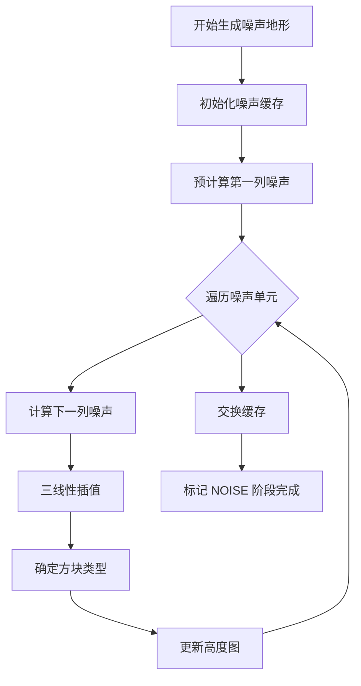
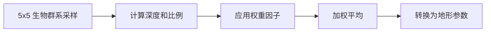
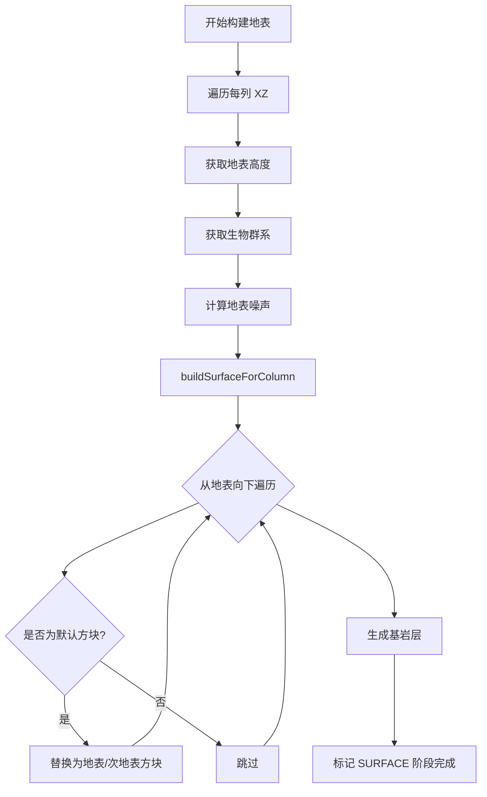
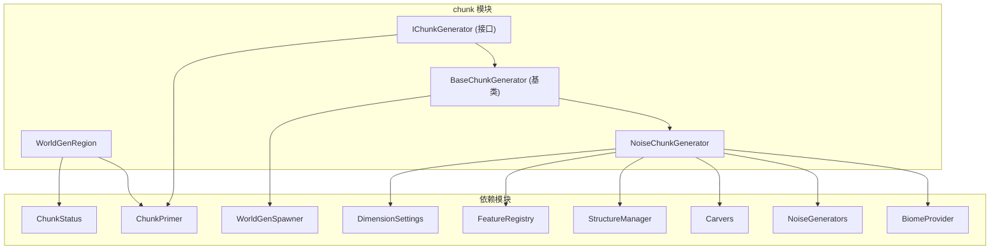
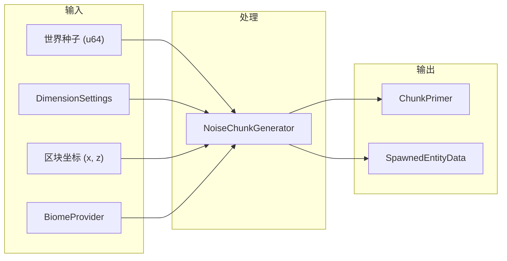
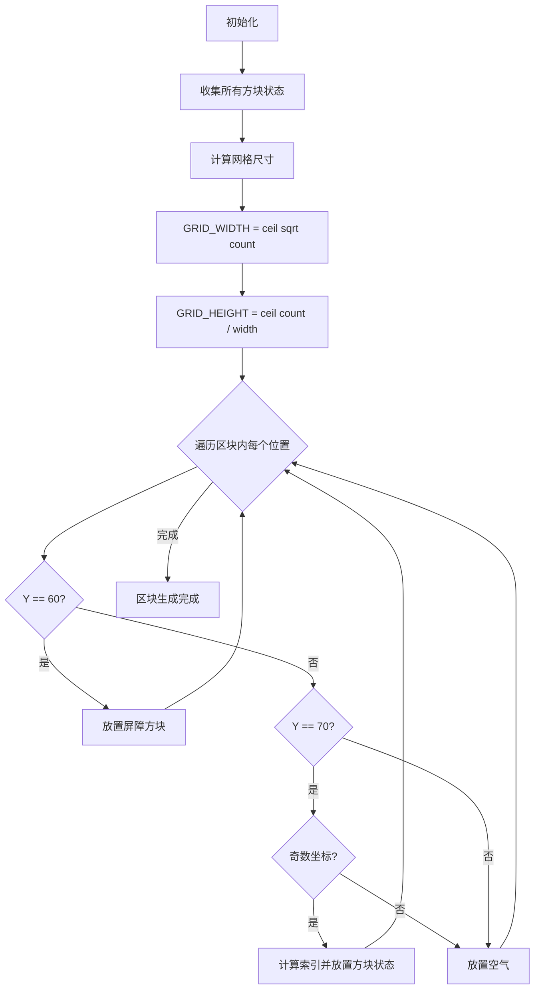

# Chunk Generation Module

本模块实现了 Minecraft 1.16.5 风格的区块生成系统，包含区块生成器接口、噪声地形生成器和调试模式生成器。

## 目录结构

```
chunk/
├── IChunkGenerator.hpp      # 区块生成器接口定义
├── IChunkGenerator.cpp      # 接口实现和基类
├── NoiseChunkGenerator.hpp  # 噪声地形生成器头文件（主世界）
├── NoiseChunkGenerator.cpp  # 噪声地形生成器实现
├── NetherChunkGenerator.hpp # 下界区块生成器头文件
├── NetherChunkGenerator.cpp # 下界区块生成器实现
├── EndChunkGenerator.hpp    # 末地区块生成器头文件
├── EndChunkGenerator.cpp    # 末地区块生成器实现
├── DebugChunkGenerator.hpp  # 调试模式生成器头文件
├── DebugChunkGenerator.cpp  # 调试模式生成器实现
└── README.md                # 本文档
```

## 文件详细介绍

### IChunkGenerator.hpp

**职责**: 定义区块生成器的核心接口和生成阶段。

**主要内容**:

#### `IChunkGenerator` 接口

定义了区块生成的完整流水线：

| 方法 | 说明 |
|------|------|
| `generateStructureStarts()` | 生成结构起点（村庄、神殿等） |
| `generateStructureReferences()` | 生成结构引用关系 |
| `generateBiomes()` | 填充生物群系数据 |
| `generateNoise()` | 生成噪声地形 |
| `buildSurface()` | 构建地表（草地、沙子等） |
| `applyCarvers()` | 应用雕刻器（洞穴、峡谷） |
| `placeFeatures()` | 放置特性（树木、矿石等） |
| `spawnInitialMobs()` | 生成初始生物（被动动物） |
| `getBiome()` | 获取指定位置的生物群系 |
| `getHeight()` | 获取生成高度 |

#### `WorldGenRegion` 类

提供有限的世界视图给生成器使用：

- 只能访问 3x3 区块范围（中心区块 + 8 邻居）
- 实现了 `IWorldWriter` 接口，支持方块读写
- 提供高度查询和生物群系查询功能

```cpp
// WorldGenRegion 区块布局（索引 4 为中心区块）
// [0][1][2]
// [3][4][5]
// [6][7][8]
```

#### `BaseChunkGenerator` 基类

提供部分方法的默认实现：

- 默认生物群系填充
- 默认结构生成（空实现）
- 默认雕刻器（空实现）
- 默认特性放置（空实现）
- 使用 `WorldGenSpawner` 进行生物生成

---

### IChunkGenerator.cpp

**职责**: 实现 `WorldGenRegion` 和 `BaseChunkGenerator` 的核心逻辑。

**关键实现**:

#### WorldGenRegion 实现

```cpp
// 世界坐标 -> 区块索引
i32 WorldGenRegion::worldToChunkIndex(i32 x, i32 z) const {
    // 将世界坐标转换为相对区块坐标
    // 然后映射到 0-8 的索引
}

// 方块访问
const BlockState* WorldGenRegion::getBlock(i32 x, i32 y, i32 z) const {
    // 边界检查 -> 区块定位 -> 本地坐标转换 -> 方块获取
}
```

#### BaseChunkGenerator 实现

- 默认生物群系填充：将所有位置设置为默认生物群系（平原）
- 生物生成：使用区块坐标计算种子，调用 `WorldGenSpawner`

---

### NoiseChunkGenerator.hpp

**职责**: 定义基于多层噪声的地形生成器，是主世界和下界的标准生成器。

**主要内容**:

```cpp
class NoiseChunkGenerator : public BaseChunkGenerator {
    // 噪声生成器
    std::unique_ptr<OctavesNoiseGenerator> m_mainDensityNoise;      // 主密度噪声 (16倍频)
    std::unique_ptr<OctavesNoiseGenerator> m_secondaryDensityNoise; // 次密度噪声 (16倍频)
    std::unique_ptr<OctavesNoiseGenerator> m_weightNoise;           // 权重噪声 (8倍频)
    std::unique_ptr<INoiseGenerator> m_surfaceDepthNoise;           // 地表深度噪声（Perlin 或 Octaves）
    
    // 生物群系
    std::unique_ptr<BiomeProvider> m_biomeProvider;
    
    // 雕刻器
    std::unique_ptr<CaveCarver> m_caveCarver;
    std::unique_ptr<CanyonCarver> m_canyonCarver;
    
    // 结构管理器
    std::unique_ptr<StructureManager> m_structureManager;
};
```

---

### NoiseChunkGenerator.cpp

**职责**: 实现完整的地形生成算法，参考 MC 1.16.5 的 `NoiseChunkGenerator`。

**核心算法**:

#### 1. 噪声地形生成 (`generateNoise`)



#### 2. 噪声列填充 (`fillNoiseColumn`)

这是地形生成的核心算法，计算每个 XZ 位置的噪声柱：

```cpp
void fillNoiseColumn(std::vector<f32>& column, i32 noiseX, i32 noiseZ,
                     BiomeWindowCache& biomeWindowCache) {
    // 1. 计算 5x5 生物群系权重
    // 2. 使用调用栈局部滑窗缓存复用 5x5 生物群系采样
    // 3. 获取生物群系深度和比例
    // 4. 计算地形参数 (depthOffset, heightFactor)
    // 5. 计算噪声密度 (16倍频叠加)
    // 6. 应用顶部滑动和底部滑动
}
```

**生物群系权重计算**:



#### 3. 密度计算 (`calculateNoiseDensity`)

```cpp
f32 calculateNoiseDensity(i32 noiseX, i32 noiseY, i32 noiseZ, ...) {
    // 16 个倍频叠加
    for (i32 octave = 0; octave < 16; ++octave) {
        // 主密度噪声 + 次密度噪声 + 权重噪声
    }
    // 混合密度值
    return lerp(density / 512.0f, secondaryDensity / 512.0f, blend);
}
```

#### 4. 地表生成 (`buildSurface`)



地表列处理细节（对齐 MC `DefaultSurfaceBuilder`）:

- `startHeight` 使用 `WORLD_SURFACE_WG + 1` 作为起始扫描高度。
- 生物群系通过 `WorldGenRegion` 按世界坐标采样，避免仅依赖局部区块缓存。
- 地表厚度使用 `surfaceNoise / 3 + 3 + random * 0.25` 的列级随机抖动。
- 顶层与次层分别使用 `surfaceBlock` / `subSurfaceBlock`，不再把整段厚度都写成顶层方块。
- 深水下层优先使用 `underWaterBlock`，并保留沙层向砂岩/红砂岩过渡逻辑。
- 当海平面以下顶层为空时，按温度切换 `ICE` 或默认流体。

#### 5. 雕刻器应用 (`applyCarvers`)

```cpp
void applyCarvers(WorldGenRegion& region, ChunkPrimer& chunk, bool isLiquid) {
    if (!isLiquid) {
        // 空气雕刻阶段：洞穴和峡谷
        m_caveCarver->carve(chunk, ...);
        m_canyonCarver->carve(chunk, ...);
    } else {
        // 液体雕刻阶段：水下洞穴和峡谷
        m_underwaterCaveCarver->carve(chunk, ...);
        m_underwaterCanyonCarver->carve(chunk, ...);
    }
}
```

#### 6. 特性放置 (`placeFeatures`)

```cpp
void placeFeatures(WorldGenRegion& region, ChunkPrimer& chunk) {
    // 按装饰阶段顺序放置特性
    for (DecorationStage stage : DecorationStages::getAll()) {
        BiomeFeaturePlacer::placeFeaturesForStage(region, chunk, *this, settings, stage, m_seed);
    }
}
```

## 模块关系图



## 模块整体职责

### 核心职责

1. **定义区块生成流水线**: 通过 `IChunkGenerator` 接口定义了完整的区块生成阶段
2. **实现噪声地形生成**: `NoiseChunkGenerator` 实现了主世界风格的地形生成
3. **提供生成环境**: `WorldGenRegion` 为生成器提供有限但安全的世界访问

### 输入和输出



### 依赖项

| 依赖模块 | 用途 |
|---------|------|
| `ChunkPrimer` | 区块生成的中间状态存储 |
| `ChunkStatus` | 区块生成阶段状态机 |
| `DimensionSettings` | 维度配置（噪声参数、海平面等） |
| `NoiseSettings` | 噪声生成参数 |
| `BiomeProvider` | 生物群系分布 |
| `OctavesNoiseGenerator` | 多倍频噪声生成 |
| `PerlinNoiseGenerator` | 柏林噪声生成 |
| `SimplexNoiseGenerator` | 单纯形噪声生成 |
| `CaveCarver` / `CanyonCarver` | 地形雕刻器 |
| `UnderwaterCarver` | 水下雕刻器 |
| `StructureManager` | 结构生成管理 |
| `FeatureRegistry` | 特性注册表 |
| `WorldGenSpawner` | 初始生物生成 |
| `BlockRegistry` / `VanillaBlocks` | 方块状态获取 |

## 使用方法

### 基本用法

```cpp
#include "common/world/gen/chunk/NoiseChunkGenerator.hpp"
#include "common/world/gen/settings/DimensionSettings.hpp"
#include "common/world/chunk/ChunkPrimer.hpp"

using namespace mc;

// 1. 创建维度设置
DimensionSettings settings = DimensionSettings::overworld();

// 2. 创建区块生成器
NoiseChunkGenerator generator(12345ULL, std::move(settings));

// 3. 创建区块生成器
ChunkPrimer primer(chunkX, chunkZ);

// 4. 准备邻域区块（用于 WorldGenRegion）
std::array<IChunk*, 9> chunks = {...};  // 中心 + 8 邻居
WorldGenRegion region(chunkX, chunkZ, chunks);

// 5. 按阶段生成
generator.generateStructureStarts(region, primer);
generator.generateStructureReferences(region, primer);
generator.generateBiomes(region, primer);
generator.generateNoise(region, primer);
generator.buildSurface(region, primer);
generator.applyCarvers(region, primer, false);   // 空气雕刻
generator.applyCarvers(region, primer, true);    // 液体雕刻
generator.placeFeatures(region, primer);

// 6. 生成初始生物
std::vector<SpawnedEntityData> entities;
generator.spawnInitialMobs(region, primer, entities);

// 7. 转换为最终区块数据
std::unique_ptr<ChunkData> data = primer.toChunkData();
```

### 自定义生物群系提供者

```cpp
// 创建自定义生物群系提供者
auto biomeProvider = std::make_unique<LayerBiomeProvider>(seed, true);

// 注入到生成器
NoiseChunkGenerator generator(seed, settings, std::move(biomeProvider));
```

### 获取高度信息

```cpp
// 获取指定位置的地形高度
i32 height = generator.getHeight(x, z, HeightmapType::WorldSurfaceWG);

// 获取生物群系
BiomeId biome = generator.getBiome(x, y, z);
```

## 容易踩的坑

### 1. 噪声缓存管理

```cpp
// 错误：噪声缓存大小不匹配
std::vector<std::vector<f32>> noiseCache[2];
noiseCache[0].resize(m_noiseSizeZ, std::vector<f32>(m_noiseSizeY)); // 缺少 +1

// 正确：噪声缓存需要 +1 用于插值
noiseCache[0].resize(m_noiseSizeZ + 1, std::vector<f32>(m_noiseSizeY + 1));
```

### 2. 生物群系权重计算

```cpp
// 注意：权重因子受中心生物群系深度影响
const f32 depthFactor = (depth > centerDepth) ? 0.5f : 1.0f;

// 这确保深谷边缘更陡峭，而山峰边缘更平缓
```

### 3. 世界坐标 vs 本地坐标

```cpp
// WorldGenRegion 使用世界坐标
const BlockState* block = region.getBlock(worldX, worldY, worldZ);

// ChunkPrimer 使用本地坐标 (0-15)
primer.getBlock(localX, y, localZ);

// 转换
i32 localX = worldX & 15;
i32 localZ = worldZ & 15;
```

### 4. 区块索引计算

```cpp
// WorldGenRegion 的区块索引布局
// 索引 = (relZ + 1) * 3 + (relX + 1)
// relX, relZ 范围: [-1, 0, 1]

// 中心区块索引为 4
IChunk* mainChunk = m_chunks[4];  // relX=0, relZ=0
```

### 5. 生成阶段顺序

必须按正确顺序调用生成方法：

```mermaid
flowchart LR
    A[STRUCTURE_STARTS] --> B[STRUCTURE_REFERENCES]
    B --> C[BIOMES]
    C --> D[NOISE]
    D --> E[SURFACE]
    E --> F[CARVERS]
    F --> G[LIQUID_CARVERS]
    G --> H[FEATURES]
    H --> I[LIGHT]
    I --> J[SPAWN]
    J --> K[HEIGHTMAPS]
    K --> L[FULL]
```



### 6. 随机种子确定性

```cpp
// 种子计算必须与 MC 一致以保证确定性
math::Random rng(static_cast<u64>(chunkX) * 341873128712ULL +
                 static_cast<u64>(chunkZ) * 132897987541ULL +
                 m_seed);

// 不同的随机数跳过次数会影响生成结果
rng.skip(2620);  // 噪声生成器初始化时跳过的随机数
```

### 7. 线程安全

```cpp
// fillNoiseColumn 的 5x5 生物群系滑窗缓存改为调用栈局部对象
// 不再把该可变缓存状态存到 NoiseChunkGenerator 成员上

// 这能显著降低并发区块生成时的数据竞争风险
// 但如果后续给生成器新增可变成员，仍需重新评估并发安全性
```

### 8. 噪声八度缩放方向

```cpp
// 错误：按常见 FBM 写法逐层放大坐标并衰减振幅
frequency *= 2.0f;
amplitude *= 2.0f;

// 正确：对齐 MC 1.16.5 NoiseChunkGenerator
// octaveScale 从 1.0 开始，每层乘 0.5；采样贡献除以 octaveScale
octaveScale *= 0.5f;
```

如果这里实现方向错误，主世界会明显变平，常见现象是峰值高度长期卡在 80~90 左右。

### 9. 地表构建器路由与维度基岩

- `buildSurfaceForColumn()` 已接入“生物群系类别 -> 专用 SurfaceBuilder”主流程，并保留按 `BiomeId` 的回退映射，避免类别未完整配置时退化。
- 基岩生成统一通过 `applyBedrock()` 实现，底部/顶部层均由 `DimensionSettings::bedrockFloor` 与 `DimensionSettings::bedrockRoof` 驱动。

## 涉及的测试用例

### test_chunk_generation.cpp

| 测试类 | 测试内容 |
|--------|----------|
| `ChunkStatus::BasicProperties` | ChunkStatus 基本属性 |
| `ChunkStatus::Ordering` | ChunkStatus 顺序比较 |
| `ChunkStatus::TaskRange` | 区块生成任务范围 |
| `ChunkStatus::GetAll` | 获取所有状态 |
| `ChunkStatus::NewStages` | 新增阶段验证 |
| `ChunkStatus::HeightmapFlags` | 高度图标志 |
| `ChunkStatus::ChunkType` | 区块类型 |
| `ChunkStatus::ByNameAndOrdinal` | 按名称/序号查找 |
| `ChunkPrimerTest::Creation` | ChunkPrimer 创建 |
| `ChunkPrimerTest::SetStatus` | ChunkPrimer 状态设置 |
| `SingleChunkLifecycleManagerTest` | 区块生命周期管理 |

### WorldGenDeterminismTest.cpp

| 测试名称 | 测试内容 |
|----------|----------|
| `LayerBiomeProviderDeterminism` | 生物群系层生成确定性 |
| `FeatureGenerationSeedDeterminism` | 特性生成种子确定性 |
| `SurfaceGenerationSeedDeterminism` | 地表生成种子确定性 |
| `NoiseGeneratorDeterminism` | 噪声生成器确定性 |
| `PerlinNoiseManualBlendParity` | Perlin 倍频叠加/偏移轴一致性回归 |
| `StructureSeedDeterminism` | 结构生成种子确定性 |
| `NextLongNoArgs` | 随机数生成器 nextLong 方法 |
| `LayerBiomeProviderMultipleSamples` | 生物群系多次采样一致性 |
| `LayerBiomeProviderNoiseBatchMatchesScalarSampling` | 噪声生物群系批量采样与逐点采样一致性 |
| `LayerBiomeProviderContainerMatchesNoiseGrid` | 区块生物群系容器与噪声网格坐标一致性 |
| `OverworldTerrainHasTallReliefInSampleWindow` | 主世界高度峰值/起伏回归（防止地形压扁） |

### NoiseSurfaceParityTest.cpp

| 测试名称 | 测试内容 |
|----------|----------|
| `PlainsSurfaceUsesDirtUnderTopLayer` | 验证平原地表顶层下方优先使用次表层方块（避免整段顶层覆盖） |

## 性能考虑

### 噪声缓存优化

```cpp
// 使用双缓存交换避免复制
std::vector<std::vector<f32>> noiseCache[2];
// ...
std::swap(noiseCache[0], noiseCache[1]);  // O(1) 交换
```

### 并行生成

```cpp
// 区块生成可以并行化
// 但需要注意：
// 1. 每个线程使用独立的生成器实例
// 2. 结构生成需要全局协调
// 3. 特性放置可能需要邻域区块信息
```

### 内存预分配

```cpp
// 预分配噪声列大小
column.resize(m_noiseSizeY + 1);

// 预分配区块数据
ChunkPrimer primer(chunkX, chunkZ);  // 内部预分配 16x256x16
```

## 参考

- Minecraft 1.16.5 `NoiseChunkGenerator`
- Minecraft 1.16.5 `ChunkGenerator`
- Minecraft 1.16.5 `WorldGenRegion`

---

## DebugChunkGenerator 调试区块生成器

### 职责

`DebugChunkGenerator` 生成一个特殊的调试世界，用于展示所有方块的所有状态。这是资源包开发者和模组制作者的重要调试工具。

### 文件详细介绍

#### DebugChunkGenerator.hpp

```cpp
class DebugChunkGenerator : public BaseChunkGenerator {
public:
    explicit DebugChunkGenerator();

    // === 静态方法 ===
    static const std::vector<const BlockState*>& getAllValidStates();
    static i32 getGridWidth();
    static i32 getGridHeight();
    static const BlockState* getBlockStateFor(i32 x, i32 z);
    static void initializeValidStates();
    static bool isInitialized();

    // === IChunkGenerator 接口 ===
    void generateNoise(WorldGenRegion& region, ChunkPrimer& chunk) override;
    // ... 其他方法为空操作
};
```

### 方块网格生成算法



### 网格布局

```
坐标系统（方块只在奇数坐标放置）：
    Z轴 →
    ┌───┬───┬───┬───┬───┬───┐
    │   │ 1 │   │ 2 │   │ 3 │  ...
X   ├───┼───┼───┼───┼───┼───┤
轴  │   │   │   │   │   │   │
↓   ├───┼───┼───┼───┼───┼───┤
    │   │ 4 │   │ 5 │   │ 6 │  ...
    └───┴───┴───┴───┴───┴───┘

索引计算：index = abs(x/2 * GRID_WIDTH + z/2)
Y=60: 屏障层（Barrier）
Y=70: 方块状态网格
```

### 使用方法

```cpp
#include "common/world/gen/chunk/DebugChunkGenerator.hpp"
#include "common/world/WorldConfig.hpp"

// 1. 创建调试生成器
DebugChunkGenerator generator;

// 2. 初始化方块状态列表（BlockRegistry 注册后调用）
DebugChunkGenerator::initializeValidStates();

// 3. 查询方块状态
const BlockState* state = DebugChunkGenerator::getBlockStateFor(1, 1);
if (state && !state->isAir()) {
    // 该位置有一个方块状态
}

// 4. 获取网格信息
i32 width = DebugChunkGenerator::getGridWidth();
i32 height = DebugChunkGenerator::getGridHeight();
const auto& allStates = DebugChunkGenerator::getAllValidStates();
```

### 与服务器集成

```cpp
// 在 IntegratedServerConfig 中设置世界类型
IntegratedServerConfig config;
config.worldType = WorldType::Debug;

// 服务器初始化时自动使用 DebugChunkGenerator
if (config.worldType == WorldType::Debug) {
    chunkGenerator = std::make_unique<DebugChunkGenerator>();
}
```

### 调试模式行为

当 `ServerWorld::isDebugWorld()` 为 true 时：

| 行为 | 限制 |
|------|------|
| 方块放置 | 禁止 |
| 方块破坏 | 禁止 |
| 计划刻执行 | 跳过 |
| 天气更新 | 跳过 |
| 红石更新 | 跳过 |
| 日光周期 | 禁用（固定正午6000） |
| 游戏模式 | 旁观者模式 |
| 难度 | 和平 |

### 测试用例

| 测试名称 | 描述 |
|----------|------|
| CreateGenerator | 验证生成器创建 |
| InitializeValidStates | 验证方块状态收集 |
| GetBlockStateFor | 验证方块位置映射 |
| GridIndexCalculation | 验证网格索引计算 |
| BiomeAlwaysPlains | 验证生物群系始终为平原 |
| GetHeight | 验证高度返回60或70 |
| GridSizeConsistency | 验证网格尺寸一致性 |

### 参考

- Minecraft 1.16.5 `DebugChunkGenerator`
- Minecraft Wiki: Debug mode

