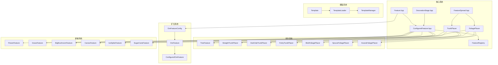

# Feature 模块

Minecraft Reborn 世界生成特征系统，负责在地形生成后添加各种装饰性结构，如矿石、树木、植被、湖泊等。

## 目录结构

```
feature/
├── Feature.hpp/cpp           # 特征基类和配置
├── ConfiguredFeature.hpp/cpp # 配置化特征和特征注册表
├── DecorationStage.hpp       # 装饰阶段枚举
├── FeatureIds.hpp            # 特征ID常量定义
├── FeatureSpread.hpp/cpp     # 特征扩散配置
├── lake/                     # 湖泊特征
│   ├── LakeFeature.hpp       # 湖泊特征接口
│   └── LakeFeature.cpp       # 湖泊特征实现
├── ore/                      # 矿石特征
│   ├── OreFeature.hpp        # 矿石特征接口
│   └── OreFeature.cpp        # 矿石特征实现
├── template/                 # 结构模板系统
│   ├── Template.hpp/cpp      # 结构模板类
│   ├── TemplateLoader.hpp/cpp# NBT模板加载器
│   └── TemplateManager.hpp/cpp# 模板管理器
├── tree/                     # 树木特征
│   ├── TreeFeature.hpp/cpp   # 树木特征主类
│   ├── trunk/                # 树干放置器
│   │   ├── TrunkPlacer.hpp/cpp     # 树干放置器基类
│   │   ├── StraightTrunkPlacer.hpp/cpp # 直树干放置器
│   │   └── TrunkPlacers.hpp/cpp    # 其他树干放置器
│   └── foliage/              # 树叶放置器
│       ├── FoliagePlacer.hpp/cpp   # 树叶放置器基类
│       ├── BlobFoliagePlacer.hpp/cpp # 球形树叶放置器
│       └── FoliagePlacers.hpp/cpp  # 其他树叶放置器
├── ocean/                    # 海洋特征
│   ├── KelpFeature.hpp/cpp   # 海带特征
│   ├── SeagrassFeature.hpp/cpp # 海草特征
│   ├── SeaPickleFeature.hpp/cpp # 海泡菜特征
│   ├── CoralFeature.hpp/cpp  # 珊瑚特征
│   └── README.md             # 海洋特征说明
└── vegetation/               # 植被特征
    ├── FlowerFeature.hpp/cpp # 花卉特征
    ├── GrassFeature.hpp/cpp  # 草丛特征
    ├── BigMushroomFeature.hpp/cpp # 巨型蘑菇特征
    ├── CactusFeature.hpp/cpp # 仙人掌特征
    ├── IceSpikeFeature.hpp/cpp # 冰刺特征
    ├── SugarCaneFeature.hpp/cpp # 甘蔗特征
    └── VegetationFeatures.hpp # 植被特征统一头文件
```

## 核心文件详解

### Feature.hpp/cpp

**职责**: 定义特征系统的核心接口和基础配置。

**主要内容**:
- `RuleTest` - 方块匹配规则基类，用于判断目标方块是否可被替换
- `BlockStateProvider` - 方块状态提供者接口
- `SimpleBlockStateProvider` - 固定方块状态提供者
- `OreFeatureConfig` - 矿石特征配置
- `OreTargetType` - 矿石目标类型枚举（NaturalStone、Netherrack、Basalt）

```cpp
// 创建矿石目标规则
auto stoneTarget = createOreTarget(OreTargetType::NaturalStone);
bool matches = stoneTarget->test(blockState, random);
```

### ConfiguredFeature.hpp/cpp

**职责**: 组合特征与其放置配置，管理特征注册和生成。

**主要内容**:
- `ConfiguredFeatureBase` - 配置化特征基类接口
- `FeatureRegistry` - 特征注册表单例，按装饰阶段组织特征
- `FeatureGenerator` - 特征生成器，在区块中放置特征

**核心方法**:
```cpp
// 注册特征
FeatureRegistry::instance().registerFeature(feature, DecorationStage::UndergroundOres);

// 获取指定阶段的特征
const auto& features = FeatureRegistry::instance().getFeatures(DecorationStage::VegetalDecoration);

// 在区块中放置特征
FeatureGenerator::placeFeatures(region, chunk, generator, biome, stage, seed);
```

### DecorationStage.hpp

**职责**: 定义特征生成的顺序阶段。

**阶段顺序**:

```mermaid
graph LR
    A[RawGeneration] --> B[Lakes]
    B --> C[LocalModifications]
    C --> D[UndergroundStructures]
    D --> E[SurfaceStructures]
    E --> F[Strongholds]
    F --> G[UndergroundOres]
    G --> H[UndergroundDecoration]
    H --> I[VegetalDecoration]
    I --> J[TopLayerModification]
```


### FeatureIds.hpp

**职责**: 定义所有注册到 FeatureRegistry 的特征 ID。

**ID 命名空间**:
- `OreFeatureIds` - 矿石特征（0-7）
- `TreeFeatureIds` - 树木特征（0-8）
- `FlowerFeatureIds` - 花卉特征（带偏移量）
- `GrassFeatureIds` - 草丛特征（带偏移量）
- `MushroomFeatureIds` - 蘑菇特征（带偏移量）
- `CactusFeatureIds` - 仙人掌特征（带偏移量）
- `SugarCaneFeatureIds` - 甘蔗特征（带偏移量）
- `IceSpikeFeatureIds` - 冰刺特征（0-1）

### FeatureSpread.hpp/cpp

**职责**: 定义特征生成时的范围扩散配置。

```cpp
// 创建固定值
auto fixed = FeatureSpread::fixed(4);

// 创建随机扩散
auto spread = FeatureSpread::spread(2, 3); // base=2, spread=3
i32 value = spread.get(random); // 返回 2 + random(0, 3)
```

## 子目录详解

### lake/ - 湖泊特征

**LakeFeature**: 生成椭圆形湖泊或熔岩湖。

```cpp
// 创建水湖配置
auto waterLake = LakeFeature::createWaterLake();

// 创建熔岩湖配置
auto lavaLake = LakeFeature::createLavaLake();

// 放置湖泊
feature.place(world, random, x, y, z);
```

### ore/ - 矿石特征

**OreFeature**: 使用球形采样算法生成矿脉形状的矿石。

**支持的矿石类型**:
- 主世界: 煤矿、铁矿、金矿、红石矿、钻石矿、青金石矿、绿宝石矿、铜矿
- 下界: 下界石英矿、下界金矿、远古残骸

**配置示例**:
```cpp
// 创建铁矿配置
auto config = std::make_unique<OreFeatureConfig>(
    createOreTarget(OreTargetType::NaturalStone),
    VanillaBlocks::getState(VanillaBlocks::IRON_ORE),
    9  // 矿脉大小
);
```

### template/ - 结构模板系统

**Template**: 存储 NBT 结构模板数据，支持旋转、镜像变换。

**TemplateLoader**: 从 .nbt 文件加载结构模板。

**TemplateManager**: 管理模板缓存和访问。

```cpp
// 加载模板
auto templ = TemplateLoader::loadFromResourcePack(pack,
    ResourceLocation("minecraft:village/plains/houses"));

// 放置模板
PlacementSettings settings;
settings.setRotation(90);
templ->place(world, pos, settings, rng, flags);
```

### tree/ - 树木特征

#### 树干放置器 (TrunkPlacers)

| 放置器 | 描述 | 用途 |
|--------|------|------|
| `StraightTrunkPlacer` | 垂直直树干 | 橡树、白桦、云杉、丛林树 |
| `DarkOakTrunkPlacer` | 2x2 粗树干 | 深色橡树 |
| `FancyTrunkPlacer` | 弯曲树干 | 精美橡树 |
| `ForkyTrunkPlacer` | 分叉树干 | 金合欢树 |
| `GiantTrunkPlacer` | 2x2 巨型树干 | 巨型云杉 |
| `MegaJungleTrunkPlacer` | 2x2 巨型丛林树干 | 巨型丛林树 |

#### 树叶放置器 (FoliagePlacers)

| 放置器 | 描述 | 用途 |
|--------|------|------|
| `BlobFoliagePlacer` | 球形树叶 | 橡树、白桦 |
| `PineFoliagePlacer` | 锥形树叶 | 松树 |
| `SpruceFoliagePlacer` | 尖顶锥形 | 云杉 |
| `AcaciaFoliagePlacer` | 伞形树叶 | 金合欢 |
| `DarkOakFoliagePlacer` | 密集球形 | 深色橡树 |
| `JungleFoliagePlacer` | 稀疏单层 | 丛林树 |
| `MegaPineFoliagePlacer` | 大型锥形 | 巨型云杉 |
| `BushFoliagePlacer` | 单层球形 | 灌木 |
| `FancyFoliagePlacer` | 密集大球形 | 精美橡树 |

**树木配置示例**:
```cpp
TreeFeatureConfig config;
config.trunkBlock = VanillaBlocks::getState(VanillaBlocks::OAK_LOG);
config.foliageBlock = VanillaBlocks::getState(VanillaBlocks::OAK_LEAVES);
config.trunkPlacer = std::make_unique<StraightTrunkPlacer>(4, 2, 0);
config.foliagePlacer = std::make_unique<BlobFoliagePlacer>(
    FeatureSpread::spread(2, 1),
    FeatureSpread::fixed(0),
    3
);
```

### vegetation/ - 植被特征

#### FlowerFeature

花卉特征，支持多种花卉随机放置。

**预定义配置**:
- `createPlainsFlowers()` - 平原花卉（蒲公英、虞美人）
- `createForestFlowers()` - 森林花卉
- `createFlowerForestFlowers()` - 繁花森林花卉（更多种类）
- `createSwampFlowers()` - 沼泽花卉（兰花）
- `createSunflower()` - 向日葵

#### GrassFeature

草丛特征，用于生成高草、矮草、蕨类等。

**预定义配置**:
- `createPlainsGrass()` - 平原草丛
- `createForestGrass()` - 森林草丛
- `createJungleGrass()` - 丛林草丛
- `createSwampGrass()` - 沼泽草丛
- `createSavannaGrass()` - 稀树草原草丛
- `createTaigaGrass()` - 针叶林草丛（蕨类为主）
- `createBadlandsDeadBush()` - 恶地枯萎灌木

#### BigMushroomFeature

巨型蘑菇特征，支持棕色和红色两种。

```cpp
// 棕色巨型蘑菇 - 平顶
// 红色巨型蘑菇 - 圆顶多层
```

#### CactusFeature

仙人掌特征，在沙漠和恶地生成。

#### IceSpikeFeature

冰刺特征，在冰刺平原生成尖塔型或冰丘型结构。

#### SugarCaneFeature

甘蔗特征，在水源附近生成。

### ocean/ - 海洋特征

海洋特征负责海底生态生成，包含海带、海草、海泡菜和珊瑚结构。

- `KelpFeature`：使用 `kelp_plant + kelp` 组合生成柱状海带。
- `SeagrassFeature`：支持普通海草与高海草混合放置。
- `SeaPickleFeature`：在活珊瑚基底上放置不同数量海泡菜。
- `CoralFeature`：随机生成树形/蘑菇形/爪形珊瑚并附带珊瑚扇装饰。

## 文件关系图



## 模块职责

### 整体职责

Feature 模块负责在世界生成过程中添加各种装饰性结构，包括：

1. **矿石生成** - 在地下生成各种矿物矿脉
2. **树木生成** - 生成各种类型的树木
3. **植被生成** - 生成花卉、草丛、蘑菇、仙人掌、甘蔗等
4. **湖泊生成** - 生成水湖和熔岩湖
5. **结构生成** - 通过模板系统放置预定义结构

### 输入

```cpp
// 输入来自区块生成器
struct FeatureInput {
    WorldGenRegion& region;     // 世界生成区域
    ChunkPrimer& chunk;         // 区块数据
    IChunkGenerator& generator; // 区块生成器
    const Biome& biome;         // 生物群系
    DecorationStage stage;      // 装饰阶段
    u64 seed;                   // 世界种子
};
```

### 输出

- 在区块中放置各种方块（矿石、原木、树叶、花卉等）
- 返回是否成功放置特征

### 依赖项

```cpp
// 外部依赖
#include "../../../core/Types.hpp"
#include "../../../util/math/random/Random.hpp"
#include "../../block/Block.hpp"
#include "../../block/BlockRegistry.hpp"
#include "../../block/VanillaBlocks.hpp"
#include "../../biome/Biome.hpp"
#include "../../chunk/ChunkPrimer.hpp"
#include "../placement/Placement.hpp"
#include "../../../resource/ResourceLocation.hpp"
#include "../../../util/nbt/Nbt.hpp"
```

## 使用方法

### 初始化

```cpp
// 1. 初始化方块系统
VanillaBlocks::initialize();

// 2. 初始化特征注册表
FeatureRegistry::instance().initialize();
```

### 配置生物群系的特征

```cpp
// 创建生物群系生成设置
BiomeGenerationSettings settings;

// 添加矿石特征（UndergroundOres 阶段）
settings.addFeature(DecorationStage::UndergroundOres, OreFeatureIds::CoalOre);
settings.addFeature(DecorationStage::UndergroundOres, OreFeatureIds::IronOre);

// 添加树木特征（VegetalDecoration 阶段）
settings.addFeature(DecorationStage::VegetalDecoration, TreeFeatureIds::OakTree);
settings.addFeature(DecorationStage::VegetalDecoration, TreeFeatureIds::BirchTree);

// 添加花卉和草丛
settings.addFeature(DecorationStage::VegetalDecoration, FlowerFeatureIds::ForestFlowers);
settings.addFeature(DecorationStage::VegetalDecoration, GrassFeatureIds::ForestGrass);
```

### 自定义特征

```cpp
// 创建自定义矿石特征
auto customOreConfig = std::make_unique<OreFeatureConfig>(
    createOreTarget(OreTargetType::NaturalStone),
    &VanillaBlocks::DIAMOND_ORE->defaultState(),
    20  // 更大的矿脉
);

auto customOre = std::make_unique<ConfiguredOreFeature>(
    std::move(customOreConfig),
    createDeepPlacement(),  // 深层放置
    "custom_diamond_ore"
);

// 注册到注册表
FeatureRegistry::instance().registerFeature(
    std::move(customOre),
    DecorationStage::UndergroundOres
);
```

## 容易踩的坑

### 1. 特征ID偏移量

**问题**: VegetalDecoration 阶段的特征ID需要手动计算偏移量。

**解决方案**: 使用 `FeatureIds.hpp` 中定义的偏移量常量：
```cpp
// 正确方式
constexpr u32 myFlowerId = FlowerFeatureIds::Offset + 0;

// 错误方式（硬编码）
constexpr u32 myFlowerId = 9;  // 如果树木数量变化会出错
```

### 2. 方块系统初始化顺序

**问题**: 特征初始化依赖于方块系统，必须在 `VanillaBlocks::initialize()` 之后调用。

```cpp
// 正确顺序
VanillaBlocks::initialize();
FeatureRegistry::instance().initialize();

// 错误顺序会导致空指针
FeatureRegistry::instance().initialize();  // 方块还未初始化！
VanillaBlocks::initialize();
```

### 3. TrunkPlacer/FoliagePlacer 深拷贝

**问题**: `TreeFeatureConfig` 包含 `unique_ptr` 成员，需要正确实现深拷贝。

**解决方案**: 已实现拷贝构造函数和赋值运算符：
```cpp
TreeFeatureConfig(const TreeFeatureConfig& other);
TreeFeatureConfig& operator=(const TreeFeatureConfig& other);
```

### 4. 放置位置检查

**问题**: 特征放置时需要正确检查位置有效性。

```cpp
// 树木需要检查下方是否为泥土
if (!TreeFeature::isDirtOrFarmlandAt(world, startPos.down())) {
    return false;
}

// 仙人掌需要检查周围是否有实体方块
if (!hasValidSpace(world, pos)) {
    return false;
}
```

### 5. 随机数种子

**问题**: 特征生成使用区块种子，需要正确计算。

```cpp
// 正确的种子计算方式
const u64 chunkSeed = seed
    ^ static_cast<u64>(static_cast<i64>(chunkX) * 341873128712ULL)
    ^ static_cast<u64>(static_cast<i64>(chunkZ) * 132897987541ULL);

math::Random random(static_cast<u32>(chunkSeed));
```

### 6. 模板加载路径

**问题**: NBT 模板文件路径格式必须正确。

```cpp
// 正确路径格式
// data/<namespace>/structures/<path>.nbt
ResourceLocation location("minecraft:village/plains/houses");
```

## 测试用例

测试文件位于 `tests/common/world/gen/test_vegetation_features.cpp`。

### 测试覆盖范围

| 测试类别 | 测试内容 |
|---------|---------|
| **FeatureIds 测试** | 验证特征ID连续性和偏移量正确性 |
| **FeatureRegistry 集成测试** | 验证特征注册和名称正确性 |
| **BiomeGenerationSettings 测试** | 验证各生物群系的特征配置 |

### 主要测试用例

```cpp
// 验证矿石特征ID连续
TEST_F(VegetationFeatureTest, OreFeatureIdsAreConsecutive);

// 验证树木特征ID正确
TEST_F(VegetationFeatureTest, TreeFeatureNames);

// 验证生物群系特征配置
TEST_F(VegetationFeatureTest, PlainsBiomeSettings);
TEST_F(VegetationFeatureTest, ForestBiomeSettings);
TEST_F(VegetationFeatureTest, DesertBiomeSettings);
TEST_F(VegetationFeatureTest, MountainsBiomeSettings);
// ... 更多生物群系测试
```

### 运行测试

```powershell
./build/bin/Release/mc_tests.exe --gtest_filter="VegetationFeatureTest.*"
```

## 性能考虑

1. **特征生成顺序**: 按 `DecorationStage` 顺序生成，确保依赖关系正确
2. **异步生成**: 特征在区块工作线程池中异步执行
3. **缓存**: `TemplateManager` 缓存已加载的结构模板
4. **批量处理**: 同一阶段的所有特征在同一遍扫描中处理

## 参考资料

- Minecraft Java 1.16.5 源码: `net.minecraft.world.gen.feature`
- 特征类型参考: `net.minecraft.world.gen.feature.Features`
- 放置修饰器参考: `net.minecraft.world.gen.placement.Placements`
